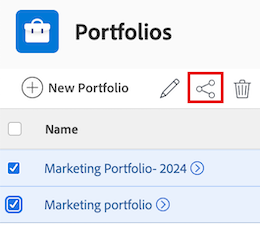

# 共用投資組合

指派存取層級時，您的Adobe Workfront管理員可授予您檢視或編輯投資組合的存取權。 您必須擁有計畫授權才能編輯投資組合。 如需詳細資訊，請參閱[授予投資組合的存取權](../../administration-and-setup/add-users/configure-and-grant-access/grant-access-portfolios.md)。

除了授予您的存取層級之外，您還可以從可與您共用專案組合的使用者那裡獲得檢視或管理特定專案組合的許可權。 如需存取層級和許可權的詳細資訊，請參閱[存取層級和許可權如何搭配運作](../../administration-and-setup/add-users/access-levels-and-object-permissions/how-access-levels-permissions-work-together.md)。

許可權專屬於Workfront中的一個專案，可定義使用者可對該專案執行的動作。

## 存取需求

+++ 展開以檢視本文中功能的存取需求。 

<table style="table-layout:auto"> 
 <col> 
 <col> 
 <tbody> 
  <tr> 
   <td role="rowheader">Adobe Workfront套件</td> 
   <td> 
任何
 </td> 
  </tr> 
  <tr> 
   <td role="rowheader">Adobe Workfront授權</td> 
   <td> 
標準
 
   
工作或更高
 
   </td> 
  </tr> 
  <tr> 
   <td role="rowheader">存取層級設定</td> 
   <td> 
檢視您要共用之物件的存取許可權或以上許可權
 </td> 
  </tr> 
  <tr> 
   <td role="rowheader">物件許可權</td> 
   <td> 
檢視您要共用之物件的許可權或更高的許可權
</td> 
  </tr> 
 </tbody> 
</table>

如需有關此表格的詳細資訊，請參閱Workfront檔案中的[存取需求](/help/quicksilver/administration-and-setup/add-users/access-levels-and-object-permissions/access-level-requirements-in-documentation.md)。

+++

## 關於共用投資組合的考量事項

除了下列考量事項外，另請參閱[物件共用許可權概觀](../../workfront-basics/grant-and-request-access-to-objects/sharing-permissions-on-objects-overview.md)。

>[!NOTE]
>
>Workfront管理員可以新增或移除系統中所有使用者的任何專案許可權，而無需擁有這些專案。

* 投資組合的建立者預設擁有投資組合的管理許可權。
* 您可以單獨共用一個投資組合，也可以同時共用多個投資組合。 共用投資組合等同於在Workfront中共用其他物件。 如需詳細資訊，請參閱[共用物件](../../workfront-basics/grant-and-request-access-to-objects/share-an-object.md)。

* 您只能授予投資組合的「檢視」或「管理」許可權。

*當您共用專案組合時，使用者預設會繼承與專案組合相關聯之所有子物件的相同許可權。

如需Workfront中物件階層的詳細資訊，請參閱[瞭解Adobe Workfront中的物件](../../workfront-basics/navigate-workfront/workfront-navigation/understand-objects.md)。

* 您可以從Portfolio移除繼承的許可權。 如需有關移除物件許可權的詳細資訊，請參閱[移除物件許可權](../../workfront-basics/grant-and-request-access-to-objects/remove-permissions-from-objects.md)。

## 共用投資組合

{{step1-to-portfolios}}

1. 在&#x200B;**投資組合**&#x200B;頁面上，選取您要共用的投資組合。 投資組合頁面隨即開啟。

1. 按一下投資組合名稱右邊的&#x200B;**共用**。 **共用[Portfolio名稱]**&#x200B;對話方塊開啟。

   

1. 在&#x200B;**授與投資組合存取權**&#x200B;欄位中，開始輸入您要共用投資組合的使用者、團隊、角色、群組或公司名稱，然後在其出現在下拉式清單中時按一下名稱。

   >[!TIP]
   >
   >您只能與作用中使用者、團隊、角色或公司共用投資組合。

1. （選擇性）選取&#x200B;**擁有存取權**&#x200B;的下拉式清單，並選取投資組合的存取層級：

   * **只有受邀者才能存取：**&#x200B;只有受邀加入投資組合的使用者才能存取（預設）。
   * **系統中的每個人都可以檢視**：系統中的所有使用者都可以在沒有邀請的情況下檢視投資組合。

1. 按一下使用者名稱右側的下拉式清單，並為此投資組合選取其許可權層級：

   * **檢視**：使用者可以檢閱和共用投資組合。
   * **管理**：使用者擁有投資組合的完整存取權，但沒有管理許可權，這些許可權是在存取層級授予的（也包含所有檢視許可權）。

1. （可選）按一下您已授與的許可權層級旁的進階選項圖示，以設定產品組合的特定許可權。

   

1. （選擇性）若要使用連結快速共用投資組合，請按一下[複製連結] **，然後將其轉寄給收件者。**

1. 按一下「**儲存**」。

## 大量共用投資組合

{{step1-to-portfolios}}

1. 在&#x200B;**投資組合**&#x200B;頁面上，選取您要共用之每個投資組合左側的方塊，然後按一下頁面頂端的&#x200B;**共用**&#x200B;圖示。 共用強制回應視窗隨即開啟。

   

1. 在&#x200B;**授與投資組合存取權**&#x200B;欄位中，開始輸入您要與其共用投資組合的使用者、團隊、角色、群組或公司名稱，然後在其出現在下拉式清單中時按一下該名稱。

   >[!TIP]
   >
   >您只能與活躍的使用者、團隊、角色或公司共用產品組合。

1. （選擇性）選取&#x200B;**擁有存取權**&#x200B;下拉式清單，並選取投資組合的存取層級：

   * **只有受邀者才能存取：**&#x200B;只有受邀加入投資組合的使用者才能存取他們（預設）。
   * **系統中的每個人都可以檢視**：系統中的所有使用者都可以在沒有邀請的情況下檢視投資組合。

1. 按一下使用者名稱右側的下拉式清單，並為投資組合選取其許可權層級：

   * **檢視**：使用者可以檢視並共用投資組合。
   * **管理**：使用者擁有投資組合的完整存取權，但沒有管理許可權，這些許可權是在存取層級授予的（也包含所有檢視許可權）。

1. （可選）按一下您已授與的許可權層級旁的進階選項圖示，以設定投資組合的特定許可權。

   

1. 按一下「**儲存**」。

## Portfolio許可權

下表顯示當允許使用者檢視或管理Portfolio時，您可以授予他們哪些許可權：

| **動作** | **管理** | **檢視** |
|---|---|---|
| 編輯Portfolio詳細資料 | ✓ |   |
| 檢視Portfolio | ✓ | ✓ |
| 刪除Portfolio | ✓ |   |
| 附加自訂表格 | ✓ |   |
| 編輯自訂欄位 | ✓ |   |
| 新增或移除程式&#42; | ✓ |   |
| 新增或移除專案&#42; | ✓ |   |
| 核准專案 | ✓ |   |
| Portfolio最佳化&#42; | ✓ |   |
| 新增檔案資料夾&#42; | ✓ | ✓ |
| 新增檔案 | ✓ | ✓ |
| 更新/評論 | ✓ | ✓ |
| 共用 | ✓ | ✓ |
| 共用系統範圍 |   | ✓ |

*這些許可權是由其他物件（如專案、方案、檔案）的存取層級和許可權所控制。
