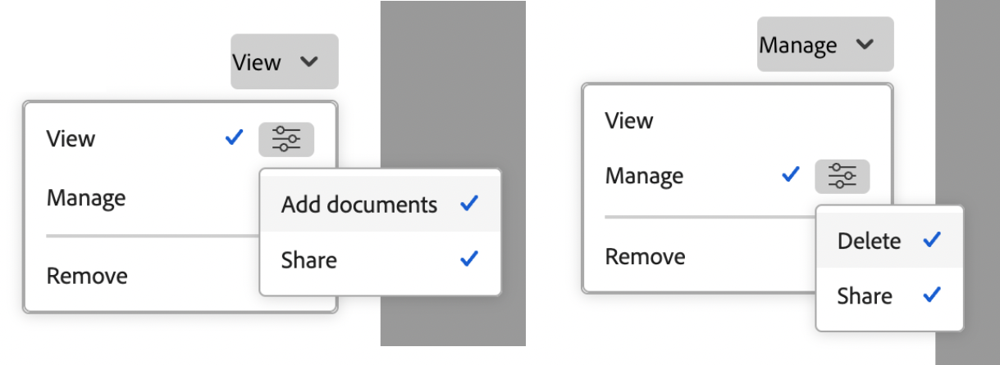

# 共用方案

{{highlighted-preview}}

指派存取層級時，您的Adobe Workfront管理員可授予您檢視或編輯方案的存取權。 您必須擁有計畫授權才能編輯計畫。 如需詳細資訊，請參閱[授予程式的存取權](../../administration-and-setup/add-users/configure-and-grant-access/grant-access-programs.md)。

除了授予您的存取層級之外，您還可以從可與您共用方案的使用者那裡獲得檢視或管理特定方案的許可權。 如需存取層級和許可權的詳細資訊，請參閱[存取層級和許可權如何搭配運作](../../administration-and-setup/add-users/access-levels-and-object-permissions/how-access-levels-permissions-work-together.md)。

許可權是Workfront中每個專案專屬的許可權，可定義使用者可對該專案執行的動作。

## 關於共用方案的考量事項

除了下列考量事項外，另請參閱[物件共用許可權概觀](../../workfront-basics/grant-and-request-access-to-objects/sharing-permissions-on-objects-overview.md)。

>[!NOTE]
>
>Workfront管理員可以新增或移除系統中所有使用者的任何專案許可權，而無需擁有這些專案。

* 依預設，方案的建立者擁有管理許可權。

* 您可以個別共用計畫，也可以一次共用多個計畫。

  如需在Workfront中共用專案的詳細資訊，請參閱[共用物件](../../workfront-basics/grant-and-request-access-to-objects/share-an-object.md)。

* 您只能授予程式的「檢視」或「管理」許可權。

      

  預覽：
  

* 當您共用方案時，使用者預設會繼承與該方案相關聯的所有子物件的相同許可權。

  如需Workfront中物件階層的詳細資訊，請參閱[瞭解Adobe Workfront中的物件](../../workfront-basics/navigate-workfront/workfront-navigation/understand-objects.md)。

* 您可以從程式中移除繼承的許可權。 如需有關從物件移除許可權的詳細資訊，請參閱  [從物件移除許可權](../../workfront-basics/grant-and-request-access-to-objects/remove-permissions-from-objects.md)。

## 程式許可權

下表顯示當允許使用者檢視或管理方案時，您可以授予他們哪些許可權：

| **動作** | **管理** | **檢視** |
|---|---|---|
| 編輯計畫詳細資料 | ✓ (A) |   |
| 檢視計畫 | ✓ (A) | ✓ (A) |
| 刪除計畫 | ✓ (A) |   |
| 附加自訂表格 | ✓ (A) |   |
| 編輯自訂欄位 | ✓ (A) |   |
| 新增或移除專案&#42; | ✓ (A) |   |
| 核准專案 | ✓ (A) |   |
| 新增檔案資料夾&#42; | ✓ (A) | ✓ (A) |
| 新增檔案 | ✓ (A) | ✓ (A) |
| 新增更新/評論 | ✓ (A) | ✓ (A) |
| 共用 | ✓ (A) | ✓ (A) |
| 共用系統範圍 |   | ✓ (A) |

*這些許可權是由存取層級和其他物件（例如專案）的許可權所控制。 
