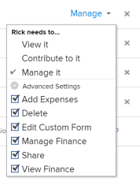

# 在Adobe Workfront中共用專案

您的Adobe Workfront管理員可在指派存取層級時，授予您檢視或編輯專案的存取權。 如需詳細資訊，請參閱 [授予專案的存取權](../../administration-and-setup/add-users/configure-and-grant-access/grant-access-projects.md).

除了授予使用者的存取層級之外，您也可以授予使用者檢視、貢獻或管理您有權共用之特定專案的權限。

權限是Workfront中一個項目專屬的權限，並定義可對該項目採取的動作。

## 共用專案的考量事項

除了下列考量事項外，另請參閱 [對象共用權限概述](../../workfront-basics/grant-and-request-access-to-objects/sharing-permissions-on-objects-overview.md).

* 預設情況下，項目的建立者具有管理項目的權限，也被指定為項目所有者。 如果將專案指派給其他擁有者，該使用者也擁有管理專案的權限。 當項目建立者（或擁有者）與其他用戶共用項目時，他們會向這些用戶授予某些權限，以控制他們在項目上工作時可以執行的操作。

   但是，如果項目所有者沒有計畫員許可證，則他們沒有管理項目的完全訪問權限。 只有具有計畫許可證的用戶才能擁有管理項目的權限。 如需詳細資訊，請參閱 [存取層級與權限如何搭配運作](../../administration-and-setup/add-users/access-levels-and-object-permissions/how-access-levels-permissions-work-together.md).

* 您可以個別共用專案，也可以一次共用其中幾個專案。 共用專案與共用其他物件相同。 如需在Workfront中共用項目的詳細資訊，請參閱 [共用物件](../../workfront-basics/grant-and-request-access-to-objects/share-an-object.md).
* 您可以授予專案下列權限： 

   * 檢視
   * 管理
   * 參與

        

* 共用專案時，除非另有指定，所有任務、問題和檔案都會繼承相同的權限。

   如需根據使用者對專案的權限管理專案上工作和問題存取權限的相關資訊，請參閱  文章一節 [編輯專案](../../manage-work/projects/manage-projects/edit-projects.md).

   Workfront管理員可以指定文檔是否應繼承用戶訪問級別較高對象的權限。 有關限制對文檔繼承的權限的詳細資訊，請參見 [建立或修改自訂存取層級](../../administration-and-setup/add-users/configure-and-grant-access/create-modify-access-levels.md).

* 您可以移除專案中繼承的權限，這樣子項物件就不會繼承。 如需從物件移除繼承權限的詳細資訊，請參閱  [從對象中刪除權限](../../workfront-basics/grant-and-request-access-to-objects/remove-permissions-from-objects.md).

## 共用專案的方式 {#ways-to-share-a-project}

您可以透過下列方式共用專案：

* 手動執行下列其中一項操作：

   * 新增使用者至專案團隊。 將使用者新增至專案團隊時，他們會自動取得專案的「檢視」權限。\
      如需新增使用者至專案團隊的詳細資訊，請參閱 [專案團隊概觀](../../manage-work/projects/planning-a-project/project-team-overview.md).
   * 個別或大量共用專案時，使用 **共用** 選項。

      共用專案類似於共用Adobe Workfront中的所有其他物件。

      如需在Workfront中共用物件的相關資訊，請參閱 [共用物件](../../workfront-basics/grant-and-request-access-to-objects/share-an-object.md).

* 自動執行下列任一操作：

   * 將專案放入 **Portfolio** 或 **方案** 已與他人共用。 使用者對專案的權限與對作品集或方案的權限相同。\
      如需將專案新增至 **Portfolio**，請參閱 [將專案新增至產品組合](../../manage-work/portfolios/create-and-manage-portfolios/add-projects-to-portfolios.md).\
      如需將專案新增至 **方案**，請參閱 [將專案新增至方案](../../manage-work/portfolios/create-and-manage-programs/add-project-to-program.md).

      有關查看對象繼承的權限的資訊，請參閱 [查看對象的繼承權限](../../workfront-basics/grant-and-request-access-to-objects/view-inherited-permissions-on-objects.md).

   * 在用於建立專案的範本上，新增實體至「專案共用」。 如需從範本共用專案的相關資訊，請參閱 [共用範本](../../workfront-basics/grant-and-request-access-to-objects/share-a-template.md).
   * 定義專案存取範本。

      若要定義專案存取範本，請參閱 [共用物件](../../workfront-basics/grant-and-request-access-to-objects/share-an-object.md).

      >[!TIP]
      >
      >附加或儲存範本時，您可以清除「範本專案共用」規則。

   * 編輯專案並定義 **獲得此項目的訪問權限時** 設定。 如需詳細資訊，請參閱 [編輯專案](../../manage-work/projects/manage-projects/edit-projects.md).

<!--

(NOTE: drafted because I created new article and linked it above) 

To view what users have inherited the access on the project from a portfolio or a program, do the following:

<ol style="list-style-type: lower-alpha;">
<li value="1">Go to a project whose sharing permissions you want to view. </li>
<li value="2"> Click the <strong>More</strong> menu , then click <strong>Sharing</strong>. </li>
<li value="3"> 
Expand the <strong>Inherited Permissions</strong> list. 
 
This list displays the names of users that have access to either the portfolio or the program that the project belongs to and also have permissions to the project. 
 
  
 </li>
</ol>

-->

<!--
<ol data-mc-conditions="QuicksilverOrClassic.Draft mode">
<li value="1">Go to a project whose sharing permissions you want for all projects you create from scratch. (NOTE: drafted because linked above)&nbsp;</li>
<li value="2"> Click the More menu, then click <strong>Sharing</strong>. </li>
<li value="3"> 
In the Project Access box that displays, near the upper-right corner, click the gear icon , then click <strong>Set as my project access template</strong>.
 
The entities that are granted permissions on the selected project have the same permissions for all the projects you create from scratch in the future.
 
 The project access template overrides the sharing defaults granted to you by the Workfront administrator in your Access Level. For more information about specifying sharing defaults for projects in the Access Level, see <a href="../../administration-and-setup/add-users/configure-and-grant-access/grant-access-projects.md" class="MCXref xref">Grant access to projects</a>.
 </li>
<li value="4">Click <strong>Save</strong>.</li>
</ol>
-->

## 不同授權類型的限制

* 具有工作許可證的用戶無權管理項目。 對於員工，最高的共用權限是Contribute。
* 擁有「請求」授權的使用者可以檢視專案資訊，但他們的專案存取權有限。
* 當具有檢視或Contribute權限的使用者也包含在核准程式中時，變更專案狀態的例外情況就會發生。 他們可以批准項目，這會更改項目的狀態，但狀態是預定義的批准或拒絕狀態。
* 若要複製專案，使用者也必須擁有在其存取層級中建立專案的存取權。

<!--

<h2>Configure default permissions for a project</h2>

(NOTE: drafted because I added one more way to automatically share the project above in the bullet list and linked it to Edit Projects) 

As a project owner, you can configure the default permissions for View, Manage, and Contribute access that are used when sharing&nbsp;the project with others. When users share a project, the default permissions are used. Users can then adjust the default permissions when sharing the project, as described in <a title="Project Permissions" href="#ways-to-share-a-project" class="MCXref xref">Ways to share a project</a>. 

To configure the default permissions that are included with each access level:

<ol>
<li value="1">Go to the project where you want to set the default permissions.</li>
<li value="2"> 
Click the More menu , then click <strong>Edit</strong>. 
 
  
 </li>
<li value="3">Click <strong>Access</strong> in the list on the left.</li>
<li value="4"> 
In the <strong>When someone is given access to this PROJECT</strong> section, select permissions that you want to be available when users are given access to the project via sharing.
 
Ensure that any permissions that you want to include in the selected access level are selected and deselect any permissions that you do not want to include in the selected permissions level.
 
To view which permissions are available for each level, see&nbsp;<a title="Project Permissions" href="#Understanding_Project_Permissions" class="MCXref xref">Share a project in Adobe Workfront</a>.
 <note type="note">
The
<strong>Delete</strong> access in the
<strong>Manage</strong> permission level determines whether users can&nbsp;delete the project itself. Users with
<strong>Manage</strong> access to the project can delete tasks and issues within the project regardless of whether this option is selected, if they have
<strong>Manage</strong> permissions to the tasks and issues.&nbsp;
</note> </li>
<li value="5">Click <strong>Save Changes</strong>.</li>
</ol>

-->

## 專案權限選項

下表列出使用者在共用專案時可授予的權限。 如需使用者根據其授權所取得存取權限的詳細資訊，請參閱 [授予專案的存取權](../../administration-and-setup/add-users/configure-and-grant-access/grant-access-projects.md).

<table border="1" cellspacing="15" cellpadding="1"> 
 <col> 
 <col> 
 <col> 
 <col> 
 <thead> 
  <tr> 
   <th> 
<strong>動作</strong> 
 </th> 
   <th> 
<strong>管理</strong> 
 </th> 
   <th> 
<strong>參與</strong> 
 </th> 
   <th> 
<strong>檢視</strong> 
 </th> 
  </tr> 
 </thead> 
 <tbody> 
  <tr> 
   <td> 
新增自訂表單
 </td> 
   <td> 
✓
 </td> 
   <td> 
 
 </td> 
   <td> 
 
 </td> 
  </tr> 
  <tr> 
   <td> 
更新自訂欄位
 </td> 
   <td> 
✓
 </td> 
   <td> 
✓
 </td> 
   <td> 
 
 </td> 
  </tr> 
  <tr> 
   <td> 
新增核准程式
 </td> 
   <td> 
✓
 </td> 
   <td> 
 
 </td> 
   <td> 
 
 </td> 
  </tr> 
  <tr> 
   <td> 
核准專案
 </td> 
   <td> 
✓
 </td> 
   <td> 
✓
 </td> 
   <td> 
✓
 </td> 
  </tr> 
  <tr> 
   <td> 
核准小時數
 </td> 
   <td> 
✓
 </td> 
   <td> 
✓ 
 </td> 
   <td> 
 
 </td> 
  </tr> 
  <tr> 
   <td> 
建立專案
 </td> 
   <td> 
✓
 </td> 
   <td> 
 
 </td> 
   <td> 
 
 </td> 
  </tr> 
  <tr> 
   <td> 
添加文檔
 </td> 
   <td> 
✓
 </td> 
   <td> 
✓
 </td> 
   <td> 
✓
 </td> 
  </tr> 
  <tr> 
   <td> 
添加問題
 </td> 
   <td> 
✓
 </td> 
   <td> 
✓
 </td> 
   <td> 
✓
 </td> 
  </tr> 
  <tr> 
   <td> 
添加任務
 </td> 
   <td> 
✓
 </td> 
   <td> 
✓
 </td> 
   <td> 
 
 </td> 
  </tr> 
  <tr> 
   <td> 
複製專案
 </td> 
   <td> 
 
 </td> 
   <td> 
✓
 </td> 
   <td> 
 
 </td> 
  </tr> 
  <tr> 
   <td> 
刪除專案
 </td> 
   <td> 
✓
 </td> 
   <td> 
 
 </td> 
   <td> 
 
 </td> 
  </tr> 
  <tr> 
   <td> 
修改計畫日期
 </td> 
   <td> 
✓
 </td> 
   <td> 
 
 </td> 
   <td> 
 
 </td> 
  </tr> 
  <tr> 
   <td> 
共用專案
 </td> 
   <td> 
✓
 </td> 
   <td> 
✓
 </td> 
   <td> 
✓
 </td> 
  </tr> 
  <tr> 
   <td> 
共用系統範圍
 </td> 
   <td> 
 
 </td> 
   <td> 
 
 </td> 
   <td> 
✓
 </td> 
  </tr> 
  <tr> 
   <td> 
檢視專案
 </td> 
   <td> 
✓
 </td> 
   <td> 
✓
 </td> 
   <td> 
✓
 </td> 
  </tr> 
  <tr> 
   <td> 
更新/注釋
 </td> 
   <td> 
✓
 </td> 
   <td> 
✓
 </td> 
   <td> 
✓
 </td> 
  </tr> 
  <tr> 
   <td> 
變更狀態
 </td> 
   <td> 
✓
 </td> 
   <td> 
 
 </td> 
   <td> 
 
 </td> 
  </tr> 
  <tr> 
   <td> 
記錄時數
 </td> 
   <td> 
✓
 </td> 
   <td> 
✓
 </td> 
   <td> 
 
 </td> 
  </tr> 
  <tr> 
   <td> 
編輯指派
 </td> 
   <td> 
✓
 </td> 
   <td> 
✓
 </td> 
   <td> 
 
 </td> 
  </tr> 
  <tr> 
   <td> 
管理基線
 </td> 
   <td> 
✓
 </td> 
   <td> 
 
 </td> 
   <td> 
 
 </td> 
  </tr> 
  <tr> 
   <td> 
管理風險*
 </td> 
   <td> 
✓
 </td> 
   <td> 
 
 </td> 
   <td> 
 
 </td> 
  </tr> 
  <tr> 
   <td> 
管理財務*
 </td> 
   <td> 
✓
 </td> 
   <td> 
 
 </td> 
   <td> 
 
 </td> 
  </tr> 
  <tr> 
   <td> 
添加/編輯費用*
 </td> 
   <td> 
✓
 </td> 
   <td> 
✓
 </td> 
   <td> 
 
 </td> 
  </tr> 
  <tr> 
   <td> 
檢視財務*
 </td> 
   <td> 
✓
 </td> 
   <td> 
✓
 </td> 
   <td> 
✓
 </td> 
  </tr> 
  <tr> 
   <td> 
附加範本
 </td> 
   <td> 
✓
 </td> 
   <td> 
 
 </td> 
   <td> 
 
 </td> 
  </tr> 
  <tr> 
   <td> 
另存為範本
 </td> 
   <td> 
✓
 </td> 
   <td> 
✓
 </td> 
   <td> 
✓
 </td> 
  </tr> 
  <tr> 
   <td> 
添加/編輯業務案例
 </td> 
   <td> 
✓
 </td> 
   <td> 
 
 </td> 
   <td> 
 
 </td> 
  </tr> 
  <tr> 
   <td> 
編輯專案詳細資訊
 </td> 
   <td> 
✓
 </td> 
   <td> 
 
 </td> 
   <td> 
 
 </td> 
  </tr> 
  <tr> 
   <td> 
編輯人員配置
 </td> 
   <td> 
✓
 </td> 
   <td> 
 
 </td> 
   <td> 
 
 </td> 
  </tr> 
  <tr> 
   <td> 
匯出到 MS Project
 </td> 
   <td> 
✓
 </td> 
   <td> 
✓
 </td> 
   <td> 
✓
 </td> 
  </tr> 
  <tr> 
   <td> 
重新計算財務/時間表*
 </td> 
   <td> 
✓
 </td> 
   <td> 
 
 </td> 
   <td> 
 
 </td> 
  </tr> 
  <tr> 
   <td> 
設定隊列屬性
 </td> 
   <td> 
✓
 </td> 
   <td> 
 
 </td> 
   <td> 
  
 </td> 
  </tr> 
  <tr> 
   <td> 
大量編輯清單中的專案
 </td> 
   <td> 
✓
 </td> 
   <td> </td> 
   <td> </td> 
  </tr> 
 </tbody> 
</table>

&#42;無法存取財務資料的使用者無法管理專案的風險和財務，即使他們有編輯專案的存取權。 如需存取金融資料的相關資訊，請參閱 [授予金融資料的存取權](../../administration-and-setup/add-users/configure-and-grant-access/grant-access-financial.md).
