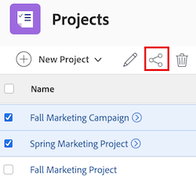

# 共用專案

<!-- Audited: 1/2024 -->

指派存取層級時，您的Adobe Workfront管理員可授予您檢視或編輯專案的存取權。 如需詳細資訊，請參閱[授予專案存取權](../../administration-and-setup/add-users/configure-and-grant-access/grant-access-projects.md)。

除了授予使用者的存取層級外，您還可以授予他們檢視、貢獻或管理您有權共用之特定專案的許可權。

許可權專屬於Workfront中的一個專案，可定義使用者可對該專案執行的動作。

## 存取需求

+++ 展開以檢視本文中功能的存取需求。

您必須具備下列專案才能共用物件：

<table style="table-layout:auto"> 
 <col> 
 <col> 
 <tbody> 
  <tr> 
   <td role="rowheader">Adobe Workfront計畫</td> 
   <td> 
任何 
 </td> 
  </tr> 
  <tr> 
   <td role="rowheader">Adobe Workfront授權</td> 
   <td> 
新增：標準
 
   或
   
目前：工作或以上

   </td> 
  </tr> 
  <tr> 
   <td role="rowheader">存取層級設定</td> 
   <td> 
檢視您要共用之物件的存取許可權或以上許可權
 </td> 
  </tr> 
  <tr> 
   <td role="rowheader">物件許可權</td> 
   <td> 
檢視您要共用之物件的許可權或更高的許可權
</td> 
  </tr> 
 </tbody> 
</table>

如需詳細資訊，請參閱Workfront檔案中的[存取需求](/help/quicksilver/administration-and-setup/add-users/access-levels-and-object-permissions/access-level-requirements-in-documentation.md)。

+++

## 共用專案的相關考量事項

除了下列考量事項外，另請參閱[物件共用許可權概觀](../../workfront-basics/grant-and-request-access-to-objects/sharing-permissions-on-objects-overview.md)。

* 依預設，專案的建立者具有管理專案的許可權，並被指定為專案所有者。 如果專案指派給其他所有者，則該使用者也具有管理專案的許可權。 當專案建立者（或擁有者）與其他使用者共用專案時，他們會授予這些使用者特定許可權，以控制他們在專案上工作時可以執行的操作。

  但是，如果專案所有者沒有Plan或Standard授權，他們便沒有管理專案的完整存取權。 只有擁有Plan或Standard授權的使用者才能擁有管理專案的許可權。 如需詳細資訊，請參閱[存取層級和許可權如何搭配運作](../../administration-and-setup/add-users/access-levels-and-object-permissions/how-access-levels-permissions-work-together.md)。

* 您可以個別共用專案，或一次共用多個專案。 共用專案與共用其他物件相同。 如需在Workfront中共用專案的詳細資訊，請參閱[共用物件](../../workfront-basics/grant-and-request-access-to-objects/share-an-object.md)。
* 您可以授予專案下列許可權：

   * 檢視
   * 管理
   * 參與

* 共用專案時，除非另有指定，否則所有任務、問題和檔案都會繼承相同的許可權。

  如需有關根據使用者對專案的許可權管理專案上任務和問題的存取許可權的資訊，請參閱文章[編輯專案](../../manage-work/projects/manage-projects/edit-projects.md)中的區段。

  Workfront管理員可以指定檔案是否應該繼承使用者存取層級中較高物件的許可權。 如需有關限制檔案繼承許可權的詳細資訊，請參閱[建立或修改自訂存取層級](../../administration-and-setup/add-users/configure-and-grant-access/create-modify-access-levels.md)。

* 您可以從專案移除繼承的許可權，這樣子物件就不會繼承它們。 如需有關移除物件繼承許可權的詳細資訊，請參閱[移除物件許可權](../../workfront-basics/grant-and-request-access-to-objects/remove-permissions-from-objects.md)。

## 不同授權型別的限制

* 擁有工作者授權的使用者沒有管理專案的許可權。 若為工作角色，則最高共用許可權為Contribute。
* 擁有請求授權的使用者可以檢視專案資訊，但他們擁有有限的專案存取權。
* 當具有「檢視」或「貢獻」許可權的使用者也包含在核准流程中時，變更專案狀態的例外情況就會發生。 他們可以核准專案，這會變更專案狀態，但狀態是預先定義的核准或拒絕狀態。
* 為了能夠複製專案，使用者也必須有權在其存取層級中建立專案。

## 共用專案的方式 {#ways-to-share-a-project}

您可以透過下列方式共用專案：

* 執行下列任一項作業以手動執行：

   * 正在將使用者新增至專案團隊。 當您將使用者新增到專案團隊時，他們會自動獲得專案的檢視許可權。\
     如需新增使用者至專案團隊的詳細資訊，請參閱[專案團隊概述](../../manage-work/projects/planning-a-project/project-team-overview.md)中的「新增使用者至專案團隊」一節。
   * 使用&#x200B;**共用**&#x200B;選項時，個別或大量共用專案。

* 執行下列任一項作業來自動執行：

   * 將專案放在已與其他人共用的&#x200B;**Portfolio**&#x200B;或&#x200B;**方案**&#x200B;中。 使用者獲得與投資組合或計畫相同的專案許可權。\
     如需將專案新增至&#x200B;**Portfolio**&#x200B;的相關資訊，請參閱[將專案新增至投資組合](../../manage-work/portfolios/create-and-manage-portfolios/add-projects-to-portfolios.md)。\
     如需將專案新增至&#x200B;**方案**&#x200B;的相關資訊，請參閱[將專案新增至方案](../../manage-work/portfolios/create-and-manage-programs/add-project-to-program.md)。
如需有關檢視物件繼承許可權的資訊，請參閱[檢視物件的繼承許可權](../../workfront-basics/grant-and-request-access-to-objects/view-inherited-permissions-on-objects.md)。

   * 在用來建立專案的範本上，將實體新增至專案共用。 如需從範本共用專案的詳細資訊，請參閱[共用範本](../../workfront-basics/grant-and-request-access-to-objects/share-a-template.md)。
   * 定義專案存取權範本。

     >[!TIP]
     >
     >附加或儲存範本時，您可以清除範本專案共用規則。

   * 編輯專案並定義&#x200B;**當某人獲得此專案的存取權時**&#x200B;設定。 如需詳細資訊，請參閱[編輯專案](../../manage-work/projects/manage-projects/edit-projects.md)。

<!--

(NOTE: drafted because I created new article and linked it above) 

To view what users have inherited the access on the project from a portfolio or a program, do the following:

<ol style="list-style-type: lower-alpha;">
<li value="1">Go to a project whose sharing permissions you want to view. </li>
<li value="2"> Click the <strong>More</strong> menu , then click <strong>Sharing</strong>. </li>
<li value="3"> 
Expand the <strong>Inherited Permissions</strong> list. 
 
This list displays the names of users that have access to either the portfolio or the program that the project belongs to and also have permissions to the project. 
  </li>
</ol>

-->

<!--
<ol data-mc-conditions="QuicksilverOrClassic.Draft mode">
<li value="1">Go to a project whose sharing permissions you want for all projects you create from scratch. (NOTE: drafted because linked above)&nbsp;</li>
<li value="2"> Click the More menu, then click <strong>Sharing</strong>. </li>
<li value="3"> 
In the Project Access box that displays, near the upper-right corner, click the gear icon , then click <strong>Set as my project access template</strong>.
 
The entities that are granted permissions on the selected project have the same permissions for all the projects you create from scratch in the future.
 
 The project access template overrides the sharing defaults granted to you by the Workfront administrator in your Access Level. For more information about specifying sharing defaults for projects in the Access Level, see <a href="../../administration-and-setup/add-users/configure-and-grant-access/grant-access-projects.md" class="MCXref xref">Grant access to projects</a>.
 </li>
<li value="4">Click <strong>Save</strong>.</li>
</ol>
-->

## 共用專案

{{step1-to-projects}}

1. 在&#x200B;**專案**&#x200B;頁面上，從清單中選取您要共用的專案。 專案頁面隨即開啟。

1. 在專案名稱的右側，按一下&#x200B;**共用**。 **共用[專案名稱]**&#x200B;對話方塊開啟。

   

1. 在&#x200B;**授與專案存取權**&#x200B;欄位中，開始輸入您要共用專案的使用者、團隊、角色、群組或公司名稱，然後當專案出現在下拉式清單中時按一下名稱。

   >[!TIP]
   >
   >您只能與作用中使用者、團隊、角色或公司共用專案。

1. （選擇性）選取&#x200B;**擁有存取權**&#x200B;下拉式清單，並選取專案的存取層級：

   * **只有受邀人員才能存取：**&#x200B;只有受邀加入專案的使用者才能存取（預設）。
   * **系統中的每個人都可以檢視**：系統中的所有使用者都可以在沒有邀請的情況下檢視專案。

1. （選擇性）若要自動將您選取的專案存取設定套用至所有新專案，請按一下&#x200B;**齒輪**&#x200B;圖示，然後核取與&#x200B;**設定為我的專案存取範本**&#x200B;內嵌的方塊。

   >[!NOTE]
   >
   >專案存取範本會覆寫Workfront管理員在存取層級中授予您的共用預設值。\
   >如需有關在存取層級中指定專案共用預設值的詳細資訊，請參閱[授予專案的存取權](../../administration-and-setup/add-users/configure-and-grant-access/grant-access-projects.md)

   <!--
   >this note also appears in Understanding Project Permissions-->

1. 按一下使用者名稱右側的下拉式清單，並選取其對此專案的許可權層級：

   * **檢視**：使用者可以檢閱並共用專案。
   * **貢獻**：使用者可以更新、記錄資訊、進行微幅編輯及共用專案（也包含所有檢視許可權）。
   * **管理**：使用者擁有專案的完整存取權，但無管理許可權，這些許可權是在存取層級授與的（也包含所有檢視和貢獻許可權）。

1. （可選）按一下您已授與的許可權層級旁的進階選項圖示，以設定專案的特定許可權。

   

1. （選擇性）若要使用連結來快速共用專案，請按一下[複製連結] **，然後將其轉寄給收件者。**

1. 按一下「**儲存**」。

## 大量共用專案

{{step1-to-projects}}

1. 在&#x200B;**專案**&#x200B;頁面上，選取您要共用的每個專案左側的方塊，然後按一下頁面頂端的&#x200B;**共用**&#x200B;圖示。 共用強制回應視窗隨即開啟。

   

1. 在&#x200B;**授與專案存取權**&#x200B;欄位中，開始輸入您要共用專案的使用者、團隊、角色、群組或公司名稱，然後當名稱出現在下拉式清單中時按一下該名稱。

   >[!TIP]
   >
   >您只能與作用中的使用者、團隊、角色或公司共用專案。

1. （選擇性）選取&#x200B;**誰有存取權**&#x200B;下拉式清單，並選取專案的存取層級：

   * **只有受邀人員才能存取：**&#x200B;只有受邀加入專案的使用者才能存取他們（預設）。
   * **系統中的每個人都可以檢視**：系統中的所有使用者都可以在沒有邀請的情況下檢視專案。

1. 按一下使用者名稱右側的下拉式清單，並為專案選取其許可權層級：

   * **檢視**：使用者可以檢閱並共用專案。
   * **Contribute**：使用者可以更新、記錄資訊、進行微幅編輯及共用專案（也包含所有檢視許可權）。
   * **管理**：使用者擁有專案的完整存取權，但無管理許可權，這些許可權是在存取層級授與的（也包含所有檢視和貢獻許可權）。

1. （可選）按一下您已授與的許可權層級旁的進階選項圖示，以設定專案的特定許可權。

   

1. 按一下「**儲存**」。

<!--

<h2>Configure default permissions for a project</h2>

(NOTE: drafted because I added one more way to automatically share the project above in the bullet list and linked it to Edit Projects) 

As a project owner, you can configure the default permissions for View, Manage, and Contribute access that are used when sharing&nbsp;the project with others. When users share a project, the default permissions are used. Users can then adjust the default permissions when sharing the project, as described in <a title="Project Permissions" href="#ways-to-share-a-project" class="MCXref xref">Ways to share a project</a>. 

To configure the default permissions that are included with each access level:

<ol>
<li value="1">Go to the project where you want to set the default permissions.</li>
<li value="2"> 
Click the More menu , then click <strong>Edit</strong>. 
 
 
 </li>
<li value="3">Click <strong>Access</strong> in the list on the left.</li>
<li value="4"> 
In the <strong>When someone is given access to this PROJECT</strong> section, select permissions that you want to be available when users are given access to the project via sharing.
 
Ensure that any permissions that you want to include in the selected access level are selected and deselect any permissions that you do not want to include in the selected permissions level.
 
To view which permissions are available for each level, see&nbsp;<a title="Project Permissions" href="#Understanding_Project_Permissions" class="MCXref xref">Share a project in Adobe Workfront</a>.
 <note type="note">
The
<strong>Delete</strong> access in the
<strong>Manage</strong> permission level determines whether users can&nbsp;delete the project itself. Users with
<strong>Manage</strong> access to the project can delete tasks and issues within the project regardless of whether this option is selected, if they have
<strong>Manage</strong> permissions to the tasks and issues.&nbsp;
</note> </li>
<li value="5">Click <strong>Save Changes</strong>.</li>
</ol>

-->

## 專案許可權選項

下表列出使用者在共用專案時可授與的許可權。 如需使用者根據其授權所取得存取權的詳細資訊，請參閱[授予專案存取權](../../administration-and-setup/add-users/configure-and-grant-access/grant-access-projects.md)。

<table border="1" cellspacing="15" cellpadding="1"> 
 <col> 
 <col> 
 <col> 
 <col> 
 <thead> 
  <tr> 
   <th> 
<strong>動作</strong> 
 </th> 
   <th> 
<strong>管理</strong> 
 </th> 
   <th> 
<strong>貢獻</strong> 
 </th> 
   <th> 
<strong>檢視</strong> 
 </th> 
  </tr> 
 </thead> 
 <tbody> 
  <tr> 
   <td> 
新增自訂表格
 </td> 
   <td> 
✓
 </td> 
   <td> 
 
 </td> 
   <td> 
 
 </td> 
  </tr> 
  <tr> 
   <td> 
更新自訂欄位
 </td> 
   <td> 
✓
 </td> 
   <td> 
✓
 </td> 
   <td> 
 
 </td> 
  </tr> 
  <tr> 
   <td> 
新增核准流程
 </td> 
   <td> 
✓
 </td> 
   <td> 
 
 </td> 
   <td> 
 
 </td> 
  </tr> 
  <tr> 
   <td> 
核准專案
 </td> 
   <td> 
✓
 </td> 
   <td> 
✓
 </td> 
   <td> 
✓
 </td> 
  </tr> 
  <tr> 
   <td> 
核准小時
 </td> 
   <td> 
✓
 </td> 
   <td> 
✓ 
 </td> 
   <td> 
 
 </td> 
  </tr> 
  <tr> 
   <td> 
建立專案
 </td> 
   <td> 
✓
 </td> 
   <td> 
 
 </td> 
   <td> 
 
 </td> 
  </tr> 
  <tr> 
   <td> 
新增檔案
 </td> 
   <td> 
✓
 </td> 
   <td> 
✓
 </td> 
   <td> 
✓
 </td> 
  </tr> 
  <tr> 
   <td> 
新增問題
 </td> 
   <td> 
✓
 </td> 
   <td> 
✓
 </td> 
   <td> 
✓
 </td> 
  </tr> 
  <tr> 
   <td> 
新增任務
 </td> 
   <td> 
✓
 </td> 
   <td> 
✓
 </td> 
   <td> 
 
 </td> 
  </tr> 
  <tr> 
   <td> 
複製專案
 </td> 
   <td> 
 
 </td> 
   <td> 
✓
 </td> 
   <td> 
 
 </td> 
  </tr> 
  <tr> 
   <td> 
刪除專案
 </td> 
   <td> 
✓
 </td> 
   <td> 
 
 </td> 
   <td> 
 
 </td> 
  </tr> 
  <tr> 
   <td> 
修改計畫日期
 </td> 
   <td> 
✓
 </td> 
   <td> 
 
 </td> 
   <td> 
 
 </td> 
  </tr> 
  <tr> 
   <td> 
共用專案
 </td> 
   <td> 
✓
 </td> 
   <td> 
✓
 </td> 
   <td> 
✓
 </td> 
  </tr> 
  <tr> 
   <td> 
全系統共用
 </td> 
   <td> 
 
 </td> 
   <td> 
 
 </td> 
   <td> 
✓
 </td> 
  </tr> 
  <tr> 
   <td> 
檢視專案
 </td> 
   <td> 
✓
 </td> 
   <td> 
✓
 </td> 
   <td> 
✓
 </td> 
  </tr> 
  <tr> 
   <td> 
更新/評論
 </td> 
   <td> 
✓
 </td> 
   <td> 
✓
 </td> 
   <td> 
✓
 </td> 
  </tr> 
  <tr> 
   <td> 
變更狀態
 </td> 
   <td> 
✓
 </td> 
   <td> 
 
 </td> 
   <td> 
 
 </td> 
  </tr> 
  <tr> 
   <td> 
記錄時數
 </td> 
   <td> 
✓
 </td> 
   <td> 
✓
 </td> 
   <td> 
 
 </td> 
  </tr> 
  <tr> 
   <td> 
編輯指派
 </td> 
   <td> 
✓
 </td> 
   <td> 
✓
 </td> 
   <td> 
 
 </td> 
  </tr> 
  <tr> 
   <td> 
管理基準線
 </td> 
   <td> 
✓
 </td> 
   <td> 
 
 </td> 
   <td> 
 
 </td> 
  </tr> 
  <tr> 
   <td> 
管理風險*
 </td> 
   <td> 
✓
 </td> 
   <td> 
 
 </td> 
   <td> 
 
 </td> 
  </tr> 
  <tr> 
   <td> 
管理財務*
 </td> 
   <td> 
✓
 </td> 
   <td> 
 
 </td> 
   <td> 
 
 </td> 
  </tr> 
  <tr> 
   <td> 
新增/編輯費用*
 </td> 
   <td> 
✓
 </td> 
   <td> 
✓
 </td> 
   <td> 
 
 </td> 
  </tr> 
  <tr> 
   <td> 
檢視財務*
 </td> 
   <td> 
✓
 </td> 
   <td> 
✓
 </td> 
   <td> 
✓
 </td> 
  </tr> 
  <tr> 
   <td> 
附加範本
 </td> 
   <td> 
✓
 </td> 
   <td> 
 
 </td> 
   <td> 
 
 </td> 
  </tr> 
  <tr> 
   <td> 
另存為範本
 </td> 
   <td> 
✓
 </td> 
   <td> 
✓
 </td> 
   <td> 
✓
 </td> 
  </tr> 
  <tr> 
   <td> 
新增/編輯業務案例
 </td> 
   <td> 
✓
 </td> 
   <td> 
 
 </td> 
   <td> 
 
 </td> 
  </tr> 
  <tr> 
   <td> 
編輯專案詳細資訊
 </td> 
   <td> 
✓
 </td> 
   <td> 
 
 </td> 
   <td> 
 
 </td> 
  </tr> 
  <tr> 
   <td> 
編輯人員配置
 </td> 
   <td> 
✓
 </td> 
   <td> 
 
 </td> 
   <td> 
 
 </td> 
  </tr> 
  <tr> 
   <td> 
匯出到 MS Project
 </td> 
   <td> 
✓
 </td> 
   <td> 
✓
 </td> 
   <td> 
✓
 </td> 
  </tr> 
  <tr> 
   <td> 
重新計算財務/時間表*
 </td> 
   <td> 
✓
 </td> 
   <td> 
 
 </td> 
   <td> 
 
 </td> 
  </tr> 
  <tr> 
   <td> 
設定佇列屬性
 </td> 
   <td> 
✓
 </td> 
   <td> 
 
 </td> 
   <td> 
  
 </td> 
  </tr> 
  <tr> 
   <td> 
在清單中大量編輯專案
 </td> 
   <td> 
✓
 </td> 
   <td> </td> 
   <td> </td> 
  </tr> 
 </tbody> 
</table>

&#42;無法存取財務資料的使用者無法管理專案的風險與財務，即使他們擁有專案的編輯存取權。 如需有關存取財務資料的資訊，請參閱[授予財務資料的存取權](../../administration-and-setup/add-users/configure-and-grant-access/grant-access-financial.md)。
