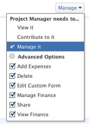

# 共用任務

當您的Adobe Workfront管理員指派存取層級時，可以授予您檢視或編輯任務的存取權。 如需授與工作存取權的詳細資訊，請參閱[授與工作存取權](../../administration-and-setup/add-users/configure-and-grant-access/grant-access-tasks.md)。

除了授予使用者的存取層級外，您還可以授予他們檢視、Contribute或管理您有權共用之特定工作的許可權。

許可權專屬於Workfront中的一個專案，可定義使用者可對該專案執行的動作。

## 共用任務時的注意事項

除了下列考量事項外，另請參閱[物件共用許可權概觀](../../workfront-basics/grant-and-request-access-to-objects/sharing-permissions-on-objects-overview.md)。

* 依預設，任務的建立者擁有管理許可權。
* 您可以個別共用工作，也可以一次大量共用數個工作。\
  共用工作與共用其他物件相同。 如需在Workfront中共用專案的詳細資訊，請參閱[共用物件](../../workfront-basics/grant-and-request-access-to-objects/share-an-object.md)。

* 您可以將下列許可權授與工作： 

   * 檢視
   * 管理
   * 參與\
       

* 當您共用任務時，使用者預設會繼承與任務相關的所有子物件的相同許可權。 例如，他們會對附加到任務的子任務、問題和檔案繼承相同許可權。\
  如需Workfront中物件階層的詳細資訊，請參閱  [瞭解Adobe Workfront中的物件](../../workfront-basics/navigate-workfront/workfront-navigation/understand-objects.md)。

  Workfront管理員可以指定檔案是否應該繼承使用者存取層級中較高物件的許可權。 如需有關限制檔案繼承許可權的詳細資訊，請參閱[建立或修改自訂存取層級](../../administration-and-setup/add-users/configure-and-grant-access/create-modify-access-levels.md)。

* 您可以從任務中移除繼承的許可權。\
  如需有關從物件移除繼承許可權的詳細資訊，請參閱  [從物件移除許可權](../../workfront-basics/grant-and-request-access-to-objects/remove-permissions-from-objects.md)。

## 共用任務的方法

您可以透過下列方式共用任務：

* 手動（個別或大量）。 手動共用工作類似於在Workfront中共用任何其他物件。

  如需在Workfront中共用物件的詳細資訊，請參閱  [共用物件](../../workfront-basics/grant-and-request-access-to-objects/share-an-object.md)。

* 自動，執行下列動作：

   * 指定任務之任何父系物件的許可權：專案、方案或投資組合。 任務會從其父物件繼承許可權。 如需有關檢視物件繼承許可權的資訊，請參閱[檢視物件的繼承許可權](../../workfront-basics/grant-and-request-access-to-objects/view-inherited-permissions-on-objects.md)。
   * 在用來建立任務所在專案的範本上，將實體新增至專案共用。 如需從範本共用專案的詳細資訊，請參閱[共用範本](../../workfront-basics/grant-and-request-access-to-objects/share-a-template.md)。

   * 編輯專案時，請指定專案中所有任務的許可權。 如需有關根據使用者對專案的許可權管理專案上任務存取許可權的資訊，請參閱文章[編輯專案](../../manage-work/projects/manage-projects/edit-projects.md)中的區段。

  >[!TIP]
  >
  >如果您未指定將使用者指派給專案中的任務時，希望使用者擁有哪些任務許可權，預設情況下，使用者會獲得與其在專案上相同的許可權。

## 任務許可權

下表顯示當允許使用者檢視、Contribute或管理任務時，您可以授予他們哪些許可權：

<table border="2" cellspacing="15" cellpadding="1"> 
 <col> 
 <col> 
 <col> 
 <col> 
 <thead> 
  <tr> 
   <th><strong>動作</strong> </th> 
   <th><strong>管理</strong> </th> 
   <th><strong>Contribute</strong> </th> 
   <th><strong>檢視</strong> </th> 
  </tr> 
 </thead> 
 <tbody> 
  <tr> 
   <td scope="row">新增任務</td> 
   <td>✓ (A)</td> 
   <td>✓ (A)</td> 
   <td> </td> 
  </tr> 
  <tr> 
   <td scope="row">新增前置任務</td> 
   <td>✓ (A)</td> 
   <td> </td> 
   <td> </td> 
  </tr> 
  <tr> 
   <td scope="row">新增問題</td> 
   <td>✓ (A)</td> 
   <td>✓ (A)</td> 
   <td>✓ (A)</td> 
  </tr> 
  <tr> 
   <td scope="row">刪除任務</td> 
   <td>✓ (A)</td> 
   <td> </td> 
   <td> </td> 
  </tr> 
  <tr> 
   <td scope="row"> 
一般任務編輯 
 </td> 
   <td>✓ (A)</td> 
   <td>✓ (A)</td> 
   <td> </td> 
  </tr> 
  <tr> 
   <td scope="row">變更任務狀態</td> 
   <td>✓ (A)</td> 
   <td>✓ (A)</td> 
   <td> </td> 
  </tr> 
  <tr> 
   <td scope="row">編輯任務限制</td> 
   <td>✓ (A)</td> 
   <td> </td> 
   <td> </td> 
  </tr> 
  <tr> 
   <td scope="row">檢視任務</td> 
   <td>✓ (A)</td> 
   <td>✓ (A)</td> 
   <td>✓ (A)</td> 
  </tr> 
  <tr> 
   <td scope="row">新增檔案</td> 
   <td>✓ (A)</td> 
   <td>✓ (A)</td> 
   <td>✓ (A)</td> 
  </tr> 
  <tr> 
   <td scope="row">複製任務*</td> 
   <td>✓ (A)</td> 
   <td>✓ (A)</td> 
   <td>✓ (A)</td> 
  </tr> 
  <tr> 
   <td scope="row">移動任務*</td> 
   <td>✓ (A)</td> 
   <td> </td> 
   <td> </td> 
  </tr> 
  <tr> 
   <td scope="row">記錄時數</td> 
   <td>✓ (A)</td> 
   <td>✓ (A)</td> 
   <td> </td> 
  </tr> 
  <tr> 
   <td scope="row">修改計畫日期</td> 
   <td>✓ (A)</td> 
   <td> </td> 
   <td> </td> 
  </tr> 
  <tr> 
   <td scope="row">接受指派</td> 
   <td>✓ (A)</td> 
   <td>✓ (A)</td> 
   <td> </td> 
  </tr> 
  <tr> 
   <td scope="row">進行指派</td> 
   <td>✓ (A)</td> 
   <td>✓ (A)</td> 
   <td> </td> 
  </tr> 
  <tr> 
   <td scope="row">附加自訂表單</td> 
   <td>✓ (A)</td> 
   <td> </td> 
   <td> </td> 
  </tr> 
  <tr> 
   <td scope="row">編輯自訂欄位</td> 
   <td>✓ (A)</td> 
   <td>✓ (A)</td> 
   <td> </td> 
  </tr> 
  <tr> 
   <td scope="row">建立核准流程</td> 
   <td>✓ (A)</td> 
   <td> </td> 
   <td> </td> 
  </tr> 
  <tr> 
   <td scope="row">核准任務</td> 
   <td>✓ (A)</td> 
   <td>✓ (A)</td> 
   <td>✓ (A)</td> 
  </tr> 
  <tr> 
   <td scope="row">編輯財務*</td> 
   <td>✓ (A)</td> 
   <td> </td> 
   <td> </td> 
  </tr> 
  <tr> 
   <td scope="row">新增/編輯費用</td> 
   <td>✓ (A)</td> 
   <td>✓ (A)</td> 
   <td> </td> 
  </tr> 
  <tr> 
   <td scope="row">檢視財務</td> 
   <td>✓ (A)</td> 
   <td>✓ (A)</td> 
   <td>✓ (A)</td> 
  </tr> 
  <tr> 
   <td scope="row">更新/評論</td> 
   <td>✓ (A)</td> 
   <td>✓ (A)</td> 
   <td>✓ (A)</td> 
  </tr> 
  <tr> 
   <td scope="row">共用</td> 
   <td>✓ (A)</td> 
   <td>✓ (A)</td> 
   <td>✓ (A)</td> 
  </tr> 
  <tr> 
   <td scope="row">全系統共用</td> 
   <td> </td> 
   <td> </td> 
   <td>✓ (A)</td> 
  </tr> 
 </tbody> 
</table>

&#42;由存取層級和專案的許可權所控制。
