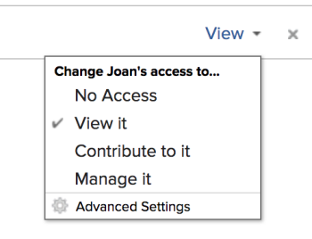

# 共用範本

身為Adobe Workfront管理員，您可以在指派使用者的存取層級時，授予使用者檢視或編輯範本的存取權。 使用者必須擁有「計畫」授權才能存取「編輯範本」。

如需授與範本存取權的詳細資訊，請參閱[授與範本存取權](../../administration-and-setup/add-users/configure-and-grant-access/grant-access-templates.md)。

除了您授與的存取層級外，使用者還可以從共用範本的其他使用者接收檢視或管理特定範本的許可權。

>[!NOTE]
>
>許可權層級在存取層級中運作。 例如，如果使用者的存取層級只允許他們檢視範本，則他們無法取得「管理範本」的許可權。

許可權專屬於Workfront中的一個專案，可定義使用者可對該專案執行的動作。

## 共用範本時的注意事項

* 除了下列考量事項外，另請參閱[物件共用許可權概觀](../../workfront-basics/grant-and-request-access-to-objects/sharing-permissions-on-objects-overview.md)。
* 根據預設，範本的建立者以及範本擁有者具有範本的管理許可權。 如需有關指定使用者為範本擁有者的資訊，請參閱[編輯專案範本](../../manage-work/projects/create-and-manage-templates/edit-templates.md)。
* 共用範本時，您可以共用下列專案：

   * 範本

     如需如何共用範本的詳細資訊，請參閱[共用專案範本](../../manage-work/projects/create-and-manage-templates/share-project-template.md)。

     您可以將下列許可權授與範本：

      * 檢視

        

      * 管理

        

   * 使用範本建立的未來專案。 您可以對使用範本建立的專案賦予與個別專案相同的許可權層級。 

     若要瞭解如何在範本層級共用範本中的專案，請參閱[共用專案範本](../../manage-work/projects/create-and-manage-templates/share-project-template.md)。

* 當您共用範本或從範本建立的專案時，使用者預設會繼承與範本或專案相關聯的所有子物件的相同許可權。

  如需Workfront中物件階層的詳細資訊，請參閱  [瞭解Adobe Workfront中的物件](../../workfront-basics/navigate-workfront/workfront-navigation/understand-objects.md)。

* 當您共用範本時，除非另有指定，所有範本任務和檔案，以及使用該範本建立的未來專案上的問題都將繼承相同的許可權。

  如需有關根據使用者對專案的許可權來管理專案上範本任務和問題的存取許可權的資訊，請參閱文章[編輯專案範本](../../manage-work/projects/create-and-manage-templates/edit-templates.md)中的[存取](../../manage-work/projects/create-and-manage-templates/edit-templates.md#access)區段。

* Workfront管理員可以指定檔案是否應該繼承使用者存取層級中較高物件的許可權。 如需有關限制檔案繼承許可權的詳細資訊，請參閱[建立或修改自訂存取層級](../../administration-and-setup/add-users/configure-and-grant-access/create-modify-access-levels.md)。

<!--

<h2>Share a template</h2>

(NOTE: drafted because this is also linked above: Share project templates >> which is an article in the Manage Work section>> Templates)&nbsp;

<ol>
<li value="1"> 
Go to the template you want to share with other entities, click <strong>Template Actions</strong>, then <strong>Template Sharing</strong>. Or
 
Navigate to a list of templates, and select multiple templates from the list, then click <strong>Share Template</strong>.
 <note type="note">
If you select multiple templates, you cannot view who already has permissions to the individual templates.
</note> </li>
<li value="2"> 
Start typing the name of a user, group, team, job role, or company that you want to share the template with in the <strong>Give template access to</strong> or <strong>Edit template access for</strong> fields.
 
Select them when they appear in the list.
 <note type="tip">
You can share an object only with active users, teams,
roles, or companies.
</note> </li>
<li value="3">From the drop-down menu, select which level of permissions you want to grant: 
<ul>
<li>
<strong>View it</strong>: Users with these permissions are able to view the template and create a project using it, or attach it to an existing project.

</li>
<li><strong>Manage it</strong>: Users with these permissions are able to edit or delete the template.</li>
</ul></li>
<li value="4">(Optional) Click <strong>Advanced Settings</strong> to fine-tune your settings for each level of permissions.</li>
<li value="5">Click <strong>Save</strong>.</li>
</ol>
<h2>Share a project at the template level</h2>

You can share the future projects that are created using a template with users at the template level.

<ol>
<li value="1"> 
Go to the template whose future projects you want to share with other entities, click <strong>Template Actions</strong>, then <strong>Project Sharing</strong>.
 
Or
 
Navigate to a list of templates, and select multiple templates from the list, then click <strong>Share Project</strong>.
 <note type="note">
If you select multiple templates, you cannot view who already has project permissions to the individual templates.
</note> </li>
<li value="2"> 
Start typing and then select the name of a user, group, team, job role, or company with whom you want to share future projects created from the template in the <strong>Give project access to</strong> or <strong>Edit template access for</strong> fields.
 <note type="tip">
You can share an object only with active users, teams,
roles, or companies.
</note> </li>
<li value="3">From the drop-down menu, select which level of permissions you want to grant. Select from the following: 
<ul>
<li><strong>No access</strong>: You can specify which users will not have any access to the template. This option is available only when bulk sharing projects from templates.&nbsp;</li>
<li><strong>View</strong>: Users with these permissions can view projects created from the template.</li>
<li><strong>Contribute</strong>: Users with these permissions can contribute to projects created from the template&nbsp;</li>
<li><strong>Manage</strong>: Users with these permissions can manage or delete projects created from this template. </li>
</ul></li>
<li value="4">(Optional) Click <strong>Advanced Settings</strong> to fine-tune your settings for each level of permissions. </li>
<li value="5">Click <strong>Save</strong>.</li>
</ol>

-->

## 範本共用的進階設定

下表顯示當允許使用者檢視或管理範本時，您可以授予他們哪些許可權。 如需共用範本的指示，請參閱文章[共用專案範本](../../manage-work/projects/create-and-manage-templates/share-project-template.md)中的[共用範本](../../manage-work/projects/create-and-manage-templates/share-project-template.md#share)一節。

<table style="table-layout:auto"> 
 <col> 
 <col> 
 <col> 
 <thead> 
  <tr> 
   <th>動作</th> 
   <th>管理</th> 
   <th>檢視</th> 
  </tr> 
 </thead> 
 <tbody> 
  <tr> 
   <td>複製</td> 
   <td>✓ (A)</td> 
   <td> </td> 
  </tr> 
  <tr> 
   <td>刪除</td> 
   <td>✓ (A)</td> 
   <td> </td> 
  </tr> 
  <tr> 
   <td>編輯範本詳細資訊</td> 
   <td>✓ (A)</td> 
   <td> </td> 
  </tr> 
  <tr> 
   <td>檢視範本</td> 
   <td>✓ (A)</td> 
   <td>✓ (A)</td> 
  </tr> 
  <tr> 
   <td>共用</td> 
   <td>✓ (A)</td> 
   <td>✓ (A)</td> 
  </tr> 
  <tr> 
   <td>全系統共用</td> 
   <td> </td> 
   <td>✓ (A)</td> 
  </tr> 
  <tr data-mc-conditions=""> 
   <td> 
新增文件
 
秘訣：有時候，人們會將檔案新增至專案範本，認為自己要新增至專案。 您可以停用此設定來防止收件者發生這種情況。
 </td> 
   <td> </td> 
   <td>✓ (A)</td> 
  </tr> 
 </tbody> 
</table>

若要瞭解您授予使用者使用範本建立之專案的許可權，請參閱[在Adobe Workfront中共用專案](../../workfront-basics/grant-and-request-access-to-objects/share-a-project.md)。
