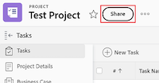
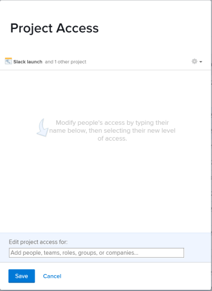

# 共用物件

當使用者指派存取層級時，您的Adobe Workfront管理員會授予他們檢視或編輯物件的存取權。 如需授予物件存取許可權的詳細資訊，請參閱 [建立或修改自訂存取層級](../../administration-and-setup/add-users/configure-and-grant-access/create-modify-access-levels.md).

除了授予使用者的存取層級之外，您還可以授予他們檢視或編輯您所建立或有權共用之特定物件的許可權。 如需存取層級和許可權的詳細資訊，請參閱 [存取層級和許可權如何搭配運作](../../administration-and-setup/add-users/access-levels-and-object-permissions/how-access-levels-permissions-work-together.md).

許可權專屬於Workfront中的一個專案，並定義您可以對該專案執行的動作。

如需關於共用物件許可權的資訊，請參閱 [共用物件許可權概觀](../../workfront-basics/grant-and-request-access-to-objects/sharing-permissions-on-objects-overview.md).

>[!NOTE]
>
>Workfront管理員可以新增或移除系統中所有使用者的任何專案的許可權，而無需擁有這些專案。

本文說明如何共用下列物件： 

* 專案、任務、問題
* Portfolio、計畫
* 文件

如需有關如何在Workfront中共用所有其他物件的資訊，另請參閱下列文章：

* 如需範本，請參閱 [共用專案範本](../../manage-work/projects/create-and-manage-templates/share-project-template.md).
* 如需校樣，請參閱 [在Workfront Proof中共用校訂](../../workfront-proof/wp-work-proofsfiles/share-proofs-and-files/share-proof.md).
* 如需報告、儀表板和行事曆，請參閱下列文章：

   * [在Adobe Workfront中共用報表](../../reports-and-dashboards/reports/creating-and-managing-reports/share-report.md)
   * [共用儀表板](../../reports-and-dashboards/dashboards/creating-and-managing-dashboards/share-dashboard.md)
   * [共用行事曆報告](../../reports-and-dashboards/reports/calendars/share-a-calendar-report.md)

  此外，另請參閱 [共用報告、儀表板和行事曆](../../workfront-basics/grant-and-request-access-to-objects/permissions-reports-dashboards-calendars.md) 以取得共用報告、儀表板和行事曆的一般資訊。 

* 如需篩選器、檢視和群組，請參閱 [共用篩選、檢視或群組](../../reports-and-dashboards/reports/reporting-elements/share-filter-view-grouping.md).
* 若為檔案資料夾，請參閱 [共用檔案資料夾](../../workfront-basics/grant-and-request-access-to-objects/share-a-document-folder.md).
* 如需計畫，請參閱 [在「情境規劃工具」中共用計畫](../../scenario-planner/share-a-plan.md).

  這需要額外的授權。

* 如需目標，請參閱 [在Workfront目標中共用目標](../../workfront-goals/workfront-goals-settings/share-a-goal.md). 這需要額外的授權。

## 存取需求

<!--drafted for P&P:

<table style="table-layout:auto"> 
 <col> 
 <col> 
 <tbody> 
  <tr> 
   <td role="rowheader">Adobe Workfront plan*</td> 
   <td> 
Any 
 </td> 
  </tr> 
  <tr> 
   <td role="rowheader">Adobe Workfront license*</td> 
   <td> 
Current license: Standard
 
   Or
   
Legacy license: Work or higher

   </td> 
  </tr> 
  <tr> 
   <td role="rowheader">Access level configurations*</td> 
   <td> 
View access or higher to the objects you want to share
 
<b>NOTE</b>
   
   If you still don't have access, ask your Workfront administrator if they set additional restrictions in your access level. For information on how a Workfront administrator can modify your access level, see <a href="../../administration-and-setup/add-users/configure-and-grant-access/create-modify-access-levels.md" class="MCXref xref">Create or modify custom access levels</a>.
 </td> 
  </tr> 
  <tr> 
   <td role="rowheader">Object permissions</td> 
   <td> 
View permissions or higher to the objects you want to share
 
For information on requesting additional access, see <a href="../../workfront-basics/grant-and-request-access-to-objects/request-access.md" class="MCXref xref">Request access to objects </a>.
 </td> 
  </tr> 
 </tbody> 
</table>
-->

您必須具備下列專案才能共用物件：

<table style="table-layout:auto"> 
 <col> 
 <col> 
 <tbody> 
  <tr> 
   <td role="rowheader">Adobe Workfront計畫*</td> 
   <td> 
任何 
 </td> 
  </tr> 
  <tr> 
   <td role="rowheader">Adobe Workfront授權*</td> 
   <td> 
工作或以上
 </td> 
  </tr> 
  <tr> 
   <td role="rowheader">存取層級設定*</td> 
   <td> 
檢視您要共用之物件的存取許可權或以上版本
 
<b>附註</b>

如果您仍然沒有存取權，請詢問您的Workfront管理員是否對您的存取層級設定了其他限制。 如需有關Workfront管理員如何修改您的存取層級的資訊，請參閱 <a href="../../administration-and-setup/add-users/configure-and-grant-access/create-modify-access-levels.md" class="MCXref xref">建立或修改自訂存取層級</a>.
 </td>
</tr> 
  <tr> 
   <td role="rowheader">物件許可權</td> 
   <td> 
檢視您要共用之物件的許可權或以上
 
如需請求其他存取許可權的詳細資訊，請參閱 <a href="../../workfront-basics/grant-and-request-access-to-objects/request-access.md" class="MCXref xref">要求物件的存取權 </a>.
 </td> 
  </tr> 
 </tbody> 
</table>

&#42;若要瞭解您擁有的計畫、授權型別或存取權，請聯絡您的Workfront管理員。

## 共用單一物件 {#share-a-single-object}

1. 前往您要共用的物件。

   如需哪些物件可以共用的詳細資訊，請參閱 [共用物件許可權概觀](../../workfront-basics/grant-and-request-access-to-objects/sharing-permissions-on-objects-overview.md).
1. 對於專案、任務和問題：

   按一下 **共用** 物件名稱旁的按鈕。

   

   或

   對於檔案、投資組合和計畫：

   按一下 **更多** 圖示 在物件名稱旁邊，然後按一下 **共用** 或 **共用。**

   

1. 在 **授予 `<Object Name>` 存取** 欄位，開始輸入您要與其共用物件的使用者、專案團隊、角色、群組或公司的名稱，然後在其出現在下拉式清單中時按一下該名稱。

   例如，如果您要共用專案，請使用 **將專案存取權授予** 欄位。

   >[!TIP]
   >
   >您只能與作用中使用者、團隊、角色或公司共用物件。

   

   >[!TIP]
   >
   >如果您有多個名稱相似的圖元，它們都會列在其型別下。 圖元名稱會依字母順序顯示。 不過，實體型別的顯示順序是隨機的。
   >
   >
   >   >
   >

1. （可選）針對您想要授予物件存取權的每個使用者、專案團隊、角色或群組，重複步驟3。

   <!--
   <MadCap:conditionalText data-mc-conditions="QuicksilverOrClassic.Draft mode">
   (NOTE: esnure this stays accurate; in the editor it looks like step 4 but one step is conditioned entirely for one version or another)
   </MadCap:conditionalText>
   -->

1. 按一下下拉式功能表，然後選取您要授與的許可權層級，以指定您在步驟3中新增的每個使用者、專案團隊、角色、群組或公司的許可權。

   下列選項可供使用：

   * **檢視：** 使用者可以檢閱和共用專案。 
   * **Contribute****：**使用者可以進行更新、記錄資訊、進行微幅編輯和共用，以及所有檢視許可權。

     >[!TIP]
     >
     >您只能將Contribute許可權授與下列物件： 
     >
     >   
     >   
     * 專案
     * 任務
     * 問題
     >   
     >

   * **管理：**使用者擁有物件的完整存取權，但沒有在存取層級授予的管理許可權，再加上所有檢視和貢獻許可權。

     >[!NOTE]
     >
     > Workfront管理員或物件建立者可以從這些實體中移除許可權。

      

     

1. （可選）按一下 **進階選項** 以設定物件的特定許可權。

   視選取的物件而定，「檢視」、「管理」和「貢獻」有不同的進階選項。\
   如需許可權層級的詳細資訊，請參閱 [共用物件許可權概觀](../../workfront-basics/grant-and-request-access-to-objects/sharing-permissions-on-objects-overview.md).

   

1. （可選）若要讓此物件可供系統中的所有使用者使用，請按一下 **齒輪** 圖示  ，然後在下拉式選單中按一下 **使其在整個系統內可見**.

   所有使用者都可以根據您設定的許可權檢視物件。

1. （選擇性和條件性）共用專案時，按一下 **齒輪** 圖示 ，然後在下拉式選單中按一下 **設為我的專案存取權範本** 將許可權設定為範本。\
   定義一個專案的許可權後，下次您從頭開始建立專案時，系統會自動套用這些相同的許可權。

   >[!NOTE]
   >
   專案存取範本會覆寫存取層級中Workfront管理員授予您的共用預設值。\
   如需有關在「存取層級」中指定專案共用預設值的詳細資訊，請參閱 [授予專案的存取權](../../administration-and-setup/add-users/configure-and-grant-access/grant-access-projects.md) .>
   >
   <!--   >
   ><MadCap:conditionalText data-mc-conditions="QuicksilverOrClassic.Draft mode">   >
   >(NOTE: (this note also appears in Understanding Project Permissions.))   >
   ></MadCap:conditionalText>   >
   >-->   >
   >

   您可以指定共用範本時，從範本建立的專案許可權。 如需詳細資訊，請參閱 [共用專案範本](../../manage-work/projects/create-and-manage-templates/share-project-template.md).

1. （選用）若要將物件設為公用，請按一下 **將此設為公開給外部使用者**.

   >[!TIP]
   >
   此選項並非適用於所有物件。

   

1. （視條件而定）如果您將物件公開給外部使用者，請按一下 **複製連結，** 然後將連結散佈給外部使用者。\
   擁有連結的任何使用者都可以檢視物件。

   >[!CAUTION]
   >
   建議您將包含機密資訊的物件與外部使用者共用時務必謹慎。 這可讓他們檢視資訊，而不需要身為Workfront使用者或屬於您的組織。

1. 按一下&#x200B;**儲存**。

## 大量共用物件

從物件清單中，您可以一次與其他使用者、團隊、群組、職務角色或公司共用多個物件。

>[!IMPORTANT]
>
當您大量共用物件時，不會顯示擁有個別物件許可權的實體名稱。 當大量共用物件時，您新增至共用清單的實體會新增至所選物件。 它們不會覆寫與個別物件相關聯的圖元。 

若要大量共用物件：

1. 瀏覽至物件清單。
1. 在清單中選取兩個或多個物件。
1. 按一下 **共用** 圖示 .\
   在大量共用時，已擁有物件存取許可權的使用者不會列為可用。

   >[!NOTE]
   >
   如果您沒有共用所選物件的許可權， **共用** 按鈕不可見。

1. 在 **編輯 `<Object Name>` 存取對象** 欄位，開始輸入您要授予許可權的使用者、團隊、群組、工作角色或公司的名稱。

   例如，如果您要共用專案，請使用 **授予專案存取權給** 欄位。

   

1. 繼續共用選取的物件，如一節中的步驟4-9所述 [共用單一物件](#share-a-single-object) 本文章內容。

   <!--
   <MadCap:conditionalText data-mc-conditions="QuicksilverOrClassic.Draft mode">
   (NOTE: ensure these steps stay accurate; always look at them in the viewer; because of condiitoning, the steps numbers in the editor are different!!!!!!*****)
   </MadCap:conditionalText>
   -->

1. 按一下&#x200B;**儲存**。
