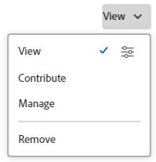

# 共用物件

<!--Audited: 01/2024-->

當使用者指派存取層級時，您的Adobe Workfront管理員會授予他們檢視或編輯物件的存取權。 如需有關授予物件存取權的詳細資訊，請參閱 [建立或修改自訂存取層級](../../administration-and-setup/add-users/configure-and-grant-access/create-modify-access-levels.md).

除了授予使用者的存取層級之外，您還可以授予他們檢視或編輯您所建立或有權共用之特定物件的許可權。 如需存取層級和許可權的詳細資訊，請參閱 [存取層級和許可權如何搭配運作](../../administration-and-setup/add-users/access-levels-and-object-permissions/how-access-levels-permissions-work-together.md).

許可權專屬於Workfront中的一個專案，可定義使用者可對該專案執行的動作。

如需關於共用物件許可權的資訊，請參閱 [物件許可權共用概觀](../../workfront-basics/grant-and-request-access-to-objects/sharing-permissions-on-objects-overview.md).

>[!NOTE]
>
>Workfront管理員可以新增或移除系統中所有使用者的任何專案許可權，而無需擁有這些專案。

本文說明如何共用下列物件：

* 專案、任務、問題
* Portfolio、計畫
* 文件

如需有關如何在Workfront中共用所有其他物件的資訊，另請參閱下列文章：

* 如需範本，請參閱 [共用專案範本](../../manage-work/projects/create-and-manage-templates/share-project-template.md).
* 如需校樣，請參閱 [在Workfront Proof中共用校訂](../../workfront-proof/wp-work-proofsfiles/share-proofs-and-files/share-proof.md).
* 如需報告、控制面板和行事曆，請參閱下列文章：

   * [在Adobe Workfront中共用報表](../../reports-and-dashboards/reports/creating-and-managing-reports/share-report.md)
   * [共用儀表板](../../reports-and-dashboards/dashboards/creating-and-managing-dashboards/share-dashboard.md)
   * [共用行事曆報告](../../reports-and-dashboards/reports/calendars/share-a-calendar-report.md)

  此外，另請參閱 [共用報告、儀表板和行事曆](../../workfront-basics/grant-and-request-access-to-objects/permissions-reports-dashboards-calendars.md) 以取得共用報告、儀表板和行事曆的一般資訊。

* 如需篩選器、檢視和群組，請參閱 [共用篩選、檢視或分組](../../reports-and-dashboards/reports/reporting-elements/share-filter-view-grouping.md).
* 若為檔案資料夾，請參閱 [共用檔案資料夾](../../workfront-basics/grant-and-request-access-to-objects/share-a-document-folder.md).
* 如需計畫，請參閱 [在「情境規劃工具」中共用計畫](../../scenario-planner/share-a-plan.md).

  這需要額外的授權。

* 如需目標，請參閱 [在Workfront目標中共用目標](../../workfront-goals/workfront-goals-settings/share-a-goal.md). 這需要額外的授權。

## 存取需求

您必須具備下列專案才能共用物件：

<table style="table-layout:auto"> 
 <col> 
 <col> 
 <tbody> 
  <tr> 
   <td role="rowheader">Adobe Workfront計畫</td> 
   <td> 
任何 
 </td> 
  </tr> 
  <tr> 
   <td role="rowheader">Adobe Workfront授權*</td> 
   <td> 
新授權： Standard
 
   或
   
目前授權：工作或以上

   </td> 
  </tr> 
  <tr> 
   <td role="rowheader">存取層級設定</td> 
   <td> 
檢視您要共用之物件的存取許可權或以上許可權
 </td> 
  </tr> 
  <tr> 
   <td role="rowheader">物件許可權</td> 
   <td> 
檢視您要共用之物件的許可權或更高的許可權
</td> 
  </tr> 
 </tbody> 
</table>

*若要瞭解您擁有的計畫、授權型別或存取權，請聯絡您的Workfront管理員。 如需詳細資訊，請參閱 [Workfront檔案中的存取需求](/help/quicksilver/administration-and-setup/add-users/access-levels-and-object-permissions/access-level-requirements-in-documentation.md).

## 從其頁面共用專案、任務或問題

1. 前往您要共用的專案、任務或問題頁面。

   如需哪些物件可以共用的資訊，請參閱 [物件許可權共用概觀](../../workfront-basics/grant-and-request-access-to-objects/sharing-permissions-on-objects-overview.md).

1. 按一下 **共用** 物件名稱旁的按鈕。

   

1. 在 **授予&lt;物件名稱>存取權至** 方塊中，開始輸入您要與其共用物件的使用者、專案團隊、角色、群組或公司的名稱，然後當名稱出現在下拉式清單中時按一下該名稱。

    {width=&quot;350&quot; }

   >[!TIP]
   >
   >您只能與作用中使用者、團隊、角色或公司共用物件。

   >[!TIP]
   >
   >如果您有多個名稱相似的圖元，它們都會列在其型別下。 圖元名稱會依字母順序顯示。 但是，實體型別的顯示順序是隨機的。
   >

1. （選擇性）針對您想要授予物件存取權的每個使用者、專案團隊、角色或群組，重複步驟3。

1. 按一下每個使用者、團隊、角色、群組或公司名稱右側的下拉式功能表，然後選取您要授與的許可權層級，以指定您在步驟3中新增的每個使用者、團隊、角色、群組或公司的許可權。

   

   若要移除物件的許可權，請參閱 [移除物件的許可權](/help/quicksilver/workfront-basics/grant-and-request-access-to-objects/remove-permissions-from-objects.md).

   下列選項可供使用：

   * **檢視：** 使用者可以檢閱和共用專案。
   * **Contribute**：使用者可以更新、記錄資訊、進行次要編輯和共用，以及所有檢視許可權。
   * **管理：** 使用者擁有物件的完整存取權，但沒有管理許可權（這些許可權是在存取層級授予的）。 此外，他們還有所有「檢視」和「貢獻」許可權。

     >[!NOTE]
     >
     >Workfront管理員或物件建立者可以從這些實體中移除許可權。

1. （可選）按一下您已授與的許可權層級旁的進階選項圖示，以設定物件的特定許可權。

   

   「檢視」、「管理」和「貢獻」有不同的進階選項，視選取的物件而定。\
   如需許可權層級的詳細資訊，請參閱 [物件許可權共用概觀](../../workfront-basics/grant-and-request-access-to-objects/sharing-permissions-on-objects-overview.md).

1. （選擇性）若要讓此物件可供系統中的所有使用者使用，請按一下下的下拉式功能表 **誰擁有存取權**，然後在下拉式功能表中按一下 **系統中的每個人都可以檢視**.

   

   所有使用者都可以根據您設定的許可權檢視物件。

1. （選擇性和條件性）共用專案時，按一下 **齒輪** 圖示 ，然後勾選「 」旁的方塊 **設為我的專案存取許可權範本** 將許可權設定為範本。

   定義一個專案的許可權後，下次您從頭開始建立專案時，系統會自動套用這些相同的許可權。

   >[!NOTE]
   >
   >專案存取範本會覆寫Workfront管理員在存取層級中授予您的共用預設值。\
   >如需有關在「存取層級」中指定專案共用預設值的詳細資訊，請參閱 [授予專案存取權](../../administration-and-setup/add-users/configure-and-grant-access/grant-access-projects.md)

   <!--
   >this note also appears in Understanding Project Permissions-->

   您可以指定共用範本時，從範本建立的專案許可權。 如需詳細資訊，請參閱 [共用專案範本](../../manage-work/projects/create-and-manage-templates/share-project-template.md).

1. （視條件而定）若要與外部使用者共用物件，請按一下 **複製連結**，然後將連結發佈至外部使用者。

   任何擁有連結的使用者都可以檢視物件。

   >[!CAUTION]
   >
   >建議您將包含機密資訊的物件與外部使用者共用時務必謹慎。 這可讓他們檢視資訊，而不需要身為Workfront使用者或屬於您的組織。

1. 按一下「**儲存**」。

## 從其頁面共用檔案、投資組合或方案

1. 移至您要共用的檔案、投資組合或方案頁面。

   如需哪些物件可以共用的資訊，請參閱 [物件許可權共用概觀](../../workfront-basics/grant-and-request-access-to-objects/sharing-permissions-on-objects-overview.md).

1. 對於投資組合與計畫：

   按一下 **共用** 物件名稱旁的按鈕。

   

   或

   對於檔案：

   按一下 **更多** 圖示  在物件名稱旁，然後按一下 **共用**.

   

1. 在 **授予&lt;物件名稱>存取權** 方塊中，開始輸入您要與其共用物件的使用者、專案團隊、角色、群組或公司的名稱，然後當名稱出現在下拉式清單中時按一下該名稱。

    {width=&quot;350&quot; }

   >[!TIP]
   >
   >您只能與作用中使用者、團隊、角色或公司共用物件。

   >[!TIP]
   >
   >如果您有多個名稱相似的圖元，它們都會列在其型別下。 圖元名稱會依字母順序顯示。 但是，實體型別的顯示順序是隨機的。
   >

1. （選擇性）針對您想要授予物件存取權的每個使用者、專案團隊、角色或群組，重複步驟3。

1. 按一下下拉式功能表，然後選取您要授與的許可權層級，以指定您在步驟3中新增的每個使用者、團隊、角色、群組或公司的許可權。

   若要移除物件的許可權，請參閱 [移除物件的許可權](/help/quicksilver/workfront-basics/grant-and-request-access-to-objects/remove-permissions-from-objects.md).

   下列選項可供使用：

   * **檢視：** 使用者可以檢閱和共用專案。
   * **管理：** 使用者擁有物件的完整存取權，但沒有管理許可權（這些許可權是在存取層級授予的）。 此外，他們還有所有「檢視」和「貢獻」許可權。

     >[!NOTE]
     >
     >Workfront管理員或物件建立者可以從這些實體中移除許可權。

     

1. （選用）按一下 **進階設定** 以設定物件的特定許可權。

   「檢視」、「管理」和「貢獻」有不同的進階選項，視選取的物件而定。\
   如需許可權層級的詳細資訊，請參閱 [物件許可權共用概觀](../../workfront-basics/grant-and-request-access-to-objects/sharing-permissions-on-objects-overview.md).

   

1. （選擇性）若要讓此物件可供系統中的所有使用者使用，請按一下 **齒輪** 圖示 ，然後在下拉式功能表中按一下 **使其在整個系統內可見**.

   所有使用者都可以根據您設定的許可權檢視物件。

1. （選擇性）若要將物件設為公用，請按一下 **將此設為公開給外部使用者**.

   >[!TIP]
   >
   >此選項並非適用於所有物件。

    {width=&quot;350&quot; }

1. （視條件而定）如果您將物件公開給外部使用者，請按一下 **複製連結**，然後將連結發佈至外部使用者。

   任何擁有連結的使用者都可以檢視物件。

   >[!CAUTION]
   >
   >建議您將包含機密資訊的物件與外部使用者共用時務必謹慎。 這可讓他們檢視資訊，而不需要身為Workfront使用者或屬於您的組織。

1. 按一下「**儲存**」。

## 從清單共用單一或大量物件

1. 移至包含您要共用之物件的清單。

   如需哪些物件可以共用的資訊，請參閱 [物件許可權共用概觀](../../workfront-basics/grant-and-request-access-to-objects/sharing-permissions-on-objects-overview.md).

1. 按一下您要共用之物件旁的核取方塊，然後按一下 **「共用」圖示**  ，位於頁面頂端。

    {width=&quot;350&quot; }

1. 在 **&lt;物件>存取** 視窗出現，開始輸入 **編輯&lt;物件名稱>存取對象** 方塊您要共用物件的使用者、專案團隊、角色、群組或公司名稱，然後當名稱出現在下拉式清單中時按一下該名稱。

    {width=&quot;350&quot; }

   >[!TIP]
   >
   >您只能與作用中使用者、團隊、角色或公司共用物件。

   >[!TIP]
   >
   >如果您有多個名稱相似的圖元，它們都會列在其型別下。 圖元名稱會依字母順序顯示。 但是，實體型別的顯示順序是隨機的。
   >

1. （可選）針對您想要授予物件存取權的每個使用者、專案團隊、角色或群組，重複步驟3。

1. 按一下每個使用者、團隊、角色、群組或公司名稱右側的下拉式功能表，然後選取您要授與的許可權層級，以指定您在步驟3中新增的每個使用者、團隊、角色、群組或公司的許可權。

   若要移除物件的許可權，請參閱 [移除物件的許可權](/help/quicksilver/workfront-basics/grant-and-request-access-to-objects/remove-permissions-from-objects.md).

   

   下列選項可供使用：

   * **檢視：** 使用者可以檢閱和共用專案。
   * **Contribute**：使用者可以更新、記錄資訊、進行次要編輯和共用，以及所有檢視許可權。

     >[!TIP]
     >
     >您只能將Contribute許可權授與下列物件：
     >
     >   * 專案
     >   * 任務
     >   * 問題
     >  

   * **管理：** 使用者擁有物件的完整存取權，但沒有管理許可權（這些許可權是在存取層級授予的）。 此外，他們還有所有「檢視」和「貢獻」許可權。

     >[!NOTE]
     >
     >Workfront管理員或物件建立者可以從這些實體中移除許可權。

1. （選用）按一下 **進階設定** 以設定物件的特定許可權。

   「檢視」、「管理」和「貢獻」有不同的進階選項，視選取的物件而定。\
   如需許可權層級的詳細資訊，請參閱 [物件許可權共用概觀](../../workfront-basics/grant-and-request-access-to-objects/sharing-permissions-on-objects-overview.md).

   

1. （選擇性）若要讓此物件可供系統中的所有使用者使用，請按一下 **齒輪** 圖示  ，然後在下拉式功能表中按一下 **使其在整個系統內可見**.

   所有使用者都可以根據您設定的許可權檢視物件。

1. （選擇性和條件性）共用專案時，按一下 **齒輪** 圖示 ，然後在下拉式功能表中按一下 **設為我的專案存取許可權範本** 將許可權設定為範本。

   定義一個專案的許可權後，下次您從頭開始建立專案時，系統會自動套用這些相同的許可權。

   >[!NOTE]
   >
   >專案存取範本會覆寫Workfront管理員在存取層級中授予您的共用預設值。\
   >如需有關在「存取層級」中指定專案共用預設值的詳細資訊，請參閱 [授予專案存取權](../../administration-and-setup/add-users/configure-and-grant-access/grant-access-projects.md)

   <!--
   >this note also appears in Understanding Project Permissions-->

   您可以指定共用範本時，從範本建立的專案許可權。 如需詳細資訊，請參閱 [共用專案範本](../../manage-work/projects/create-and-manage-templates/share-project-template.md).

1. （選擇性）若要將物件設為公用，請按一下 **將此設為公開給外部使用者**.

   >[!TIP]
   >
   >此選項並非適用於所有物件。

    {width=&quot;350&quot; }

1. （視條件而定）如果您將物件公開給外部使用者，請按一下 **複製連結**，然後將連結發佈至外部使用者。

   任何擁有連結的使用者都可以檢視物件。

   >[!CAUTION]
   >
   >建議您將包含機密資訊的物件與外部使用者共用時務必謹慎。 這可讓他們檢視資訊，而不需要身為Workfront使用者或屬於您的組織。

1. 按一下「**儲存**」。
