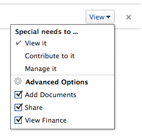

# 共用物件

您的Adobe Workfront管理員在使用者指派存取層級時，授予他們檢視或編輯物件的存取權。 有關授予對象訪問權限的詳細資訊，請參見 [建立或修改自訂存取層級](../../administration-and-setup/add-users/configure-and-grant-access/create-modify-access-levels.md).

除了授予用戶的訪問級別之外，您還可以授予他們查看或編輯您建立或有權共用的特定對象的權限。 如需存取層級和權限的詳細資訊，請參閱 [存取層級與權限如何搭配運作](../../administration-and-setup/add-users/access-levels-and-object-permissions/how-access-levels-permissions-work-together.md).

權限是Workfront中一個項目專屬的權限，並定義可對該項目採取的動作。

有關共用對象權限的資訊，請參閱 [對象共用權限概述](../../workfront-basics/grant-and-request-access-to-objects/sharing-permissions-on-objects-overview.md).

>[!NOTE]
>
>Workfront管理員可以為所有使用者新增或移除系統中任何項目的權限，而不是這些項目的擁有者。

本文說明如何共用共用相同的下列物件： 

* 專案、工作、問題
* Portfolio，方案
* 文件

如需如何共用Workfront中所有其他物件的相關資訊，另請參閱下列文章：

* 如需範本，請參閱 [共用專案範本](../../manage-work/projects/create-and-manage-templates/share-project-template.md).
* 如需校樣，請參閱 [在Workfront校樣中共用校樣](../../workfront-proof/wp-work-proofsfiles/share-proofs-and-files/share-proof.md).
* 如需報表、控制面板和日曆的相關資訊，請參閱下列文章：

   * [在Adobe Workfront中共用報表](../../reports-and-dashboards/reports/creating-and-managing-reports/share-report.md)
   * [共用控制面板](../../reports-and-dashboards/dashboards/creating-and-managing-dashboards/share-dashboard.md)
   * [共用日曆報表](../../reports-and-dashboards/reports/calendars/share-a-calendar-report.md)

   此外，請參閱 [共用報表、控制面板和日曆](../../workfront-basics/grant-and-request-access-to-objects/permissions-reports-dashboards-calendars.md) 以取得共用報表、控制面板和日曆的一般資訊。 

* 如需篩選器、檢視和群組，請參閱 [共用篩選、檢視或分組](../../reports-and-dashboards/reports/reporting-elements/share-filter-view-grouping.md).
* 有關文檔資料夾，請參見 [共用文檔資料夾](../../workfront-basics/grant-and-request-access-to-objects/share-a-document-folder.md).
* 如需計畫，請參閱 [在方案計畫器中共用計畫](../../scenario-planner/share-a-plan.md).

   這需要額外的授權。

* 如需目標，請參閱 [在Workfront目標中共用目標](../../workfront-goals/workfront-goals-settings/share-a-goal.md). 這需要額外的授權。

## 存取需求

<!--drafted for P&P:

<table style="table-layout:auto"> 
 <col> 
 <col> 
 <tbody> 
  <tr> 
   <td role="rowheader">Adobe Workfront plan*</td> 
   <td> 
Any 
 </td> 
  </tr> 
  <tr> 
   <td role="rowheader">Adobe Workfront license*</td> 
   <td> 
Current license: Standard
 
   Or
   
Legacy license: Work or higher

   </td> 
  </tr> 
  <tr> 
   <td role="rowheader">Access level configurations*</td> 
   <td> 
View access or higher to the objects you want to share
 
<b>NOTE</b>
   
   If you still don't have access, ask your Workfront administrator if they set additional restrictions in your access level. For information on how a Workfront administrator can modify your access level, see <a href="../../administration-and-setup/add-users/configure-and-grant-access/create-modify-access-levels.md" class="MCXref xref">Create or modify custom access levels</a>.
 </td> 
  </tr> 
  <tr> 
   <td role="rowheader">Object permissions</td> 
   <td> 
View permissions or higher to the objects you want to share
 
For information on requesting additional access, see <a href="../../workfront-basics/grant-and-request-access-to-objects/request-access.md" class="MCXref xref">Request access to objects </a>.
 </td> 
  </tr> 
 </tbody> 
</table>
-->

您必須具備以下條件才能共用物件：

<table style="table-layout:auto"> 
 <col> 
 <col> 
 <tbody> 
  <tr> 
   <td role="rowheader">Adobe Workfront計畫*</td> 
   <td> 
任何 
 </td> 
  </tr> 
  <tr> 
   <td role="rowheader">Adobe Workfront授權*</td> 
   <td> 
工作或更高
 </td> 
  </tr> 
  <tr> 
   <td role="rowheader">訪問級別配置*</td> 
   <td> 
查看要共用的對象的訪問權限或更高
 
<b>附註</b>

如果您仍無權存取，請洽詢您的Workfront管理員，他們是否在您的存取層級設定其他限制。 如需Workfront管理員如何修改您的存取層級的詳細資訊，請參閱 <a href="../../administration-and-setup/add-users/configure-and-grant-access/create-modify-access-levels.md" class="MCXref xref">建立或修改自訂存取層級</a>.
 </td>
</tr> 
  <tr> 
   <td role="rowheader">物件權限</td> 
   <td> 
查看要共用的對象的權限或更高
 
有關請求其他訪問的資訊，請參閱 <a href="../../workfront-basics/grant-and-request-access-to-objects/request-access.md" class="MCXref xref">請求對對象的訪問 </a>.
 </td> 
  </tr> 
 </tbody> 
</table>

&#42;若要了解您擁有的計畫、授權類型或存取權，請聯絡您的Workfront管理員。

## 共用單一物件 {#share-a-single-object}

1. 前往您要共用的物件。

   有關可共用對象的資訊，請參見 [對象共用權限概述](../../workfront-basics/grant-and-request-access-to-objects/sharing-permissions-on-objects-overview.md).
1. 按一下 **更多** 圖示 在物件名稱旁，按一下 **共用** 或&#x200B;**共用。**

   

1. 在 **提供 `<Object Name>` 存取** 欄位中，開始鍵入要與其共用對象的用戶、團隊、角色、組或公司的名稱，然後在下拉清單中顯示該名稱時按一下該名稱。

   例如，如果您共用專案，請使用 **授予專案存取權** 欄位。

   >[!TIP]
   >
   >您只能與作用中使用者、團隊、角色或公司共用物件。

   

   >[!TIP]
   >
   >如果有多個實體的名稱相同，它們都會列在其類型下。 實體的名稱按字母順序顯示。 不過，實體類型的出現順序是隨機的。
   >
   >
   >   >

1. （可選）對要授予對象訪問權限的每個用戶、團隊、角色或組重複步驟3。

   <!--
   <MadCap:conditionalText data-mc-conditions="QuicksilverOrClassic.Draft mode">
   (NOTE: esnure this stays accurate; in the editor it looks like step 4 but one step is conditioned entirely for one version or another)
   </MadCap:conditionalText>
   -->

1. 按一下下拉式功能表，然後選取您要授予的權限層級，以指定您在步驟3中新增的每個使用者、團隊、角色、群組或公司的權限。

   可使用下列選項：

   * **查看：** 使用者可以檢閱和共用項目。 
   * **Contribute****:**使用者可以進行更新、記錄資訊、進行微幅編輯和共用，以及取得所有檢視權限。

      >[!TIP]
      >
      >您只能將Contribute權限授與下列物件： 
      * 專案
      * 任務
      * 問題

   * **管理：**使用者可完全存取物件，但無管理權限，這些權限會在存取層級授予，加上所有檢視和Contribute權限。

      >[!NOTE]
       Workfront管理員或物件建立者能夠從這些實體中移除權限。

       

      

1. （選用）按一下 **進階選項** 設定物件的特定權限。

   視圖、管理和Contribute具有不同的高級選項（取決於所選對象）。\
   如需權限層級的詳細資訊，請參閱 [對象共用權限概述](../../workfront-basics/grant-and-request-access-to-objects/sharing-permissions-on-objects-overview.md).

   

1. （可選）若要讓此物件可供系統中的所有使用者使用，請按一下 **齒輪** 圖示  ，然後在下拉式功能表中按一下 **使此可見系統範圍**.

   所有使用者都可以根據您設定的權限查看物件。

1. （選用和有條件）共用專案時，按一下 **齒輪** 圖示 ，然後在下拉式功能表中按一下 **設為我的專案存取範本** 將權限設為範本。\
   對一個專案定義權限後，下次您從頭建立專案時，系統會自動套用這些相同的權限。

   >[!NOTE]
   專案存取範本會覆寫Workfront管理員在存取層級中授予您的共用預設值。\
   有關在訪問級別中指定項目共用預設值的詳細資訊，請參閱 [授予專案的存取權](../../administration-and-setup/add-users/configure-and-grant-access/grant-access-projects.md) .>
   <!--   >
   ><MadCap:conditionalText data-mc-conditions="QuicksilverOrClassic.Draft mode">   >
   >(NOTE: (this note also appears in Understanding Project Permissions.))   >
   ></MadCap:conditionalText>   >
   >-->   >

   您可以在共用範本時，針對將從範本建立的專案指定權限。 如需詳細資訊，請參閱 [共用專案範本](../../manage-work/projects/create-and-manage-templates/share-project-template.md).

1. （選用）若要將物件設為公用，請按一下 **將此項目公開給外部使用者**.

   >[!TIP]
   此選項不適用於所有對象。

   

1. （條件性）如果您將物件設為對外部使用者公開，請按一下 **複製連結，** 然後將連結分發給外部用戶。\
   任何具有連結的使用者都能檢視物件。

   >[!CAUTION]
   建議您在與外部使用者共用包含機密資訊的物件時，務必小心。 這可讓使用者檢視資訊，而不需要是Workfront使用者或您組織的一員。

1. 按一下&#x200B;**儲存**。

## 大量共用物件

從對象清單中，您可以同時與其他用戶、團隊、組、工作角色或公司共用多個對象。

>[!IMPORTANT]
大量共用對象時，不會顯示具有各個對象權限的實體的名稱。 批量共用對象時，添加到共用清單中的實體將添加到所選對象。 它們不會覆寫與個別物件相關聯的實體。 

要大量共用對象：

1. 導覽至物件清單。
1. 在清單中選擇兩個或多個對象。
1. 按一下 **共用** 圖示 .\
   已有權存取物件的使用者在大量共用時不會列為可用。

   >[!NOTE]
   如果您沒有共用所選對象的權限，則 **共用** 按鈕未顯示。

1. 在 **編輯 `<Object Name>` 存取** 欄位中，開始鍵入要授予權限的用戶、團隊、組、作業角色或公司的名稱。

   例如，如果您共用專案，請使用 **為授予專案存取權** 欄位。

   

1. 繼續共用所選對象，如一節中的步驟4-9所述 [共用單一物件](#share-a-single-object) 這篇文章。

   <!--
   <MadCap:conditionalText data-mc-conditions="QuicksilverOrClassic.Draft mode">
   (NOTE: ensure these steps stay accurate; always look at them in the viewer; because of condiitoning, the steps numbers in the editor are different!!!!!!*****)
   </MadCap:conditionalText>
   -->

1. 按一下&#x200B;**儲存**。
