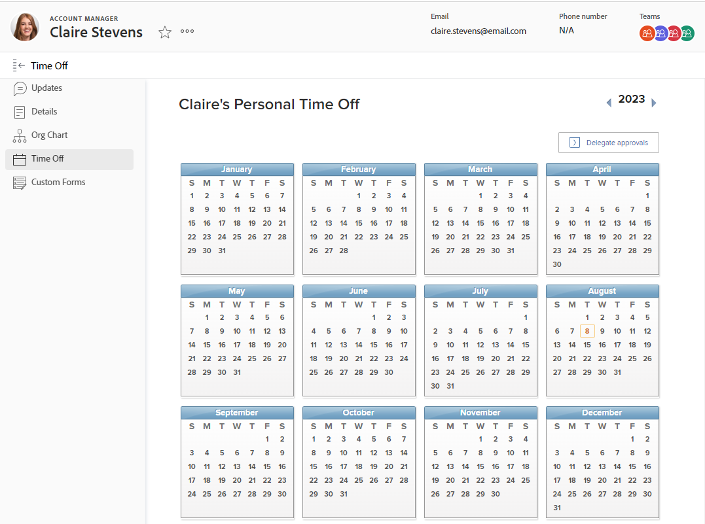

# 設定個人休假

<!-- Audited: 12/2023 -->

[!DNL Adobe Workfront] 並非設計用來複製或取代您現有的系統，以管理、累積及追蹤個人休假。

不過，請務必指明核准的休假何時發生，因為這會同時影響您的排程和 [!UICONTROL 計畫完成日期] 指派給您的任務。

例如，如果您被指派給一項排程為兩週的任務，而您計畫在此期間休假3天， [!DNL Workfront] 將三天新增至任務時間表，以說明休假。

「資源管理」工具也會使用您的個人休假來指示您何時可以排程工作。

>[!NOTE]
>
>為了確保排程休假的日期不會出現不一致的情況，我們建議您使用者設定檔的時區與排程的時區相符。 如需詳細資訊，請參閱下列文章：
>
>* [建立排程](../../../administration-and-setup/set-up-workfront/configure-timesheets-schedules/create-schedules.md)
>* [編輯使用者設定檔](../../../administration-and-setup/add-users/create-and-manage-users/edit-a-users-profile.md)
>

## 存取需求

您必須具有下列存取權才能執行本文中的步驟：

<table style="table-layout:auto"> 
 <col> 
 </col> 
 <col> 
 </col> 
 <tbody> 
  <tr> 
   <td role="rowheader">[!DNL Adobe Workfront] 計劃</td> 
   <td>任何</td> 
  </tr> 
  <tr> 
   <td role="rowheader">[!DNL Adobe Workfront] 授權</td> 
   <td> 
新增：標準（設定個人休假）

        
或

        
目前：工作或更高（以設定您的個人休假）
 </td>
  </tr> 
  <tr> 
   <td role="rowheader">存取層級設定</td> 
   <td>具有[！UICONTROL Edit User]存取權的[！UICONTROL Manager] （變更其他使用者的休假行事曆） 
   <strong>注意：</strong> 如果管理員編輯其他使用者的個人休假行事曆，則所有專案都會顯示在使用者的時區，而不是管理員的時區。</td> 
  </tr> 
 </tbody> 
</table>

如需有關此表格的詳細資訊，請參閱 [Workfront檔案中的存取需求](/help/quicksilver/administration-and-setup/add-users/access-levels-and-object-permissions/access-level-requirements-in-documentation.md).

## 在中設定個人休假 [!DNL Workfront]

{{step1-click-profile-pic}}

1. 在左側面板中，按一下 **[!UICONTROL 休假]**.
1. 選取您個人休假的所需日期。

   

1. 選取 **[!UICONTROL 全天]**，請休一整天的假。

   如果您休假不到一整天，請保持此核取方塊為空白，並指出休假的開始和結束時間。

1. 按一下「**[!UICONTROL 儲存]**」。

   您的休假現在可以在以下位置看到： [!DNL Workfront] 系統，位於資源管理工具，例如資源規劃工具和工作負載平衡器。 在此期間為您指派工作時，工具提示會通知使用者您已排程休假。
