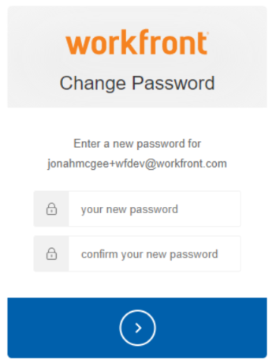

# 使用增強式驗證重設使用者密碼

<!--This article has been hidden by request-->

為您的[!DNL Workfront]環境啟用增強式驗證(eAuth)時，[!DNL Workfront]管理員無法重設其他使用者的登入認證。 這與沒有eAuth或啟用單一登入(SSO)的[!DNL Workfront]環境不同。

## 存取需求

您必須具有下列存取權才能執行本文中的步驟：

<table style="table-layout:auto"> 
 <col> 
 <col> 
 <tbody> 
  <tr> 
   <td role="rowheader"><strong>[!DNL Adobe Workfront] 計畫*</strong></td> 
   <td> 
 任何
 </td> 
  </tr> 
  <tr> 
   <td role="rowheader"><strong>[!DNL Adobe Workfront] 授權*</strong></td> 
   <td> 
[!UICONTROL 計畫]
 </td> 
  </tr> 
  <tr> 
   <td role="rowheader"><strong>存取層級設定*</strong></td> 
   <td> 
系統管理員 
 </td> 
  </tr> 
 </tbody> 
</table>

若要瞭解您擁有的計畫、授權型別或存取權，請連絡您的[!DNL Workfront]管理員。

## 在啟用eAuth的環境中重設使用者密碼

1. 按一下[!DNL Workfront]右上角的&#x200B;**[!UICONTROL 主功能表]**&#x200B;圖示，然後按一下&#x200B;**[!UICONTROL 使用者]** 。

   

1. 選取需要重設密碼的&#x200B;**[!UICONTROL 使用者]**。
   

1. 在您選擇想要的&#x200B;**[!UICONTROL 使用者]**&#x200B;後，請按一下顯示的&#x200B;**[!UICONTROL 更多]按鈕**，然後從下拉式功能表中選取&#x200B;**[!UICONTROL 傳送忘記密碼電子郵件]**&#x200B;選項。

   

選取&#x200B;**[!UICONTROL 傳送忘記密碼電子郵件]**&#x200B;選項後，會傳送電子郵件給選取的使用者，其中包含使用者變更自己密碼的指示。

