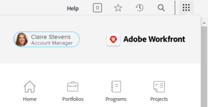

# 重設密碼

{{important-not-on-aec}}

您可以重設您的[!DNL Adobe Workfront]密碼。 作為一項重要的安全性措施，建議您定期執行此作業。

>[!NOTE]
>
>[!DNL Workfront]管理員可以設定自訂密碼限制，如[設定系統安全性偏好設定](../../../administration-and-setup/manage-workfront/security/configure-security-preferences.md)和[設定驗證的密碼原則](../../../administration-and-setup/manage-workfront/security/configure-password-policies-authentication.md)中所述。
>
><!-- [!DNL Workfront] administrator can also reset your password in an Enhanced Authentication enabled environment. For more information, see [Reset a user's password with Enhanced Authentication](../../../workfront-basics/manage-your-account-and-profile/managing-your-workfront-account/reset-user-password-eauth.md).-->

## 存取需求

+++ 展開以檢視本文中功能的存取需求。

<table style="table-layout:auto"> 
 <col> 
 </col>
 <tbody> 
  <tr> 
   <td>Adobe Workfront套件</td> 
   <td> 
任何
 </td> 
  </tr> 
  <tr> 
   <td>Adobe Workfront授權</td> 
   <td> 
   
投稿人或以上

   
要求或更高版本
 </td> 
  </tr> 
 </tbody> 
</table>

如需詳細資訊，請參閱Workfront檔案中的[存取需求](/help/quicksilver/administration-and-setup/add-users/access-levels-and-object-permissions/access-level-requirements-in-documentation.md)。

+++

## 在[!DNL Adobe Workfront]中重設您的密碼

{{step1-click-profile-pic}}

1. 按一下&#x200B;**[!UICONTROL 更多功能表]** ，然後按一下&#x200B;**[!UICONTROL 編輯]**。

1. 在顯示的&#x200B;**[!UICONTROL 編輯人員]**&#x200B;方塊中，在&#x200B;**[!UICONTROL 個人資訊]**&#x200B;下，按一下&#x200B;**[!UICONTROL 變更密碼]**。

   ![按一下[變更密碼]](assets/edit-user-change-password.png)

   如果貴組織已將[!DNL Workfront]與SSO解決方案整合，當您按一下&#x200B;**[!UICONTROL 變更密碼]**&#x200B;時，系統可能會引導您透過SSO系統重設密碼。 這會重設您的SSO密碼，而這會影響您登入組織內的所有其他應用程式。

1. 輸入您的舊密碼，然後輸入您想要的新密碼兩次。

   您的密碼必須至少為8個字元，並包含下列兩種字元型別：

   * 大寫字母
   * 小寫字母
   * 數字
   * 特殊字元(如！ @ # $ %)

   密碼規則可能比這更嚴格，視您的[!DNL Workfront]管理員所設定的組態設定而定。

1. 按一下「**[!UICONTROL 儲存]**」。
