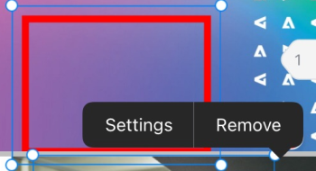

# [!DNL iOS]中校訂的註解

您可以檢閱和解決校訂上的現有評論，並將新評論和註解新增到校訂檔案中。

您對校訂的評論存取權與[!DNL Adobe Workfront]中的相同。 如需校訂功能的相關資訊，請參閱 [!DNL Workfront Proof]](../../../workfront-proof/wp-acct-admin/account-settings/proof-perm-profiles-in-wp.md)中的[校訂許可權設定檔。

>[!NOTE]
>
>如果校訂所有者已鎖定校訂，則您無法評論它。 如需詳細資訊，請參閱文章[檢閱及決定 [!DNL Adobe Workfront] 行動應用程式](../../../workfront-basics/mobile-apps/using-the-workfront-mobile-app/work-with-proofs-in-mobile-app.md)中的校訂時[鎖定並解除鎖定校訂](../../../workfront-basics/mobile-apps/using-the-workfront-mobile-app/work-with-proofs-in-mobile-app.md#lock)。

## 檢閱校訂中的現有評論

您可以檢閱在校訂檔案上所做的評論。 註解通常具有關聯的工程圖，以標註註解所參考的檔案區域。 工程圖可包括箭頭、直線、矩形、反白及手繪工程圖。

1. 開啟檔案校訂。 如需詳細資訊，請參閱[檢閱並決定 [!DNL Adobe Workfront] 行動應用程式](../../../workfront-basics/mobile-apps/using-the-workfront-mobile-app/work-with-proofs-in-mobile-app.md)中的校訂。
1. 在檔案頁面上選取註解圖示以開啟註解及任何關聯的工程圖和附件。

   如果評論有多個回覆，您可以選取&#x200B;**[!UICONTROL 檢視回覆]**&#x200B;以顯示所有回覆，或上下滑動評論工作表以顯示更多內容。

1. 若要檢視註釋上的附件，請選取註釋縮圖。 按照提示將附件檔案下載到您的裝置。
1. 若要回覆註解，請在註解下的文字方塊中輸入您的回應，並選取&#x200B;**[!UICONTROL 傳送]**&#x200B;圖示。

### 使用註解清單

1. 若要按頁碼順序檢視所有註解的清單，請選取右上角的註解圖示。

   註解圖示上會指出未讀註解的數目。 未讀評論標示為藍色圓點。 含有附件的註解具有紙夾圖示![[!UICONTROL 附件]圖示](assets/mobile-paper-clip-icon.png)。

1. 在清單中選取個別註解，以在檔案頁面上檢視註解及其關聯的工程圖。
1. 選取X以關閉評論清單並返回校樣。

### 對評論採取動作

在[!UICONTROL 註解]清單中，您可以執行不同的動作，例如解析註解或將其標示為已讀取。

1. 選取註解：

   * 按住個別註解以選取它。
   * 選擇右上角的&#x200B;**[!UICONTROL 選取]**，在每一個註解旁邊顯示核取方塊。 然後，點選註解核取方塊或選擇左上方的&#x200B;**[!UICONTROL 全選]**。

1. 若要解析選取的註解，請選取底部工具列中的![[!UICONTROL 解析註解]圖示](assets/mobile-resolvecomment-icon-30x30.png)。

   您一次只能解析一個註解。 註解會以綠色圖示標示，以顯示其已解決。

   原始註解會保留在檔案上。 註解解析顯示為原始註解的回覆： &quot;[!UICONTROL 此執行緒已由[名稱].]解析

   您可以選取已解析的註解並選取&#x200B;**[!UICONTROL 復原]**&#x200B;圖示來復原解析度。

1. 若要將選取的註解標示為已讀取，請選取底部工具列中的&#x200B;**[!UICONTROL 標示為已讀取]**&#x200B;圖示。

   只有在已選取未讀註解時，才能使用此選項。

1. 若要刪除選取的註解，請選取底部工具列中的&#x200B;**[!UICONTROL 刪除]**&#x200B;圖示。 然後，在確認訊息上選取&#x200B;**[!UICONTROL 刪除]**&#x200B;以永久刪除評論。

## 對校訂進行評論

您可以將校樣評論關聯到檔案的特定區域。 使用工程圖工具來選取要註解的區域。

1. 開啟檔案校訂。 如需詳細資訊，請參閱[檢閱並決定 [!DNL Adobe Workfront] 行動應用程式](../../../workfront-basics/mobile-apps/using-the-workfront-mobile-app/work-with-proofs-in-mobile-app.md)中的校訂。
1. 從校樣畫面底部的工具列選取繪圖工具。

   

   如果您沒有看到所需的工具，請向右捲動工具列。

1. 選取工具名稱旁的&#x200B;**[!UICONTROL 設定]**&#x200B;以定義顏色、不透明度及粗細。 選取星形圖示，讓這些選擇成為工具的預設設定。

   

1. 在校樣檔案上繪製形狀。 選取&#x200B;**[!UICONTROL 還原]**&#x200B;圖示以還原繪圖。
1. （條件式）選取圖案並選擇&#x200B;**[!UICONTROL 設定]**&#x200B;以編輯圖案設定，或選擇&#x200B;**[!UICONTROL 移除]**&#x200B;以刪除圖案。

   

1. 選取&#x200B;**[!UICONTROL 新增註解]**。
1. 在文字方塊中輸入註解。
1. 若要在註解上標籤連絡人，請輸入@符號或選取![[!UICONTROL 標籤連絡人]](assets/mobile-tag-user-icon.png)以新增@符號，開始輸入您要包含的連絡人名稱，然後在名稱出現在下拉式清單中時按一下該名稱。

   將評論新增到校訂時，聯絡人將收到電子郵件通知。

1. 若要將附件新增至註解，請選取![[!UICONTROL 附件]圖示](assets/mobile-paper-clip-icon.png)。 選取&#x200B;**[!UICONTROL 從資料庫選擇]**、**[!UICONTROL 拍攝影片]**&#x200B;或&#x200B;**[!UICONTROL 選取檔案]**，然後依照提示將檔案或像片附加至註解。

   按一下縮圖影像上的X以移除附件。

1. 選取&#x200B;**[!UICONTROL 傳送]**&#x200B;圖示，將註解與繪圖新增至校樣中。
