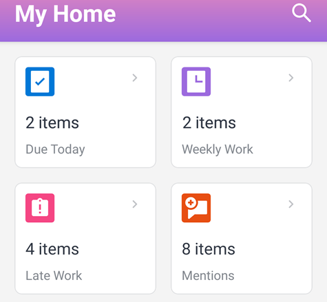

# [!UICONTROL 首頁] 區域小工具

兩者的主區域小部件 [!DNL iOS] 和 [!DNL Android] 幫助您快速查找工作項。

**[!UICONTROL 今天到期]:** 顯示今天到期的工作項目數。 選取介面工具集以查看項目清單。

**[!UICONTROL 每週工作]:** 顯示本週到期的工作項目數。 選取介面工具集以查看項目清單。

**[!UICONTROL 延遲工作]:** 顯示延遲的工作項數（超過計畫完成日期）。 選取介面工具集以查看項目清單。

**[!UICONTROL 提及次數]:** 顯示未讀取的提及次數。 提及是指在 [!UICONTROL 更新] 標籤 [!DNL Adobe Workfront]. 選取介面工具集，即可查看提及次數清單。
