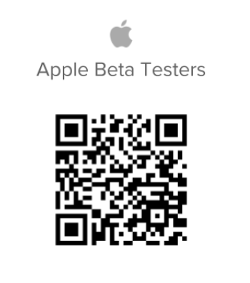

# 成為[!UICONTROL iOS] Beta測試者

## 下載Beta版應用程式

有幾種方式可以成為[!DNL Adobe Workfront]應用程式的Beta測試者：

### [!DNL App Store]

您可以使用[!DNL Apple App Store]來尋找及下載應用程式。

>[!IMPORTANT]
>
>安裝[!DNL TestFlight]應用程式並在您的[!DNL iOS]裝置上成為Beta測試者後，您必須使用[!DNL TestFlight]應用程式而非[!DNL Apple Store]下載更新版本的[!DNL Workfront]。 如果您不是[!DNL iOS]的Beta版測試者，則可繼續從[!DNL Apple Store]更新您的行動應用程式。

#### 1.安裝[!DNL TestFlight]應用程式

若要安裝[!DNL Workfront]應用程式的測試版，您必須在裝置上安裝[!DNL TestFlight]應用程式。 安裝[!DNL TestFlight]之後，您必須安裝[!DNL Workfront]應用程式。

1. 安裝[!DNL Workfront]應用程式（如果尚未安裝）。
1. 開啟[!DNL Workfront]行動應用程式。
1. 點選底部導覽列中的&#x200B;**[!UICONTROL 更多]**。
1. 點選您的名稱，然後點選&#x200B;**[!UICONTROL 成為Beta測試者]**。
1. 點選&#x200B;**[!UICONTROL 在[!DNL App Store]]**&#x200B;中檢視以檢視[!DNL TestFlight]應用程式。
1. 點選&#x200B;**[!UICONTROL 取得]**&#x200B;以在您的裝置上安裝[!DNL TestFlight]，然後點選&#x200B;**[!UICONTROL 安裝]**。
1. 在[!DNL TestFlight]應用程式中點選&#x200B;**[!UICONTROL 開啟]**，然後點選&#x200B;**[!UICONTROL 繼續]**。
1. 點選&#x200B;**[!UICONTROL 接受]**&#x200B;以接受[!DNL TestFlight]應用程式的條款與條件。\
   [!DNL TestFlight]應用程式已安裝在您的裝置上。 繼續下一節。

#### 2.在[!DNL TestFlight]中安裝[!DNL Workfront] Beta App

您必須先在iOS裝置上安裝[!DNL Workfront]應用程式和[!DNL TestFlight]應用程式，才能在iOS裝置上成為Beta測試者。

1. 開啟[!DNL Workfront]行動應用程式。
1. 點選底部導覽列中的&#x200B;**[!UICONTROL 更多]**。
1. 點選您的名稱，然後點選&#x200B;**[!UICONTROL 成為Beta測試者]**。\
   [!DNL TestFlight]應用程式隨即開啟，[!DNL Workfront]已列為可供下載的應用程式。

1. 點選&#x200B;**[!UICONTROL 接受]**。
1. 應用程式完成更新時，點選&#x200B;**[!UICONTROL 開啟]**。\
   系統會將您重新導向至您的[!DNL Workfront]應用程式，而您現在是[!DNL Workfront]的Beta測試者。 首頁畫面上的Workfront行動應用程式旁會顯示一個橘色點，表示您的裝置已安裝Beta版應用程式。

### QR碼

您也可以掃描下方的二維碼以註冊Beta版並下載應用程式：

## 讓我們瞭解我們的工作

若要提供測試版應用程式的意見回饋或回報問題：

1. 在底部導覽列中點選&#x200B;**[!UICONTROL 更多]**。
1. 點選您的名稱，然後&#x200B;**[!UICONTROL 提交意見]**。
1. 選擇&#x200B;**[!UICONTROL 開始問卷]**&#x200B;以提供應用程式的一般意見回饋。\
   或\
   選擇&#x200B;**[!UICONTROL 報告問題]**&#x200B;以向[!DNL Workfront]客戶服務團隊提交票證。

## 更新[!DNL Workfront] Beta應用程式

如果您註冊為Beta版測試者，則必須在[!DNL TestFlight]中更新[!DNL Workfront]應用程式以存取Beta版提供的新功能。

1. 開啟[!DNL TestFlight]應用程式。
1. 點選&#x200B;**[!UICONTROL 更新]**。

## 選擇退出測試版測試

1. 開啟[!DNL TestFlight]應用程式。
1. 點選[!DNL Workfront]圖示。
1. 在頁面底部，點選&#x200B;**[!UICONTROL 停止測試]**。
