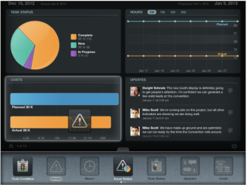

# 更新[!UICONTROL 專案詳細資料]檢視中的Widget

從專案清單存取[!UICONTROL 專案]後，您可以透過將Widget新增至您的[!UICONTROL 專案詳細資料]畫面來檢視該專案的其他資訊。 每個使用者都可以自訂自己的Widget。

## 存取需求

+++ 展開以檢視本文中功能的存取需求。

<table style="table-layout:auto"> 
 <col> 
 </col> 
 <col> 
 </col> 
 <tbody> 
  <tr> 
   <td role="rowheader"><strong>Adobe Workfront套件</strong></td> 
   <td> 
任何
 </td> 
  </tr> 
  <tr> 
   <td role="rowheader"><strong>Adobe Workfront授權</strong></td> 
   <td> 
   
投稿人或以上

   
評論或以上
 </td> 
  </tr> 
 </tbody> 
</table>

如需詳細資訊，請參閱Workfront檔案中的[存取需求](/help/quicksilver/administration-and-setup/add-users/access-levels-and-object-permissions/access-level-requirements-in-documentation.md)。

+++

## 更新[!UICONTROL 專案詳細資料]檢視中的Widget

1. 從[!DNL Adobe Workfront View]首頁，點選專案名稱以導覽至該專案。
1. 點選畫面中央底部的標籤。\
   [!UICONTROL Widget]區域隨即顯示。\
   向左向右滑動，以捲動Widget。\
   

1. 拖放Widget以自訂專案頁面的配置。\
   您一次最多可以顯示4個Widget。\
   您可以透過拖曳小工具並放置到其他位置來重新排列小工具。\
   當您在專案之間導覽時，會儲存Widget排列。

1. 從下列Widget中選取：

   * **[!UICONTROL 任務條件]**：在圓餅圖中[!UICONTROL 條件]顯示專案中的所有任務。
   * **[!UICONTROL 問題]**：以折線圖顯示所有問題的時間表。 括弧內會指出未完成的問題數目。
   * **[!UICONTROL 小時]**：在合併折線圖中的專案任務上顯示[!UICONTROL 實際]和[!UICONTROL 計畫小時]。
   * **[!UICONTROL 問題]** [!UICONTROL 狀態]：在圓形圖表中依「狀態」顯示所有問題。
   * **[!UICONTROL 更新]**：顯示專案的所有更新和註解。
   * **[!UICONTROL 成本]**：在合併長條圖中顯示專案的[!UICONTROL 實際]和[!UICONTROL 計畫成本]。
   * **[!UICONTROL 收入]**：在合併長條圖中顯示專案的[!UICONTROL 實際]和[!UICONTROL 計畫收入]。
   * **[!UICONTROL 任務進度]**：在圓餅圖中[!UICONTROL 進度狀態]顯示專案中的所有任務。
   * **[!UICONTROL 近期任務]**：顯示最多6個近期任務。 Widget會依下列順序排序專案任務：

      * 首先，在[!UICONTROL 預估到期日]之前
      * 第二，依[!UICONTROL 工作分解結構]

     它會顯示最後兩個完成任務（如果適用）和接下來的4個任務。 若要瞭解[!DNL Workfront]檢視行動應用程式中將會顯示哪些任務，您可以為您檢視的專案建立任務報告，並依「預估到期日」及「[!DNL Workfront]劃分結構」進行排序。 前6個任務將列於[!UICONTROL 近期]任務Widget的「Workfront檢視」行動應用程式中。

   * **[!UICONTROL 剩餘任務]**：在折線圖中顯示未完成的任務。
   * **[!UICONTROL 檔案]**：顯示附加至專案的檔案清單。\

     您可以使用[!DNL Workfront View]開啟下列檔案格式：

      * 所有文字檔案
      * .pdf
      * 影像檔案（.jpg、.jpeg、.png等）
      * .xls
   * **[!UICONTROL 詳細資料]**：顯示專案的下列詳細資料：

      * 專案名稱
      * 專案建立者的名稱
      * 專案狀態
      * 專案群組
      * 專案排程
   * **[!UICONTROL 團隊]**：顯示專案團隊中的使用者名稱。\

     如需專案團隊的詳細資訊，請參閱[專案團隊概述](../../../manage-work/projects/planning-a-project/project-team-overview.md)。
