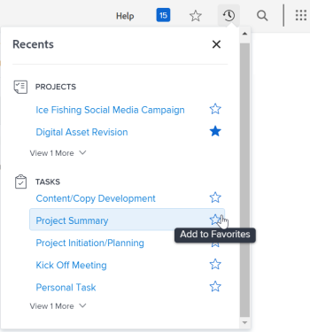

# 查看和管理收藏夾

此 [!UICONTROL 我的最愛] 功能表，您就可以快速存取項目。 項目會保留在 [!UICONTROL 我的最愛] 功能表，直到您移除為止。 「我的最愛」功能表上最多可以有40個項目。

## 存取需求

您必須具備下列存取權，才能執行本文中的步驟：

<table style="table-layout:auto"> 
 <col> 
 </col> 
 <col> 
 </col> 
 <tbody> 
  <tr> 
   <td role="rowheader"><strong>[!DNL Adobe Workfront] 計劃*</strong></td> 
   <td> 
任何
 </td> 
  </tr> 
  <tr> 
   <td role="rowheader"><strong>[!DNL Adobe Workfront] 授權*</strong></td> 
   <td> 
[!UICONTROL Request]或更高版本
 </td> 
  </tr> 
 </tbody> 
</table>

&#42;若要了解您擁有的計畫或授權類型，請連絡您的 [!DNL Workfront] 管理員。

## 檢視收藏

若要檢視您先前新增為我的最愛的項目：

1. 按一下 **[!UICONTROL 我的最愛]** 圖示  在 [!DNL Adobe Workfront] 頁面。

1. 在 [!UICONTROL 我的最愛] 清單中，按一下要查看的項目。

## 將項目新增為我的最愛

您可以新增最近的項目或目前頁面至 [!UICONTROL 我的最愛] 功能表。

* [將最近的項目添加為收藏夾](#add-recent-items-as-a-favorite)
* [將當前項目添加為收藏夾](#add-the-current-item-as-a-favorite)

### 將最近的項目添加為收藏夾

1. 按一下 **[!UICONTROL 收件者]** 圖示 ![[!UICONTROL 收件者]](assets/recents-icon-40x43.png) 位於新 [!DNL Adobe Workfront] 體驗。
1. 將滑鼠指標暫留在您要儲存為我的最愛的最近項目上，然後按一下星號。

   最近的項目會顯示在 [!UICONTROL 我的最愛] 功能表。

   按一下右上方的X以關閉清單。

   

### 將當前項目添加為收藏夾

1. 移至您要新增為我的最愛的頁面。
1. 按一下 **[!DNL Favorites]** 圖示  在 [!DNL Workfront] 頁面，然後按一下 **[!UICONTROL 新增目前頁面]**.

   

   按一下右上方的X以關閉清單。

   或

   按一下 **[!UICONTROL 我的最愛]** 圖示  對象名稱的右側。

   >[!NOTE]
   >
   >如果您按一下 **[!UICONTROL 我的最愛]** 表徵圖已添加為收藏夾的對象上，該對象將從 [!UICONTROL 我的最愛] 功能表。\
   >

## 從 [!UICONTROL 我的最愛] 功能表

1. 按一下 **[!UICONTROL 我的最愛]** 圖示  在 [!DNL Workfront] 頁面。

1. 將滑鼠指標暫留在您要以我的最愛移除的項目上，然後按一下 **X** 旁邊。

   或

   如果您位在要移除為我的最愛的頁面上，請按一下 **[!UICONTROL 我的最愛]** 圖示  對象名稱旁邊，從「收藏夾」菜單中將其刪除。
