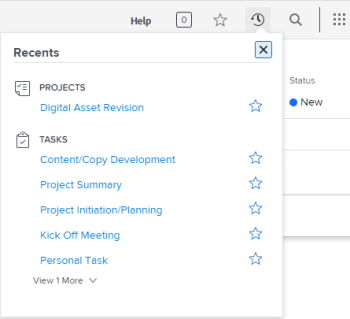

# 檢視最近專案

[!UICONTROL Recents]功能表位於上方導覽列。 此功能表會顯示最近檢視的專案、報告、控制面板、任務、問題等。 只包含過去兩週內檢視的物件，每種物件型別最多二十個，並依照最近檢視的順序列出。

## 存取需求

+++ 展開以檢視本文中功能的存取需求。

<table style="table-layout:auto"> 
 <col> 
 </col> 
 <col> 
 </col> 
 <tbody> 
  <tr> 
   <td role="rowheader">Adobe Workfront套件</td> 
   <td> 
任何
 </td> 
  </tr> 
  <tr> 
   <td role="rowheader">Adobe Workfront授權</td> 
   <td> 
   
投稿人或以上
 
   
要求或更高版本
 </td> 
  </tr> 
 </tbody> 
</table>

如需有關此表格的詳細資訊，請參閱Workfront檔案中的[存取需求](/help/quicksilver/administration-and-setup/add-users/access-levels-and-object-permissions/access-level-requirements-in-documentation.md)。

+++

## 檢視最近專案

1. 按一下任何頁面右上角的&#x200B;**[!UICONTROL 最近]**&#x200B;圖示![[!UICONTROL 最近]](assets/recents-icon-40x43.png)。

   

   在每個物件型別下，您最多可以看到5個最近檢視過的專案。

1. （選擇性）若要展開最近專案的清單，請按一下物件型別下最後一個專案正下方的&#x200B;**[!UICONTROL 檢視更多]**，以顯示先前檢視的10個專案。 您可以展開清單來顯示每個物件型別最多20個專案。
1. 按一下右上方的X以關閉清單。

有關如何將最近專案標示為我的最愛資訊，請參閱[檢視和管理我的最愛](../../../workfront-basics/navigate-workfront/recent-and-favorites/view-and-manage-favorites.md)。
