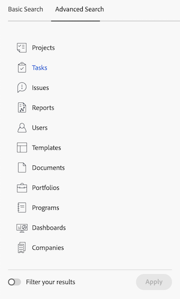

# 搜尋 [!DNL Adobe Workfront]

<!-- Audited: 5/2025 -->

當您不記得專案的確切位置時，可以搜尋專案，輕鬆找到[!DNL Adobe Workfront]中的專案。

您可以在[!DNL Workfront]內任何頁面的右上角看到[!UICONTROL 搜尋]方塊。

在導覽列中

您必須有檢視物件的許可權，才能在搜尋中找到該物件。 因此，搜尋結果會因使用者而異。

## 存取需求

+++ 展開此區段以檢視執行本文所述步驟所需的存取許可權。

<table style="table-layout:auto"> 
 <col> 
 <col> 
 <tbody> 
  <tr> 
   <td role="rowheader">[!DNL Adobe Workfront] 計劃</td> 
   <td> 
任何
 </td> 
  </tr> 
  <tr> 
   <td role="rowheader">[!DNL Adobe Workfront] 授權</td> 
   <td> 
新增：投稿人或更高版本

   
或

   
目前：要求或以上 

</td> 
  </tr> 
  <tr> 
   <td role="rowheader">存取層級設定</td> 
   <td> 
[!UICONTROL View]物件型別的存取權 
 
注意：如果您還是沒有存取權，請詢問您的[!DNL Workfront]管理員是否對您的存取層級設定了其他限制。 如需[!DNL Workfront]管理員如何修改存取層級的詳細資訊，請參閱<a href="../../../administration-and-setup/add-users/configure-and-grant-access/create-modify-access-levels.md" class="MCXref xref">建立或修改自訂存取層級</a>。
</td> 
  </tr> 
  <tr> 
   <td role="rowheader">物件許可權</td> 
   <td> 
您必須有檢視物件的許可權，才能在搜尋中找到該物件。
 
如需請求其他存取權的資訊，請參閱<a href="../../../workfront-basics/grant-and-request-access-to-objects/request-access.md" class="MCXref xref">請求物件</a>的存取權。
 </td> 
  </tr> 
 </tbody> 
</table>

如需有關此表格的詳細資訊，請參閱Workfront檔案中的[存取需求](/help/quicksilver/administration-and-setup/add-users/access-levels-and-object-permissions/access-level-requirements-in-documentation.md)。

+++

## 瞭解搜尋

### 可供搜尋的物件

您可以在Workfront中搜尋下列物件：

* 專案
* 任務
* 問題
* 報告
* 使用者
* 範本
* 文件
* 專案組合
* 計劃
* 儀表板
* 公司
* 附註

### 可供搜尋的欄位

可供搜尋的欄位是根據搜尋型別：基本或[!UICONTROL 進階搜尋]。

* **基本搜尋**：在基本搜尋中搜尋物件時，[!DNL Workfront]會在下列欄位中尋找可能包含關鍵字的文字：

   * 物件名稱
   * 說明
   * 自訂資料欄位
   * 更新
   * 檔名稱（在特定檔案搜尋和基本搜尋中）

  如需[!DNL Workfront]中「基本搜尋」的詳細資訊，請參閱本文中的下列章節： [基本搜尋](#basic-search)。

* **[!UICONTROL 進階搜尋]**：在[!UICONTROL 進階搜尋]中，您可以設定篩選條件，以搜尋基本搜尋中無法使用的欄位。 因此，[!UICONTROL 進階搜尋]可讓您搜尋物件中的任何欄位。

  如需[!UICONTROL 進階搜尋]的詳細資訊，請參閱本文中的下列章節： [進階搜尋](#advanced-search)。

>[!NOTE]
>
>若要執行[!UICONTROL 進階搜尋]，您必須在開始搜尋時選取[!UICONTROL 進階搜尋]選項。 您無法將基本搜尋調整為[!UICONTROL 進階搜尋]。

## 瞭解[!DNL Workfront]個搜尋的限制

在[!DNL Workfront]中使用[!UICONTROL 搜尋]時，請考量下列限制：

* 搜尋不區分大小寫。
* [!DNL Workfront]不正確或不理解錯字。
* 在[!DNL Workfront]中搜尋不支援萬用字元。
* 在[!DNL Workfront]中搜尋支援部分文字搜尋，但不支援子字串搜尋。\
   例如，搜尋關鍵字「stand」會傳回包含「standard」字詞的結果，但不會傳回包含「understand」字詞的結果。

## 搜尋多個字詞

當您在搜尋中包含多個單字，而且只想尋找符合「搜尋」方塊中所有單字的物件時，您可以以任何順序鍵入單字。

例如，搜尋「行銷示範」（不含引號）會尋找具有以下名稱的物件：

* 行銷示範
* 示範行銷
* 1月市場分析示範

它也會尋找名稱中可能含有「Marketing」的物件，以及說明中的「Demo」物件。

不過，您可以在[!UICONTROL 搜尋]方塊中執行下列動作，以調整顯示的搜尋結果：

<table style="table-layout:auto"> 
 <col> 
 <col> 
 <tbody> 
  <tr> 
   <td>包含引號</td> 
   <td> 
在雙引號內以正確順序輸入文字可讓您只尋找完全相符的物件。 例如，搜尋「Marketing Demo」（使用引號）會尋找具有以下名稱的物件：
 
    <ul> 
     <li> 行銷示範</li> 
     <li> 1月行銷示範</li> 
     <li>行銷示範計畫</li> 
    </ul> 
不過，此搜尋找不到名稱為「示範行銷」的物件。
 </td> 
  </tr> 
  <tr> 
   <td>包含OR</td> 
   <td> 
使用「OR」連線單字（不含引號）可讓您僅尋找至少符合[!UICONTROL 搜尋]方塊中一個單字的物件。 這些字詞可依任何順序輸入。 例如，搜尋「Marketing OR Demo」（不含引號）會尋找具有以下名稱的物件：
 
    <ul> 
     <li> 市場分析示範</li> 
     <li>1月市場分析示範</li> 
     <li>示範</li> 
     <li>市場分析</li> 
    </ul> 
注意：「OR」必須全部大寫。 否則，會解譯成您在搜尋的片語中的另一個單字。
 </td> 
  </tr> 
  <tr> 
   <td>包含和</td> 
   <td> 
使用「AND」連線單字（不含引號）可讓您僅尋找符合[!UICONTROL 搜尋]方塊中所有單字的物件。 這些字詞可依任何順序輸入。 例如，搜尋「Marketing AND Demo」（不含引號）會尋找具有以下名稱的物件：
 
    <ul> 
     <li>行銷示範</li> 
     <li>示範行銷</li> 
     <li>1月市場分析示範</li> 
    </ul> 
注意：「AND」必須全部大寫。 否則，會解譯成您在搜尋的片語中的另一個單字。 同樣地，包含「&amp;」（不含引號）只會搜尋包含&amp;字元的物件。
 </td> 
  </tr> 
 </tbody> 
</table>

## 在[!DNL Workfront]中使用搜尋

[!DNL Workfront]提供兩種型別的搜尋：基本和進階。 如果您要在常見物件欄位（例如名稱或說明）中尋找關鍵字，請使用基本搜尋。 如果您想要使用篩選器來搜尋其他物件欄位，請使用[!UICONTROL 進階搜尋]。

* [基本搜尋](#basic-search)
* [高級搜尋](#advanced-search)

### 基本搜尋

「基本搜尋」可讓您搜尋系統中所有物件的關鍵字，或一次只搜尋一個物件（例如專案）。 [!DNL Workfront]然後在幾個特定欄位中搜尋這些關鍵字。 然後，您可以根據[!DNL Workfront]選取的其他物件特定欄位來調整搜尋結果。

如需在基本搜尋中搜尋的特定欄位清單，請參閱本文中的下列章節： [可供搜尋的欄位](#fields-available-for-search)。

>[!NOTE]
>
>若要執行[!UICONTROL 進階搜尋]，您必須在開始搜尋時選取[!UICONTROL 進階搜尋]選項。 您無法將基本搜尋調整為[!UICONTROL 進階搜尋]。

* [執行基本搜尋](#perform-a-basic-search)
* [精簡基本搜尋](#refine-a-basic-search)

#### 執行基本搜尋

您可以使用下列任一方式進行「基本搜尋」：

* 橫跨系統中的所有物件（一般搜尋）。
* 一次只在一個物件上（物件特定搜尋）。

執行基本搜尋：

1. 按一下頁面右上角的放大鏡。

1. （選擇性）若要搜尋特定物件，請按一下&#x200B;**[!UICONTROL 全部]**&#x200B;下拉式功能表，然後選取您要搜尋的物件。

   

1. 在&#x200B;**[!UICONTROL 搜尋]**&#x200B;方塊中，開始輸入您要搜尋的資訊。
如需[!DNL Workfront]中搜尋哪些欄位的詳細資訊，請參閱本文中的下列章節： [瞭解搜尋](#understand-search)。
   

   當您開始輸入搜尋列時，[!DNL Workfront]會根據您的檢視歷程記錄提出建議，並以藍色標示您正在搜尋的關鍵字。

1. 如果您要尋找的專案顯示在[!UICONTROL 自動提示]功能表中，請按一下該專案。

   或

   在鍵盤上按Return (Mac)或[!UICONTROL Enter] (Windows)以執行全面搜尋。 此搜尋會查詢整個資料庫，而非您最近檢視的專案，並開啟&#x200B;**搜尋**&#x200B;頁面。

   如果您執行一般搜尋，[!DNL Workfront]會傳回任何搜尋欄位中符合搜尋字詞之物件的結果，如[瞭解搜尋](#understand-search)中所述。 符合搜尋條件的物件會顯示在清單中。

   >[!NOTE]
   >
   >有時候，一個字的變化會顯示在找到的專案清單中。\
   >例如，搜尋「行銷」會顯示名稱中包含「行銷」或「市場」的物件。

1. （選擇性）如果您的搜尋產生太多結果，請依照[調整基本搜尋](#refine-a-basic-search)中的說明來調整搜尋。

#### 精簡基本搜尋

執行「基本搜尋」之後，您可以調整搜尋。

使用搜尋結果左側的工具列來縮小您要尋找的資訊範圍。

若要縮小搜尋範圍：

1. （條件式）如果您執行一般搜尋，請在結果左上角的物件清單中選取要搜尋的物件。
1. 在結果左側的工具列中，找出搜尋中顯示的物件可用的欄位。 每個欄位的值會依計數排序，每個欄位最多可顯示10個值。
1. 在任一可用欄位中按一下，以縮短結果清單。 您所做的選擇會以藍色反白，而未選取的欄位值會隱藏。
選取每個新值後，右側的結果會動態更新。

   

1. （選擇性）按一下選取的值以取消選取它們，然後再次顯示每個欄位的所有值。

### [!UICONTROL 進階搜尋]

[!UICONTROL 進階搜尋]可讓您使用基本搜尋無法使用的欄位和篩選器來搜尋。 例如，您可以搜尋具有特定優先順序或檔案所有者名稱的專案。

>[!NOTE]
>
>若要執行[!UICONTROL 進階搜尋]，您必須在開始搜尋時選取[!UICONTROL 進階搜尋]選項。 您無法將基本搜尋調整為[!UICONTROL 進階搜尋]。

* [使用[!UICONTROL 進階搜尋]](#use-advanced-search)

#### 使用[!UICONTROL 進階搜尋]

您可以使用[!UICONTROL 進階搜尋]，根據特定條件篩選搜尋。\
當您不記得與物件相關聯的關鍵字，但知道該物件的某些特定資訊時（例如：專案優先順序、檔案擁有者名稱等），這種搜尋型別會很有幫助。

若要執行進階搜尋，請執行下列動作：

1. 在[!DNL Workfront]中任何頁面的右上角，按一下&#x200B;**[!UICONTROL 搜尋]**&#x200B;圖示。 顯示&#x200B;**搜尋**&#x200B;功能表。

1. 在&#x200B;**搜尋**&#x200B;功能表底部，按一下&#x200B;**[!UICONTROL 進階搜尋]**。 **搜尋**&#x200B;頁面開啟，預設選取&#x200B;**進階搜尋**&#x200B;索引標籤。
   

1. 選取您要搜尋的物件型別。 預設會選取&#x200B;**[!UICONTROL 工作]**。

   

1. （選用）在清單頂端的欄位中輸入關鍵字。
1. （選擇性）將&#x200B;**[!UICONTROL 篩選結果]**&#x200B;切換為&#x200B;**On**&#x200B;以建置篩選來縮小搜尋範圍。 完成時，按一下&#x200B;**套用**。

1. 按一下&#x200B;**[!UICONTROL 搜尋]**。 符合您搜尋的專案清單會顯示在&#x200B;**[!UICONTROL 進階搜尋]**&#x200B;工具列的右側。
