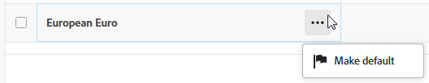
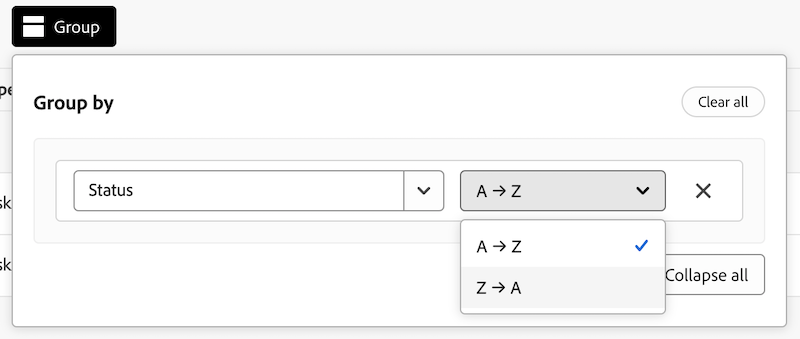

# 使用增強型清單

Adobe Workfront的部分割槽域提供增強型清單。 這些清單使用表格格式來顯示清單專案，並且它們具有與標準清單不同的外觀和感覺。 也增強了檢視管理，包括篩選、分組、管理欄和搜尋。

如需有關標準清單的資訊，請參閱[開始使用Adobe Workfront中的清單](/help/quicksilver/workfront-basics/navigate-workfront/use-lists/view-items-in-a-list.md)。

>[!NOTE]
>
>每個增強型清單的設定方式可能有所不同，以協助您顯示所需的資料。 並非每個清單都會使用本文所述的所有功能，有些清單可能會有僅適用於該清單的特殊功能。

## 存取需求

+++ 展開以檢視本文中功能的存取需求。

<table style="table-layout:auto">
 <col> 
 <col>
 <tbody> 
  <tr> 
   <td>Adobe Workfront套件</td> 
   <td>
任何
</td> 
  </tr> 
  <tr> 
   <td>Adobe Workfront授權</td> 
   <td>
   
投稿人或以上

   
要求或更高版本
</td>
  </tr>
 </tbody> 
</table>

如需詳細資訊，請參閱Workfront檔案中的[存取需求](/help/quicksilver/administration-and-setup/add-users/access-levels-and-object-permissions/access-level-requirements-in-documentation.md)。

+++

## 使用增強型清單的物件

以下是一些型別的Workfront物件清單，這些清單使用增強型清單格式，以及在您有權檢視物件時預設會顯示這些清單的一些區域。

>[!NOTE]
>
>此清單並不完整。 這些物件清單中的每一份也都會出現在報表或儀表板上。 例如，包含專案報告的專案報告或控制面板也會顯示專案清單。

| Workfront清單 | 物件清單的位置 |
|--- |--- |
| 優先順序 | <ul><li>首頁>選取左側功能表中的「優先順序」圖示</li><li>主要功能表>優先順序</li></ul> |
| 請求清單 | <ul><li>請求（僅限新體驗）</li><li>首頁上的我的請求Widget</li></ul> |
| 匯率清單 | <ul><li>設定>專案偏好設定>匯率</li></ul> |

## 新增和編輯增強型清單中的專案

根據增強型清單的設定，可能有兩種方法可以將專案新增到清單：

* 按一下清單上方的按鈕。 此選項會開啟對話方塊，您可在其中輸入資訊並加以儲存。
* 按一下清單底部的&#x200B;**新列**。 此選項會將新的一列加入表格中，而且您會在每個儲存格中輸入資訊。

  增強型清單支援這些欄位型別：

   * 文字
   * 數字
   * 貨幣
   * 日期
   * 日期與時間
   * 單一/多選下拉式清單
   * 自動提示
   * 段落
   * 被指定者（一或多個）
   * 檢色器

  當您編輯儲存格時，每個欄位型別都有自己的編輯選項。

若要編輯清單中的專案，請在要編輯的儲存格中連按兩下，然後輸入資訊。 某些儲存格可能是唯讀的。

## 使用增強型清單中的動作列和更多選單

當您選取增強型清單中專案旁的核取方塊時，動作列會出現在畫面底部，並顯示您可以對專案採取的動作。 有些動作可能是該清單專屬的動作，不會出現在任何其他清單中。

>[!NOTE]
>
>各種增強型清單可能允許選取單一專案、大量編輯（選取多個專案）或無專案選取。

按一下動作列上的按鈕即可執行該動作，例如檢視清單專案、刪除專案或編輯專案。

如果選取的專案沒有可用的動作，動作列會顯示「沒有可用的動作」。

**更多**&#x200B;功能表是三點式功能表，當您將滑鼠游標停留在清單專案上的主要欄位旁時，就會顯示這個功能表。 （主要欄位是表格最左側的欄。）

按一下功能表以檢視專案的其他動作。 有些動作可能是該清單專屬的動作，不會出現在任何其他清單中。

## 自訂增強型清單中的欄

某些增強型清單可讓您隱藏和顯示欄，以及重新排序欄。

1. 按一下清單上方的&#x200B;**欄**。

   

1. 使用切換來顯示或隱藏清單中的欄。
1. 若要重新排序欄，請按一下&#x200B;**拖曳**&#x200B;圖示，並將欄移至您想要的位置。 移動欄會自動變更清單。

   >[!NOTE]
   >
   >主要欄位是表格最左側的欄。 它在第一個位置是固定的，您無法變更其欄。 如果欄數很大，則主要欄位會凍結在左側，當您水準捲動時，您永遠可以看到它。
   >
   >欄位名稱旁的圖示會顯示欄位型別，例如文字或日期欄位。

   當欄隱藏時，**欄**&#x200B;按鈕上會出現指示器。 當您重新排序欄時，指示器未出現。

   隱藏資料行的

## 篩選和分組增強型清單中的專案

篩選器可協助您減少在清單中顯示的資訊量。 群組會根據特定條件將清單中的物件區隔在區域中。

### 使用篩選器

1. 按一下清單上方的&#x200B;**篩選器**。
1. 在[篩選]方塊中，按一下[**新增條件**]。
1. 選取欄位作為篩選依據。
1. 選取篩選修飾元，例如「具有任何」、「不具有任何」、「早於」或「晚於」。 修正因子選項會因您篩選的欄位型別而異。
1. 選取一或多個欄位值。 根據您篩選的欄位型別，系統可能會提示您從清單中選取專案、搜尋專案，或使用日曆來選取日期範圍。

   

   篩選器會自動套用至清單。

1. 按一下&#x200B;**新增條件**，將另一個條件以OR陳述式形式新增至篩選器。
1. 套用篩選器時，您可以再次開啟&#x200B;**篩選器**&#x200B;選項來變更篩選器選項或清除所有篩選器。

   將篩選器套用至清單時，**篩選器**&#x200B;按鈕上會出現指示器。

   

### 使用群組

1. 按一下清單上方的&#x200B;**群組**。
1. 選取要組織清單的分組。

   

1. 套用群組時，您可以再次開啟「群組」選項以一次摺疊或展開所有群組、將群組變更為依不同欄位分組，或清除所有群組。

   

   將分組套用至清單時，**群組**&#x200B;按鈕上會出現指示器。

   

## 在增強型清單中排序和搜尋

若要排序個別欄，請移至欄並按一下向下箭頭。 欄名稱旁的圖示表示清單會依該欄中的值排序，以及排序的方向。

>[!NOTE]
>
>有些欄可能無法排序。

若要在群組內排序您的工作，請開啟&#x200B;**群組**，並選取是否要以遞增或遞減順序排序。

若要搜尋，請在清單上方的搜尋欄位中輸入搜尋字詞。 當您鍵入時，結果會在清單中反白顯示。

