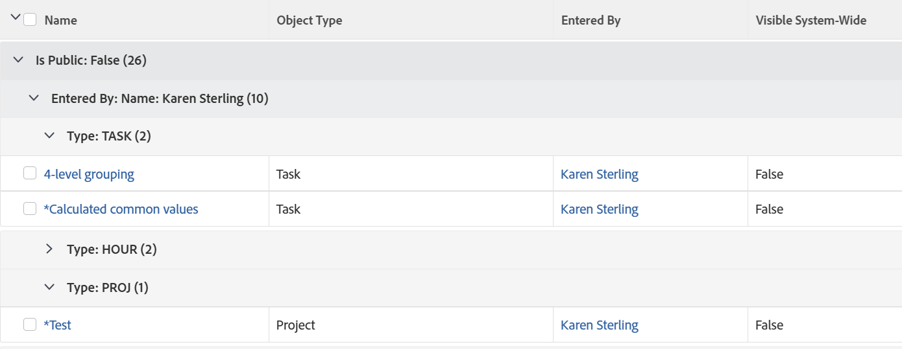

# 開始使用 [!DNL Adobe Workfront]

<!--
{{highlighted-preview}}
-->

您可以在 [!DNL Adobe Workfront] 獲取有關它們的資訊，如它們的開始日期和到期日、分配給它們的用戶以及與它們關聯的其他對象。

以下是 [!DNL Workfront]:

* 清單每五分鐘自動刷新一次，以更新系統中其他用戶在其他位置更新的資訊。
* 部分 [!DNL Workfront] 預配置了預設的對象清單。

   您可以自訂這些預先設定的清單中的大部分。

* A [!DNL Workfront] 管理員可建立自訂清單以套用至不同區域 [!DNL Workfront].

   有關建立系統級清單的詳細資訊，請參閱文章 [建立、編輯和共用預設篩選器、檢視和群組](../../../administration-and-setup/set-up-workfront/configure-system-defaults/create-and-share-default-fvgs.md).

## 存取需求

您必須具備下列存取權，才能執行本文中的步驟：

<table style="table-layout:auto"> 
 <col> 
 <col> 
 <tbody> 
  <tr> 
   <td role="rowheader"><strong>[!DNL Adobe Workfront] 計劃*</strong></td> 
   <td> 
任何
 </td> 
  </tr> 
  <tr> 
   <td role="rowheader"><strong>[!DNL Adobe Workfront] 授權*</strong></td> 
   <td> 
[!UICONTROL Request]或更高版本
 </td> 
  </tr> 
  <tr> 
   <td role="rowheader"><strong>訪問級別配置*</strong></td> 
   <td> 
[!UICONTROL View]或更高版本對篩選器、視圖、組的訪問
 
對於[!UICONTROL設定]區域中的項，需要該項或[!UICONTROL系統管理員]訪問級別的管理訪問。
 
注意：如果您仍無法存取，請詢問您的 [!DNL Workfront] 管理員。 若要了解 [!DNL Workfront] 管理員可以更改您的訪問級別，請參閱 <a href="../../../administration-and-setup/add-users/configure-and-grant-access/create-modify-access-levels.md" class="MCXref xref">建立或修改自訂存取層級</a>.
 </td> 
  </tr> 
  <tr> 
   <td role="rowheader"><strong>物件權限</strong></td> 
   <td> 
[!UICONTROL View]或更高權限，具有對共用的訪問權限
 
有關請求其他訪問的資訊，請參閱 <a href="../../../workfront-basics/grant-and-request-access-to-objects/request-access.md" class="MCXref xref">請求對對象的訪問 </a>.
 </td>
  </tr> 
 </tbody> 
</table>

若要了解您擁有的計畫、授權類型或存取權，請聯絡您的 [!DNL Workfront] 管理員。

## 對象清單

以下是一些類型的物件清單，您可在 [!DNL Workfront] 和某些區域，當您有權檢視物件時，這些區域預設會顯示。

>[!NOTE]
>
>* 此清單不全面。 這些物件清單中的每個也會顯示在報表或控制面板上。 例如，專案報表或包含專案報表的控制面板也會顯示專案清單。
>* 在此清單中，「select」表示您需要按一下項目名稱，而非名稱左側的核取方塊。

<table style="table-layout:auto"> 
 <col> 
 <col> 
 <thead> 
  <tr> 
   <th><strong>[!DNL Workfront] 清單</strong></th> 
   <th><strong>對象清單的位置</strong></th> 
  </tr> 
 </thead> 
 <tbody> 
  <tr> 
   <td>產品組合清單</td> 
   <td> 
    <ul> 
     <li> 
[!UICONTROLPortfolio]
 </li> 
    </ul> </td> 
  </tr> 
  <tr> 
   <td>方案清單</td> 
   <td> 
    <ul> 
     <li> 
[!UICONTROLPortfolio] &gt;[!UICONTROL選擇產品組合] &gt;[!UICONTROL程式]
 </li> 
     <li data-mc-conditions="QuicksilverOrClassic.Quicksilver"> 
[!UICONTROL程式]
 </li> 
    </ul> </td> 
  </tr> 
  <tr> 
   <td>專案清單</td> 
   <td> 
    <ul> 
     <li> 
[!UICONTROL項目]
 </li> 
     <li> 
[!UICONTROLPortfolio] &gt;[!UICONTROL選擇產品組合] &gt;[!UICONTROL項目]
 </li> 
     <li> 
[!UICONTROLPortfolio] &gt;[!UICONTROL選擇產品組合] &gt;[!UICONTROL程式] &gt;[!UICONTROL選擇程式] &gt;[!UICONTROL項目]
 </li> 
    </ul> </td> 
  </tr> 
  <tr> 
   <td>任務清單</td> 
   <td> 
    <ul> 
     <li> 
[!UICONTROL項目] &gt;[!UICONTROL選擇項目] &gt; [!UICONTROL任務]
 </li> 
     <li> 
[!UICONTROL項目] &gt;[!UICONTROL選擇項目] &gt;[!UICONTROL任務] &gt;[!UICONTROL選擇任務] &gt;[!UICONTROL子任務]
 </li> 
     <li> 
[!UICONTROL項目] &gt;[!UICONTROL選擇項目] &gt;[!UICONTROL任務] &gt;[!UICONTROL選擇任務] &gt; [!UICONTROL前置任務*]
 </li> 
    </ul> </td> 
  </tr> 
  <tr> 
   <td>問題清單</td> 
   <td> 
    <ul> 
     <li> 
[!UICONTROL項目] &gt; [!UICONTROL選擇]項目&gt;[!UICONTROL問題]
 </li> 
     <li> 
[!UICONTROL項目] &gt;[!UICONTROL選擇項目] &gt;[!UICONTROL任務] &gt;[!UICONTROL選擇任務] &gt; [!UICONTROL問題]
 </li> 
     <li> 
[!UICONTROL項目] &gt;[!UICONTROL選擇項目] &gt;[!UICONTROL任務] &gt;[!UICONTROL選擇任務] &gt;[!UICONTROL子任務] &gt;[!UICONTROL選擇任務] &gt; [!UICONTROL選擇任務] &gt; [!UICONTROL問題]
 </li> 
    </ul> </td> 
  </tr> 
  <tr> 
   <td>報表清單</td> 
   <td> 
    <ul> 
     <li> 
  [!UICONTROL報表]  
 </li> 
    </ul> </td> 
  </tr> 
  <tr> 
   <td>控制面板清單</td> 
   <td> 
    <ul> 
     <li> 
[!UICONTROL控制面板]
 </li> 
    </ul> </td> 
  </tr> 
  <tr> 
   <td>迭代清單</td> 
   <td> 
    <ul> 
     <li> 
[!UICONTROL團隊] &gt; [!UICONTROL迭代]
 </li> 
    </ul> </td> 
  </tr> 
  <tr> 
   <td>使用者清單</td> 
   <td> 
    <ul> 
     <li> 
[!UICONTROL用戶]
 </li> 
    </ul> </td> 
  </tr> 
  <tr> 
   <td>文檔清單</td> 
   <td> 
    <ul> 
     <li> 
[!UICONTROL文檔]
 </li> 
     <li> 
[!UICONTROLPortfolio] &gt;[!UICONTROL選擇產品組合] &gt; [!UICONTROL文檔]
 </li> 
     <li> 
[!UICONTROLPortfolio] &gt; [!UICONTROL選擇產品組合] &gt; [!UICONTROL程式] &gt;[!UICONTROL選擇程式] &gt;[!UICONTROL文檔]
 </li> 
     <li> 
[!UICONTROL項目] &gt;[!UICONTROL選擇項目] &gt;[!UICONTROL文檔]
 </li> 
     <li> 
[!UICONTROL項目] &gt;[!UICONTROL選擇項目] &gt;[!UICONTROL任務] &gt;[!UICONTROL選擇任務] &gt; [!UICONTROL文檔]
 </li> 
     <li> 
[!UICONTROL項目] &gt; [!UICONTROL選擇]項目&gt; [!UICONTROL問題] &gt;[!UICONTROL選擇問題] &gt; [!UICONTROL文檔]
 </li> 
    </ul> </td> 
  </tr> 
  <tr> 
   <td>時間表清單</td> 
   <td> 
    <ul> 
     <li> 
[!UICONTROL時間表] s &gt; [!UICONTROL所有時間表]*
 </li> 
    </ul> </td> 
  </tr> 
  <tr> 
   <td>計費費率清單</td> 
   <td> 
    <ul> 
     <li> 
[!UICONTROL項目] &gt;[!UICONTROL選擇項目] &gt;[!UICONTROL計費率*]
 </li> 
    </ul> </td> 
  </tr> 
  <tr> 
   <td>帳單記錄清單</td> 
   <td> 
    <ul> 
     <li> 
[!UICONTROL項目] &gt; [!UICONTROL選擇項目] &gt; [!UICONTROL計費記錄]
 </li> 
    </ul> </td> 
  </tr> 
  <tr> 
   <td>風險清單</td> 
   <td> 
    <ul> 
     <li> 
[!UICONTROL項目] &gt;[!UICONTROL選擇項目] &gt;[!UICONTROL風險]
 </li> 
    </ul> </td> 
  </tr> 
  <tr> 
   <td>費用清單</td> 
   <td> 
    <ul> 
     <li> 
[!UICONTROL項目] &gt;[!UICONTROL選擇]項目&gt;[!UICONTROL費用]
 </li> 
     <li> 
[!UICONTROL項目] &gt; [!UICONTROL選擇項目] &gt; [!UICONTROL任務] &gt;[!UICONTROL選擇任務] &gt; [!UICONTROL費用]
 </li> 
    </ul> </td> 
  </tr> 
  <tr> 
   <td>小時條目清單</td> 
   <td> 
    <ul> 
     <li> 
[!UICONTROL項目] &gt;[!UICONTROL選擇]項目
 </li> 
     <li> 
[!UICONTROL項目] &gt;[!UICONTROL選擇項目] &gt;[!UICONTROL任務] &gt;[!UICONTROL選擇任務] &gt;[!UICONTROL小時]
 </li> 
     <li> 
[!UICONTROL項目] &gt;[!UICONTROL選擇]項目&gt;[!UICONTROL問題] &gt;[!UICONTROL選擇]問題&gt;[!UICONTROL小時]
 </li>
    </ul> </td> 
  </tr>
  <tr> 
   <td class="preview">自訂表單清單</td> 
   <td> 
    <ul> 
     <li class="preview"> 
[!UICONTROL設定] &gt;[!UICONTROL自訂Forms]

     <!--Remove the following note box when this goes to Production. Or do this when the Preview highlighting becomes available.-->
     
<b>注意</b>:目前僅可在預覽環境中使用
 </li> 
    </ul> </td> 
  </tr> 
  <tr> 
    <td>組或子組的清單</td> 
   <td> 
    <ul> 
     <li> 
[!UICONTROL設定] &gt;[!UICONTROL組]
 </li>
     <li> 
[!UICONTROL設定] &gt;[!UICONTROL組] &gt;[!UICONTROL選擇父組] &gt;[!UICONTROL子組] </li> 
    </ul> </td> 
  </tr> 
  <tr> 
   <td>團隊清單</td> 
   <td> 
    <ul> 
     <li> 
[!UICONTROL設定] &gt;[!UICONTROL團隊]
 </li> 
    </ul> </td> 
  </tr>
  <tr> 
   <td>公司清單</td> 
   <td> 
    <ul> 
     <li> 
[!UICONTROL設定] &gt;[!UICONTROL公司]
 </li> 
    </ul> </td> 
  </tr>
  <tr> 
   <td>排程清單</td> 
   <td> 
    <ul> 
     <li> 
[!UICONTROL設定] &gt;[!UICONTROL計畫]
 </li> 
    </ul> </td> 
  </tr>
  <tr> 
   <td>版面範本清單</td> 
   <td> 
    <ul> 
     <li> 
[!UICONTROL設定] &gt;[!UICONTROL佈局模板]
 </li> 
    </ul> </td> 
  </tr>
 </tbody> 
</table>

不能自定義指定區域上的清單。 A [!DNL Workfront] 管理員可以在系統層級建立自訂清單，或者如果您的存取層級允許您存取編輯報表，則可以為此物件建立報表。

## 清單元素

清單包含定義其格式的特定元素以及顯示的資訊。 您可以找到數個預設可用的系統清單元素。 您也可以建立自訂元素以符合您的需求。

>[!NOTE]
>
>當您從清單中選取新的篩選、檢視或分組時，即使您登出，該選取項目仍會保留 [!DNL Workfront] 或關閉瀏覽器。

以下是清單的元素：

<table style="table-layout:auto"> 
 <col> 
 <col> 
 <thead> 
  <tr> 
   <th><strong>元素</strong></th> 
   <th><strong>說明</strong></th> 
  </tr> 
 </thead> 
 <tbody> 
  <tr> 
   <td><strong>[!UICONTROL篩選器]</strong></td> 
   <td> 
篩選器會根據您指定的條件，將不必要的資訊排除在清單之外。 
 
如需詳細資訊，請參閱 <a href="../../../reports-and-dashboards/reports/reporting-elements/filters-overview.md" class="MCXref xref">篩選器概觀，於 [!DNL Adobe Workfront]</a>.
 </td> 
  </tr> 
  <tr> 
   <td><strong>[!UICONTROL視圖]</strong></td> 
   <td> 
檢視會定義您在畫面上顯示的欄位（欄）。
 
如需詳細資訊，請參閱 <a href="../../../reports-and-dashboards/reports/reporting-elements/views-overview.md" class="MCXref xref">檢視概觀，於 [!DNL Adobe Workfront]</a>.
 </td> 
  </tr> 
  <tr> 
   <td><strong>[!UICONTROL分組]</strong></td> 
   <td> 
群組會根據您指定的准則，在區域中區隔清單上的物件。
 
例如，清單中的問題可依狀態或優先順序以區段顯示。
 
在標準分組中，最多可以有三層分組；如果在文本模式中配置分組，則可以添加第四層。
 
如需分組的詳細資訊，請參閱 <a href="../../../reports-and-dashboards/reports/reporting-elements/groupings-overview.md" class="MCXref xref">群組概觀(於 [!DNL Adobe Workfront]</a>.
 
如需文字模式的詳細資訊，請參閱 <a href="../../../reports-and-dashboards/reports/text-mode/understand-text-mode.md" class="MCXref xref">文字模式概觀</a>.
 </td> 
  </tr> 
 </tbody> 
</table>

依預設，這些元素會顯示在每個清單的頂端。 它們有黏性，當您捲動清單時請勿移動。 將滑鼠移至每個元素的圖示上以加以識別。

您可以在下列區域中自訂清單元素，並與其他使用者共用：

* 在區段中找到的任何系統預設清單 [開始使用 [!DNL Adobe Workfront]](#default-workfront-lists) 本文
* 與您共用的任何報表

清單的建立元素與報表的建立元素相同。

如需建立和自訂清單和報表之建置元素的詳細資訊，請參閱 [報表元素：篩選器、檢視和群組](../../../reports-and-dashboards/reports/reporting-elements/reporting-elements-filters-views-groupings.md).

## 列出動作

您可以在清單中完成下列動作：

<table style="table-layout:auto"> 
 <col> 
 <col> 
 <thead> 
  <tr> 
   <th><strong>動作</strong></th> 
   <th><strong>信息</strong></th> 
  </tr> 
 </thead> 
 <tbody> 
  <tr> 
   <td><strong>內嵌編輯</strong> </td> 
   <td> 
直接在清單中編輯對象及其資訊。
 
如需詳細資訊，請參閱 <a href="../../../workfront-basics/navigate-workfront/use-lists/inline-edit-objects.md" class="MCXref xref">內嵌編輯清單中的項目，位於 [!DNL Adobe Workfront]</a>.
 </td> 
  </tr> 
  <tr data-mc-conditions="QuicksilverOrClassic.Quicksilver"> 
   <td><strong>使用[!UICONTROL摘要]更新</strong> </td> 
   <td> 
使用[!UICONTROL摘要]面板更新專案層級的工作和問題。
 
提示：「摘要」不適用於所有對象，並且在「任務」或「問題」報表中不可用。
 
如需詳細資訊，請參閱 <a href="../../../workfront-basics/the-new-workfront-experience/summary-overview.md" class="MCXref xref">摘要概觀</a>.
 </td> 
  </tr> 
  <tr> 
   <td><strong>自訂清單顯示</strong> </td> 
   <td> 
自訂清單、欄排列、項目排序順序或顯示項目數的外觀和風格。
 
注意：當您登出時，會還原您對頁面上顯示的項目數所做的變更 [!DNL Workfront] 或關閉瀏覽器。 在8小時後，更改也可能被還原。
 
如需詳細資訊，請參閱 <a href="../../../workfront-basics/navigate-workfront/use-lists/modify-list-display.md" class="MCXref xref">修改清單的顯示方式</a>.
 </td> 
  </tr> 
  <tr> 
   <td><strong>快速篩選器</strong> </td> 
   <td> 
套用快速篩選，只尋找對您而言重要的項目，以便您快速檢閱、更新或與他人共用。
 
重要：您可以使用快速篩選器查找包含搜索詞的項目，無論該項目在螢幕上是可見的還是在您滾動到頁面底部後將顯示。 使用瀏覽器的搜尋功能時，您只能找到已顯示在畫面上的項目。 如果您的清單有多個頁面，快速篩選器只會尋找目前頁面上的項目。
 
如需詳細資訊，請參閱 <a href="../../../workfront-basics/navigate-workfront/use-lists/apply-quick-filter-list.md" class="MCXref xref">將快速篩選器應用於清單</a>.
 </td> 
  </tr> 
  <tr> 
   <td><strong>匯出</strong> </td> 
   <td> 
從導出對象清單 [!DNL Workfront]. 當清單包含超過2000個項目時，匯出清單是檢查一個頁面上所有項目的唯一方式。
 
如需匯出清單的詳細資訊，請參閱 <a href="../../../workfront-basics/navigate-workfront/use-lists/export-lists.md" class="MCXref xref">匯出清單</a>. 如需匯出格式和限制的詳細資訊，請參閱 <a href="../../../reports-and-dashboards/reports/creating-and-managing-reports/export-data.md" class="MCXref xref">匯出資料</a>.
 </td> 
  </tr> 
 </tbody> 
</table>

### 清單工具列

下表列出工具列中許多可用的圖示，並指出按一下圖示後會發生什麼事：

<table style="table-layout:auto"> 
 <col> 
 <col> 
 <col> 
 <tbody> 
  <tr> 
   <td><strong>圖示</strong></td> 
   <td><strong>說明</strong></td> 
   <td><strong>按一下</strong></td> 
  </tr> 
  <tr> 
   <td>  </td> 
   <td>[!UICONTROL添加項或用戶]</td> 
   <td>開啟更多選項，包括新增項目或使用者。</td> 
  </tr> 
  <tr> 
   <td>  </td> 
   <td>[!UICONTROL在上面插入任務]</td> 
   <td> 
在所選任務的上方插入任務。
 
這僅適用於任務。 
 </td> 
  </tr> 
  <tr> 
   <td>  </td> 
   <td>[!UICONTROL在下面插入任務]</td> 
   <td> 
在所選任務下面插入任務。
 
這僅適用於任務。 
 </td> 
  </tr> 
  <tr> 
   <td>  </td> 
   <td>[!UICONTROL編輯]</td> 
   <td>編輯所選項目。</td> 
  </tr> 
  <tr> 
   <td>  </td> 
   <td>[!UICONTROL Copy]</td> 
   <td>複製所選項目。</td> 
  </tr> 
  <tr> 
   <td>  </td> 
   <td>[!UICONTROL刪除]</td> 
   <td>刪除所選項目。</td> 
  </tr> 
  <tr> 
   <td>  </td> 
   <td>[!UICONTROL添加到]</td> 
   <td> 
開啟對話框，將所選問題添加到小版本。
 
這僅適用於問題。
 </td> 
  </tr> 
  <tr> 
   <td>  </td> 
   <td>[!UICONTROL共用]</td> 
   <td>共用所選項目。</td> 
  </tr> 
  <tr> 
   <td>  </td> 
   <td>[!UICONTROL縮進和退出任務] </td> 
   <td> 
縮進或縮出所選任務。 
 
這僅適用於任務。 
 </td> 
  </tr> 
  <tr> 
   <td></a> </td> 
   <td>[!UICONTROL更多]</td> 
   <td>開啟所選項目的其他選項。</td> 
  </tr> 
  <tr> 
   <td> 
  
 </td> 
   <td> 
[!UICONTROL快速篩選器] 
 </td> 
   <td> 
開啟快速篩選搜尋方塊，尋找顯示清單中的項目。
 </td> 
  </tr> 
  <tr> 
   <td>  </td> 
   <td>[!UICONTROL導出]</td> 
   <td>將清單匯出至PDF、Excel或以定位點分隔的檔案。</td> 
  </tr> 
  <tr> 
   <td>  </td> 
   <td>[!UICONTROL Agile View]</td> 
   <td>以敏捷視圖顯示清單。 這僅適用於任務。</td> 
  </tr> 
  <tr> 
   <td>  </td> 
   <td>[!UICONTROL甘特圖]</td> 
   <td> 
在[!UICONTROL甘特圖]視圖中顯示清單。
 
這僅適用於專案和工作。
 </td> 
  </tr> 
  <tr data-mc-conditions=""> 
   <td>  
  
 </td> 
   <td>[!UICONTROL篩選器]下拉式功能表</td> 
   <td> 
顯示篩選器清單和管理篩選器的其他選項，包括建立篩選器。 
 
在小螢幕上，篩選器名稱會由篩選器圖示取代。 當您套用「[!UICONTROL全部]」以外的任何篩選時，「篩選」圖示上會顯示一個藍點。
 </td> 
  </tr> 
  <tr data-mc-conditions=""> 
   <td>  
  
 </td> 
   <td>[!UICONTROL視圖]下拉菜單</td> 
   <td> 
顯示檢視清單和管理檢視的其他選項，包括建立檢視。 
 
在小螢幕上，「視圖」名稱被[!UICONTROL視圖]表徵圖替換。 當您套用「[!UICONTROL Standard]」以外的任何檢視時，[!UICONTROL檢視]圖示上會顯示一個藍點。
 </td> 
  </tr> 
  <tr data-mc-conditions=""> 
   <td>  
  
 </td> 
   <td>[!UICONTROL分組]下拉菜單</td> 
   <td> 
顯示群組清單和管理群組的其他選項，包括建立群組。 
 
在小螢幕上，「分組」名稱被[!UICONTROL分組]表徵圖取代。 當您套用「[!UICONTROL Nothing]」以外的任何群組時，[!UICONTROL Grouping]圖示上會顯示一個藍點。
 </td> 
  </tr> 
  <tr data-mc-conditions=""> 
   <td>  </td> 
   <td> 
[!UICONTROL計畫模式]
 </td> 
   <td> 
選擇要自動還是手動保存在任務清單中所做的更改。 
 
有關編輯清單中任務的資訊，請參閱 <a href="/help/quicksilver/manage-work/tasks/manage-tasks/edit-tasks-in-a-list.md" class="MCXref xref">編輯清單中的任務</a>. 
 
這僅適用於任務。
 </td> 
  </tr> 
  <tr> 
   <td>  </td> 
   <td>[!UICONTROL摘要]</td> 
   <td> 
顯示或隱藏所選項的[!UICONTROL摘要]框。
 
這僅適用於工作和問題。
 
如需新 [!DNL Adobe Workfront] 體驗，請參閱 <a href="/help/quicksilver/workfront-basics/the-new-workfront-experience/summary-overview.md" class="MCXref xref">摘要概觀</a>.
 </td> 
  </tr> 
  <tr> 
   <td>  </td> 
   <td>[!UICONTROL刪除]</td> 
   <td>從清單中移除某些內容。 例如，作為管理組或子組成員資格的組管理員，請刪除組成員，如 <a href="/help/quicksilver/administration-and-setup/manage-groups/create-and-manage-groups/view-and-manage-a-groups-memberships.md" class="MCXref xref">查看和管理組成員資格</a>.</td> 
  </tr> 
  <tr> 
   <td>  </td> 
   <td>[!UICONTROL注釋] /[!UICONTROL更新]</td> 
   <td> 
鍵入注釋或更新。
 </td> 
  </tr> 
 </tbody> 
</table>

## 清單與報表之間的差異

清單和報告都是網格，包含有關對象類型的資訊。

下表概述清單與報表之間的相似性和差異：

<table style="table-layout:auto"> 
 <col> 
 <col> 
 <col> 
 <thead> 
  <tr> 
   <th><strong>功能</strong> </th> 
   <th><strong>清單</strong> </th> 
   <th><strong>報告</strong> </th> 
  </tr> 
 </thead> 
 <tbody> 
  <tr> 
   <td> 
任何人都可以建立
 </td> 
   <td>✓* </td> 
   <td> </td> 
  </tr> 
  <tr> 
   <td> 
僅a [!DNL Workfront] 擁有[!UICONTROL Plan]許可證的管理員和用戶可以建立它們
 </td> 
   <td> </td> 
   <td>✓**</td> 
  </tr> 
  <tr> 
   <td> 
預設集可從 [!DNL Workfront]
 </td> 
   <td>✓</td> 
   <td>✓</td> 
  </tr> 
  <tr> 
   <td> 
在標準模式中可自訂
 </td> 
   <td>✓</td> 
   <td>✓</td> 
  </tr> 
  <tr> 
   <td> 
可在文字模式中自訂
 </td> 
   <td>✓</td> 
   <td>✓</td> 
  </tr> 
  <tr> 
   <td> 
您可以與其他使用者共用
 </td> 
   <td>✓</td> 
   <td>✓</td> 
  </tr> 
  <tr> 
   <td> 
您可以在全系統內共用
 </td> 
   <td>✓</td> 
   <td> ✓ </td> 
  </tr> 
  <tr> 
   <td> 
您可以在系統外部共用
 </td> 
   <td> </td> 
   <td>✓ </td> 
  </tr> 
  <tr> 
   <td> 
您可以匯出為.pdf, [!DNL Excel]，以及Tab分隔格式
 </td> 
   <td>✓</td> 
   <td> ✓ </td> 
  </tr> 
  <tr> 
   <td> 
您可以排程在電子郵件中傳送
 </td> 
   <td> </td> 
   <td>✓ </td> 
  </tr> 
  <tr> 
   <td> 
您可以新增至版面範本
 </td> 
   <td>✓</td> 
   <td> </td> 
  </tr> 
  <tr> 
   <td> 
您可以將它們新增至自訂區段 
 </td> 
   <td> </td> 
   <td>✓</td> 
  </tr> 
  <tr> 
   <td> 
您可以將它們新增至控制面板
 </td> 
   <td> ✓*** </td> 
   <td>✓</td> 
  </tr> 
  <tr> 
   <td> 
您可以使用提示來自訂其顯示內容
 </td> 
   <td> </td> 
   <td>✓</td> 
  </tr> 
  <tr> 
   <td> 
您可以在圖表中顯示
 </td> 
   <td> </td> 
   <td>✓</td> 
  </tr> 
  <tr> 
   <td> 
您可以內嵌編輯其中的物件
 </td> 
   <td>✓</td> 
   <td>✓</td> 
  </tr> 
 </tbody> 
</table>

您必須有篩選器、檢視和群組的存取權，才能建立這些項目。 如需詳細資訊，請參閱 [授予篩選器、檢視和群組的存取權](../../../administration-and-setup/add-users/configure-and-grant-access/grant-access-fvg.md).

您必須有篩選器、檢視、群組，以及報表、控制面板和日曆的存取權，才能建立這些項目。 如需詳細資訊，請參閱 [授予對報表、控制面板和日曆的存取權](../../../administration-and-setup/add-users/configure-and-grant-access/grant-access-reports-dashboards-calendars.md).

只有在報表建立者已將清單元素設定為可在控制面板上顯示時，您才可自訂放置在控制面板上的報表清單。

>[!NOTE]
>
>若不先建立報表並將其新增至控制面板，則無法將清單新增至控制面板。

如需建立報表的詳細資訊，請參閱 [建立自訂報表](../../../reports-and-dashboards/reports/creating-and-managing-reports/create-custom-report.md). 如需建立自訂區段的相關資訊，請參閱 [建立自訂標籤或區段](../../../workfront-basics/manage-your-account-and-profile/configuring-your-user-profile/create-custom-tabs.md).

## 更新後的清單與舊版清單之間的差異

中有兩種類型的清單 [!DNL Workfront]:

* 舊版清單

   

* 更新清單

   

這兩種類型的清單都會顯示在 [!DNL Adobe Workfront].

中的所有清單和報表 [!DNL Adobe Workfront] 會更新清單，但下列項目除外：

* 清單 [!UICONTROL 設定] 區域
* 清單 [!UICONTROL 報表] 區域

下表顯示 [!DNL Workfront]:

<!--
 [Legacy does not equal Classic. Legacy lists appear in NWE and Classic. Updated lists appear in NWE and Classic.]
-->

<table style="table-layout:auto"> 
 <col> 
 <col> 
 <tbody> 
  <tr> 
   <td><b>舊版清單</b></td> 
   <td><b>更新清單</b></td> 
  </tr> 
  <tr> 
   <td> 
舊字型、欄標題、藍色分組顏色配置
 </td> 
   <td> 
更新字型、欄標題、灰色分組顏色配置
 </td> 
  </tr> 
  <tr> 
   <td> 
內嵌編輯速度變慢
 </td> 
   <td> 
更快速的內嵌編輯
 </td> 
  </tr> 
  <tr> 
   <td> 
顯示 <strong>100</strong> 依預設項目
 </td> 
   <td> 
顯示 <strong>全部</strong> 或 <strong>2000年</strong> 依預設項目
 </td> 
  </tr> 
  <tr> 
   <td> 
使用CTRL+F查找清單中的項目
 </td> 
   <td> 
使用快速篩選器快速查找大清單中的資訊
 
如需在清單中使用快速篩選的相關資訊，請參閱 <a href="../../../workfront-basics/navigate-workfront/use-lists/apply-quick-filter-list.md" class="MCXref xref">將快速篩選器應用於清單</a>.
 </td> 
  </tr> 
  <tr> 
   <td>您無法以RTF格式內嵌編輯自訂欄位。</td> 
   <td> 
自訂欄位中的文字可設定為允許粗體、斜體、底線、項目符號、編號、超連結和區塊引號。
 
如需詳細資訊，請參閱 <a href="../../../administration-and-setup/customize-workfront/create-manage-custom-forms/create-or-edit-a-custom-form.md" class="MCXref xref">建立或編輯自訂表單</a>.
 </td> 
  </tr> 
  <tr> 
   <td>條件式格式可以更改清單中連結的文本顏色</td> 
   <td>無法將文本顏色更改應用於清單中的連結</td> 
  </tr> 
 </tbody> 
</table>
