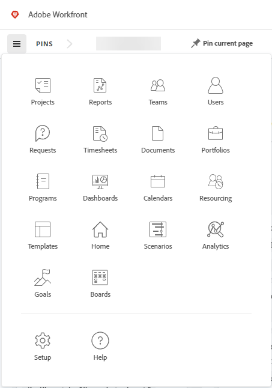

# [!DNL Adobe Unified Experience] 的 [!DNL Workfront]

存取 [!DNL Workfront] 到 [!DNL Adobe Experience Cloud] 提供順暢、統一的體驗，協助您管理所有 [!DNL Adobe] 應用程式。 單一身分管理可為您提供一個登入位置，不需要多個URL或登入ID。

若要判斷您的組織是否位在Adobe統一體驗，請檢查您用來存取Workfront的URL。

| URL | Adobe體驗 |
|------------|------------|
| （公司名稱）.my.workfront.com | Workfront體驗 |
| experience.adobe.com | Adobe統一體驗 |

## 存取需求

您必須具有下列存取權才能執行本文中的步驟：

<table style="table-layout:auto"> 
 <col> 
 <col> 
 <tbody> 
  <tr> 
   <td role="rowheader"><strong>[!DNL Adobe Workfront] 計畫*</strong></td> 
   <td> 
任何
 </td> 
  </tr> 
  <tr> 
   <td role="rowheader"><strong>[!DNL Adobe Workfront] 授權*</strong></td> 
   <td> 
[！UICONTROL Request]或更高版本
 </td> 
  </tr> 
 </tbody> 
</table>

&#42;若要瞭解您擁有的計畫、授權型別或存取權，請聯絡您的 [!DNL Workfront] 管理員。

## 先決條件

您組織的例項 [!DNL Workfront] 必須上線至 [!DNL Adobe Business Platform] / [!DNL Adobe Admin Console].

如果您對入門有任何疑問， [!DNL Adobe Admin Console]，請參閱 [[!DNL Adobe Unified Experience] 常見問題集](/help/quicksilver/workfront-basics/navigate-workfront/workfront-navigation/unified-experience-faq.md/).

## 登入 [!DNL Adobe Experience Cloud]

1. 開啟瀏覽器視窗並前往 <https://experience.adobe.com>.
1. 在 [!UICONTROL 登入] 熒幕，輸入您的電子郵件地址，然後按一下 **[!UICONTROL 繼續]**.

   ![登入 [!DNL Adobe Experience Cloud]](assets/aec-login-page.png)

## 存取 [!DNL Workfront]

登入之後 [!DNL Adobe Experience Cloud]，您可以檢視所有 [!DNL Workfront] 按一下頂端導覽區中的組織切換器，即可存取組織和環境。 選取 [!DNL Workfront] 您想要使用的組織或環境。 環境可能包括 [!UICONTROL 預覽] 和 [!UICONTROL Sandbox] 您的組織是否使用這些工具。

![檢視 [!DNL Workfront] 組織和環境](assets/aec-view-all-orgs.png)

>[!NOTE]
>
>第一次登入 [!DNL Adobe Experience Cloud]，組織會預設為字母清單中的第一個組織。 下次登入時，組織會預設為您上次造訪的組織。

[!DNL Workfront] 出現在清單中 [!DNL Adobe Experience Cloud] 您可存取的產品。 您可以選擇 [!DNL Workfront] 在的「快速存取」功能表中， [!DNL Experience Cloud] 首頁，或使用產品切換器  隨時變更應用程式。

![選取 [!DNL Workfront] 以存取應用程式](assets/aec-product-switcher.png)

## 導覽 [!DNL Workfront]

使用 [!UICONTROL 主要功能表] 圖示  左側的 [!DNL Workfront] 導覽列來導覽至您有權存取的任何頁面。 中可用的選項 [!UICONTROL 主要功能表] 取決於：

* **版面配置範本設定**：若要瞭解如何 [!DNL Workfront] 管理員可以修改 [!UICONTROL 主要功能表] 從版面範本，請參閱 [自訂 [!UICONTROL 主要功能表] 使用版面範本](/help/quicksilver/administration-and-setup/customize-workfront/use-layout-templates/customize-main-menu.md).
* **授權型別**：若要瞭解不同授權型別的預設設定，請參閱 [瞭解的導覽 [!UICONTROL 檢閱]-license使用者](/help/quicksilver/workfront-basics/navigate-workfront/workfront-navigation/reviewer-global-navigation-bar.md) 或 [瞭解的導覽 [!UICONTROL 工作]-license使用者](/help/quicksilver/workfront-basics/navigate-workfront/workfront-navigation/worker-global-navigation-bar.md).

## 存取您的設定檔和偏好設定

您可以按一下頂端導覽區域中的個人資料圖片，存取個人資料和偏好設定選項。

此功能表可讓您：

* 選擇 **[!UICONTROL 深色主題]** 格式設定 [!DNL Adobe Experience Cloud].
* 設定 **[!UICONTROL 偏好設定]** 的 [!DNL Adobe Experience Cloud]，包括主要和次要語言偏好設定。
* 存取您的 **[!UICONTROL [!DNL Workfront]個人資料]**. 進入設定檔後，按一下 **[!UICONTROL 更多]** 功能表  並選取 **[!UICONTROL 編輯]**. 如需設定檔的詳細資訊，請參閱 [設定我的設定](/help/quicksilver/workfront-basics/manage-your-account-and-profile/configuring-your-user-profile/configure-my-settings.md).
* **[!UICONTROL 登出]** Adobe Experience Cloud的。

## 管理您的密碼

>[!NOTE]
>
>變更您的密碼會變更您的所有密碼 [!DNL Adobe Experience Cloud] 應用程式。

您的密碼未在中管理 [!DNL Workfront].

如果您的組織使用單獨的應用程式來管理密碼，您將透過該提供者變更您的密碼。

如果您的密碼是由 [!DNL Adobe]，您可以變更Adobe帳戶中的密碼。

[請參閱本文以瞭解如何變更您的Adobe密碼。](https://helpx.adobe.com/manage-account/using/change-or-reset-password.html){target="_blank"}

如需變更密碼的詳細資訊，請連絡管理員。
