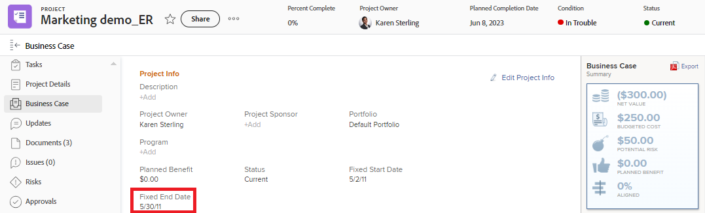
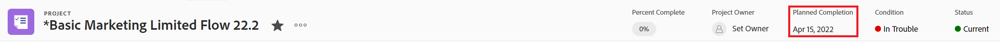

# [!DNL Workfront]中專案、任務和問題日期的概觀

<!-- Audited: 05/2024 -->

<!--consider expanding on this article with ALL dates for PTIs - Hand off dates, Approval Dates, etc-->

<!-- there are dates below that need definition - ask Product-->

本文提供[!DNL Adobe Workfront]中與專案、任務和問題相關的最常見日期的定義。 此處包含的影像範例說明日期在Workfront中顯示，並非完整日期。 還有其他區域會顯示日期。 所有日期也會顯示在專案、任務和問題報告與清單中。

如需關於報告和清單的資訊，請參閱下列文章：

* [開始使用 [!DNL Adobe Workfront]中的清單](../../../workfront-basics/navigate-workfront/use-lists/view-items-in-a-list.md)
* [開始使用報告](../../../reports-and-dashboards/reports/reporting/get-started-reports-workfront.md)

如需有關專案、任務和問題欄位的詳細資訊，請參閱[ [!DNL Adobe Workfront] 術語辭彙表](../../../workfront-basics/navigate-workfront/workfront-navigation/workfront-terminology-glossary.md)。

## [!UICONTROL 實際開始日期]

[!UICONTROL 實際開始日期]是使用者實際開始處理專案、任務或問題的日期。 建立專案、任務或問題時，[!UICONTROL 實際開始日期]是空的。

您可以手動指出任務或問題的工作開始時間，或任務或問題狀態從[!UICONTROL 新增]變更為[!UICONTROL 進行中]或[!UICONTROL 完成]時，[!UICONTROL 實際開始日期]會自動填入。 專案的[!UICONTROL 實際開始日期]與專案上第一個任務的開始日期一致。

>[!TIP]
>
>[!UICONTROL 實際開始日期]可能與專案、任務或問題的[!UICONTROL 計劃開始日期]不相符，因為使用者可能較其計畫日期晚或早開始工作。

如需詳細資訊，請參閱[專案總覽[!UICONTROL 實際開始日期]](../../../manage-work/projects/planning-a-project/project-actual-start-date.md)。

>[!NOTE]
>
>[!UICONTROL 必須於]個任務開始，或固定日期限制會影響任務的[!UICONTROL 計劃開始日期]，而非[!UICONTROL 實際開始日期]。 這會將[!UICONTROL 計劃開始日期]更新為您指定的日期。 如上所述，[!UICONTROL 實際開始日期]與[!UICONTROL 計劃開始日期]分開更新。

## [!UICONTROL 實際完成日期]

[!UICONTROL 實際完成日期]是使用者實際完成專案、任務或問題的日期。 建立專案、任務或問題時，[!UICONTROL 實際完成日期]為空白。

您可以手動指出任務或問題的工作完成時間，或當發生下列任一情況時，自動填入[!UICONTROL 實際完成日期]：

* 專案、任務或問題狀態變更為[!UICONTROL 完成]、[!UICONTROL 已關閉]或[!UICONTROL 已解決]。
* 任務或專案完成百分比為100%。

專案的[!UICONTROL 實際完成日期]與您完成專案上最後一個任務的日期一致。

>[!TIP]
>
>[!UICONTROL 實際完成日期]可能與[!UICONTROL 計畫完成日期]不符。

如需詳細資訊，請參閱[專案總覽[!UICONTROL 實際完成日期]](../../../manage-work/projects/planning-a-project/project-actual-completion-date.md)。

## 核准路徑完成日期

「核准路徑完成日期」是指核准專案、任務或問題且變更專案狀態的日期。

核准路徑完成日期會顯示在專案、任務和問題清單及報告中。

## 核准路徑開始日期

核准路徑開始日期是專案、任務或問題狀態變更為「未決核准」且專案核准請求已傳送給核准者的日期。

核准路徑開始日期會顯示在專案、任務和問題清單及報告中。

<!--## Auto Closure Date -->

## 編列預算完成日期

這是專案的已棄用欄位。 此欄位在清單或報告中可能會顯示的任何資訊，都會與Workfront已移除的功能有關。 無法更新此欄位。

此欄位會顯示在專案報告和清單中。

## 編列預算開始日期

這是專案的已棄用欄位。 此欄位可能顯示的任何資訊都與Workfront已移除的功能有關。 無法更新此欄位。

此欄位會顯示在專案報告和清單中。

## [!UICONTROL 認可日期]

[!UICONTROL 認可日期]是指指派給任務或問題的使用者認可完成任務或問題的日期。 這與[!UICONTROL 規劃完成日期]不同，因為這是僅由負責工作的使用者提供的比較實際的完成日期預估。 如需詳細資訊，請參閱[[!UICONTROL 認可日期]總覽](../../../manage-work/projects/updating-work-in-a-project/overview-of-commit-dates.md)。

>[!NOTE]
>
>變更[!UICONTROL 認可日期]會影響[!UICONTROL 預計完成日期]，但不會影響任務或問題的[!UICONTROL 規劃完成日期]。 專案經理可以使用受指派人在[!UICONTROL 認可日期]所做的變更來更新任務或問題的[!UICONTROL 規劃完成日期]。

<!--## Completion Pending Date-->

## 限制日期

如果您使用繫結至特定日期的「任務限制」，則該特定日期會成為任務的「限制日期」。

下列任務限制會更新「限制日期」欄位：

* 必須開始時間
* 必須完成時間
* 開始時間不晚於
* 開始時間不早於

>[!TIP]
>
>限製為固定日期的任務沒有限制日期。
>

「限制日期」會顯示在工作清單或報告中。

## 已轉換問題的輸入日期

轉換為專案或任務的問題建立日期。

轉換的問題輸入日期會顯示在專案、工作清單及報告中。

## 到期日

任務或問題到期完成的日期。 任務或問題的到期日與計畫完成日期相同。

任務和問題到期日會顯示在任務和問題清單及報告中。

如需詳細資訊，請參閱本文中的[規劃完成日期](#planned-completion-date)一節。

## 到期日

專案到期完成的日期。 專案的到期日與專案的計畫完成日期相同。

專案到期日會顯示在專案清單與報表中。

如需詳細資訊，請參閱本文中的[規劃完成日期](#planned-completion-date)一節。

## [!UICONTROL 輸入日期]

[!UICONTROL 進入日期]是在[!DNL Workfront]中建立專案、任務或問題的日期。

[!UICONTROL 進入日期]不會影響專案、任務或問題的時間表，但對於追蹤和報告用途而言很重要。 建立物件時，[!DNL Workfront]會自動產生[!UICONTROL 輸入日期]，您無法手動進行編輯。

## 預估到期日期

任務和專案的「預估到期日」會顯示專案或任務應完成的較現實日期。

預估日期更符合專案和任務的實際，因為它們會考慮影響專案或任務實際完成的專案。 「預估到期日」與「預估完成日期」類似。

如需詳細資訊，請參閱[預計與估計日期總覽](/help/quicksilver/manage-work/tasks/task-information/differentiate-projected-estimated-dates.md)。

專案與任務的「預估到期日」會顯示在專案與任務清單與報告中。

## 預估開始日期

任務和專案的「預估開始日期」會顯示更實際的專案或任務開始日期。

預估日期更符合專案和任務的實際，因為它們會考慮影響專案或任務實際開始的專案。 預估開始日期與預估開始日期類似。

如需詳細資訊，請參閱[預計與估計日期總覽](/help/quicksilver/manage-work/tasks/task-information/differentiate-projected-estimated-dates.md)。

專案與作業的「預估開始日期」會顯示在專案與作業清單與報表中。

<!--## Exchange Rate Date-->

## 固定結束日期

完成業務案例時，專案請求者或擁有者會識別專案的「固定結束日期」。 這是他們建議專案必須完成的日期。

這是手動估計，未考慮專案上任務的任何實際進度。

專案的「固定結束日期」會顯示在專案的「業務案例」區段，以及專案清單與報表中。

## 固定開始日期

完成業務案例時，專案請求者或擁有者會識別專案的「固定開始日期」。 這是他們建議專案應該開始的日期。

這是手動估計，未考慮專案上任務的任何實際進度。

專案的「固定開始日期」會顯示在專案的「業務案例」區段，以及專案清單與報表中。

## 移交日期

任務可供工作的日期。 這表示所有限制、核准和相依性都已完成，使用者可以開始處理任務。

「移交日期」是計算式，無法手動設定。

如需移交日期的詳細資訊，請參閱[工作移交日期概觀](/help/quicksilver/manage-work/tasks/task-information/handoff-task-date.md)。

任務的「移交日期」會顯示在任務清單及報告中。

## 上次財務更新日期

更新專案上任何財務資訊的日期。 這包括更新專案之財務區段或業務案例區段中的財務欄位。

上次財務更新日期會顯示在專案清單與報表中。

## 上次更新日期

專案、任務或問題上次更新的日期。 任何觸發要儲存的專案、任務或問題的變更都會視為更新。 這包括狀態、條件、時間表、財務或任何其他欄位的變更。

上次更新日期會顯示在專案、任務、問題清單及報告中。

## [!UICONTROL 小時輸入日期]

當您記錄專案、任務和問題的時間以指出您花在專案、任務或問題上的實際時間（以小時為單位）時，您記錄的時間會變成專案、任務或問題的[!UICONTROL 實際小時]。

您記錄時間的日期是小時專案上的[!UICONTROL 小時專案日期]欄位。

小時輸入日期會顯示在小時清單和報告中。

>[!TIP]
>
>一小時的[!UICONTROL 輸入日期]與另一個Workfront物件的[!UICONTROL 輸入日期]不同，因為它不是建立小時記錄的日期，而是您希望小時產生關聯的日期。
>
>例如，您可以在9月5日記錄任務的小時數，但是將小時數與9月1日建立關聯。 該小時的輸入日期是9月1日。

如需有關如何在Workfront中記錄時間的資訊，請參閱[記錄時間](../../../timesheets/create-and-manage-timesheets/log-time.md)。

>[!TIP]
>
>我們建議在工作任務和問題上記錄時間，而不是父級任務或專案。 工作任務的登入時間將累計至父任務和專案，作為[!UICONTROL 父任務和專案的實際時數]。 登入問題的時間會統計為專案的[!UICONTROL 實際時數]。

## [!UICONTROL 計畫完成日期]

[!UICONTROL 計畫完成日期]或[!UICONTROL 到期日]是專案、任務或問題的計畫完成日期。

根據[!UICONTROL 任務限制]，您可能無法編輯任務的[!UICONTROL 規劃完成日期]。 根據專案的[!UICONTROL 排程模式]，您可能無法編輯專案的[!UICONTROL 規劃完成日期]。

[!UICONTROL 計畫完成日期]在[!DNL Workfront]的某些區域顯示為到期日。

如需詳細資訊，請參閱下列文章：

* [任務[!UICONTROL 計畫完成日期]的總覽](../../../manage-work/tasks/task-information/task-planned-completion-date.md)
* [設定專案[!UICONTROL 計畫完成日期]](../../../manage-work/projects/planning-a-project/project-planned-completion-date.md)
* [問題[!UICONTROL 計畫完成日期]的總覽](../../../manage-work/issues/issue-information/issue-planned-completion-date.md)

## 計劃日期對準

這是自動指標，可讓Workfront指派專案、任務和問題，以顯示相對於其計畫完成日期的專案完成時間。

「計畫日期對齊方式」指標可能的值如下：

* 將於計劃完成日期完成
* 將於計劃完成日期前完成
* 將於計劃完成日期後完成

計畫日期對齊會顯示在專案、任務、問題清單和報告中。

## [!UICONTROL 計劃開始日期]

[!UICONTROL 計劃開始日期]是專案、任務或問題的計劃開始日期。

根據[!UICONTROL 任務限制]，您可能無法編輯任務的[!UICONTROL 規劃開始日期]。 根據專案的[!UICONTROL 排程模式]，您可能無法編輯專案的[!UICONTROL 規劃開始日期]。

如需詳細資訊，請參閱[專案總覽[!UICONTROL 計劃開始日期]](../../../manage-work/projects/planning-a-project/project-planned-start-date.md)。

## [!UICONTROL 預計完成日期]

[!UICONTROL 預計完成日期]是專案、任務或問題將完成的即時計算量度。 當專案、任務或問題標示為完成時，[!UICONTROL 預計完成日期]將變更為[!UICONTROL 實際完成日期]的日期。

如果一切順利且按計畫進行，[!UICONTROL 預計完成日期]應符合[!UICONTROL 計畫完成日期]。 否則，由於前置任務上的延遲，[!UICONTROL 預計完成日期]可能會與[!UICONTROL 計畫完成日期]不同。

如需詳細資訊，請參閱專案、任務和問題的[專案預計完成日期]的[!UICONTROL 總覽](../../../manage-work/projects/planning-a-project/project-projected-completion-date.md)。

## [!UICONTROL 預計開始日期]

[!UICONTROL 預計開始日期]是專案、任務或問題開始的即時日期，會考慮所有延遲。 此專案、任務或問題的開始日期比[!UICONTROL 計劃開始日期]更準確。 [!UICONTROL 計劃開始日期]未考慮延遲或過去的日期。

當您第一次計畫專案時，任務的[!UICONTROL 計劃開始日期]與專案的[!UICONTROL 預計開始日期]相同。 由於可能發生延遲或工作可能提前完成，[!UICONTROL 預計開始日期]可能會與[!UICONTROL 計劃開始日期]不同。

若為工作，當其中一個前置任務在排程之後執行時，[!UICONTROL 預計開始日期]也可能與其[!UICONTROL 計劃開始日期]不同。

>[!TIP]
>
>您只能在清單或報告中檢視問題的[!UICONTROL 預計開始日期]。

如需詳細資訊，請參閱[專案總覽[!UICONTROL 預計開始日期]](../../../manage-work/projects/planning-a-project/project-projected-start-date.md)。

<!--## Rejection Date-->

## 寬限日期

任務有時可以延遲開始和完成，而不會影響專案的完成日期。

「Slack日期」會顯示任務明確會影響專案的「完成日期」的確切日期。

如需任務Slack日期的相關資訊，請參閱[任務Slack日期總覽](/help/quicksilver/manage-work/tasks/task-information/task-slack-date.md)。

工作Slack日期會顯示在工作清單及報告中。

## 開始日期

專案計劃開始的日期。 專案的開始日期與專案的計劃開始日期相同。

此欄位會顯示在專案清單和報告中。

如需詳細資訊，請參閱本文中的[規劃開始日期](#planned-start-date)一節。

