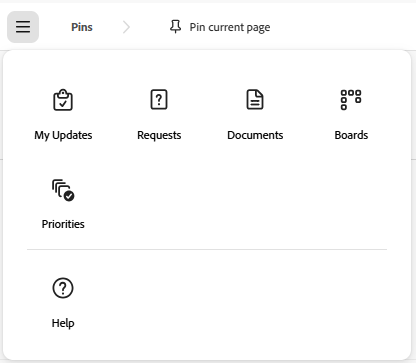

# 瞭解[!UICONTROL Light]授權使用者的導覽

{{highlighted-preview}}

[!UICONTROL 主要功能表]會隨著您的[!DNL Adobe Workfront]系統管理員指派給您的存取層級而變更。 依預設，您只能存取包含您存取層級所允許之功能的區域。 若要瞭解每個存取層級的預設配置元件，請參閱[關於預設 [!DNL Adobe Workfront] 配置](../../../administration-and-setup/customize-workfront/use-layout-templates/about-the-default-wf-layout.md)。

## 瞭解[!UICONTROL 輕度使用者]的預設[!UICONTROL 主要功能表]

您身為[!UICONTROL 輕度使用者]，主要職責是檢閱、評論及核准工作。 您可在[!UICONTROL 主要功能表]中看到的區域可讓您進行這項作業。

下列區域包含在[!UICONTROL 輕度使用者]的預設配置中：

* **[!UICONTROL 我的更新]**：依預設，所有存取層級的使用者皆可使用的&#x200B;**[!UICONTROL 首頁]**&#x200B;區域，已取代為輕量級授權型別使用者的&#x200B;**[!UICONTROL 我的更新]**。 您身為[!UICONTROL 輕度使用者]，無法完成工作。 您只需要檢視有關您必須檢閱、評論或核准之工作的資訊。 **[!UICONTROL 我的更新]**&#x200B;區域可讓您執行這些動作。 這是新Light使用者的預設登陸區域。

  >[!TIP]
  >
  >您的[!DNL Workfront]或群組管理員可能會指派可以變更預設登入頁面的配置範本。 使用版面配置範本，您也可以以[!UICONTROL 輕量]授權使用者的身分檢視[!UICONTROL 首頁]和[!UICONTROL 更新]區域。

* **[!UICONTROL 請求]**：您可以提交並檢閱您或貴公司其他使用者在此區域提交的請求。
* **[!UICONTROL 檔案]**：您可以在這裡上傳檔案或檢閱與您共用的檔案。
* **[!UICONTROL 看板]**：使用共用看板（包含欄和卡片，可反映您想要完成的工作），以彈性與團隊成員共同作業。 如需詳細資訊，請參閱[開始使用看板：文章索引](../../../agile/get-started-with-boards/get-started-with-boards.md)。
* **[!UICONTROL 優先順序]**：您可以快速管理工作並排定優先順序。 如需詳細資訊，請參閱[開始使用優先順序](/help/quicksilver/workfront-basics/priorities/get-started-with-priorities.md)。

在預覽環境中範例影像：

生產環境中的影像範例：

## 自訂您的預設[!UICONTROL 主功能表]

您的[!DNL Workfront]管理員可以指派配置範本給您，以修改您的[!DNL Workfront]預設配置。 如需使用版面配置範本的詳細資訊，請參閱[使用版面配置範本自訂[!UICONTROL 主功能表]](../../../administration-and-setup/customize-workfront/use-layout-templates/customize-main-menu.md)。
