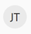

# [!DNL Adobe Workfront]物件總覽

<!--Audited: 12/2023-->

<!--
<***Linked to several articles, do not remove/ change. 
-->

您在[!DNL Adobe Workfront]中顯示的資訊由儲存在[!DNL Workfront]資料庫中的物件表示。 物件是[!DNL Workfront]中驅動資訊的專案。

瞭解[!DNL Workfront]中物件的定義方式非常重要，這樣您就可以根據組織中的必要需求使用正確的物件。

例如，當您計畫大量工作時，您需要使用[!UICONTROL 專案]物件來定義該工作。 若要將此工作分割成較小的計畫增量，您可以使用[!UICONTROL 工作]物件。 對於較少量未計畫且可能意外發生的工作，您可以使用Issue物件。 如果您想要追蹤一組專案的進度及預算與時間表遵守情況，可以在[!UICONTROL Portfolio]與[!UICONTROL 方案]中組織專案。 若要定義可協助您解決工作的其他元素，您想要使用儲存在[!UICONTROL 專案]、[!UICONTROL 任務]、[!UICONTROL 問題]或[!UICONTROL Portfolio]下的其他物件，例如[!UICONTROL 檔案]、[!UICONTROL 更新]、[!UICONTROL 小時]、[!UICONTROL 使用者]或[!UICONTROL 工作角色]。

[!UICONTROL 報表]和[!UICONTROL 儀表板]是另一個物件範例，可協助您以視覺化方式整理[!DNL Workfront]中的資料量，讓所有使用者都能輕鬆存取。

如需[!DNL Workfront]中物件的完整清單，請參閱[API總管](../../../wf-api/general/api-explorer.md)。

## 物件的相依性和階層

物件在[!UICONTROL Workfront]中相互連結。 例如，一個任務或問題不可能在專案之外獨立存在。 [!UICONTROL 任務]和[!UICONTROL 問題]是儲存在[!UICONTROL 專案]物件中的物件範例。 [!UICONTROL 任務]和[!UICONTROL 問題]被視為專案的子物件。

以下是[!DNL Workfront]中最常使用的物件及其各自的父物件和子物件：

| **物件** | **父物件** | **子物件** |
|---|---|---|
| [!UICONTROL 專案組合] |  | [!UICONTROL 方案]，[!UICONTROL 專案]，[!UICONTROL 檔案]，[!DNL Notes]，[!UICONTROL 使用者] |
| [!UICONTROL 程式] | [!UICONTROL 專案組合] | [!UICONTROL 專案]，[!UICONTROL 檔案]，[!UICONTROL 附註]，[!UICONTROL 使用者] |
| [!UICONTROL 專案] | [!UICONTROL Portfolio]，[!UICONTROL 程式] | [!UICONTROL 任務]，[!UICONTROL 問題]，[!UICONTROL 檔案]，[!UICONTROL 附註]，[!UICONTROL 小時]，[!UICONTROL 使用者] |
| [!UICONTROL 任務] | [!UICONTROL 專案] | [!UICONTROL 問題]，[!UICONTROL 子系任務]，[!UICONTROL 檔案]，[!UICONTROL 附註]，[!UICONTROL 小時]，[!UICONTROL 使用者] |
| [!UICONTROL 問題] | [!UICONTROL 任務]，[!UICONTROL 專案] | [!UICONTROL 檔案]，[!UICONTROL 附註]，[!UICONTROL 小時]，[!UICONTROL 使用者] |
| [!UICONTROL 儀表板] |  | [!UICONTROL 報表]，外部頁面 |
| [!UICONTROL 報告] | [!UICONTROL 儀表板] |  |
| [!UICONTROL 群組] |  | [!UICONTROL 使用者] |
| [!UICONTROL 團隊] |  | [!UICONTROL 使用者] |
| [!UICONTROL 使用者] | [!UICONTROL 群組]，[!UICONTROL 團隊]，[!UICONTROL 公司] | [!UICONTROL 工作角色] |
| [!UICONTROL 公司] |  | [!UICONTROL 使用者] |
| [!UICONTROL 文件] | [!UICONTROL 任務]，[!UICONTROL 問題]，[!UICONTROL 專案]，[!UICONTROL Portfolio]，[!UICONTROL 計畫]，[!UICONTROL 使用者] |  |
| [!UICONTROL 計畫]* |  | [!UICONTROL 個方案] |
| [!DNL Goals]* |  | [!UICONTROL 個結果]，[!UICONTROL 個活動] |

如需[!DNL Workfront]中物件的完整清單，請參閱[API總管](../../../wf-api/general/api-explorer.md)。

*計畫是[!DNL Adobe Workfront Scenario Planner]的物件。 如需[!DNL Scenario Planner]的相關資訊，請參閱[情境規劃工具]概觀](../../../scenario-planner/scenario-planner-overview.md)。[!UICONTROL 

*[!UICONTROL 目標]是[!DNL Adobe Workfront Goals]的物件。 如需[!DNL Workfront Goals]的相關資訊，請參閱[[!DNL Adobe Workfront Goals] 概觀](../../../workfront-goals/goal-management/wf-goals-overview.md)。

## 自訂物件名稱

作為[!DNL Workfront]管理員，您可以使用[!UICONTROL 配置範本]來自訂[!DNL Workfront]中的物件名稱。

如需有關如何使用[!UICONTROL 配置範本]自訂物件名稱的詳細資訊，請參閱[建立和管理配置範本](../../../administration-and-setup/customize-workfront/use-layout-templates/create-and-manage-layout-templates.md)。

自訂版面範本並將其指派給使用者後，這些使用者可以看到物件的自訂名稱。 已指派給版面配置範本的使用者不會再看到Web應用程式中任何位置的物件預設名稱。

例如，如果貴組織中較大量的工作稱為「參與」，您可以將名稱&#39;[!UICONTROL 專案]&#39;取代為「參與」。 您的[!DNL Workfront]介面會顯示&#39;Engagement&#39;而非&#39;[!UICONTROL Project]&#39;，出現在名稱&#39;[!UICONTROL Project]&#39;的所有位置。

>[!NOTE]
>
>為了讓使用者看到物件的新名稱，使用者必須在您儲存[!UICONTROL 配置範本]後，登出並重新登入[!DNL Workfront]。

>[!IMPORTANT]
>
>[!DNL Workfront]檔案一律參考物件的預設名稱。 身為[!DNL Workfront]管理員，請務必通知使用者物件名稱的變更，以便他們瞭解如何使用[!DNL Workfront]檔案，以及應用程式中不會反映物件名稱變更的區域。

* [可使用[!UICONTROL 配置範本]自訂的物件名稱](#object-names-that-can-be-customized-using-a-layout-template)
* [反映自訂物件名稱的 [!DNL Workfront] 區域](#areas-of-workfront-that-reflect-the-customized-object-names)
* [未反映自訂物件名稱的 [!DNL Workfront] 區域](#areas-of-workfront-that-do-not-reflect-the-customized-object-names)

### 可使用[!UICONTROL 配置範本]自訂的物件名稱

作為[!DNL Workfront]管理員，您可以自訂下列物件的名稱，以符合您組織中的術語：

* [!UICONTROL Portfolio]
* [!UICONTROL 程式]
* [!UICONTROL 專案]
* [!UICONTROL 任務]
* [!UICONTROL 問題]
* [!UICONTROL 目標]*
* [!UICONTROL 結果]*
* [!UICONTROL 活動]*

  *[!UICONTROL 目標]、[!UICONTROL 結果]和[!UICONTROL 活動]僅在貴公司購買[!DNL Workfront Goals]時才可用。 如需[!DNL Workfront Goals]的相關資訊，請參閱[[!DNL Adobe Workfront Goals] 概觀](../../../workfront-goals/goal-management/wf-goals-overview.md)。

* [!UICONTROL 方案]**
* [!UICONTROL 案例]**
* [!UICONTROL 計畫]**

  **[!UICONTROL 方案]、[!UICONTROL 案例]和[!UICONTROL 方案]僅在貴公司購買[!DNL Workfront Scenario Planner]時才可供使用。 如需[!DNL Scenario Planner]的相關資訊，請參閱[開始使用 [!DNL Scenario Planner]](../../../scenario-planner/get-started-with-scenario-planning.md)。

如需有關如何使用[!UICONTROL 配置範本]自訂物件名稱的詳細資訊，請參閱[建立和管理配置範本](../../../administration-and-setup/customize-workfront/use-layout-templates/create-and-manage-layout-templates.md)。

您無法在Workfront中自訂任何其他物件的名稱。 如需[!DNL Workfront]中物件的完整清單，請參閱[API總管](../../../wf-api/general/api-explorer.md)。

當您自訂物件的名稱時，該物件的新名稱會出現在顯示該物件名稱的[!DNL Workfront]應用程式的大部分割槽域中。

### 反映自訂物件名稱的[!DNL Workfront]區域

下列區域顯示物件的更新名稱：

* 上方巡覽
* 左側面板導覽中的所有區段
* 所有功能表
* 應用程式內通知
* Report Builder和報告元素（檢視、篩選器和群組）
* [!UICONTROL 儲存]按鈕
* 匯出的檔案
* 電子郵件
* 行動應用程式

### 未反映自訂物件名稱的[!DNL Workfront]區域

下列區域不會顯示物件的更新名稱：

<!--
  <li data-mc-conditions="QuicksilverOrClassic.Draft mode"> 
Referenced Object Type selection for a Typeahead field in a Custom Form 
 
(NOTE: drafting this because I don't think this is true)
 </li>
  -->

* [!DNL Outlook]增益集

### 自訂物件名稱的影響

在[!DNL Workfront]中自訂物件名稱時，請注意下列事項：

* 您可能在系統顯示中遇到文體或文法錯誤。 例如，如果您將&#39;[!UICONTROL Issue]&#39;重新命名為&#39;Request&#39;，而您在系統中的任何地方都看到片語&#39;An request&#39;，則表示這是正常運作，不應視為錯誤。
* 您物件的自訂名稱無法翻譯。 只有[!DNL Workfront]預設名稱可以翻譯成支援的語言。 如需[!DNL Workfront]支援之語言的詳細資訊，請參閱 [!DNL Adobe Workfront]](../../../workfront-basics/supported-languages-in-workfront.md)中的[支援的語言。 自訂物件名稱欄位支援外來字元，因此您可以用任何語言輸入術語。
* 當您使用[!UICONTROL 配置範本]自訂物件名稱時，我們建議您根據您的業務單位（團隊或群組）來指派您的[!UICONTROL 配置範本]。\
   建議您使用這些業務單位使用者清楚理解的名稱，以避免混淆。
* 電子郵件通知與傳遞的報告一律包含產生電子郵件之使用者的[!UICONTROL 配置範本]所定義的物件名稱。 如果您的使用者收到其他團隊和群組使用者的電子郵件通知，則您使用者應該準備好在其電子郵件中看到與群組或團隊無關的物件名稱。\
   作為[!DNL Workfront]管理員，建議使用者注意與每個物件關聯的圖示。 各種物件名稱之間的圖示會維持一致，與預設物件一致，如顯示在資料庫中的圖示一樣。 如需與物件關聯的所有[!DNL Workfront]圖示清單，請參閱[物件圖示](#object-icons)。

  >[!TIP]
  >
  >對於組織中的常見工作，請考慮建立自訂檔案以反映您的術語。

## 物件圖示

[!DNL Workfront]檔案一律參照物件的預設名稱。 如果您的物件已自訂其名稱，您可以依賴與其關聯的圖示來瞭解哪個自訂物件對應到哪個[!DNL Workfront]預設物件。

如需哪些物件可在[!DNL Workfront]中擁有自訂名稱的詳細資訊，請參閱可使用[!UICONTROL 配置範本]](#object-names-that-can-be-customized-using-a-layout-template)自訂的[物件名稱。

以下是Workfront中的物件清單及其對應的圖示。

| **物件** | **圖示** | **可自訂的物件名稱** |
|---|---|---|
| [!UICONTROL 公司] |  ，  |  |
| [!UICONTROL 儀表板] |  ，  |  |
| [!UICONTROL 目標] |  | ✔ |
| [!UICONTROL 群組] |  ，  |  |
| [!UICONTROL 問題] |  ，  | ✔ |
| [!UICONTROL 工作角色] | ，，， |  |
| [!UICONTROL 計畫] | ， |  |
| [!UICONTROL Portfolio] |  ，  | ✔ |
| [!UICONTROL 程式] |  ，  | ✔ |
| [!UICONTROL 專案] |  ，  | ✔ |
| [!UICONTROL 報告] |  ，  |  |
| [!UICONTROL 任務] |  ，  | ✔ |
| [!UICONTROL 團隊] | ， ，  |  |
| [!UICONTROL 範本] |  ，  |  |
| [!UICONTROL 使用者] |  ，  ，  ，  ，  |  |

## 物件的參考編號

在[!DNL Workfront]中建立的每個物件都會被指派唯一的參考編號。 在區分兩個在其他方面相似的物件（例如具有相同名稱的工作）時，參考編號非常有用。 您可以使用物件的參考編號來搜尋物件，也可以在報表中包含參考編號。

如需如何依參考編號搜尋物件的詳細資訊，請參閱[使用物件的參考編號](../../../workfront-basics/navigate-workfront/search/reference-number-of-objects.md)。

## 物件特定搜尋

您可以在[!DNL Workfront]中搜尋所有物件，也可以在基本和進階搜尋中選取要搜尋的特定物件。

並非所有物件都可在[!DNL Workfront]中搜尋。 您可以在[!DNL Workfront]中執行下列物件的基本和進階搜尋：

| **物件** | **基本搜尋** | **進階搜尋** |
|---|---|---|
| [!UICONTROL 專案] | ✓ (A) | ✓ (A) |
| [!UICONTROL 任務] | ✓ (A) | ✓ (A) |
| [!UICONTROL 問題] | ✓ (A) | ✓ (A) |
| [!UICONTROL 報告] | ✓ (A) | ✓ (A) |
| [!UICONTROL 使用者] | ✓ (A) | ✓ (A) |
| [!UICONTROL 範本] | ✓ (A) | ✓ (A) |
| [!UICONTROL 文件] | ✓ (A) | ✓ (A) |
| [!UICONTROL 專案組合] | ✓ (A) | ✓ (A) |
| [!UICONTROL 程式] | ✓ (A) | ✓ (A) |
| [!UICONTROL 儀表板] | ✓ (A) | ✓ (A) |
| [!UICONTROL 公司] | ✓ (A) | ✓ (A) |
| [!UICONTROL 備註] （或[!UICONTROL 更新]） | ✓ (A) |  |

如需在[!DNL Workfront]中執行基本和進階搜尋的詳細資訊，請參閱[搜尋 [!DNL Adobe Workfront]](../../../workfront-basics/navigate-workfront/search/search-workfront.md)。

## 物件的存取受限

當使用者無權存取物件時，使用者看到物件名稱顯示在Workfront中的任何位置均顯示「無權存取」。

存取物件時，可以在存取層級或特定物件的許可權中加以限制。

這適用於本文中[物件相依性和階層](#interdependency-and-hierarchy-of-objects)區段中列出的所有物件和子物件。 這不適用於團隊和使用者物件。

## 物件報表

在[!DNL Workfront]中開始建立報表之前，瞭解物件的階層與相依性非常重要。 報表是物件專屬的。 您必須先為報表選取正確的物件，才能顯示您想要的資料。

>[!IMPORTANT]
>
>您只能在同一個報表中報告您選取的物件以及父物件。 父物件報表中不能有子物件的相關資訊。 例如，您可以在任務報告中顯示專案資訊，但不能在專案報告中顯示任務資訊。

您可以使用我們的開放API來報告資料庫中的所有物件。 如需資料庫中所有物件的完整清單，請參閱[API總管](../../../wf-api/general/api-explorer.md)。

>[!NOTE]
>
> * 如果您已使用版面配置範本自訂物件名稱，則也會自訂Report Builder中的物件名稱。 確保您知道哪些物件已自訂，並在Report Builder中尋找自訂名稱。 如需哪些物件可在[!DNL Workfront]中擁有自訂名稱的詳細資訊，請參閱本文章中的[可以使用[!UICONTROL 配置範本]](#object-names-that-can-be-customized-using-a-layout-template)自訂的物件名稱。
> * 在報表中使用文字模式時，文字模式運算式中的物件名稱是[!DNL Workfront]中的標準名稱，而非自訂物件名稱。 如需有關在報表中使用文字模式的詳細資訊，請參閱[文字模式概觀](../../../reports-and-dashboards/reports/text-mode/understand-text-mode.md)。

如需建立報告的詳細資訊，請參閱[建立自訂報告](../../../reports-and-dashboards/reports/creating-and-managing-reports/create-custom-report.md)。\
如需有關我們的API的詳細資訊，請參閱[API Explorer](../../../wf-api/general/api-explorer.md)。

### 可用於報表的物件

在[!DNL Workfront]網頁應用程式中使用Report Builder時，您可以報告下列物件。 縮排專案符號可提供物件的詳細資訊，而不會代表其他物件。

* [!UICONTROL 專案]
* [!UICONTROL 任務]
* [!UICONTROL 小時]
* [!UICONTROL 問題]
* [!UICONTROL 使用者]
* [!UICONTROL 存取]層級
* [!UICONTROL 核准]
* [!UICONTROL 核准流程]
* [!UICONTROL 工作分派]
* [!UICONTROL 基準線]
* [!UICONTROL 基準線任務]
* [!UICONTROL 記帳記錄]
* [!UICONTROL 已編列預算時數]
   * 這是[!UICONTROL 預算時數]，它們會顯示在舊版已棄用的資源管理工具中。
   * 「Bud. [!UICONTROL 預算時數]報告中的時數欄位參考[!UICONTROL 資源規劃工具]中工作角色的預算時數。 如需詳細資訊，請參閱[瞭解專案的[!UICONTROL 預算勞力成本]和[!UICONTROL 預算時數]](../../../manage-work/projects/project-finances/budgeted-labor-cost.md)。

* [!UICONTROL 行事曆活動]
* [!UICONTROL 公司]
* [!UICONTROL 自訂表單]
* [!UICONTROL 儀表板]
* [!UICONTROL 檔案]
* [!UICONTROL 檔案核准]
* [!UICONTROL 文件版本]
   * 您可以檢視檔案版本的相關資訊、與版本相關聯的檔案、建立版本的使用者，以及在檔案版本上建立校訂的使用者（校訂建立者）（如果存在）。
* [!UICONTROL 電子郵件範本]
* [!UICONTROL 費用]
* [!UICONTROL 費用型別]
* [!UICONTROL 外部頁面]
* [!UICONTROL 我的最愛]
* [!UICONTROL 篩選器]
* [!UICONTROL 目標]
   * 您可以為策略目標建立報告，或在專案與目標關聯作為目標活動時，可在專案報告中顯示目標相關的資訊。 您只能在組織已購買[!DNL Workfront Goals]授權的情況下建立策略目標並連線專案。 如需[!DNL Workfront Goals]的相關資訊，請參閱[[!DNL Workfront Goals] 概觀](../../../workfront-goals/goal-management/wf-goals-overview.md)。 如需有關將專案連線到策略目標的資訊，請參閱[將專案新增到Adobe Workfront目標中的目標](../../../workfront-goals/results-and-activities/connect-projects-to-goals-overview.md)。
*您無法報告與[!UICONTROL 業務案例]相關聯的專案目標。 如需有關專案目標與策略目標的資訊，請參閱[ [!DNL Adobe Workfront] 術語表](../../../workfront-basics/navigate-workfront/workfront-navigation/workfront-terminology-glossary.md)。

* [!UICONTROL 群組]
* [!UICONTROL 群組]
* [!UICONTROL 小時型別]
* [!UICONTROL 方案]
   * 只有貴公司已購買[!DNL Workfront Scenario Planner]授權，您才能為屬於計畫子物件的方案建立報告。 如需方案的相關資訊，請參閱 [!DNL Workfront Scenario Planner]](../../../scenario-planner/initiatives-overview.md)中的[方案概觀。

* 計畫工作角色
   * 只有貴公司已購買[!DNL Workfront Scenario Planner]授權時，您才能為計畫中方案相關的工作角色建立報告。 如需建立方案並將其與工作角色建立關聯的資訊，請參閱[在 [!DNL Workfront Scenario Planner]](../../../scenario-planner/create-and-edit-initiatives.md)中建立和編輯方案。

* [!UICONTROL 反複專案]
* [!UICONTROL 工作角色]
* [!UICONTROL 日誌專案]
   * 您可以在[!UICONTROL 更新]物件區域（如任務、專案、問題等）報告追蹤的系統更新。 如需詳細資訊，請參閱[!UICONTROL 更新]區域](../../../reports-and-dashboards/reports/creating-and-managing-reports/create-journal-entry-report.md)的[報告。

* [!UICONTROL 配置範本]
* [!UICONTROL 里程碑]
* [!UICONTROL 里程碑路徑]
* [!UICONTROL 附註]或[!UICONTROL 更新]
   * 您可以報告個別使用者新增的註解。

* [!UICONTROL 引數] （或[!UICONTROL 自訂欄位]）
* [!UICONTROL 引數群組] （或[!UICONTROL 分割槽符號]）
* [!UICONTROL Portfolio]
* [!UICONTROL 程式]
* [!UICONTROL 專案（財務資料）]
   * 財務資訊僅會在與其關聯的資料存在時間少於5年時，才會填入[!UICONTROL 專案（財務資料）]報表中。 例如，如果工作角色在2015年1月被配置給任務，而今天是2021年9月，則工作角色的[!UICONTROL 配置日期]之類的財務檔案不會填入[!UICONTROL 專案（財務資料）]報表中。

  >[!CAUTION]
  >
  >執行專案（財務資料）報表會執行財務資料的重新計算，這會覆寫先前的財務資料，而且可能需要相當長的時間。 如需重新計算財務資料之結果的詳細資訊，請參閱[重新計算專案財務](/help/quicksilver/manage-work/projects/project-finances/recalculate-project-finances.md)。

* [!UICONTROL 校訂核准]
   * 可讓您檢視有關校訂核准的各種資訊，包括：提交以供核准的校訂、[!UICONTROL 核准者]的相關資訊、請求者的相關資訊（如果請求者是授權的[!DNL Workfront]使用者）、版本資訊、校訂ID以及校訂建立日期。\
      [!UICONTROL 校訂核准]報告僅包含可在使用者的「我的工作」區域中取得的校訂，這些區域尚未做出決定。\
   * 校訂核准已在[!DNL Workfront]中指派，如[在[中新增使用者到校訂](../../../review-and-approve-work/proofing/managing-proofs-within-workfront/share-a-proof-in-workfront.md#add)在 [!DNL Adobe Workfront]](../../../review-and-approve-work/proofing/managing-proofs-within-workfront/share-a-proof-in-workfront.md)內共用校訂。

* [!UICONTROL 佇列]
* [!UICONTROL 佇列主題]
* [!UICONTROL 費率] （這會顯示工作角色[!UICONTROL 收費率]資訊）
* [!UICONTROL 提醒通知]
* [!UICONTROL 報告]
* [!UICONTROL 資源集區]
* [!UICONTROL 風險]
* [!UICONTROL 風險型別]
* [!UICONTROL 排程]
* [!UICONTROL 計分卡]
* [!UICONTROL 團隊]
* [!UICONTROL 範本]
* [!UICONTROL 範本任務]
* [!UICONTROL 休假]
   * 您可以根據使用者在其設定檔中的指示，報告使用者的休假。

* [!UICONTROL 時程表]
* [!UICONTROL 週期性時程表]
* [!UICONTROL 主題群組]
* [!UICONTROL 使用者核准]
* [!UICONTROL 使用者委派]

   * 您可以報告受委派執行外出時其他人之任務和問題的使用者。 此報表顯示不在辦公室的使用者以及在外出期間履行職責的使用者。

* [!UICONTROL 使用者決定]

   * 您可以報告當月使用者對校樣和檔案做了多少決策。

* [!UICONTROL 檢視]
* [!UICONTROL 工作專案] （這會產生任務和問題的報告）
