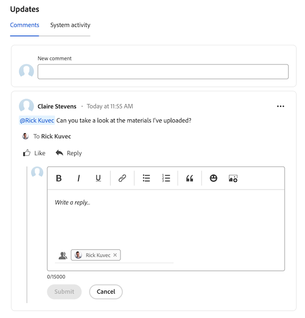

# 在優先順序中新增及檢視註解

您可以在任務或問題上新增更新，以向他人傳達工作專案的進度。

優先順序顯示指派給您的工作專案。 您看不到指派給團隊的工作專案。

## 存取需求

+++ 展開以檢視本文中功能的存取需求。

<table style="table-layout:auto"> 
 <col> 
 </col> 
 <col> 
 </col> 
 <tbody> 
  <tr> 
   <td role="rowheader"><strong>Adobe Workfront套件</strong></td> 
   <td> 
任何
 </td> 
  </tr> 
  <tr> 
   <td role="rowheader"><strong>Adobe Workfront授權</strong></td> 
   <td> 
   
要求或更高的問題和檔案；檢閱或更高的所有其他物件

   
問題和檔案的貢獻者或以上：所有其他物件的淺色或以上
 
   </td> 
  </tr> 
  <tr> 
   <td role="rowheader"><strong>存取層級設定</strong></td> 
   <td> 
檢視或編輯更新所在物件的存取權
</td> 
  </tr> 
  <tr> 
   <td role="rowheader"><strong>物件許可權</strong></td> 
   <td> 
檢視物件的存取權
</td> 
  </tr> 
 </tbody> 
</table>

如需詳細資訊，請參閱Workfront檔案中的[存取需求](/help/quicksilver/administration-and-setup/add-users/access-levels-and-object-permissions/access-level-requirements-in-documentation.md)。

+++

## 新增快速註解

您可以從工作清單新增註解：

{{step1-to-priorities}}

1. 找到您要更新的工作專案。
1. 將游標暫留在名稱上，然後按一下[新增更新]。**&#x200B;**
   
   <!--new screen for prod -->
1. 開始輸入您的註解。
1. （選擇性）在&#x200B;**標籤人員或團隊**&#x200B;方塊中，開始輸入使用者或您要加入此註解之團隊的名稱或電子郵件，然後在其顯示在清單中時選取它。
1. （可選）使用RTF工具列中的選項來格式化文字、新增emoji、連結或影像至您的註解，以強化您的內容。
1. 按一下&#x200B;**提交**&#x200B;將註解新增至工作專案。

   >[!IMPORTANT]
   >
   >您只能在提交評論的15分鐘內編輯評論。 若要編輯評論，請按一下評論右上角的&#x200B;**更多**&#x200B;功能表，然後按一下&#x200B;**編輯**。

如需新增更新的詳細資訊，請參閱[將更新新增至工作專案](/help/quicksilver/workfront-basics/updating-work-items-and-viewing-updates/update-work.md)。

## 在工作專案中檢視並新增評論和系統更新

您可以在個別工作專案中加入註解並檢視註解及系統更新：

{{step1-to-priorities}}

1. 按一下工作專案名稱以開啟&#x200B;**概觀**&#x200B;頁面。
1. 在熒幕右下角找到&#x200B;**更新**&#x200B;區域。
1. （選擇性）使用&#x200B;**註解**&#x200B;標籤檢視其他人對工作專案所做的更新。
1. （選擇性）使用&#x200B;**系統活動**&#x200B;標籤檢視與工作專案相關的系統活動。
1. （選擇性）若要新增註解，請前往&#x200B;**註解**&#x200B;索引標籤，並開始輸入&#x200B;**新註解**&#x200B;方塊。 完成時，請按一下&#x200B;**提交**。
   

## 回複評論

您可以回覆工作專案中的註解：

{{step1-to-priorities}}

1. 按一下工作專案名稱以開啟&#x200B;**概觀**&#x200B;頁面。
1. 在熒幕右下角找到&#x200B;**更新**&#x200B;區域。
1. 在&#x200B;**註解**&#x200B;標籤上，尋找您要回覆的註解，然後按一下&#x200B;**回覆**。
1. （視條件而定）如果您想要將訊息內容帶入回覆，請按一下訊息本文旁的&#x200B;**更多**&#x200B;功能表圖示，然後選擇&#x200B;**引號回覆**。

1. 輸入您的回覆，然後按一下&#x200B;**提交**。

   >[!IMPORTANT]
   >
   >您只能在提交評論的15分鐘內編輯評論。 若要編輯評論，請按一下評論右上角的&#x200B;**更多**&#x200B;功能表，然後按一下&#x200B;**編輯**。

   
