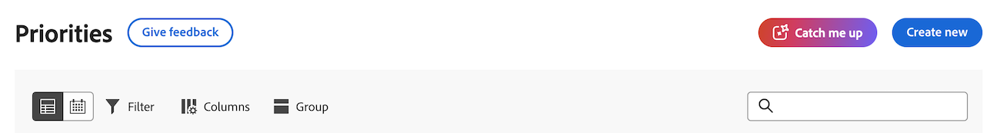

# 在優先順序中趕上工作

隨時瞭解專案的最新進展 — 由Workfront的AI Assistant提供技術支援 — 在以下時間範圍內概述有關專案的更新、上傳檔案和其他重大變更：24小時、3天、7天。 這有助於縮短尋找作用中專案資訊的時間。

>[!NOTE]
>
>此功能僅適用於使用AI助理且使用統一Adobe體驗的客戶。 如需有關AI助理的詳細資訊，請參閱[AI助理概述](/help/quicksilver/workfront-basics/ai-assistant/ai-assistant-overview.md)。

## 存取需求

+++ 展開以檢視本文中功能的存取需求。

<table style="table-layout:auto"> 
 <col> 
 <col> 
 <tbody> 
  <tr> 
   <td role="rowheader">Adobe Workfront套件</td> 
   <td>任何</td>
  </tr> 
  <tr> 
   <td role="rowheader">Adobe Workfront授權</td> 
   <td>
標準</td>
  </tr> 
 </tbody> 
</table>

如需有關此表格的詳細資訊，請參閱Workfront檔案中的[存取需求](/help/quicksilver/administration-and-setup/add-users/access-levels-and-object-permissions/access-level-requirements-in-documentation.md)。

+++

## 存取我瞭解

{{step1-to-priorities}}

1. 在頁面頂端，按一下&#x200B;**回覆我**。
   
1. 選取想要的時間範圍：
   * **過去24小時的摘要**
   * **過去3天的摘要**
   * **過去7天的摘要**

   >[!NOTE]
   >
   > 如果您無法與此面板互動，表示貴組織沒有已簽署的檔案Adobe Gen AI合約。

