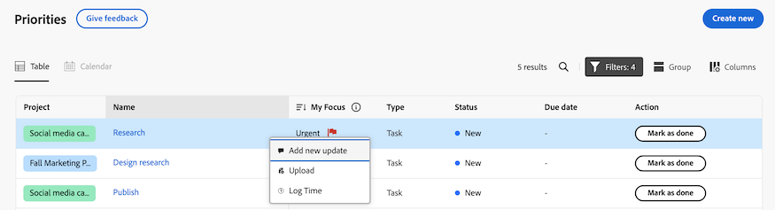
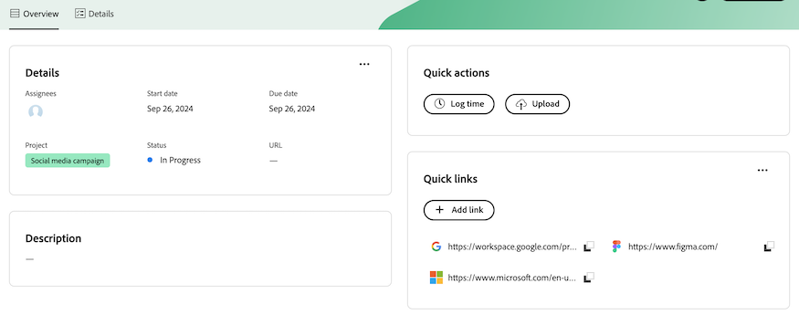

# 開始使用優先順序

優先順序將於2024年10月3日在「預覽」中提供

優先順序是為任務所有者量身打造的簡化且直覺式體驗。 優先順序將分階段推出，從工作清單開始。

優先順序讓您盡情享受

* 管理日常工作並排定優先順序：透過整合式導覽來整理您的日或周，以更清楚明瞭
* 提高生產力：存取專案情境，並透過更少的點按動作更快執行工作
* 個人化功能：受益於專為任務所有者設計的功能

## 尋找並組織您的工作

在「優先順序」中，您可以篩選及分組工作，協助您管理截止日期，並優先處理對您而言重要的工作。 您也可以使用「我的焦點」欄快速識別緊急工作。

### 使用篩選器尋找您的工作

使用篩選器尋找您最重要的工作。 您可以透過以下方式篩選指派給您的任務和問題：

<table>
  <tbody>
   <tr>
   <th>篩選器</th>
   <th>說明</th>
   </tr>
    <tr>
      <td>正在處理</td>
      <td>顯示您目前正在處理的專案</td>
    </tr>
    <tr>
      <td>已就緒可開始</td>
      <td>顯示專案與 
      <ul>
      <li>沒有未完成的前置任務或任務限制</li>
      
和

      <li>計劃開始日期是過去或未來最多兩週</li>
      </ul>
      </td>
    </tr>
    <tr>
      <td>尚未就緒</td>
      <td>顯示具有
       <ul>
      <li>未完成的前置任務或無法處理專案的任務限制</li>
      
或

      <li>超過兩週的計劃開始日期</li>
      </ul>
       </td>
    </tr>
    <tr>
      <td>已請求</td>
      <td>顯示您尚未開始處理的問題</td>
    </tr>
      <td>完成</td>
      <td>顯示過去兩週內完成的工作。 此篩選選項不包含核准。</td>
    </tr>
    <tr>
    <td>專案</td>
    <td>顯示包含您已受指派的任務或問題的專案</td>
    </tr>
    <tr>
    <td>到期日期</td>
    <td>按計畫完成日期顯示工作</td>
    </tr>
    <tr>
    <td>狀態</td>
    <td>顯示新增、進行中和完成狀態的任務或問題</td>
    </tr>
  </tbody>
</table>

### 使用群組組織您的工作

篩選完您的工作後，您可以根據下列條件將專案分組

* 無
* 到期週數
* 狀態
* 專案

<!--For more information, see [Find and organize your work in Priorities]().-->

### 使用「我的焦點」排定重要工作專案的優先順序

「我的焦點」是工作清單中的一欄，可協助您排定工作優先順序。 「我的焦點」值是個人的，不會影響專案、任務或問題資料。 您可以使用下列焦點等級：

* 緊急
* 主要
* 次要
* 一般（預設）

將焦點層級指派給工作專案後，您就可以排序欄，在工作清單頂端顯示緊急專案。

<!--For more information, see [Prioritize important work items with My Focus]().-->

### 使用行事曆檢視[!BADGE 即將推出]{type=Informative}

行事曆檢視將提供任務和問題的視覺化表示。 您將能夠選擇日、周或月檢視。 您也可以使用與工作清單類似的方式篩選專案。

## 處理任務和問題

在「優先順序」中，您可以更新工作專案以保持工作專案詳細資訊最新、記錄時間以準確追蹤您的工作時間、上傳資產而無需導覽至專案，以及新增快速連結以輕鬆存取常用資源。

### 新增和檢視更新

在任務或問題上新增更新，以將您的進度傳達給其他人。

「更新」區段會顯示系統更新，以及使用者在過去90天內所做的最近200項更新。

<!--For more information, see [Add and view updates in Priorities]().-->

### 記錄時間

您可以記錄工作專案的時間，以指出您花在工作專案上的小時數。 您也可以記錄與工作無關的時間，例如假期、病假或會議時間。 您的記錄時間會顯示在您的時程表中。

<!--For more information, see [Log time in Priorities]().-->

### 上傳檔案

將檔案直接上傳到任務或問題的檔案區域，無需導覽到專案。 從「優先順序」上傳檔案時，您可以

* 選取現有資料夾
* 上傳含有更新流註解的檔案
* 新增其他檔案
* 從已連線檔案整合匯入檔案

<!--For more information, see [Upload files in Priorities]().-->

### 檢視檔案[!BADGE 即將推出]{type=Informative}

「檔案」標籤可讓您檢視與工作專案相關的所有檔案。 您可以依名稱、檔案型別或人員篩選檔案，以及依名稱和上傳日期排序。

您也可以開啟檔案或校訂。

### 新增快速連結

您可以將常用的連結內嵌在工作專案的詳細資訊頁面中。 快速連結可讓您快速瀏覽或複製連結。

<!--For more information, see [Add and manage quick links in Priorities]().-->

### 檢閱並核准資產[!BADGE 即將推出]{type=Informative}

檢閱和核准資產的能力在優先順序藍圖上。

目前，我們建議在新首頁中使用等待我核准和所有核准Widget。

如需詳細資訊，請參閱新首頁](/help/quicksilver/workfront-basics/using-home/new-home/add-edit-remove-widgets-in-new-home.md)中的[新增、編輯或移除Widget。

## 使用「趕上我」來檢視您錯過了哪些內容[!BADGE 即將推出]{type=Informative}

使用「補充資料」功能來檢視您錯過了哪些內容。 即時瞭解將在以下時間範圍內概述有關您專案的更新、上傳的檔案、核准和其他重大變更：24小時、3天、7天。

## 考量事項

* 在優先順序中存取任務會跨越標籤。 我們計畫在未來新增其他標籤，例如檔案、子任務、核准等。 使用&#x200B;**提供意見反應**&#x200B;按鈕提交意見反應，讓我們知道您需要這些專案。

