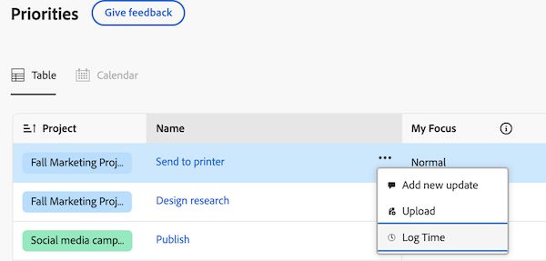

# 在優先順序中記錄時間

您可以在Adobe Workfront中記錄工作專案的時間，以指出您花在工作專案上的小時數。 您的記錄時間會顯示在您的時程表中。

## 存取需求

+++ 展開以檢視本文中功能的存取需求。

您必須具有下列存取權才能執行本文中的步驟，並記錄專案特定時數：

<table style="table-layout:auto"> 
 <col> 
 <col> 
 <tbody> 
  <tr> 
   <td role="rowheader">Adobe Workfront計畫</td> 
   <td> 
任何
 </td> 
  </tr> 
  <tr> 
   <td role="rowheader">Adobe Workfront授權</td> 
   <td> 
新增： 

   
在任務或問題上記錄小時數的輕度或更高

   
目前： 
   
在任務或問題上記錄小時數的工作或更高
 </td> 
  </tr> 
  <tr> 
   <td role="rowheader">存取層級設定</td> 
   <td> 
編輯您記錄時間的工作專案型別的存取權 
 
例如，您需要編輯問題的存取權，以記錄問題的時間
 </td> 
  </tr> 
  <tr> 
   <td role="rowheader">物件許可權</td> 
   <td> 
您記錄時間的工作專案的Contribute或以上許可權包括「記錄時數」許可權
 </td> 
  </tr> 
 </tbody> 
</table>

如需有關此表格的詳細資訊，請參閱Workfront檔案中的[存取需求](/help/quicksilver/administration-and-setup/add-users/access-levels-and-object-permissions/access-level-requirements-in-documentation.md)。

+++

## 在工作清單中記錄時間

您可以直接從工作清單記錄時間：

{{step1-to-priorities}}

1. 將游標暫留在名稱上，然後按一下&#x200B;**記錄時間**。
   
   <!--new screen for prod -->
1. 在&#x200B;**小時型別**&#x200B;下拉式功能表中，選取適當的小時型別。 如定義時數型別和可用性所述，可用時數型別取決於系統、專案和使用者層級中已定義的內容。

1. （視條件而定）如果您的Workfront或群組管理員已啟用手動將工作角色指派至時數專案設定，請從下拉式選單中選取工作角色。 依預設，系統會顯示指派給工作專案時所指定的角色。 如果您在物件上未被指派角色，您的「主要角色」會顯示為預設值。 如果您沒有指派主要角色，則不會顯示任何工作角色。

1. 輸入您要記錄的時間，然後按一下[記錄時間]。****

   

## 在工作專案中記錄時間

您可以在個別工作專案中記錄時間：

{{step1-to-priorities}}

1. 按一下工作專案名稱以開啟「概觀」頁面。
1. 在&#x200B;**快速動作**&#x200B;區段中，按一下&#x200B;**記錄時間**。
1. 在&#x200B;**小時型別**&#x200B;下拉式功能表中，選取適當的小時型別。 如定義時數型別和可用性所述，可用時數型別取決於系統、專案和使用者層級中已定義的內容。
1. （視條件而定）如果您的Workfront或群組管理員已啟用手動將工作角色指派至時數專案設定，請從下拉式選單中選取工作角色。 依預設，系統會顯示指派給工作專案時所指定的角色。 如果您在物件上未被指派角色，您的「主要角色」會顯示為預設值。 如果您沒有指派主要角色，則不會顯示任何工作角色。

1. 輸入您要記錄的時間，然後按一下[記錄時間]。****

   
