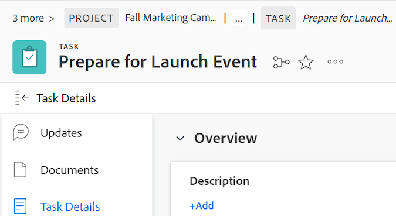

# 階層連結概觀

階層連結會顯示所有物件型別的完整導覽階層。 階層連結路徑中的每個物件都有顯示物件型別的標籤。 您目前所在的頁面會以斜體顯示在頁首和階層連結路徑結尾。 在以下範例中，這是「[!UICONTROL 與品牌團隊共用]」任務。

當階層連結路徑中有太多物件或熒幕寬度禁止顯示完整導覽階層時，路徑會摺疊部分階層連結，並將這些物件群組在階層連結路徑的開頭。 專案和目前物件頁面一律會顯示在階層連結路徑中。

例如，上圖中的「其他3個」表示3個物件未顯示。 這些專案可能位於專案層級的上方，或專案與目前頁面之間。

按一下「[!UICONTROL 更多]」可讓您展開完整的階層。 您可以按一下「[!UICONTROL 更少]」以再次收合階層連結路徑。

您也可以使用下列鍵來導覽階層連結：

<table style="table-layout:auto"> 
 <col> 
 <col> 
 <tbody> 
  <tr> 
   <td role="rowheader"><strong>標籤</strong> </td> 
   <td> 
導覽至階層連結中的每個專案
 </td> 
  </tr> 
  <tr> 
   <td role="rowheader"><strong>輸入</strong> </td> 
   <td> 
展開摺疊的階層連結路徑、摺疊展開的階層連結路徑，並在開啟物件連結時開啟新頁面
 </td> 
  </tr> 
 </tbody> 
</table>

+++存取需求

您必須具有下列存取權才能執行本文中的步驟：

<table style="table-layout:auto"> 
 <col> 
 </col> 
 <col> 
 </col> 
 <tbody> 
  <tr> 
   <td role="rowheader"><strong>[!DNL Adobe Workfront] 計畫*</strong></td> 
   <td> 
任何
 </td> 
  </tr> 
  <tr> 
   <td role="rowheader"><strong>[!DNL Adobe Workfront] 授權*</strong></td> 
   <td> 
[！UICONTROL Request]或更高版本
 </td> 
  </tr> 
 </tbody> 
</table>

*若要瞭解您擁有的計畫或授權型別，請連絡您的[!DNL Workfront]管理員。

+++

<!--drafted: this is no longer possible, since we removed Campaigns, but it might come back as part of Maestro: 

## Multi-object breadcrumbs

>[!NOTE]
>
>The information in this article is available only in the Preview environment when you participate in the [!UICONTROL Campaigns] beta program. The functionality described here might not be fully available yet. For more information about current available features and how to enroll, see [Campaigns beta].

Some objects can belong to multiple parent objects. For example, a project can belong to multiple campaigns. In this case, all the campaigns that the project belongs to display in the breadcrumb.

The multi-object listing in the breadcrumb (for example, the campaigns) displays the number of parent objects which expands into a list to display all the campaigns that the project is associated with. For more information, see [Add objects to a campaign](../../manage-work/campaigns/add-objects-to-a-campaign.md).

-->

## 從階層連結存取父物件

如需[!DNL Workfront]中父物件的相關資訊，請參閱[瞭解 [!DNL Adobe Workfront]](../../workfront-basics/navigate-workfront/workfront-navigation/understand-objects.md)中的物件。

1. （條件式）如果您在收合的階層連結路徑中看不到您要導覽的物件，請按一下&#x200B;**[!UICONTROL 更多]**，然後找出物件。

   >[!NOTE]
   >
   >如果您沒有物件的許可權，就無法在階層連結中看到該物件。

1. 按一下階層連結路徑中的任何物件，即可存取該物件。

   物件頁面隨即開啟。
