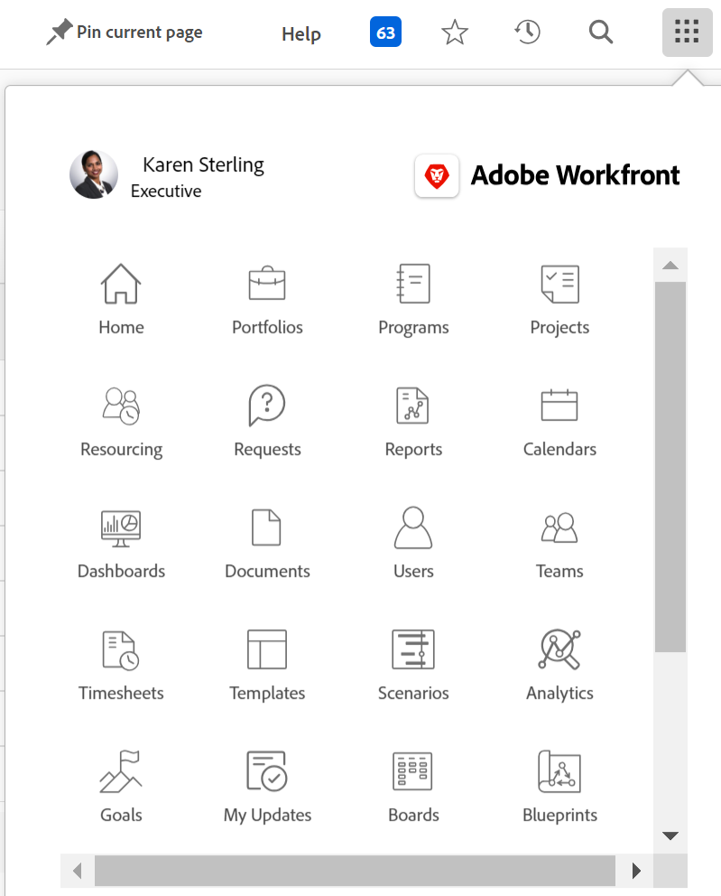

# 頂端導覽列概觀

<!--Audited: 01/2024-->

頂端導覽列（顯示在[!DNL Adobe Workfront]的熒幕頂端）可讓您輕鬆尋找並導覽至平台的其他區域。

## [!UICONTROL 首頁]圖示

**[!UICONTROL 首頁]**&#x200B;圖示會帶您前往[!UICONTROL 首頁]頁面，此頁面為預設登陸頁面。

依預設，「首頁」圖示會開啟「首頁」區域。 如需首頁的詳細資訊，請參閱[使用[!UICONTROL 首頁]區域](../../workfront-basics/using-home/using-the-home-area/use-the-home-area.md)。

您的Workfront管理員可以自訂「首頁」圖示，透過建立版面配置範本並將其指派給您來開啟其他頁面。 如需詳細資訊，請參閱[使用配置範本自訂登入頁面](/help/quicksilver/administration-and-setup/customize-workfront/use-layout-templates/customize-landing-page.md)。

## 釘選頁面

您可以釘選經常造訪的頁面，讓它們顯示在頂端導覽列中。 若要深入瞭解釘選頁面，請參閱[釘選頁面以自訂您的工作區](../../workfront-basics/the-new-workfront-experience/pin-pages.md)。

<!--
## [!UICONTROL Help] menu

The **[!UICONTROL Help]** menu allows you to search for help with a specific task, find more information on using [!DNL Workfront], view content related to the page you are currently on, or submit feedback about your experience.

To learn more about the Help menu, see [Access [!DNL Adobe Workfront] help](../../workfront-basics/navigate-workfront/workfront-navigation/access-workfront-help.md).
-->

## [!UICONTROL 通知]功能表

畫面右上角的藍色編號方塊會開啟通知清單。

您可以從「通知」功能表存取下列專案：

* **通知**：這些是Workfront在滿足某些條件時產生的警示，可讓您知道可能需要注意的資訊。

* **公告**：您的Workfront管理員所傳送的重要主題相關公告。

若要進一步瞭解通知和公告，請參閱[檢視和管理應用程式內通知](../../workfront-basics/using-notifications/view-and-manage-in-app-notifications.md)。

## [!UICONTROL 我的最愛]功能表

**[!UICONTROL 我的最愛]**&#x200B;圖示會開啟系統中您已標示為我的最愛的頁面清單。 您可以從此功能表新增目前所在的頁面。

若要深入瞭解我的最愛，請參閱[檢視和管理我的最愛](../../workfront-basics/navigate-workfront/recent-and-favorites/view-and-manage-favorites.md)。

## [!UICONTROL 最近]個功能表

**[!UICONTROL 最近]**&#x200B;圖示![[!UICONTROL 最近]](assets/recents-icon-40x43.png)會開啟您最近造訪過的頁面清單。

若要深入瞭解最近專案，請參閱[檢視最近專案](../../workfront-basics/navigate-workfront/recent-and-favorites/view-recent-items.md)。

## [!UICONTROL 搜尋]功能表

[!DNL Workfront]右上角的&#x200B;**[!UICONTROL 搜尋]**&#x200B;圖示可讓您執行基本搜尋、將搜尋限制在特定物件，或使用[!UICONTROL 進階搜尋]來搜尋特定物件的關鍵字，並使用篩選器將搜尋限制在特定欄位。

若要進一步瞭解搜尋，請參閱[搜尋 [!DNL Adobe Workfront]](../../workfront-basics/navigate-workfront/search/search-workfront.md)。

## [!UICONTROL 主要選單]

>[!IMPORTANT]
>
>此頁面上說明的主要功能表僅適用於尚未上線到[!DNL Adobe Experience Cloud]的組織。
>
> 如果您的組織已上線到[!DNL Adobe Experience Cloud]，請參閱 [!DNL Workfront][&#128279;](/help/quicksilver/workfront-basics/navigate-workfront/workfront-navigation/adobe-unified-experience.md)的[!DNL Adobe Unified Experience] 。

**[!UICONTROL 主功能表]**&#x200B;圖示會開啟[!UICONTROL 主功能表]，您可以從中導覽至Workfront的其他區域。

[!UICONTROL 主要功能表]中可用的選項相依於：

* **配置範本設定**：若要瞭解[!DNL Workfront]系統管理員如何從配置範本修改[!UICONTROL 主功能表]，請參閱[使用配置範本自訂[!UICONTROL 主功能表]](../../administration-and-setup/customize-workfront/use-layout-templates/customize-main-menu.md)。

* **授權型別**：若要瞭解不同授權型別的預設設定，請參閱[瞭解Review-license使用者的導覽](../../workfront-basics/navigate-workfront/workfront-navigation/reviewer-global-navigation-bar.md)或[瞭解[!UICONTROL Work]-license使用者的導覽](../../workfront-basics/navigate-workfront/workfront-navigation/worker-global-navigation-bar.md)。

每個圖示都會將您帶往Workfront的不同區域。

若要深入瞭解每個區域，請參閱：

<!--

(NOTE: Update screenshot and add icons for new products/features.)

-->

<table style="table-layout:auto"> 
 <col> 
 <col> 
 <tbody> 
  <tr> 
   <td> 
    <ul> 
     <li>[!UICONTROL 首頁]： <a href="../../workfront-basics/using-home/using-the-home-area/use-the-home-area.md" class="MCXref xref">使用[!UICONTROL 首頁]區域</a></li> 
     <li>[!UICONTROL 產品組合]： <a href="../../manage-work/portfolios/portfolio-management-overview.md" class="MCXref xref">Portfolio管理</a></li> 
     <li>[!UICONTROL 程式]： <a href="../../manage-work/portfolios/create-and-manage-programs/create-and-manage-programs.md" class="MCXref xref">建立和管理程式</a></li> 
     <li>[!UICONTROL 專案]： <a href="../../manage-work/projects/projects-overview.md" class="MCXref xref">專案：文章索引</a></li> 
     <li>[!UICONTROL 報告]： <a href="../../reports-and-dashboards/reports/reports-overview.md" class="MCXref xref">報告</a></li> 
     <li>[!UICONTROL 儀表板]： <a href="../../reports-and-dashboards/dashboards/dashboards-overview.md" class="MCXref xref">儀表板</a></li> 
     <li>[!UICONTROL 行事曆]： <a href="../../reports-and-dashboards/reports/calendars/calendars.md" class="MCXref xref">行事曆：文章索引</a></li> 
     <li>[!UICONTROL Resourcing]： <a href="../../resource-mgmt/resource-mgmt-overview/resource-management-overview.md" class="MCXref xref">資源管理</a></li> 
     <li>[!UICONTROL 團隊]： <a href="../../people-teams-and-groups/create-and-manage-teams/create-and-mange-teams.md" class="MCXref xref">建立和管理團隊</a></li> 
     <li>[!UICONTROL 使用者]： <a href="../../administration-and-setup/add-users/create-and-manage-users/create-and-manage-users.md" class="MCXref xref">建立和管理使用者</a></li> 
    </ul> </td> 
   <td> 
    <ul> 
     <li>[!UICONTROL 要求]： <a href="../../manage-work/requests/create-requests/create-requests.md" class="MCXref xref">建立要求</a></li> 
     <li>[!UICONTROL 時程表]： <a href="../../timesheets/timesheets-all.md" class="MCXref xref">時程表：文章索引</a></li> 
     <li>[!UICONTROL 檔案]： <a href="../../documents/documents-overview.md" class="MCXref xref">檔案</a></li> 
     <li>[!UICONTROL 範本]： <a href="../../manage-work/projects/create-and-manage-templates/create-manage-templates.md" class="MCXref xref">建立和管理專案範本：文章索引</a></li> 
     <li>[!UICONTROL 目標]： <a href="../../workfront-goals/goal-management/wf-goals-overview.md" class="MCXref xref">[!DNL Adobe Workfront Goals]總覽</a></li> 
     <li>[!UICONTROL 案例]： <a href="../../scenario-planner/scenario-planner-overview.md" class="MCXref xref">案例規劃工具概觀</a></li> 
     <li>[!UICONTROL Proofing]： <a href="../../workfront-proof/workfront-proof.md" class="MCXref xref">[!DNL Workfront]校訂：文章索引</a></li> 
    </ul> </td> 
  </tr> 
 </tbody> 
</table>

在主功能表下半部，您可以存取下列專案：

<table style="table-layout:auto"> 
 <col> 
 <col> 
 <tbody> 
  <tr> 
   <td> 
[!UICONTROL 設定]
 </td> 
   <td> 
按一下<b>[!UICONTROL 設定]</b>即可前往[!UICONTROL 設定]區域，您可在此設定[!DNL Workfront]帳戶的不同層面。 根據您的存取設定，您可以設定的內容可能會受到限制。
 
如需[!UICONTROL Setup]區域的詳細資訊，請參閱<a href="../../administration-and-setup/administration-and-setup.md" class="MCXref xref">管理與設定：文章索引</a>。
 </td> 
  </tr> 
  <tr> 
   <td> 
[!UICONTROL 說明]
 </td> 
   <td> 
按一下<b>[!UICONTROL 說明]</b>即可前往[!DNL Adobe Experience League]，存取說明文章、尋找訓練、提交客戶支援票證等等。
 
如需有關[!DNL Experience League]或其他取得說明方法的詳細資訊，請參閱<a href="../../workfront-basics/tips-tricks-and-troubleshooting/guide-for-help-in-workfront.md" class="MCXref xref">在Adobe Workfront中尋找說明的快速指南</a>。
 </td> 
  </tr>

<tr> 
   <td> 
[!UICONTROL 登出]
 </td> 
   <td>按一下<b>[!UICONTROL 登出]</b>會將您登出[!DNL Workfront]。</td> 
  </tr> 
 </tbody> 
</table>

