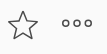
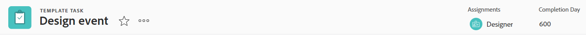
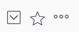
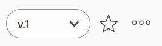

# 物件標題概觀

檢視[!DNL Adobe Workfront]中物件的標頭時，您可以一眼檢視物件的相關資訊。

除了物件名稱之外，標題還可以包含物件的擁有者、狀態或完成百分比。

[!DNL Workfront]指定物件名稱的優先順序，在標題中為其分配儘可能多的空間。 物件名稱太長時會遭到截斷。 若要顯示物件的全名，您可以將滑鼠游標停留在物件上。

## 存取物件的標頭

存取[!DNL Workfront]中物件的標頭與擁有該標頭的所有物件相同。

例如，若要存取專案的標頭：

1. 前往專案。\
   標題會顯示在頁面頂端，並包含專案名稱。

   

<!--## [!UICONTROL Home] header overview 

The following headers are available in Home:

* Task: For more information on how you can use this header, see the [Task header overview](#task-header-overview) in this article.
* Issue: For more information on how you can use this header, see the [Issue header overview](#issue-header-overview) in this article.-->

## 可自訂的標頭

您的[!DNL Workfront]或群組管理員可以使用版面配置範本來自訂專案、任務和問題的標題。

本文會說明所有物件的預設標頭，包括專案及任務和問題。

如需有關自訂物件標頭資訊的資訊，請參閱[使用版面配置範本自訂物件標頭](../../administration-and-setup/customize-workfront/use-layout-templates/customize-object-headers.md)。

## 專案標題概觀

專案標題預設會顯示下列資訊：

<table style="table-layout:auto"> 
 <col> 
 <col> 
 <thead> 
  <tr> 
   <th>頁首資訊</th> 
   <th>附註</th> 
  </tr> 
 </thead> 
 <tbody> 
  <tr> 
   <td role="rowheader">上層物件的階層連結</td> 
   <td>如果專案與方案或產品組合相關聯，則會顯示在標題左上角的階層連結中。 按一下父物件的名稱會開啟該父物件。</td> 
  </tr> 
  <tr data-mc-conditions=""> 
   <td role="rowheader">物件圖示 </td> 
   <td> 
紫色的[!UICONTROL 專案]圖示會顯示在專案名稱的左側。
 </td> 
  </tr> 
  <tr> 
   <td role="rowheader">專案名稱</td> 
   <td>您可以在標題中編輯專案名稱。</td> 
  </tr> 
  <tr> 
   <td role="rowheader">物件型別的名稱</td> 
   <td> 
文字「[!UICONTROL PROJECT]」顯示在標頭中專案名稱上方。
 </td> 
  </tr> 
  <tr> 
   <td role="rowheader">專案的動作區域</td> 
   <td> 
在專案名稱旁邊，會顯示包含<b>共用</b>選項的動作區域。
 
  
  </td> 
  </tr> 
  <tr> 
   <td role="rowheader">[!UICONTROL 完成百分比]</td> 
   <td>您無法在標題中編輯專案完成百分比。</td> 
  </tr> 
  <tr> 
   <td role="rowheader">[!UICONTROL 專案所有者]</td> 
   <td> 
您可以在標頭中編輯[!UICONTROL 專案所有者] 。
 </td> 
  </tr> 
  <tr> 
   <td role="rowheader">[!UICONTROL 計畫完成日期] </td> 
   <td> 
如果專案排程開始於[!UICONTROL 完成日期]，您可以在標題中編輯專案[!UICONTROL 規劃完成日期]和時間。 如果專案排程自[!UICONTROL 開始日期]，此資訊將會從專案中的任務更新。
 </td> 
  </tr> 
  <tr> 
   <td role="rowheader">[!UICONTROL 條件] </td> 
   <td> 
將專案的[!UICONTROL 條件型別]設定為「手動」時，可以更新標頭中的專案[!UICONTROL 條件]。
</td> 
  </tr> 
  <tr> 
   <td role="rowheader">[!UICONTROL 狀態]</td> 
   <td>您可以在標題中編輯專案[!UICONTROL Status]。</td> 
  </tr> 
  <tr> 
   <td role="rowheader">[!UICONTROL 核准]區域</td> 
   <td> 
如果您是核准者之一，請使用下列圖示來管理專案的核准：
 
  </img> [!UICONTROL 核准]
 
  </img> [!UICONTROL 拒絕]
 
  </img> [!UICONTROL 召回]
 
如果您不是核准者，請按一下[!UICONTROL 更多]圖示以檢視目前核准步驟的相關資訊。
 
若要進一步瞭解核准，請參閱<a href="../../review-and-approve-work/manage-approvals/approval-process-in-workfront.md" class="MCXref xref">核准程式總覽</a>。
 </td> 
  </tr> 
 </tbody> 
</table>

## 任務標題概觀

預設情況下，任務標題包含以下資訊：

<table style="table-layout:auto"> 
 <col> 
 <col> 
 <thead> 
  <tr> 
   <th>頁首資訊</th> 
   <th>附註</th> 
  </tr> 
 </thead> 
 <tbody> 
  <tr> 
   <td role="rowheader">上層物件的階層連結</td> 
   <td> 
任務的父物件會顯示在階層連結中。 按一下父物件的名稱會開啟該父物件。
 
如需詳細資訊，請參閱<a href="../../workfront-basics/the-new-workfront-experience/breadcrumb-overview.md" class="MCXref xref">階層連結總覽</a>。
 </td> 
  </tr> 
  <tr data-mc-conditions=""> 
   <td role="rowheader">物件圖示 </td> 
   <td> 
工作名稱左側會顯示綠色的[!UICONTROL 工作]圖示。
 </td> 
  </tr> 
  <tr> 
   <td role="rowheader">任務名稱</td> 
   <td>您可以在標題中編輯任務名稱。</td> 
  </tr> 
  <tr> 
   <td role="rowheader">物件型別的名稱</td> 
   <td> 
文字「[!UICONTROL TASK]」顯示在標題中任務名稱上方。
 </td> 
  </tr> 
  <tr> 
   <td role="rowheader">任務的動作區域</td> 
   <td> 
在工作名稱旁邊，會顯示包含<b>共用</b>選項的動作區域。
 
  
 
如果顯示「相依性」圖示，您可以按一下該圖示來檢視任務的任何前置任務或後續任務。
 </td> 
  </tr> 
  <tr> 
   <td role="rowheader">[!UICONTROL 完成百分比]</td> 
   <td>您可以在標題中編輯任務完成百分比。</td> 
  </tr> 
  <tr> 
   <td role="rowheader">[!UICONTROL 指定任務]</td> 
   <td>您可以從標題編輯任務的受指派人。</td> 
  </tr> 
  <tr> 
   <td role="rowheader"> 
[!UICONTROL Work on It]、[!UICONTROL Done]或[!UICONTROL Start Task]按鈕
 </td> 
   <td> 
如果任務已指派給您，您可以按一下[!UICONTROL 處理該任務] 或[!UICONTROL 開始任務]按鈕，指示您正在處理該任務，或按一下[!UICONTROL 完成]按鈕，指示您已完成該任務。
 
如需有關將[!UICONTROL 處理它]按鈕取代為[!UICONTROL 開始工作]按鈕的資訊，請參閱<a href="../../people-teams-and-groups/create-and-manage-teams/work-on-it-button-to-start-button.md" class="MCXref xref">將[!UICONTROL 處理它]按鈕取代為[!UICONTROL 開始]按鈕</a>。
 </td> 
  </tr> 
  <tr> 
   <td role="rowheader">[!UICONTROL 計畫完成日期]</td> 
   <td> 
您可以在標題中編輯任務[!UICONTROL 規劃完成日期] 和時間。
 
提示：請注意[!UICONTROL 認可日期]在標題中不可見。 您可以在[!UICONTROL 詳細資訊]頁面上檢視它。
 </td> 
  </tr> 
  <tr> 
   <td role="rowheader">[!UICONTROL 狀態]</td> 
   <td>您可以在標題中編輯任務[!UICONTROL Status]。</td> 
  </tr> 
  <tr> 
   <td role="rowheader">[!UICONTROL 核准]區域</td> 
   <td> 
當您是核准者之一時，請使用下列圖示來管理任務的核准：
 
  </img> [!UICONTROL 核准]
 
  </img> [!UICONTROL 拒絕]
 
  </img> [!UICONTROL 召回]
 
如果您不是核准者，請按一下[!UICONTROL 更多]圖示以檢視目前核准步驟的相關資訊。
 
若要進一步瞭解核准，請參閱<a href="../../review-and-approve-work/manage-approvals/approval-process-in-workfront.md" class="MCXref xref">核准程式總覽</a>。
 </td> 
  </tr> 
 </tbody> 
</table>

## 問題標題概觀

依預設，問題標題包含以下資訊：

<table style="table-layout:auto"> 
 <col> 
 <col> 
 <thead> 
  <tr> 
   <th>頁首資訊</th> 
   <th>附註</th> 
  </tr> 
 </thead> 
 <tbody> 
  <tr> 
   <td role="rowheader">上層物件的階層連結</td> 
   <td> 
問題的父物件會顯示在階層連結中。 按一下父物件的名稱會開啟該父物件。
 
如需詳細資訊，請參閱<a href="../../workfront-basics/the-new-workfront-experience/breadcrumb-overview.md" class="MCXref xref">階層連結總覽</a>。
 </td> 
  </tr> 
  <tr> 
   <td role="rowheader">物件圖示 </td> 
   <td> 
問題名稱的左側會顯示粉紅色[!UICONTROL Issue]圖示。
 </td> 
  </tr> 
  <tr> 
   <td role="rowheader">問題名稱</td> 
   <td>您可以在標題中編輯問題名稱。</td> 
  </tr> 
  <tr> 
   <td role="rowheader">物件型別的名稱</td> 
   <td> 
文字「[!UICONTROL ISSUE]」會顯示在標頭中的問題名稱上方。
 </td> 
  </tr> 
  <tr> 
   <td role="rowheader">問題的動作區域</td> 
   <td> 
在問題名稱旁邊，會顯示包含<b>共用</b>選項的動作區域。
 
  
如果顯示[!UICONTROL 相依性]圖示，您可以按一下圖示以檢視問題的任何前置任務或後續任務。
  </td> 
  </tr> 
  <tr> 
   <td role="rowheader">[!UICONTROL 完成百分比]</td> 
   <td> 
您可以從標題編輯問題的完成百分比。
 </td> 
  </tr> 
  <tr> 
   <td role="rowheader">[!UICONTROL 指定任務]</td> 
   <td>您可以從標題編輯問題的受指派人。</td> 
  </tr> 
  <tr> 
   <td role="rowheader">[!UICONTROL 處理它]、[!UICONTROL 完成]、或[!UICONTROL 開始問題]按鈕</td> 
   <td>如果問題指派給您，您可以按一下[!UICONTROL 處理問題] 或[!UICONTROL 開始問題]按鈕來指示您正在處理問題，或按一下[!UICONTROL 完成]按鈕來指示您已完成問題。如需有關將[!UICONTROL 處理它]按鈕取代為[!UICONTROL 開始工作]按鈕的資訊，請參閱 <a href="../../people-teams-and-groups/create-and-manage-teams/work-on-it-button-to-start-button.md" class="MCXref xref">將[!UICONTROL 處理它]按鈕取代為[!UICONTROL 開始]按鈕</a>。</td> 
  </tr> 
  <tr> 
   <td role="rowheader">[!UICONTROL 計畫完成日期]</td> 
   <td> 
您可以在標題中編輯問題[!UICONTROL 規劃完成日期] 和時間。
 
提示：請注意[!UICONTROL 認可日期]在標題中不可見。 您可以在[!UICONTROL 詳細資訊]頁面上檢視它。
 </td> 
  </tr> 
  <tr> 
   <td role="rowheader">[!UICONTROL 狀態]</td> 
   <td>您可以在標題中編輯問題[!UICONTROL Status]。</td> 
  </tr> 
  <tr> 
   <td role="rowheader">[!UICONTROL 核准]區域</td> 
   <td> 
如果您是核准者之一，請使用下列圖示來管理問題的核准：
 
  [!UICONTROL 核准]
 
  [!UICONTROL 拒絕]
 
  [!UICONTROL 召回]
 
如果您不是核准者，請按一下[!UICONTROL 更多]圖示以檢視目前核准步驟的相關資訊。
 
若要進一步瞭解核准，請參閱<a href="../../review-and-approve-work/manage-approvals/approval-process-in-workfront.md" class="MCXref xref">核准程式總覽</a>。
 </td> 
  </tr> 
 </tbody> 
</table>

## 計畫標題總覽

程式標題會顯示下列資訊：

<table style="table-layout:auto"> 
 <col> 
 <col> 
 <thead> 
  <tr> 
   <th>頁首資訊</th> 
   <th>附註</th> 
  </tr> 
 </thead> 
 <tbody> 
  <tr> 
   <td role="rowheader">Portfolio名稱的階層連結</td> 
   <td> 
您可以從[!UICONTROL Program]的標頭存取[!UICONTROL Portfolio]。 按一下父物件的名稱會開啟該父物件。
 
如需詳細資訊，請參閱<a href="../../workfront-basics/the-new-workfront-experience/breadcrumb-overview.md" class="MCXref xref">階層連結總覽</a>。
 </td> 
  </tr> 
  <tr> 
   <td role="rowheader">物件圖示 </td> 
   <td> 
橘色[!UICONTROL 方案]圖示會顯示在方案名稱的左側。
 </td> 
  </tr> 
  <tr> 
   <td role="rowheader">方案名稱</td> 
   <td>您可以在標題中編輯方案名稱。</td> 
  </tr> 
  <tr> 
   <td role="rowheader">物件型別的名稱</td> 
   <td> 
如果程式標示為[!UICONTROL Active]，則文字「[!UICONTROL PROGRAM]」會顯示在標頭中的程式名稱上方。
 </td> 
  </tr> 
  <tr> 
   <td role="rowheader">啟用狀態</td> 
   <td> 
如果程式已停用，標題中程式名稱上方會顯示文字「[!UICONTROL PROGRAM DEACTIVATED]」。
 </td> 
  </tr> 
  <tr> 
   <td role="rowheader">計畫的動作區域</td> 
   <td> 
在程式名稱旁邊，會顯示包含<b>共用</b>選項的動作區域。
 
  </td> 
  </tr> 
  <tr> 
   <td role="rowheader">[!UICONTROL 完成百分比]</td> 
   <td> 
您無法在標題中編輯程式的[!UICONTROL 完成百分比]。 此資訊會從計畫中的專案更新。
 
提示：依預設，計畫的完成百分比是屬於計畫的[!UICONTROL 目前]或[!UICONTROL 已核准狀態]中專案完成百分比值的平均值。
 </td> 
  </tr> 
  <tr> 
   <td role="rowheader">[!UICONTROL 計畫管理員]</td> 
   <td> 
您可以在標題中編輯[!UICONTROL 方案管理員]。 這與[!UICONTROL 計畫所有者]相同。
 </td> 
  </tr> 
  <tr> 
   <td role="rowheader">[!UICONTROL 計畫完成日期]</td> 
   <td>您無法在標題中編輯方案[!UICONTROL 規劃完成日期]。 此資訊會從方案中專案的[!UICONTROL 規劃完成日期]更新。</td> 
  </tr> 
  <tr> 
   <td role="rowheader">[!UICONTROL 作用中專案條件]</td> 
   <td>這是計算在程式中，將[!UICONTROL Condition]設定為[!UICONTROL On Target]、[!UICONTROL At Risk]或[!UICONTROL In Trouble]的活動專案百分比。</td> 
  </tr> 
 </tbody> 
</table>

## Portfolio標題概觀 {#portfolio-header-overview}

投資組合標題包含下列資訊：

<table style="table-layout:auto"> 
 <col> 
 <col> 
 <thead> 
  <tr> 
   <th>頁首資訊</th> 
   <th>附註</th> 
  </tr> 
 </thead> 
 <tbody> 
  <tr> 
   <td role="rowheader">物件圖示 </td> 
   <td> 
投資組合名稱左側會顯示藍色的[!UICONTROL Portfolio]圖示。
 </td> 
  </tr> 
  <tr> 
   <td role="rowheader">投資組合名稱</td> 
   <td>您可以在標題中編輯投資組合名稱。</td> 
  </tr> 
  <tr> 
   <td role="rowheader">物件型別的名稱</td> 
   <td> 
如果投資組合標示為使用中，文字「[!UICONTROL PORTFOLIO]」會在標題中的投資組合名稱上方顯示。
 </td> 
  </tr> 
  <tr> 
   <td role="rowheader">啟用狀態</td> 
   <td> 
如果投資組合停用，文字「[!UICONTROL PORTFOLIO DEACTIVATED]」會在標題中的投資組合名稱上方顯示。
 </td> 
  </tr> 
  <tr> 
   <td role="rowheader">投資組合的動作區域</td> 
   <td> 
投資組合名稱旁會顯示[!UICONTROL actions]區域。
 
  
</td> 
  </tr> 
  <tr> 
   <td role="rowheader">[!UICONTROL Portfolio Manager]</td> 
   <td>您可以在標題中編輯[!UICONTROL Portfolio Manager] 。 這與[!UICONTROL Portfolio Owner]相同。</td> 
  </tr> 
  <tr> 
   <td role="rowheader">[!UICONTROL 開啟時間]</td> 
   <td>這是計算專案組合中專案目前準時的百分比。</td> 
  </tr> 
  <tr> 
   <td role="rowheader">[!UICONTROL 預算]</td> 
   <td>這是計算投資組合中專案目前是否在預算內的百分比。</td> 
  </tr> 
  <tr> 
   <td role="rowheader">[!UICONTROL 已對齊]</td> 
   <td>這是計算專案組合中符合專案組合的專案百分比。</td> 
  </tr> 
  <tr> 
   <td role="rowheader">[!UICONTROL ROI]</td> 
   <td>這是投資組合中所有專案的[!UICONTROL 投資報酬率]計算方式。</td> 
  </tr> 
  <tr> 
   <td role="rowheader">[!UICONTROL 淨值]</td> 
   <td>這是投資組合中所有專案的[!UICONTROL 淨值]計算。</td> 
  </tr> 
 </tbody> 
</table>

## 範本標題概觀 {#template-header-overview}

範本標題會顯示下列資訊：

<table style="table-layout:auto"> 
 <col> 
 <col> 
 <thead> 
  <tr> 
   <th>頁首資訊</th> 
   <th>附註</th> 
  </tr> 
 </thead> 
 <tbody> 
  <tr> 
   <td role="rowheader">物件圖示 </td> 
   <td> 
綠色的[!UICONTROL 範本]圖示會顯示在範本名稱的左側。
 </td> 
  </tr> 
  <tr> 
   <td role="rowheader">範本的名稱</td> 
   <td>您可以在標題中編輯範本名稱。</td> 
  </tr> 
  <tr> 
   <td role="rowheader">物件型別的名稱</td> 
   <td> 
如果範本標示為作用中，則文字「[!UICONTROL TEMPLATE]」會顯示在標題中範本名稱上方。
 </td> 
  </tr> 
  <tr> 
   <td role="rowheader">啟用狀態</td> 
   <td> 
如果範本已停用，標題中範本名稱上方會顯示文字「[!UICONTROL TEMPLATE DEACTIVATED]」。
 </td> 
  </tr> 
  <tr> 
   <td role="rowheader">範本的動作區域</td> 
   <td> 
範本名稱旁會顯示動作區域。
 
  
 </td> 
  </tr> 
  <tr> 
   <td role="rowheader">[!UICONTROL 範本所有者]</td> 
   <td>您可以編輯標頭中的[!UICONTROL 範本所有者]欄位。</td> 
  </tr> 
  <tr> 
   <td role="rowheader">[!UICONTROL 持續時間]</td> 
   <td>範本的持續時間。 您無法在標題中編輯此欄位。</td> 
  </tr> 
 </tbody> 
</table>

## 範本任務標題概觀

範本任務標題會顯示下列資訊：

<table style="table-layout:auto"> 
 <col> 
 <col> 
 <thead> 
  <tr> 
   <th>頁首資訊</th> 
   <th>附註</th> 
  </tr> 
 </thead> 
 <tbody> 
  <tr> 
   <td role="rowheader">上層物件的階層連結</td> 
   <td> 
範本任務的父物件會顯示在階層連結中。 按一下父物件的名稱會開啟該父物件。
 
如需詳細資訊，請參閱<a href="../../workfront-basics/the-new-workfront-experience/breadcrumb-overview.md" class="MCXref xref">階層連結總覽</a>。
 </td> 
  </tr> 
  <tr> 
   <td role="rowheader">物件圖示 </td> 
   <td> 
綠色的[!UICONTROL 工作]圖示會顯示在範本工作名稱的左側。
 </td> 
  </tr> 
  <tr> 
   <td role="rowheader">範本任務的名稱</td> 
   <td>您可以在標題中編輯範本任務名稱。</td> 
  </tr> 
  <tr> 
   <td role="rowheader">物件型別的名稱</td> 
   <td> 
文字「[!UICONTROL TEMPLATE TASK]」顯示在標題中範本任務名稱的上方。
 </td> 
  </tr> 
  <tr> 
   <td role="rowheader">範本任務的動作區域</td> 
   <td> 
範本任務名稱旁會顯示動作區域。
 
  
 </td> 
  </tr> 
  <tr> 
   <td role="rowheader">[!UICONTROL 指定任務]</td> 
   <td>您可以在標題中編輯範本任務的[!UICONTROL 指派]。</td> 
  </tr> 
  <tr> 
   <td role="rowheader">[!UICONTROL 完成日]</td> 
   <td>這是範本期間範本任務應完成的日期。</td> 
  </tr> 
 </tbody> 
</table>

## 記帳記錄表頭概述

帳單記錄表頭會顯示下列資訊：

<table style="table-layout:auto"> 
 <col> 
 <col> 
 <thead> 
  <tr> 
   <th>頁首資訊</th> 
   <th>附註</th> 
  </tr> 
 </thead> 
 <tbody> 
  <tr> 
   <td role="rowheader">上層物件的階層連結</td> 
   <td> 
計費記錄的父物件會顯示在階層連結中。 按一下父物件的名稱會開啟該父物件。
 
如需詳細資訊，請參閱<a href="../../workfront-basics/the-new-workfront-experience/breadcrumb-overview.md" class="MCXref xref">階層連結總覽</a>。
 </td> 
  </tr> 
  <tr> 
   <td role="rowheader">物件圖示 </td> 
   <td> 
計費記錄名稱左側會顯示藍色的[!UICONTROL 計費記錄]圖示。
 </td> 
  </tr> 
  <tr> 
   <td role="rowheader">付費記錄的名稱</td> 
   <td>您可以在標題中編輯計費記錄的名稱。</td> 
  </tr> 
  <tr> 
   <td role="rowheader">物件型別的名稱</td> 
   <td> 
文字「[!UICONTROL BILLING RECORD]」會顯示在標題中計費記錄名稱上方。
 </td> 
  </tr> 
  <tr> 
   <td role="rowheader">計費記錄的「更多」功能表</td> 
   <td> 
在計費記錄名稱旁邊，會顯示[!UICONTROL 更多]功能表，可讓您選取下列選項：
 
    <ul> 
     <li> 
[!UICONTROL 編輯]
 </li> 
     <li> 
 刪除 
 </li> 
    </ul>
    
<b>附註</b>

    
「已記帳」狀態的記帳記錄不會顯示「更多」功能表。 您無法編輯或刪除已記帳記錄。

     </td> 
  </tr> 
  <tr> 
   <td role="rowheader">[!UICONTROL 記帳記錄總計]</td> 
   <td>這是付費記錄的總金額。 您無法編輯此欄位。</td> 
  </tr> 
  <tr> 
   <td role="rowheader">[!UICONTROL 計費日期]</td> 
   <td>這是建立付費記錄的日期，除非在建立付費記錄時已手動變更。 您可以在標題中編輯[!UICONTROL 計費日期]。</td> 
  </tr> 
  <tr> 
   <td role="rowheader">[!UICONTROL 狀態]</td> 
   <td> 
當記帳記錄的狀態為[!UICONTROL Billed]時，您無法再編輯它。
 
您可以在標題中編輯計費記錄的狀態。
 </td> 
  </tr> 
 </tbody> 
</table>

## 使用者標題概觀

使用者標題會顯示下列資訊：

<table style="table-layout:auto"> 
 <col> 
 <col> 
 <thead> 
  <tr> 
   <th>頁首資訊</th> 
   <th>附註</th> 
  </tr> 
 </thead> 
 <tbody> 
  <tr> 
   <td role="rowheader">使用者個人資料圖片</td> 
   <td>您無法更新標題中的設定檔圖片。</td> 
  </tr> 
  <tr> 
   <td role="rowheader">使用者名稱和標題</td> 
   <td> 
 使用者的標題會以其名稱上方的所有大寫字母顯示。 您不能在標題中編輯使用者的名稱。
 </td> 
  </tr> <!--
   <tr> 
    <td role="rowheader">Name of the object type</td> 
    <td> 
The name of the object type does not display.
 </td> 
   </tr>
  --> 
  <tr> 
   <td role="rowheader">啟用狀態</td> 
   <td> 
如果使用者已停用，標題中的所有文字和設定檔圖片都會變暗。
 </td> 
  </tr> 
  <tr> 
   <td role="rowheader">使用者的動作區域</td> 
   <td> 
使用者名稱旁會顯示動作區域。
 
  
</td> 
  </tr> 
  <tr> 
   <td role="rowheader">電子郵件地址</td> 
   <td>您無法編輯標頭中的電子郵件地址。 這通常是使用者名稱。</td> 
  </tr> 
  <tr> 
   <td role="rowheader">電話號碼</td> 
   <td>您無法編輯標題中的電話號碼。</td> 
  </tr> 
  <tr> 
   <td role="rowheader">團隊</td> 
   <td> 
您可以檢視使用者所屬的團隊。 將滑鼠移到團隊頭像上以顯示團隊名稱。 您無法編輯標題中的團隊。
 </td> 
  </tr> 
 </tbody> 
</table>

## 團隊標題概觀

專案團隊標題會顯示下列資訊：

<table style="table-layout:auto"> 
 <col> 
 <col> 
 <thead> 
  <tr> 
   <th>頁首資訊</th> 
   <th>附註</th> 
  </tr> 
 </thead> 
 <tbody> 
  <tr> 
   <td role="rowheader">物件圖示 </td> 
   <td> 
紫色的[!UICONTROL 團隊]圖示會顯示在團隊名稱的左側。
 </td> 
  </tr> 
  <tr> 
   <td role="rowheader">團隊名稱</td> 
   <td>您可以在標題中編輯專案團隊名稱。</td> 
  </tr> 
  <tr> 
   <td role="rowheader">物件型別的名稱</td> 
   <td> 
文字「[!UICONTROL TEAM]」顯示在標題中團隊名稱上方。
 </td> 
  </tr> 
  <tr> 
   <td role="rowheader">專案團隊的動作區域</td> 
   <td> 
專案團隊名稱旁會顯示動作區域。
 
  
</td> 
  </tr> 
  <tr> 
   <td role="rowheader">團隊成員設定檔圖片</td> 
   <td>團隊成員的設定檔圖片。 將滑鼠移至圖片上以顯示使用者的名稱。</td> 
  </tr> 
  <tr> 
   <td role="rowheader">說明</td> 
   <td>這是團隊成員的簡短說明。 您無法在標題中編輯專案團隊的說明。</td> 
  </tr> 
 </tbody> 
</table>

## 反複專案標題概觀

版序標題會顯示下列資訊：

<table style="table-layout:auto"> 
 <col> 
 <col> 
 <thead> 
  <tr> 
   <th>頁首資訊</th> 
   <th>附註</th> 
  </tr> 
 </thead> 
 <tbody> 
  <tr> 
   <td role="rowheader">物件圖示 </td> 
   <td> 
橘色[!UICONTROL 反複專案]圖示會顯示在反複專案名稱的左側。
 </td> 
  </tr> 
  <tr> 
   <td role="rowheader">反複專案的名稱</td> 
   <td>您可以在標題中編輯反複專案名稱。</td> 
  </tr> 
  <tr> 
   <td role="rowheader">物件型別的名稱</td> 
   <td> 
文字「[!UICONTROL ITERATION]」會顯示在標題中反複專案名稱上方。
 </td> 
  </tr> 
  <tr> 
   <td role="rowheader">反複專案的動作區域</td> 
   <td> 
在版序名稱旁邊，會顯示動作區域。
 
 
  <tr> 
   <td role="rowheader">所有者</td> 
   <td>這是反複專案的[!UICONTROL 擁有者]。 您無法編輯標頭中的[!UICONTROL Owner]。</td> 
  </tr> 
  <tr> 
   <td role="rowheader">[!UICONTROL 時間表]</td> 
   <td>[!UICONTROL 時間表]會顯示反複專案的開始和結束日期。 您無法在標題中編輯[!UICONTROL 時間表]。</td> 
  </tr> 
  <tr> 
   <td role="rowheader">[!UICONTROL 團隊]</td> 
   <td>您無法在標題中編輯反複專案的專案團隊。 按一下專案團隊名稱即可前往專案團隊頁面。</td> 
  </tr> 
 </tbody> 
</table>

## 群組標題概觀

群組標題會顯示下列資訊：

<table style="table-layout:auto"> 
 <col> 
 <col> 
 <thead> 
  <tr> 
   <th>頁首資訊</th> 
   <th>附註</th> 
  </tr> 
 </thead> 
 <tbody> 
  <tr> 
   <td role="rowheader">物件圖示 </td> 
   <td> 
橘色[!UICONTROL Group]圖示會顯示在群組名稱的左側。
 </td> 
  </tr> 
  <tr> 
   <td role="rowheader">群組名稱</td> 
   <td>您可以在標題中編輯群組名稱。</td> 
  </tr> 
  <tr> 
   <td role="rowheader">物件型別的名稱</td> 
   <td> 
文字「[!UICONTROL GROUP]」顯示在標頭中群組名稱上方。
 </td> 
  </tr> 
  <tr> 
   <td role="rowheader">群組的[!UICONTROL actions]區域</td> 
   <td> 
在群組名稱旁邊，會顯示[!UICONTROL More]功能表，可讓您選取下列選項：
 
    <ul> 
     <li> 
[!UICONTROL 編輯]
 </li> 
     <li> 
[!UICONTROL 副本]
 </li> 
     <li> 
[!UICONTROL Delete]
 </li> 
    </ul> </td> 
  </tr> 
  <tr> 
   <td role="rowheader">[!UICONTROL 業務領導者]</td> 
   <td>您可以在標頭中編輯[!UICONTROL Business Leader]。</td> 
  </tr> 
  <tr> 
   <td role="rowheader">[!UICONTROL 授權使用中] </td> 
   <td> 
[!UICONTROL 使用中授權]方塊顯示群組及其子群組中[!UICONTROL 計畫]和[!UICONTROL 工作]授權使用者的數目。 您可以按一下編號來檢視所有5種授權型別的資訊。
 
如需詳細資訊，請參閱<a href="../../administration-and-setup/manage-groups/create-and-manage-groups/view-number-licenses-allocated-used-group.md" class="MCXref xref">檢視新[!DNL Adobe Workfront]體驗</a>中群組所配置及使用的授權數目。
 </td> 
  </tr> 
  <tr> 
   <td role="rowheader">[!UICONTROL 群組管理員]</td> 
   <td>您可以在標題中編輯群組管理員。</td> 
  </tr> 
 </tbody> 
</table>

## 檔案標題概觀

檔案標題會顯示下列資訊：

<table style="table-layout:auto"> 
 <col> 
 <col> 
 <thead> 
  <tr> 
   <th>頁首資訊</th> 
   <th>附註</th> 
  </tr> 
 </thead> 
 <tbody> 
  <tr> 
   <td role="rowheader">上層物件的階層連結</td> 
   <td> 
檔案的父物件會顯示在階層連結中。 按一下父物件的名稱會開啟該父物件。
 
如需詳細資訊，請參閱<a href="../../workfront-basics/the-new-workfront-experience/breadcrumb-overview.md" class="MCXref xref">階層連結總覽</a>。
 </td> 
  </tr> 
  <tr> 
   <td role="rowheader">物件圖示 </td> 
   <td> 
藍色的[!UICONTROL Document]圖示會顯示在檔名稱的左側。
 </td> 
  </tr> 
  <tr> 
   <td role="rowheader">檔名稱</td> 
   <td>您可以在標題中編輯檔名稱。</td> 
  </tr> 
  <tr> 
   <td role="rowheader">物件型別的名稱</td> 
   <td> 
文字「[!UICONTROL DOCUMENT]」顯示在標題中檔名稱上方。
 </td> 
  </tr> 
  <tr> 
   <td role="rowheader">檔案的動作區域</td> 
   <td> 
檔名稱旁會顯示動作區域。
 
  
</td> 
  </tr> 
  <tr> 
   <td role="rowheader">核准[!UICONTROL 決定]區域</td> 
   <td> [!UICONTROL 決策]區域會顯示在檔案標題的右上角。此區域會根據核准階段以及您是核准者、稽核者或兩者皆不而有所不同。 <ul><li> 
如果您是核准者，則可以使用下列圖示來管理檔案的核准：
 
  [!UICONTROL 核准]
 
  [!UICONTROL 召回]
 
  [!UICONTROL 拒絕]
 
如需核准決定的詳細資訊，請參閱<a href="../../review-and-approve-work/manage-approvals/approving-work.md" class="MCXref xref">核准工作</a>。</li><li>
如果您是檢閱者，可以按一下「完成我的檢閱」按鈕，表示您已檢閱檔案。

如需有關檢閱檔案的詳細資訊，請參閱<a href="../../review-and-approve-work/document-reviews-and-approvals/review-and-approve-documents/review-a-document.md" class="MCXref xref">檢閱檔案</a>。
</li><li>否則，此區域會顯示檔案的目前檢閱和核准狀態。</li><ul>
 </td> 
  </tr> 
 </tbody> 
</table>

## 公司標題概觀 {#company-header-overview}

公司標題會顯示下列資訊：

<table style="table-layout:auto"> 
 <col> 
 <col> 
 <thead> 
  <tr> 
   <th>頁首資訊</th> 
   <th>附註</th> 
  </tr> 
 </thead> 
 <tbody> 
  <tr> 
   <td role="rowheader">物件圖示 </td> 
   <td> 
藍色的[!UICONTROL 公司]圖示會顯示在公司名稱的左側。
 </td> 
  </tr> 
  <tr> 
   <td role="rowheader">公司名稱</td> 
   <td>您可以在標題中編輯公司名稱。</td> 
  </tr> 
  <tr> 
   <td role="rowheader">物件型別的名稱</td> 
   <td> 
文字「[!UICONTROL COMPANY]」會顯示在標頭中的公司名稱上方。
 </td> 
  </tr> 
  <tr> 
   <td role="rowheader">公司的「更多」功能表</td> 
   <td> 
在公司名稱旁邊，會顯示[!UICONTROL More]功能表，可讓您選取下列選項：
 
    <ul> 
     <li> 
[!UICONTROL 編輯]
 </li> 
     <li> 
[!UICONTROL 刪除公司]
 </li> 
    </ul> </td> 
  </tr> 
 </tbody> 
</table>

## 計畫表頭概觀

計畫是[!DNL Workfront Scenario Planner]的物件。 如需[!DNL Scenario Planner]的相關資訊，請參閱[ [!DNL Scenario Planner] 概觀](../../scenario-planner/scenario-planner-overview.md)。

計畫表頭會顯示下列資訊：

<table style="table-layout:auto"> 
 <col> 
 <col> 
 <thead> 
  <tr> 
   <th>頁首資訊</th> 
   <th>附註</th> 
  </tr> 
 </thead> 
 <tbody> 
  <tr> 
   <td role="rowheader">返回計劃</td> 
   <td>按一下此連結即可前往[!UICONTROL Plans]清單。</td> 
  </tr> 
  <tr> 
   <td role="rowheader">物件圖示 </td> 
   <td> 
藍色[!UICONTROL 計畫]圖示會顯示在計畫名稱的左側。
 </td> 
  </tr> 
  <tr> 
   <td role="rowheader">計畫名稱</td> 
   <td>您可以在標題中編輯計畫名稱。</td> 
  </tr> 
  <tr> 
   <td role="rowheader">物件型別的名稱</td> 
   <td> 
文字「[!UICONTROL PLAN]」會顯示在標頭中的計畫名稱上方。
 </td> 
  </tr> 
  <tr> 
   <td role="rowheader">計畫的動作區域</td> 
   <td> 
計畫名稱旁會顯示動作區域。
 
  
</td> 
  </tr> 
  <tr> 
   <td role="rowheader">其他計畫動作</td> 
   <td> 
在計畫名稱和動作區域下方，您可以完成下列動作：
 
    <ul> 
     <li> 
<strong>[!UICONTROL 顯示衝突]</strong>：按一下此切換可顯示或隱藏方案中的衝突。
 </li> 
     <li> 
<strong>[!UICONTROL 比較案例]</strong>：按一下此連結可顯示您已建立之案例的並排比較。
 </li> 
     <li> 
<strong>[!UICONTROL 案例選擇]</strong>：在此下拉式功能表中，您可以複製案例或選取以檢視不同的案例。
 </li> 
    </ul> </td> 
  </tr> 
  <tr> 
   <td role="rowheader">職務角色資訊</td> 
   <td>在[!UICONTROL 工作角色]方塊中，您可以檢視計畫可用的工作角色數量，以及所需的職位角色數量。 按一下方塊可讓您調整可用的職務角色。</td> 
  </tr> 
  <tr> 
   <td role="rowheader">[!UICONTROL Financial]資訊</td> 
   <td>在[!UICONTROL Financial]方塊中，您可以檢視計畫的預算、成本及使用率百分比。 按一下方塊可讓您調整預算金額，並決定人員成本是否納入計畫中。</td> 
  </tr> 
  <tr> 
   <td role="rowheader">[!UICONTROL 淨值]</td> 
   <td>在[!UICONTROL 淨值]方塊中，您可以根據您為計畫輸入的預算和成本檢視計畫的淨值。</td> 
  </tr> 
  <tr> 
   <td role="rowheader">[!UICONTROL 共用對象]資訊</td> 
   <td>有權檢視或管理計畫的使用者會顯示在標題的右上角。 將滑鼠游標停留在設定檔圖片上，會顯示其名稱。</td> 
  </tr> 
  <tr> 
   <td role="rowheader">[!UICONTROL 前往發佈]</td> 
   <td>當您按一下[!UICONTROL 前往發佈]時，可以在您檢視的情境中建立或更新連結至方案的專案。</td> 
  </tr> 
 </tbody> 
</table>

## 目標標題概觀

當您的公司有權存取Workfront目標時，您可以建立策略目標。 如需[!DNL Workfront Goals]的詳細資訊，請參閱[開始使用 [!DNL Adobe Workfront Goals]](../../workfront-goals/goal-management/getting-started-with-wf-goals.md)。

目標標題會顯示下列資訊：

<table style="table-layout:auto"> 
 <col> 
 <col> 
 <thead> 
  <tr> 
   <th>頁首資訊</th> 
   <th>附註</th> 
  </tr> 
 </thead> 
 <tbody> 
  <tr> 
   <td role="rowheader">物件圖示 </td> 
   <td> 
紫色[!UICONTROL 目標]圖示會顯示在目標名稱的左側。
 </td> 
  </tr> 
  <tr> 
   <td role="rowheader">目標的名稱</td> 
   <td>您可以在標題中編輯目標名稱。</td> 
  </tr> 
  <tr> 
   <td role="rowheader">物件型別的名稱</td> 
   <td> 
文字「[!UICONTROL GOAL]」會顯示在標頭中的目標名稱上方。
 </td> 
  </tr> 
  <tr> 
   <td role="rowheader">目標的更多選單</td> 
   <td> 
在目標名稱旁邊，顯示更多功能表。
 

   您可以從目標的「更多」功能表執行下列動作：
   <ul><li>[!UICONTROL 編輯]</li>
   <li>[!UICONTROL 複製目標]</li>
   <li>[!UICONTROL 刪除目標]</li>
   <li>[!UICONTROL Share]</li>
   <li>[!UICONTROL 啟動]或[!UICONTROL 停用]</li>
   <li>[!UICONTROL Close]或[!UICONTROL Reopen]</li>
   </td> 
  </tr> 
  <tr> 
   <td role="rowheader">[!UICONTROL 進度]</td> 
   <td>進度目標的百分比，表示已完成目標的程度。 您無法更新目標進度。 Workfront會根據目標上每個進度指示器的進度來計算進度。</td> 
  </tr> 
  <tr> 
   <td role="rowheader">[!UICONTROL 擁有者]</td> 
   <td>這是目標的擁有者。 您可以手動更新目標所有者。 使用者、團隊、群組或您的組織可以是目標擁有者。</td> 
  </tr> 
  <tr> 
   <td role="rowheader">[!UICONTROL 句點]</td> 
   <td>必須完成目標的時間範圍。 </td> 
  </tr> 
  <tr> 
   <td role="rowheader">[!UICONTROL 條件]</td> 
   <td>目標條件會指出目標是否準時完成目標，或落後 </td> 
  </tr> 
  <tr> 
   <td role="rowheader">[!UICONTROL 狀態]</td> 
   <td>指出目標為作用中、新或已關閉。 您無法手動更新目標狀態。 如需詳細資訊，請參閱[!DNL Adobe Workfront Goals]</a>中的<a href="../../workfront-goals/goal-management/goal-status-overview.md" class="MCXref xref">目標狀態總覽</td> 
  </tr> 
 </tbody> 
</table>
