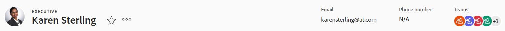

# 物件標題概觀

您可以在 [!DNL Adobe Workfront] 查看其標題時。

除了對象的名稱之外，標題還可以包括對象的所有者、狀態或完成百分比。

[!DNL Workfront] 會優先處理物件的名稱，並在標題中為物件分配盡可能多的空間。 當對象名稱太長時，它會被截斷。 若要顯示物件的完整名稱，您可以將滑鼠暫留在物件上。

## 訪問對象的標題

在中存取物件的標題 [!DNL Workfront] 對於所有具有它的對象都是相同的。

例如，若要存取專案的標題：

1. 前往專案。\
   標題會顯示在頁面頂端，並包含專案的名稱。

   

## [!UICONTROL 首頁] 標題概觀

首頁提供下列標題：

* 任務：如需如何使用此標題的詳細資訊，請參閱 [任務標題概述](#task-header-overview) 這篇文章。
* 問題：如需如何使用此標題的詳細資訊，請參閱 [問題標題概觀](#issue-header-overview) 這篇文章。

## 可自訂標題

您的 [!DNL Workfront]  或者，群組管理員可使用配置範本來自訂專案、工作和問題的標題。

本文說明所有對象的預設標題，包括項目和任務及問題。

如需自訂物件標題資訊的詳細資訊，請參閱 [使用版面範本自訂物件標題](../../administration-and-setup/customize-workfront/use-layout-templates/customize-object-headers.md).

## 專案標題概觀

依預設，專案標題會顯示下列資訊：

<table style="table-layout:auto"> 
 <col> 
 <col> 
 <thead> 
  <tr> 
   <th>標題資訊</th> 
   <th>附註</th> 
  </tr> 
 </thead> 
 <tbody> 
  <tr> 
   <td role="rowheader">含有上層物件的階層連結</td> 
   <td>如果專案與方案或產品組合相關聯，則會顯示在標題左上角的階層連結中。 按一下父對象的名稱將開啟該父對象。</td> 
  </tr> 
  <tr data-mc-conditions=""> 
   <td role="rowheader">對象表徵圖 </td> 
   <td> 
紫色的[!UICONTROL項目]表徵圖  顯示在專案名稱的左側。
 </td> 
  </tr> 
  <tr> 
   <td role="rowheader">專案名稱</td> 
   <td>您可以編輯標題中的專案名稱。</td> 
  </tr> 
  <tr> 
   <td role="rowheader">對象類型的名稱</td> 
   <td> 
文字「[!UICONTROL PROJECT]」會顯示在標題的專案名稱上方。
 </td> 
  </tr> 
  <tr> 
   <td role="rowheader">任務的操作區域</td> 
   <td> 
專案名稱旁會顯示動作區域。
 
  
  </td> 
  </tr> 
  <tr> 
   <td role="rowheader">[!UICONTROL百分比完成]</td> 
   <td>您無法編輯標題中的專案完成百分比。</td> 
  </tr> 
  <tr> 
   <td role="rowheader">[!UICONTROL項目所有者]</td> 
   <td> 
您可以在標題中編輯[!UICONTROL專案擁有者]。
 </td> 
  </tr> 
  <tr> 
   <td role="rowheader">[!UICONTROL計畫完成日期] </td> 
   <td> 
如果項目計畫為[!UICONTROL完成日期]，則可以編輯題頭中的項目[!UICONTROL計畫完成日期]和時間。 如果從[!UICONTROL開始日期]計畫項目，則此資訊將從項目中的任務更新。
 </td> 
  </tr> 
  <tr> 
   <td role="rowheader">[!UICONTROL條件] </td> 
   <td> 
將項目的[!UICONTROL條件類型]設定為「手動」時，可以在標題中更新項目[!UICONTROL條件]。
</td> 
  </tr> 
  <tr> 
   <td role="rowheader">[!UICONTROL狀態]</td> 
   <td>您可以在標題中編輯專案[!UICONTROL狀態]。</td> 
  </tr> 
  <tr> 
   <td role="rowheader">[!UICONTROL Approvals]區域</td> 
   <td> 
當您是批准者之一時，請使用以下表徵圖來管理項目的批准：
 
  </img> [!UICONTROL批准]
 
  </img> [!UICONTROL拒絕]
 
  </img> [!UICONTROL召回]
 
如果您不是核准者，請按一下[!UICONTROL更多]圖示  查看有關當前批准步驟的資訊。
 
若要進一步了解核准，請參閱 <a href="../../review-and-approve-work/manage-approvals/approval-process-in-workfront.md" class="MCXref xref">核准流程概述</a>.
 </td> 
  </tr> 
 </tbody> 
</table>

## 任務標題概述

預設情況下，任務標題包含以下資訊：

<table style="table-layout:auto"> 
 <col> 
 <col> 
 <thead> 
  <tr> 
   <th>標題資訊</th> 
   <th>附註</th> 
  </tr> 
 </thead> 
 <tbody> 
  <tr> 
   <td role="rowheader">含有上層物件的階層連結</td> 
   <td> 
任務的父對象顯示在階層連結中。 按一下父對象的名稱將開啟該父對象。
 
如需詳細資訊，請參閱 <a href="../../workfront-basics/the-new-workfront-experience/breadcrumb-overview.md" class="MCXref xref">階層連結概觀</a>.
 </td> 
  </tr> 
  <tr data-mc-conditions=""> 
   <td role="rowheader">對象表徵圖 </td> 
   <td> 
綠色的[!UICONTROL任務]表徵圖  顯示在任務名稱的左側。
 </td> 
  </tr> 
  <tr> 
   <td role="rowheader">任務名稱</td> 
   <td>您可以在標題中編輯任務名稱。</td> 
  </tr> 
  <tr> 
   <td role="rowheader">對象類型的名稱</td> 
   <td> 
文本「[!UICONTROL TASK]」顯示在標題的任務名稱上方。
 </td> 
  </tr> 
  <tr> 
   <td role="rowheader">任務的操作區域</td> 
   <td> 
在任務名稱旁邊，將顯示[!UICONTROL操作]區域。
 
  
 
如果顯示「相依性」表徵圖，則可以按一下表徵圖以查看任務的任何前置任務或後繼任務。
 </td> 
  </tr> 
  <tr> 
   <td role="rowheader">[!UICONTROL百分比完成]</td> 
   <td>您可以在標題中編輯任務完成百分比。</td> 
  </tr> 
  <tr> 
   <td role="rowheader">[!UICONTROL分配]</td> 
   <td>您可以從題頭編輯任務的受分配者。</td> 
  </tr> 
  <tr> 
   <td role="rowheader"> 
[!UICONTROL Work on It]、[!UICONTROL Done]或[!UICONTROL Start Task]按鈕
 </td> 
   <td> 
如果已將任務分配給您，則可以按一下[!UICONTROL Work on It] 或[!UICONTROL開始任務] 按鈕，指示您現在正在處理任務，或者使用[!UICONTROL完成]按鈕指示您已完成任務。
 
有關將[!UICONTROL Work On It]按鈕替換為[!UICONTROL Start Task]按鈕的資訊，請參見 <a href="../../people-teams-and-groups/create-and-manage-teams/work-on-it-button-to-start-button.md" class="MCXref xref">用[!UICONTROL開始]按鈕替換[!UICONTROL Work On It]按鈕</a>.
 </td> 
  </tr> 
  <tr> 
   <td role="rowheader">[!UICONTROL計畫完成日期]</td> 
   <td> 
您可以編輯任務[!UICONTROL計畫完成日期] 時間 在標題中。
 
提示：請注意，標題中不會顯示[!UICONTROL提交日期]。 您可以在[!UICONTROL詳細資訊]頁面上查看它。
 </td> 
  </tr> 
  <tr> 
   <td role="rowheader">[!UICONTROL狀態]</td> 
   <td>您可以編輯標題中的任務[!UICONTROL狀態]。</td> 
  </tr> 
  <tr> 
   <td role="rowheader">[!UICONTROL Approvals]區域</td> 
   <td> 
當您是批准者之一時，請使用以下表徵圖來管理任務的批准：
 
  </img> [!UICONTROL批准]
 
  </img> [!UICONTROL拒絕]
 
  </img> [!UICONTROL召回]
 
如果您不是核准者，請按一下[!UICONTROL更多]圖示  查看有關當前批准步驟的資訊。
 
若要進一步了解核准，請參閱 <a href="../../review-and-approve-work/manage-approvals/approval-process-in-workfront.md" class="MCXref xref">核准流程概述</a>.
 </td> 
  </tr> 
 </tbody> 
</table>

## 問題標題概觀

問題標題預設包含下列資訊：

<table style="table-layout:auto"> 
 <col> 
 <col> 
 <thead> 
  <tr> 
   <th>標題資訊</th> 
   <th>附註</th> 
  </tr> 
 </thead> 
 <tbody> 
  <tr> 
   <td role="rowheader">含有上層物件的階層連結</td> 
   <td> 
問題的上層物件會顯示在階層連結中。 按一下父對象的名稱將開啟該父對象。
 
如需詳細資訊，請參閱 <a href="../../workfront-basics/the-new-workfront-experience/breadcrumb-overview.md" class="MCXref xref">階層連結概觀</a>.
 </td> 
  </tr> 
  <tr> 
   <td role="rowheader">對象表徵圖 </td> 
   <td> 
粉紅色的[!UICONTROL問題]表徵圖  顯示在問題名稱的左側。
 </td> 
  </tr> 
  <tr> 
   <td role="rowheader">問題名稱</td> 
   <td>您可以編輯標題中的期刊名稱。</td> 
  </tr> 
  <tr> 
   <td role="rowheader">對象類型的名稱</td> 
   <td> 
文字「[!UICONTROL ISSUE]」會顯示在標題的問題名稱上方。
 </td> 
  </tr> 
  <tr> 
   <td role="rowheader">問題的動作區域</td> 
   <td> 
問題名稱旁會顯示[!UICONTROL動作]區域。
 
  
 
如果顯示[!UICONTROL相依性]表徵圖，則可以按一下表徵圖以查看問題的任何前置任務或後繼任務。
  </td> 
  </tr> 
  <tr> 
   <td role="rowheader">[!UICONTROL百分比完成]</td> 
   <td> 
您可以從標題編輯期刊的完成百分比。
 </td> 
  </tr> 
  <tr> 
   <td role="rowheader">[!UICONTROL分配]</td> 
   <td>您可以從標題編輯期刊的受分派者。</td> 
  </tr> 
  <tr> 
   <td role="rowheader">[!UICONTROL Work on It], [!UICONTROL Done], 或[!UICONTROL開始問題]按鈕</td> 
   <td>如果問題已指派給您，您可以按一下[!UICONTROL Work on It] 或[!UICONTROL開始問題] 按鈕，指示您正在處理問題，或使用[!UICONTROL完成]按鈕指示您已完成問題。有關將[!UICONTROL Work On It]按鈕替換為[!UICONTROL Start Task]按鈕的資訊，請參見 <a href="../../people-teams-and-groups/create-and-manage-teams/work-on-it-button-to-start-button.md" class="MCXref xref">用[!UICONTROL開始]按鈕替換[!UICONTROL Work On It]按鈕</a>.</td> 
  </tr> 
  <tr> 
   <td role="rowheader">[!UICONTROL計畫完成日期]</td> 
   <td> 
您可以編輯問題[!UICONTROL計畫完成日期] 時間 在標題中。
 
提示：請注意，標題中不會顯示[!UICONTROL提交日期]。 您可以在[!UICONTROL詳細資訊]頁面上查看它。
 </td> 
  </tr> 
  <tr> 
   <td role="rowheader">[!UICONTROL狀態]</td> 
   <td>您可以在標題中編輯問題[!UICONTROL狀態]。</td> 
  </tr> 
  <tr> 
   <td role="rowheader">[!UICONTROL Approvals]區域</td> 
   <td> 
當您是批准者之一時，請使用以下表徵圖來管理問題的批准：
 
  [!UICONTROL批准]
 
  [!UICONTROL拒絕]
 
  [!UICONTROL召回]
 
如果您不是核准者，請按一下[!UICONTROL更多]圖示  查看有關當前批准步驟的資訊。
 
若要進一步了解核准，請參閱 <a href="../../review-and-approve-work/manage-approvals/approval-process-in-workfront.md" class="MCXref xref">核准流程概述</a>.
 </td> 
  </tr> 
 </tbody> 
</table>

## 方案標題概述

方案標題顯示以下資訊：

<table style="table-layout:auto"> 
 <col> 
 <col> 
 <thead> 
  <tr> 
   <th>標題資訊</th> 
   <th>附註</th> 
  </tr> 
 </thead> 
 <tbody> 
  <tr> 
   <td role="rowheader">以Portfolio名稱的階層連結</td> 
   <td> 
您可以從[!UICONTROL程式]的標題訪問[!UICONTROLPortfolio]。 按一下父對象的名稱將開啟該父對象。
 
如需詳細資訊，請參閱 <a href="../../workfront-basics/the-new-workfront-experience/breadcrumb-overview.md" class="MCXref xref">階層連結概觀</a>.
 </td> 
  </tr> 
  <tr> 
   <td role="rowheader">對象表徵圖 </td> 
   <td> 
橘色[!UICONTROL程式]圖示  顯示在方案名稱的左側。
 </td> 
  </tr> 
  <tr> 
   <td role="rowheader">方案名稱</td> 
   <td>您可以編輯標題中的方案名稱。</td> 
  </tr> 
  <tr> 
   <td role="rowheader">對象類型的名稱</td> 
   <td> 
如果程式被標籤為[!UICONTROL Active]，則標題中的程式名稱上方會顯示文本「[!UICONTROL PROGRAM]」。
 </td> 
  </tr> 
  <tr> 
   <td role="rowheader">啟動狀態</td> 
   <td> 
如果程式已停用，則標題中的程式名稱上方會顯示文本「[!UICONTROL PROGRAM DEACTIVE]」。
 </td> 
  </tr> 
  <tr> 
   <td role="rowheader">方案的行動領域</td> 
   <td> 
在程式名稱旁邊，將顯示[!UICONTROL操作]區域。
 
  
 </td> 
  </tr> 
  <tr> 
   <td role="rowheader">[!UICONTROL百分比完成]</td> 
   <td> 
您無法編輯標題中方案的[!UICONTROL完成百分比]。 此資訊會從方案中的專案更新。
 
提示：預設情況下，方案的完成百分比是屬於方案的[!UICONTROL當前]或[!UICONTROL已批准狀態]中項目的完成百分比值的平均值。
 </td> 
  </tr> 
  <tr> 
   <td role="rowheader">[!UICONTROL程式管理器]</td> 
   <td> 
您可以在標題中編輯[!UICONTROL程式管理器]。 這與[!UICONTROL程式所有者]相同。
 </td> 
  </tr> 
  <tr> 
   <td role="rowheader">[!UICONTROL計畫完成日期]</td> 
   <td>您無法編輯題頭中的方案[!UICONTROL計畫完成日期]。 此資訊從計畫中項目的[!UICONTROL計畫完成日期]中更新。</td> 
  </tr> 
  <tr> 
   <td role="rowheader">[!UICONTROL活動項目條件]</td> 
   <td>這是計算程式中活動項目的百分比，將[!UICONTROL條件]設定為[!UICONTROL On Target]、[!UICONTROL At Risk]或[!UICONTROL In Faule]。</td> 
  </tr> 
 </tbody> 
</table>

## Portfolio標題概觀 {#portfolio-header-overview}

產品組合標題包含下列資訊：

<table style="table-layout:auto"> 
 <col> 
 <col> 
 <thead> 
  <tr> 
   <th>標題資訊</th> 
   <th>附註</th> 
  </tr> 
 </thead> 
 <tbody> 
  <tr> 
   <td role="rowheader">對象表徵圖 </td> 
   <td> 
藍色的[!UICONTROLPortfolio]表徵圖 顯示在產品組合名稱的左側。
 </td> 
  </tr> 
  <tr> 
   <td role="rowheader">產品組合名稱</td> 
   <td>您可以編輯標題中的產品組合名稱。</td> 
  </tr> 
  <tr> 
   <td role="rowheader">對象類型的名稱</td> 
   <td> 
如果產品組合標示為作用中，標題中產品組合名稱上方會顯示「[!UICONTROLPORTFOLIO]」文字。
 </td> 
  </tr> 
  <tr> 
   <td role="rowheader">啟動狀態</td> 
   <td> 
如果產品組合已停用，標題中產品組合名稱上方會顯示「[!UICONTROLPORTFOLIODEVARITED]」文字。
 </td> 
  </tr> 
  <tr> 
   <td role="rowheader">產品組合的[!UICONTROL actions]區域</td> 
   <td> 
產品組合名稱旁會顯示[!UICONTROL actions]區域。
 
  
</td> 
  </tr> 
  <tr> 
   <td role="rowheader">[!UICONTROLPortfolio管理器]</td> 
   <td>您可以在標題中編輯[!UICONTROLPortfolio管理器]。 這與[!UICONTROLPortfolio所有者]相同。</td> 
  </tr> 
  <tr> 
   <td role="rowheader">[!UICONTROL準時]</td> 
   <td>這是目前項目組合中按時項目百分比的計算。</td> 
  </tr> 
  <tr> 
   <td role="rowheader">[！預算上的UICONTROL]</td> 
   <td>這是對項目組合中當前預算項目的百分比的計算。</td> 
  </tr> 
  <tr> 
   <td role="rowheader">[!UICONTROL對齊]</td> 
   <td>這是計算組合中項目與組合對齊的百分比。</td> 
  </tr> 
  <tr> 
   <td role="rowheader">[!UICONTROL ROI]</td> 
   <td>這是投資組合中所有項目的[!UICONTROL投資回報]計算。</td> 
  </tr> 
  <tr> 
   <td role="rowheader">[!UICONTROL淨值]</td> 
   <td>這是產品組合中所有專案的[!UICONTROL淨值]計算。</td> 
  </tr> 
 </tbody> 
</table>

## 範本標題概觀 {#template-header-overview}

範本標題會顯示下列資訊：

<table style="table-layout:auto"> 
 <col> 
 <col> 
 <thead> 
  <tr> 
   <th>標題資訊</th> 
   <th>附註</th> 
  </tr> 
 </thead> 
 <tbody> 
  <tr> 
   <td role="rowheader">對象表徵圖 </td> 
   <td> 
綠色的[!UICONTROL模板]表徵圖 顯示在範本名稱的左側。
 </td> 
  </tr> 
  <tr> 
   <td role="rowheader">範本名稱</td> 
   <td>您可以編輯標題中的範本名稱。</td> 
  </tr> 
  <tr> 
   <td role="rowheader">對象類型的名稱</td> 
   <td> 
如果模板被標籤為活動，則標題的「模板」名稱上方會顯示文本「[!UICONTROL TEMPLATE]」。
 </td> 
  </tr> 
  <tr> 
   <td role="rowheader">啟動狀態</td> 
   <td> 
如果已停用範本，標題中範本名稱上方會顯示文字「[!UICONTROL TEMPLATE DEACTIVATED]」。
 </td> 
  </tr> 
  <tr> 
   <td role="rowheader">範本的動作區域</td> 
   <td> 
動作區域隨即顯示在範本名稱旁。
 
  
 </td> 
  </tr> 
  <tr> 
   <td role="rowheader">[!UICONTROL模板所有者]</td> 
   <td>您可以編輯標題中的[!UICONTROL模板所有者]欄位。</td> 
  </tr> 
  <tr> 
   <td role="rowheader">[!UICONTROL持續時間]</td> 
   <td>範本的持續時間。 您無法編輯標題中的此欄位。</td> 
  </tr> 
 </tbody> 
</table>

## 模板任務標題概述

模板任務標題顯示以下資訊：

<table style="table-layout:auto"> 
 <col> 
 <col> 
 <thead> 
  <tr> 
   <th>標題資訊</th> 
   <th>附註</th> 
  </tr> 
 </thead> 
 <tbody> 
  <tr> 
   <td role="rowheader">階層連結至上層物件</td> 
   <td> 
範本任務的上層物件會顯示在階層連結中。 按一下父對象的名稱將開啟該父對象。
 
如需詳細資訊，請參閱 <a href="../../workfront-basics/the-new-workfront-experience/breadcrumb-overview.md" class="MCXref xref">階層連結概觀</a>.
 </td> 
  </tr> 
  <tr> 
   <td role="rowheader">對象表徵圖 </td> 
   <td> 
綠色的[!UICONTROL任務]表徵圖 顯示在模板任務名稱的左側。
 </td> 
  </tr> 
  <tr> 
   <td role="rowheader">模板任務的名稱</td> 
   <td>您可以在標題中編輯範本任務名稱。</td> 
  </tr> 
  <tr> 
   <td role="rowheader">對象類型的名稱</td> 
   <td> 
文本「[!UICONTROL模板任務]」顯示在標題中模板任務名稱的上方。
 </td> 
  </tr> 
  <tr> 
   <td role="rowheader">模板任務的操作區域</td> 
   <td> 
在模板任務的名稱旁邊，將顯示操作區域。
 
  
 </td> 
  </tr> 
  <tr> 
   <td role="rowheader">[!UICONTROL分配]</td> 
   <td>您可以在標題中編輯模板任務的[!UICONTROL分配]。</td> 
  </tr> 
  <tr> 
   <td role="rowheader">[!UICONTROL完成日]</td> 
   <td>這是範本期間應完成範本工作的當天。</td> 
  </tr> 
 </tbody> 
</table>

## 帳單記錄題頭概述

開單記錄題頭顯示以下資訊：

<table style="table-layout:auto"> 
 <col> 
 <col> 
 <thead> 
  <tr> 
   <th>標題資訊</th> 
   <th>附註</th> 
  </tr> 
 </thead> 
 <tbody> 
  <tr> 
   <td role="rowheader">階層連結至上層物件</td> 
   <td> 
帳單記錄的父對象顯示在階層連結中。 按一下父對象的名稱將開啟該父對象。
 
如需詳細資訊，請參閱 <a href="../../workfront-basics/the-new-workfront-experience/breadcrumb-overview.md" class="MCXref xref">階層連結概觀</a>.
 </td> 
  </tr> 
  <tr> 
   <td role="rowheader">對象表徵圖 </td> 
   <td> 
藍色的[!UICONTROL計費記錄]表徵圖  顯示在計費記錄名稱的左側。
 </td> 
  </tr> 
  <tr> 
   <td role="rowheader">計費記錄的名稱</td> 
   <td>您可以編輯題頭中的計費記錄名稱。</td> 
  </tr> 
  <tr> 
   <td role="rowheader">對象類型的名稱</td> 
   <td> 
文本「[!UICONTROL BILLING RECORD]」顯示在題頭中的開單記錄名稱上方。
 </td> 
  </tr> 
  <tr> 
   <td role="rowheader">開單記錄的活動區域</td> 
   <td> 
在計費記錄的名稱旁邊，顯示[!UICONTROL更多]菜單  顯示，可讓您選取下列選項：
 
    <ul> 
     <li> 
[!UICONTROL編輯]
 </li> 
     <li> 
 
 </li> 
    </ul> </td> 
  </tr> 
  <tr> 
   <td role="rowheader">[!UICONTROL計費記錄合計]</td> 
   <td>這是計費記錄的總金額。 您無法編輯此欄位。</td> 
  </tr> 
  <tr> 
   <td role="rowheader">[!UICONTROL計費日期]</td> 
   <td>這是建立計費記錄的日期，除非在建立計費記錄時手動更改。 您可以編輯標題中的[!UICONTROL帳單日期]。</td> 
  </tr> 
  <tr> 
   <td role="rowheader">[!UICONTROL狀態]</td> 
   <td> 
當帳單記錄的狀態為[!UICONTROL已計費]時，您將無法再編輯它。
 
您可以編輯題頭中計費記錄的狀態。
 </td> 
  </tr> 
 </tbody> 
</table>

## 使用者標題概觀

使用者標題會顯示下列資訊：

<table style="table-layout:auto"> 
 <col> 
 <col> 
 <thead> 
  <tr> 
   <th>標題資訊</th> 
   <th>附註</th> 
  </tr> 
 </thead> 
 <tbody> 
  <tr> 
   <td role="rowheader">用戶的個人資料圖片</td> 
   <td>您無法更新標題中的個人資料圖片。</td> 
  </tr> 
  <tr> 
   <td role="rowheader">使用者名稱和標題</td> 
   <td> 
 使用者的標題會顯示在其名稱上方的所有大寫字母中。 您無法編輯標題中的使用者名稱。
 </td> 
  </tr> <!--
   <tr> 
    <td role="rowheader">Name of the object type</td> 
    <td> 
The name of the object type does not display.
 </td> 
   </tr>
  --> 
  <tr> 
   <td role="rowheader">啟動狀態</td> 
   <td> 
如果使用者已停用，標題中的所有文字和描述檔圖片都會呈現灰色。
 </td> 
  </tr> 
  <tr> 
   <td role="rowheader">使用者的動作區域</td> 
   <td> 
動作區域會顯示在使用者名稱旁。
 
  
</td> 
  </tr> 
  <tr> 
   <td role="rowheader">電子郵件地址</td> 
   <td>您無法編輯標題中的電子郵件地址。 這通常是使用者名稱。</td> 
  </tr> 
  <tr> 
   <td role="rowheader">電話號碼</td> 
   <td>您無法編輯標題中的電話號碼。</td> 
  </tr> 
  <tr> 
   <td role="rowheader">團隊</td> 
   <td> 
您可以檢視使用者所屬的團隊。 將滑鼠移到團隊頭像上以顯示團隊的名稱。 無法編輯標題中的團隊。
 </td> 
  </tr> 
 </tbody> 
</table>

## 團隊標題概觀

團隊題頭顯示以下資訊：

<table style="table-layout:auto"> 
 <col> 
 <col> 
 <thead> 
  <tr> 
   <th>標題資訊</th> 
   <th>附註</th> 
  </tr> 
 </thead> 
 <tbody> 
  <tr> 
   <td role="rowheader">對象表徵圖 </td> 
   <td> 
紫色的[!UICONTROL團隊]表徵圖  顯示在團隊名稱的左側。
 </td> 
  </tr> 
  <tr> 
   <td role="rowheader">團隊名稱</td> 
   <td>您可以編輯標題中的團隊名稱。</td> 
  </tr> 
  <tr> 
   <td role="rowheader">對象類型的名稱</td> 
   <td> 
文字「[!UICONTROL TEAM]」會顯示在標題的團隊名稱上方。
 </td> 
  </tr> 
  <tr> 
   <td role="rowheader">團隊的動作區域</td> 
   <td> 
團隊名稱旁邊會顯示[!UICONTROL actions]區域。
 
  
</td> 
  </tr> 
  <tr> 
   <td role="rowheader">團隊成員配置檔案圖片</td> 
   <td>團隊成員的個人資料圖片。 將滑鼠移到圖片上以顯示使用者的名稱。</td> 
  </tr> 
  <tr> 
   <td role="rowheader">說明</td> 
   <td>這是小組成員的簡短描述。 您無法編輯題頭中團隊的說明。</td> 
  </tr> 
 </tbody> 
</table>

## 小版本標題概述

小版本標題顯示以下資訊：

<table style="table-layout:auto"> 
 <col> 
 <col> 
 <thead> 
  <tr> 
   <th>標題資訊</th> 
   <th>附註</th> 
  </tr> 
 </thead> 
 <tbody> 
  <tr> 
   <td role="rowheader">對象表徵圖 </td> 
   <td> 
橘色[!UICONTROL小版本]表徵圖  顯示在小版本名稱的左側。
 </td> 
  </tr> 
  <tr> 
   <td role="rowheader">小版本的名稱</td> 
   <td>您可以在標題中編輯小版本名稱。</td> 
  </tr> 
  <tr> 
   <td role="rowheader">對象類型的名稱</td> 
   <td> 
文本「[!UICONTROL ITERATION]」顯示在標題的小版本名稱上方。
 </td> 
  </tr> 
  <tr> 
   <td role="rowheader">迭代的操作區域</td> 
   <td> 
在標題的右上角，會顯示動作區域。
 
  
</td> 
  </tr> 
  <tr> 
   <td role="rowheader">所有者</td> 
   <td>這是小版本的[!UICONTROL所有者]。 您無法編輯標題中的[!UICONTROL所有者]。</td> 
  </tr> 
  <tr> 
   <td role="rowheader">[!UICONTROL時間軸]</td> 
   <td>[!UICONTROL時間軸]顯示小版本的開始和結束日期。 您無法編輯標題中的[!UICONTROL時間軸]。</td> 
  </tr> 
  <tr> 
   <td role="rowheader">[!UICONTROL團隊]</td> 
   <td>不能在標題中編輯小版本的組。 按一下團隊名稱會將您帶到團隊頁面。</td> 
  </tr> 
 </tbody> 
</table>

## 群組標題概觀

群組標題會顯示下列資訊：

<table style="table-layout:auto"> 
 <col> 
 <col> 
 <thead> 
  <tr> 
   <th>標題資訊</th> 
   <th>附註</th> 
  </tr> 
 </thead> 
 <tbody> 
  <tr> 
   <td role="rowheader">對象表徵圖 </td> 
   <td> 
橘色[!UICONTROL組]表徵圖  顯示在群組名稱的左側。
 </td> 
  </tr> 
  <tr> 
   <td role="rowheader">群組名稱</td> 
   <td>您可以在標題中編輯群組名稱。</td> 
  </tr> 
  <tr> 
   <td role="rowheader">對象類型的名稱</td> 
   <td> 
文字「[!UICONTROL GROUP]」會顯示在標題的群組名稱上方。
 </td> 
  </tr> 
  <tr> 
   <td role="rowheader">組的[!UICONTROL操作]區域</td> 
   <td> 
在群組名稱旁，會顯示[!UICONTROL更多]功能表  顯示，可讓您選取下列選項：
 
    <ul> 
     <li> 
[!UICONTROL編輯]
 </li> 
     <li> 
[!UICONTROL Copy]
 </li> 
     <li> 
[!UICONTROL刪除]
 </li> 
    </ul> </td> 
  </tr> 
  <tr> 
   <td role="rowheader">[!UICONTROL業務負責人]</td> 
   <td>您可以編輯標題中的[!UICONTROL業務領導者]。</td> 
  </tr> 
  <tr> 
   <td role="rowheader">[!UICONTROL使用中的許可證] </td> 
   <td> 
「正在使用的[!UICONTROL許可證]」框顯示組及其子組中的[!UICONTROL計畫]和[!UICONTROL工作]許可證用戶的數量。 您可以按一下數字，查看所有5種授權類型的此資訊。
 
如需詳細資訊，請參閱 <a href="../../administration-and-setup/manage-groups/create-and-manage-groups/view-number-licenses-allocated-used-group.md" class="MCXref xref">查看新 [!DNL Adobe Workfront] 體驗</a>.
 </td> 
  </tr> 
  <tr> 
   <td role="rowheader">[!UICONTROL組管理員]</td> 
   <td>您可以編輯標題中的「群組管理員」。</td> 
  </tr> 
 </tbody> 
</table>

## 文檔標題概述

文檔標題顯示以下資訊：

<table style="table-layout:auto"> 
 <col> 
 <col> 
 <thead> 
  <tr> 
   <th>標題資訊</th> 
   <th>附註</th> 
  </tr> 
 </thead> 
 <tbody> 
  <tr> 
   <td role="rowheader">含有上層物件的階層連結</td> 
   <td> 
檔案的父對象顯示在階層連結中。 按一下父對象的名稱將開啟該父對象。
 
如需詳細資訊，請參閱 <a href="../../workfront-basics/the-new-workfront-experience/breadcrumb-overview.md" class="MCXref xref">階層連結概觀</a>.
 </td> 
  </tr> 
  <tr> 
   <td role="rowheader">對象表徵圖 </td> 
   <td> 
藍色的[!UICONTROL文檔]表徵圖  顯示在文檔名稱的左側。
 </td> 
  </tr> 
  <tr> 
   <td role="rowheader">文檔的名稱</td> 
   <td>您可以編輯標題中的文檔名稱。</td> 
  </tr> 
  <tr> 
   <td role="rowheader">對象類型的名稱</td> 
   <td> 
文本「[!UICONTROL DOCUMENT]」顯示在標題中的文檔名稱上方。
 </td> 
  </tr> 
  <tr> 
   <td role="rowheader">文檔的操作區域</td> 
   <td> 
在文檔名稱旁邊，將顯示操作區域。
 
  
</td> 
  </tr> 
  <tr> 
   <td role="rowheader">批准[!UICONTROL Decision]區域</td> 
   <td> 
當文檔處於批准步驟時，[!UICONTROL決策]區域顯示在「文檔」標題的右上角。
 
使用以下表徵圖管理文檔的批准：
 
  [!UICONTROL批准]
 
  [!UICONTROL召回]
 
  [!UICONTROL拒絕]
 
如需核准決定的詳細資訊，請參閱 <a href="../../review-and-approve-work/manage-approvals/approving-work.md" class="MCXref xref">核准工作 </a>.
 </td> 
  </tr> 
 </tbody> 
</table>

## 公司標題概觀 {#company-header-overview}

公司標題會顯示下列資訊：

<table style="table-layout:auto"> 
 <col> 
 <col> 
 <thead> 
  <tr> 
   <th>標題資訊</th> 
   <th>附註</th> 
  </tr> 
 </thead> 
 <tbody> 
  <tr> 
   <td role="rowheader">對象表徵圖 </td> 
   <td> 
藍色的[!UICONTROL公司]表徵圖  顯示在公司名稱的左側。
 </td> 
  </tr> 
  <tr> 
   <td role="rowheader">公司名稱</td> 
   <td>您可以在標題中編輯公司名稱。</td> 
  </tr> 
  <tr> 
   <td role="rowheader">對象類型的名稱</td> 
   <td> 
文字「[!UICONTROL COMPANY]」會顯示在標題中的公司名稱上方。
 </td> 
  </tr> 
  <tr> 
   <td role="rowheader">公司的行動區域</td> 
   <td> 
在公司名稱旁，會顯示[!UICONTROL更多]功能表  顯示，可讓您選取下列選項：
 
    <ul> 
     <li> 
[!UICONTROL編輯]
 </li> 
     <li> 
[!UICONTROL刪除公司]
 </li> 
    </ul> </td> 
  </tr> 
 </tbody> 
</table>

## 計畫題頭概述

計畫是 [!DNL Workfront Scenario Planner]. 如需 [!DNL Scenario Planner]，請參閱 [此 [!DNL Scenario Planner] 概述](../../scenario-planner/scenario-planner-overview.md).

計畫題頭顯示以下資訊：

<table style="table-layout:auto"> 
 <col> 
 <col> 
 <thead> 
  <tr> 
   <th>標題資訊</th> 
   <th>附註</th> 
  </tr> 
 </thead> 
 <tbody> 
  <tr> 
   <td role="rowheader">返回計劃</td> 
   <td>按一下此連結即可前往[!UICONTROL計畫]清單。</td> 
  </tr> 
  <tr> 
   <td role="rowheader">對象表徵圖 </td> 
   <td> 
藍色的[!UICONTROL計畫]表徵圖 顯示在計畫名稱的左側。
 </td> 
  </tr> 
  <tr> 
   <td role="rowheader">計畫名稱</td> 
   <td>您可以在題頭中編輯計畫名稱。</td> 
  </tr> 
  <tr> 
   <td role="rowheader">對象類型的名稱</td> 
   <td> 
文本「[!UICONTROL PLAN]」顯示在題頭的計畫名稱上方。
 </td> 
  </tr> 
  <tr> 
   <td role="rowheader">計畫的活動區域</td> 
   <td> 
在計畫名稱旁邊，將顯示活動區域。
 
  
</td> 
  </tr> 
  <tr> 
   <td role="rowheader">其他計畫操作</td> 
   <td> 
在計畫名稱和活動區域下，您可以完成以下操作：
 
    <ul> 
     <li> 
<strong>[!UICONTROL顯示衝突]</strong>:按一下此切換按鈕可顯示或隱藏方案中的衝突。
 </li> 
     <li> 
<strong>[!UICONTROL比較方案]</strong>:按一下此連結會並排顯示您所建立藍本的比較。
 </li> 
     <li> 
<strong>[!UICONTROL方案選擇]</strong>:在此下拉式功能表中，您可以複製藍本或選取檢視不同藍本。
 </li> 
    </ul> </td> 
  </tr> 
  <tr> 
   <td role="rowheader">作業角色資訊</td> 
   <td>在[!UICONTROL作業角色]框中，您可以了解與所需數量相比計畫有多少作業角色可用。 按一下該框可以調整可用的作業角色。</td> 
  </tr> 
  <tr> 
   <td role="rowheader">[!UICONTROL財務]資訊</td> 
   <td>在「[!UICONTROL財務]」框中，您可以查看計畫的預算、成本和利用率百分比。 按一下該框可以調整預算金額，並確定計畫中是否包括人員成本。</td> 
  </tr> 
  <tr> 
   <td role="rowheader">[!UICONTROL淨值]</td> 
   <td>在「[!UICONTROL淨值]」框中，您可以根據為計畫輸入的預算和成本查看計畫的淨值。</td> 
  </tr> 
  <tr> 
   <td role="rowheader">[!UICONTROL與]資訊共用</td> 
   <td>有權查看或管理計畫的用戶顯示在題頭的右上角。 將滑鼠游標暫留在其個人資料圖片上會顯示其名稱。</td> 
  </tr> 
  <tr> 
   <td role="rowheader">[!UICONTROL轉到發佈]</td> 
   <td>按一下[!UICONTROL轉到發佈]時，可以在您正在查看的方案中建立或更新連結到方案的項目。</td> 
  </tr> 
 </tbody> 
</table>

## 目標標題概觀

當您的公司可以存取Workfront目標時，您可以建立策略目標。 如需 [!DNL Workfront Goals]，請參閱 [開始使用 [!DNL Adobe Workfront Goals]](../../workfront-goals/goal-management/getting-started-with-wf-goals.md).

目標標題會顯示下列資訊：

<table style="table-layout:auto"> 
 <col> 
 <col> 
 <thead> 
  <tr> 
   <th>標題資訊</th> 
   <th>附註</th> 
  </tr> 
 </thead> 
 <tbody> 
  <tr> 
   <td role="rowheader">對象表徵圖 </td> 
   <td> 
紫色[!UICONTROL目標]表徵圖  顯示在目標名稱的左側。
 </td> 
  </tr> 
  <tr> 
   <td role="rowheader">目標名稱</td> 
   <td>您可以編輯標題中的目標名稱。</td> 
  </tr> 
  <tr> 
   <td role="rowheader">對象類型的名稱</td> 
   <td> 
文字「[!UICONTROL GOAL]」會顯示在標題中目標名稱上方。
 </td> 
  </tr> 
  <tr> 
   <td role="rowheader">目標的動作區域</td> 
   <td> 
目標名稱旁會顯示動作區域。
 
  

   您可以從目標的動作區域執行下列動作：
   <ul><li>[!UICONTROL編輯]</li>
   <li>[!UICONTROL複製目標]</li>
   <li>[!UICONTROL刪除目標]</li>
   <li>[!UICONTROL共用]</li>
   <li>[!UICONTROL激活]或[!UICONTROL停用]</li>
   <li>[!UICONTROL關閉]或[!UICONTROL重新開啟]</li>
   </td> 
  </tr> 
  <tr> 
   <td role="rowheader">[!UICONTROL進度]</td> 
   <td>進度目標的百分比，指明已完成多少目標。 您無法更新目標進度。 Workfront根據每個進度指標在目標上的進度計算。</td> 
  </tr> 
  <tr> 
   <td role="rowheader">[!UICONTROL所有者]</td> 
   <td>這是目標的擁有者。 您可以手動更新目標擁有者。 使用者、團隊、群組或您的組織可以是目標擁有者。</td> 
  </tr> 
  <tr> 
   <td role="rowheader">[!UICONTROL句點]</td> 
   <td>必須完成目標的時間範圍。 </td> 
  </tr> 
  <tr> 
   <td role="rowheader">[!UICONTROL條件]</td> 
   <td>目標條件會指出目標是在目標上按時完成，還是落後 </td> 
  </tr> 
  <tr> 
   <td role="rowheader">[!UICONTROL狀態]</td> 
   <td>指出目標為使用中、新目標或已關閉目標。 您無法手動更新目標狀態。 如需詳細資訊，請參閱 <a href="../../workfront-goals/goal-management/goal-status-overview.md" class="MCXref xref">中的目標狀態概觀 [!DNL Adobe Workfront Goals]</a></td> 
  </tr> 
 </tbody> 
</table>