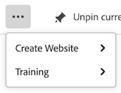

# 釘選頁面以自訂您的工作區

<!-- Audited: 4/2025 -->

您可以在[!DNL Adobe Workfront]中釘選您最重要的工作，以增加可見度、改善組織結構，並加快存取速度。 釘選頁面可隨時從Workfront中任何頁面的頂端存取。

您可能會被指派給已釘選頁面的版面配置範本（如[使用版面配置範本自訂釘選頁面](../../administration-and-setup/customize-workfront/use-layout-templates/customize-pinned-pages.md)中所述）。 無法重新命名或移除這些預先定義的圖釘。 您釘選的任何頁面都會顯示在預先定義的釘選右側。

## 存取需求

+++ 展開以檢視本文中功能的存取需求。

您必須具有下列存取權才能執行本文中的步驟：

<table style="table-layout:auto"> 
 <col> 
 </col> 
 <col> 
 </col> 
 <tbody> 
  <tr> 
   <td role="rowheader"><strong>[!DNL Adobe Workfront] 計劃</strong></td> 
   <td> 
任何
 </td> 
  </tr> 
  <tr> 
   <td role="rowheader"><strong>[!DNL Adobe Workfront] 授權</strong></td> 
   <td> 
新增：投稿人
 
   
或

     
目前：要求

   </td> 
  </tr> 
 </tbody> 
</table>

如需有關此表格的詳細資訊，請參閱Workfront檔案中的[存取需求](/help/quicksilver/administration-and-setup/add-users/access-levels-and-object-permissions/access-level-requirements-in-documentation.md)。

+++

## 釘選頁面

1. 導覽至您要釘選的頁面。 這可以是任何工作專案，例如專案、任務、請求佇列等。

1. 在頁面的左上角，按一下&#x200B;**[!UICONTROL 釘選目前頁面]**。 釘選頁面現在可從[!DNL Workfront]中任何頁面的頂端存取。

   

## 存取釘選頁面

1. 在任何頁面頂端，按一下您要檢視的釘選頁面。

   >[!TIP]
   >
   >將滑鼠停留在釘選頁面上，即可檢視完整名稱和說明。

   或

   如果您釘選了許多頁面，請按一下&#x200B;**[!UICONTROL 更多]**&#x200B;圖示以檢視其他釘選頁面。

   

   釘選頁面隨即顯示。

## 重新命名釘選頁面

1. 暫留在頂端導覽的釘選頁面上。
1. 按一下圖釘名稱旁出現的&#x200B;**更多**&#x200B;圖示，並選取&#x200B;**[!UICONTROL 重新命名圖釘]**。

   

1. 輸入新的PIN名稱，然後按一下[儲存]。**&#x200B;**

   

## 重新排序釘選頁面

您可以重新排列釘選頁面的顯示順序。

1. 將游標停留在您要移動的釘選頁面上，然後按一下&#x200B;**更多**&#x200B;圖示。
1. 選擇&#x200B;**向左移動**&#x200B;或&#x200B;**向右移動**&#x200B;以移動您的圖釘。
1. （選擇性）選擇&#x200B;**移至前面**&#x200B;將您的圖釘移至圖釘列的最左位置。

   

   您的變更會自動儲存，並在您下次存取Workfront時記住這些變更。

## 移除釘選頁面

1. 按一下您要移除的釘選旁的&#x200B;**更多**&#x200B;圖示。
1. 按一下&#x200B;**移除圖釘**。 無法再從[!DNL Workfront]中任何頁面的頂端存取該頁面。

   

