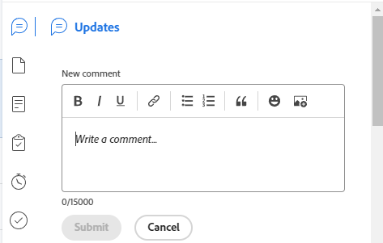

# [!UICONTROL 摘要] 概述

{{highlighted-preview}}

您可以使用 [!UICONTROL 摘要] 面板，直接從任務清單、問題、檔案或其他區域檢閱和更新工作專案資訊。 [!DNL Adobe Workfront] 問題按鈕來顯示任務和問題。

下表顯示您可以找到及使用 [!UICONTROL 摘要] 面板：

<table style="table-layout:auto"> 
 <col data-mc-conditions=""> 
 <tbody> 
  <tr> 
   <td>任務</td> 
  </tr> 
  <tr> 
   <td> 
內的工作清單
 
    <ul> 
     <li>專案</li> 
     <li>子任務</li> 
    </ul> </td> 
  </tr> 
  <tr> 
   <td>[！UICONTROL工作負載平衡器]的[！UICONTROL未指派]和[！UICONTROL已指派]工作區域中的任務</td> 
  </tr> 
  <tr data-mc-conditions=""> 
   <td>問題</td> 
  </tr> 
  <tr data-mc-conditions=""> 
   <td> 
內的問題清單
 
    <ul> 
     <li>專案</li> 
     <li>任務</li> 
     <li>子任務</li> 
    </ul> </td> 
  </tr> 
  <tr data-mc-conditions=""> 
   <td>[！UICONTROL工作負載平衡器]的[！UICONTROL指派的工作]區域發生問題</td> 
  </tr> 
  <tr data-mc-conditions=""> 
   <td>[！UICONTROL請求]區域的[！UICONTROL已提交]區段中的問題</td> 
  </tr> 
  <tr data-mc-conditions=""> 
   <td>文件</td> 
  </tr> 
  <tr data-mc-conditions=""> 
   <td>[！UICONTROL檔案]區域</td> 
  </tr> 
  <tr data-mc-conditions=""> 
   <td>任何物件（專案、任務、問題、方案、投資組合、範本、範本任務、使用者）的[！UICONTROL檔案]區段</td> 
  </tr> 
 </tbody> 
</table>

<!--

Workfront administrators can customize the Summary in the Layout Template. For more information, see <a href="../../administration-and-setup/customize-workfront/use-layout-templates/create-and-manage-layout-templates.md" class="MCXref xref">Create and manage layout templates</a>.

-->

本文說明如何存取及使用 [!UICONTROL 摘要] 清單中任務和問題的面板。

如需有關存取 [!UICONTROL 摘要] 在 [!UICONTROL 工作負載平衡器]，請參閱 [更新中的工作專案 [!UICONTROL 工作負載平衡器] 使用 [!UICONTROL 摘要]](../../resource-mgmt/workload-balancer/update-items-in-summary-panel-in-workload-balancer.md).

如需有關存取 [!UICONTROL 摘要] 如需檔案，請參閱 [[!UICONTROL 摘要] 檔案概覽](../../documents/managing-documents/summary-for-documents.md).

## 存取需求

您必須具有下列存取權才能執行本文中的步驟：

<table style="table-layout:auto"> 
 <col> 
 <col> 
 <tbody> 
  <tr> 
   <td role="rowheader"><strong>[!DNL Adobe Workfront] 計畫*</strong></td> 
   <td> 
任何
 </td> 
  </tr> 
  <tr> 
   <td role="rowheader"><strong>[!DNL Adobe Workfront] 授權*</strong></td> 
   <td> 
[！UICONTROL Request]或更高版本
 </td> 
  </tr> 
  <tr> 
   <td role="rowheader"><strong>存取層級設定*</strong></td> 
   <td> 
[！UICONTROL檢視]或更高的任務、問題、檔案存取權
 
[！UICONTROL檢視]或更高的存取權存取您要檢視其檔案之任何物件的[！UICONTROL摘要]
 
注意：如果您還是沒有存取權，請詢問您的 [!DNL Workfront] 管理員是否對您的存取層級設定其他限制。 如需瞭解如何 [!DNL Workfront] 管理員可以修改您的存取層級，請參閱 <a href="../../administration-and-setup/add-users/configure-and-grant-access/create-modify-access-levels.md" class="MCXref xref">建立或修改自訂存取層級</a>.
 </td> 
  </tr> 
  <tr> 
   <td role="rowheader"><strong>物件許可權</strong></td> 
   <td> 
[！UICONTROL檢視]或任務、問題或檔案的更高許可權
 
如需請求其他存取許可權的詳細資訊，請參閱 <a href="../../workfront-basics/grant-and-request-access-to-objects/request-access.md" class="MCXref xref">要求物件的存取權 </a>.
 </td> 
  </tr> 
 </tbody> 
</table>

&#42;若要瞭解您擁有的計畫、授權型別或存取權，請聯絡您的 [!DNL Workfront] 管理員。

## 檢視 [!UICONTROL 摘要] 任務或問題清單中的面板

1. 前往任務或問題，然後在清單中選取專案。
1. 按一下 **[!UICONTROL 摘要]** 圖示 

   或

   按一下 **[!UICONTROL 開啟摘要]** 圖示  在 [!UICONTROL 已提交] 的區段 [!UICONTROL 請求] 區域。

   開啟「摘要」後，當您按一下或選取其他任務或問題時，摘要會保持開啟狀態，直到您手動關閉摘要為止。

   >[!TIP]
   >
   >您一次只能選取一個任務或一個問題，以在 [!UICONTROL 摘要] 面板。

   

   預覽環境中的摘要面板範例：
   

   

   生產環境中的摘要面板範例：
   

1. （選用）若要關閉 [!UICONTROL 摘要] 面板，執行下列任一項作業：

   * 在任務或問題清單中，按一下 **[!UICONTROL 開啟摘要]** 圖示 

     或

     按一下 **X** 圖示於 [!UICONTROL 摘要] 面板。

   * 在 [!UICONTROL 已提交] 的區段 [!UICONTROL 請求] 區域，按一下 **[!UICONTROL 關閉摘要]** 圖示 

     或

     按一下 **X** 圖示加以顯示。

## [!UICONTROL 完成百分比]

使用頂端的進度列 [!UICONTROL 摘要] 更新您選取的任務或問題的完成百分比。 輸入數字或將橫條拖曳到正確的百分比。

## [!UICONTROL 更新]

使用 [!UICONTROL 更新] 的區段 [!UICONTROL 摘要] 以檢視最近的更新，並對您選取的任務或問題進行更新。 按一下 **[!UICONTROL 檢視全部]** 直接前往 [!UICONTROL 更新] 標籤中。

預覽環境中的更新範例：

生產環境中的更新範例：

## [!UICONTROL 文件]

使用 [!UICONTROL 檔案] 的區段 [!UICONTROL 摘要] 以檢視附加到您所選任務或問題的檔案。 按一下縮圖以開啟檔案預覽。 若要直接前往 [!UICONTROL 檔案] 索引標籤上的任務或問題，按一下 **[!UICONTROL 檔案]** 標題。

## [!UICONTROL 詳細資料]

使用 [!UICONTROL 詳細資料] 的區段 [!UICONTROL 摘要] 若要檢視高階工作專案詳細資訊、進行指派或新增開始日期。 按一下 **[!UICONTROL 檢視全部]** 直接前往 [!UICONTROL 詳細資料] 標籤上的任務或問題。

>[!NOTE]
>
>此區段中顯示的欄位，與首頁右側面板中顯示的欄位相同。 您可以自訂這些欄位 [自訂 [!UICONTROL 首頁] 和 [!UICONTROL 摘要] 使用版面範本](../../administration-and-setup/customize-workfront/use-layout-templates/customize-home-summary-layout-template.md).

## [!UICONTROL 子任務]

此區段僅適用於工作。 使用 [!UICONTROL 子任務] 的區段 [!UICONTROL 摘要] 以檢視 [!UICONTROL 新增]， [!UICONTROL 進行中]、和 [!UICONTROL 已關閉] 您選取之任務的子任務。 按一下 **[!UICONTROL 狀態]** 下拉式功能表以切換狀態。 若要直接前往 [!UICONTROL 子任務] 標籤上，按一下 **[!UICONTROL 子任務]**&#x200B;標題&#x200B;。

如果您尚未將任何子任務新增至任務，請按一下 **[!UICONTROL 在這裡新增一個]** 直接前往 [!UICONTROL 子任務] 標籤中。

## [!UICONTROL 小時]

使用 [!UICONTROL 小時] 的區段 [!UICONTROL 摘要] 以記錄所選任務或問題的時數。 按一下 **[!UICONTROL 記錄時間]** 並輸入小時。 若要直接前往任務或問題上的時數索引標籤，請按一下 **[!UICONTROL 小時]** 標題。

中的小時計數 [!UICONTROL 摘要] 顯示您所記錄的時數。 其他使用者在中會有不同的小時總計 [!UICONTROL 摘要] 視他們登入工作的時間而定。

如果沒有計畫 [!UICONTROL 小時] 在任務或問題上，而您已記錄時間，時數列顯示紅色。

## 核准

使用 [!UICONTROL 核准] 的區段 [!UICONTROL 摘要] 以檢視附加至您所選任務或問題的核准。 如果您尚未新增任何核准，請從下拉式選單中選取現有核准，或按一下 **[!UICONTROL 建立單一使用核准程式]** 直接前往 [!UICONTROL 核准] 標籤上的任務或問題。

若要直接前往 [!UICONTROL 核准] 索引標籤上的任務或問題，按一下 **[!UICONTROL 核准]** 標題。

