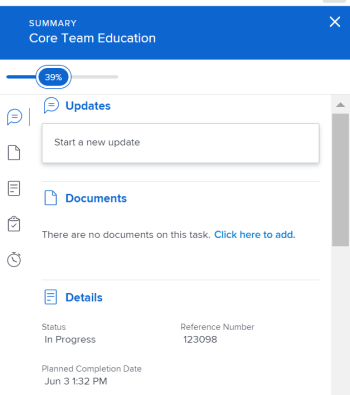
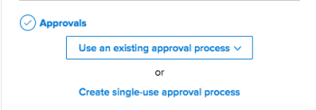

# [!UICONTROL 摘要] 概述

您可以使用 [!UICONTROL 摘要] 直接從任務問題清單、文檔或其他領域查看和更新工作項資訊的面板 [!DNL Adobe Workfront] 顯示任務和問題。

下表顯示您可以找到的區域，以及 [!UICONTROL 摘要] 面板：

<table style="table-layout:auto"> 
 <col data-mc-conditions=""> 
 <tbody> 
  <tr> 
   <td>任務</td> 
  </tr> 
  <tr> 
   <td> 
任務清單
 
    <ul> 
     <li>專案</li> 
     <li>子任務</li> 
    </ul> </td> 
  </tr> 
  <tr> 
   <td>[!UICONTROL未分配]和[!UICONTROL已分配]工作區中的任務 [!DNL Workload Balancer]</td> 
  </tr> 
  <tr data-mc-conditions=""> 
   <td>問題</td> 
  </tr> 
  <tr data-mc-conditions=""> 
   <td> 
問題清單
 
    <ul> 
     <li>專案</li> 
     <li>任務</li> 
     <li>子任務</li> 
    </ul> </td> 
  </tr> 
  <tr data-mc-conditions=""> 
   <td>在 [!DNL Workload Balancer]</td> 
  </tr> 
  <tr data-mc-conditions=""> 
   <td>[!UICONTROL請求]區域的[!UICONTROL已提交]部分中的問題</td> 
  </tr> 
  <tr data-mc-conditions=""> 
   <td>文件</td> 
  </tr> 
  <tr data-mc-conditions=""> 
   <td>[!UICONTROL文檔]區域</td> 
  </tr> 
  <tr data-mc-conditions=""> 
   <td>任何對象（項目、任務、問題、方案、組合、模板、模板任務、用戶）的[!UICONTROL Documents]節</td> 
  </tr> 
 </tbody> 
</table>

<!--

Workfront administrators can customize the Summary in the Layout Template. For more information, see <a href="../../administration-and-setup/customize-workfront/use-layout-templates/create-and-manage-layout-templates.md" class="MCXref xref">Create and manage layout templates</a>.

-->

本文說明如何存取和使用 [!UICONTROL 摘要] 清單中的任務和問題面板。

如需存取 [!UICONTROL 摘要] 在 [!DNL Workload Balancer]，請參閱 [更新 [!DNL Workload Balancer] 使用 [!UICONTROL 摘要]](../../resource-mgmt/workload-balancer/update-items-in-summary-panel-in-workload-balancer.md).

如需存取 [!UICONTROL 摘要] 有關文檔，請參閱 [[!UICONTROL 摘要] 文檔概覽](../../documents/managing-documents/summary-for-documents.md).

## 存取需求

您必須具備下列存取權，才能執行本文中的步驟：

<table style="table-layout:auto"> 
 <col> 
 <col> 
 <tbody> 
  <tr> 
   <td role="rowheader"><strong>[!DNL Adobe Workfront] 計劃*</strong></td> 
   <td> 
任何
 </td> 
  </tr> 
  <tr> 
   <td role="rowheader"><strong>[!DNL Adobe Workfront] 授權*</strong></td> 
   <td> 
[!UICONTROL Request]或更高版本
 </td> 
  </tr> 
  <tr> 
   <td role="rowheader"><strong>訪問級別配置*</strong></td> 
   <td> 
[!UICONTROL視圖]或更高版本對任務、問題、文檔的訪問
 
[!UICONTROL View]或更高版本對要查看文檔的任何對象的訪問[!UICONTROL Summary]
 
注意：如果您仍無法存取，請詢問您的 [!DNL Workfront] 管理員。 若要了解 [!DNL Workfront] 管理員可修改您的存取層級，請參閱 <a href="../../administration-and-setup/add-users/configure-and-grant-access/create-modify-access-levels.md" class="MCXref xref">建立或修改自訂存取層級</a>.
 </td> 
  </tr> 
  <tr> 
   <td role="rowheader"><strong>物件權限</strong></td> 
   <td> 
對任務、問題或文檔的[!UICONTROL View]或更高權限
 
有關請求其他訪問的資訊，請參閱 <a href="../../workfront-basics/grant-and-request-access-to-objects/request-access.md" class="MCXref xref">請求對對象的訪問 </a>.
 </td> 
  </tr> 
 </tbody> 
</table>

&#42;若要了解您擁有的計畫、授權類型或存取權，請聯絡您的 [!DNL Workfront] 管理員。

## 檢視 [!UICONTROL 摘要] 任務或問題清單中的面板

1. 轉到任務或問題，然後在清單中選擇項目。
1. 按一下 **[!UICONTROL 摘要]** 圖示 

   或

   按一下 **[!UICONTROL 開啟摘要]** 圖示  在 [!UICONTROL 已提交] 區段 [!UICONTROL 請求] 的上界。

   開啟「摘要」後，當您按一下或選取其他任務或問題時，摘要會保持開啟，直到您手動關閉摘要為止。

   >[!TIP]
   >
   >您一次只能選取一或一個問題，以在 [!UICONTROL 摘要] 中。

   

1. （選用）若要關閉 [!UICONTROL 摘要] 面板，執行下列操作之一：

   * 在任務或問題清單中，按一下 **[!UICONTROL 開啟摘要]** 圖示 

      或

      按一下 **X** 表徵圖 [!UICONTROL 摘要] 中。

   * 在 [!UICONTROL 已提交] 區段 [!UICONTROL 請求] ，按一下 **[!UICONTROL 關閉摘要]** 圖示 

      或

      按一下 **X** 表徵圖。

## [!UICONTROL 完成百分比]

使用 [!UICONTROL 摘要] 更新您所選任務或問題的完成百分比。 輸入數字或將條拖到正確百分比。

## [!UICONTROL 更新]

使用 [!UICONTROL 更新] 區段 [!UICONTROL 摘要] 查看最近更新，並對所選任務或問題進行更新。 按一下 **[!UICONTROL 查看全部]** 直接前往 [!UICONTROL 更新] 頁簽。

## [!UICONTROL 文件]

使用 [!UICONTROL 檔案] 區段 [!UICONTROL 摘要] 查看附加到您選擇的任務或問題的文檔。 按一下縮略圖以開啟文檔預覽。 若要直接前往 [!UICONTROL 檔案] 頁簽，按一下 **[!UICONTROL 檔案]** 標題。

## [!UICONTROL 詳细資訊]

使用 [!UICONTROL 詳細資料] 區段 [!UICONTROL 摘要] 要查看高級工作項詳細資訊，請進行分配或添加起始日期。 按一下 **[!UICONTROL 查看全部]** 直接前往 [!UICONTROL 詳細資料] 頁簽。

>[!NOTE]
>
>此區段中顯示的欄位，與首頁右側面板中顯示的欄位相同。 您可以自訂這些欄位 [自訂 [!UICONTROL 首頁] 和 [!UICONTROL 摘要] 使用版面範本](../../administration-and-setup/customize-workfront/use-layout-templates/customize-home-summary-layout-template.md).

## [!UICONTROL 子任務]

此部分僅適用於任務。 使用 [!UICONTROL 子任務] 區段 [!UICONTROL 摘要] 檢視 [!UICONTROL 新增], [!UICONTROL 進行中]，和 [!UICONTROL 已關閉] 子任務。 按一下 **[!UICONTROL 狀態]** 下拉式功能表，以在狀態之間切換。 若要直接前往 [!UICONTROL 子任務] 頁簽，按一下 **[!UICONTROL 子任務]**&#x200B;標題。

如果尚未將任何子任務添加到任務中，請按一下 **[!UICONTROL 在這裡新增一個]** 直接前往 [!UICONTROL 子任務] 頁簽。

## [!UICONTROL 時數]

使用 [!UICONTROL 小時] 區段 [!UICONTROL 摘要] 登錄所選任務或問題的時間。 按一下 **[!UICONTROL 記錄時間]** 然後輸入您的小時數。 要直接轉到任務或問題的「小時」頁簽，請按一下 **[!UICONTROL 小時]** 標題。

中的小時計數 [!UICONTROL 摘要] 顯示您記錄的小時數。 其他使用者的小時總數會不同 [!UICONTROL 摘要] 取決於他們登錄任務的時間。

如果沒有計畫 [!UICONTROL 小時] 在任務或問題上，且您已記錄時間，時長列會顯示為紅色。

## 核准

使用 [!UICONTROL 核准] 區段 [!UICONTROL 摘要] 查看附加到任務的批准或選定的問題。 如果您尚未新增任何核准，請從下拉式功能表中選取現有核准，或按一下 **[!UICONTROL 建立一次性核准流程]** 直接前往 [!UICONTROL 核准] 頁簽。

若要直接前往 [!UICONTROL 核准] 頁簽，按一下 **[!UICONTROL 核准]** 標題。

