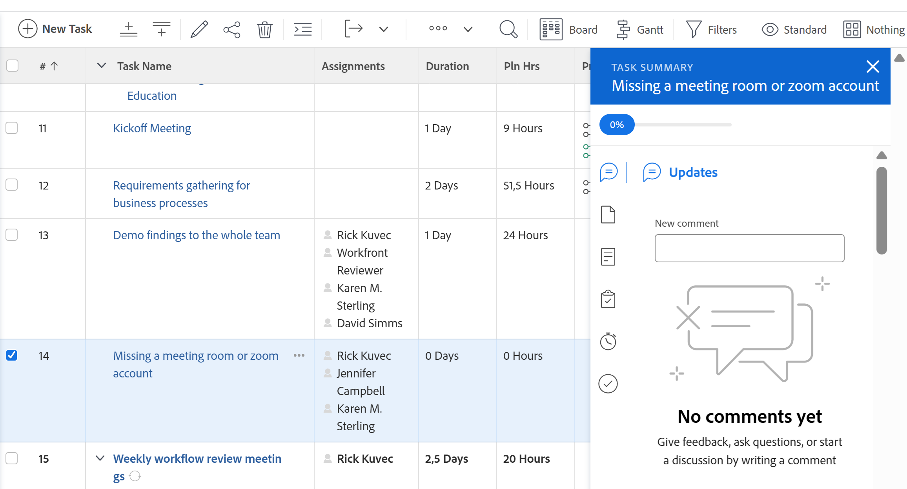

# [!UICONTROL 摘要]概述

<!--The highlighted information on this page refers to functionality not yet generally available. It is available only in the Preview environment for all customers or in Production for customers who enabled fast releases. 

For information about fast releases, see [Enable or disable fast releases for your organization](/help/quicksilver/administration-and-setup/set-up-workfront/configure-system-defaults/enable-fast-release-process.md).

For information about the current release schedule, see [Second Quarter 2024 release overview](/help/quicksilver/product-announcements/product-releases/24-q2-release-activity/24-q2-release-overview.md). -->

您可以使用[!UICONTROL 摘要]面板，直接從任務、問題、檔案清單或顯示任務和問題的[!DNL Adobe Workfront]的其他區域檢閱和更新工作專案資訊。

您的Workfront或群組管理員可以修改摘要面板中顯示的區域和欄位。 他們最多可以新增16個欄位到摘要面板。

>[!IMPORTANT]
>
>我們建議您新增必須經常更新的欄位至「摘要」面板，這樣您就可以輕鬆存取並更新這些欄位，無需存取物件的首頁面。
>
>例如，您可以將以下經常更新的欄位新增到任務和問題摘要面板：
>
>* 狀態
>* 完成百分比
>* 認可日期
>* 規劃完成日期
>* 狀況

下表顯示您可以找到並使用[!UICONTROL 摘要]面板的區域：

<table style="table-layout:auto"> 
 <col data-mc-conditions=""> 
 <tbody> 
  <tr> 
   <td><b>任務</b></td> 
  </tr> 
  <tr> 
   <td> 
內的工作清單
 
    <ul> 
     <li>專案</li> 
     <li>子任務</li> 
    </ul> </td> 
  </tr> 
  <tr> 
   <td>[!UICONTROL 工作負載平衡器]的[!UICONTROL 未指派]和[!UICONTROL 已指派]工作區域中的任務</td> 
  </tr> 
   <tr> 
   <td>[!UICONTROL 時程表]中的任務</td> 
  </tr> 
  <tr data-mc-conditions=""> 
   <td><b>問題</b></td> 
  </tr> 
  <tr data-mc-conditions=""> 
   <td> 
內的問題清單
 
    <ul> 
     <li>專案</li> 
     <li>任務</li> 
     <li>子任務</li> 
    </ul> </td> 
  </tr> 
  <tr data-mc-conditions=""> 
   <td>[!UICONTROL 工作負載平衡器]的[!UICONTROL 指派的工作]區域發生問題</td> 
  </tr> 
  <tr data-mc-conditions=""> 
   <td>[!UICONTROL 請求]區域的[!UICONTROL 已提交]區段中的問題</td> 
  </tr> 
</tr> 
   <tr> 
   <td>[!UICONTROL 時程表]中的問題</td> 
  </tr>

<tr data-mc-conditions=""> 
   <td><b>文件</b></td> 
  </tr> 
  <tr data-mc-conditions=""> 
   <td>[!UICONTROL 檔案]區域</td> 
  </tr> 
  <tr data-mc-conditions=""> 
   <td>任何物件（專案、任務、問題、方案、投資組合、範本、範本任務、使用者）的[!UICONTROL 檔案]區段</td> 
  </tr> 
 </tbody> 
</table>

<!--

Workfront administrators can customize the Summary in the Layout Template. For more information, see <a href="../../administration-and-setup/customize-workfront/use-layout-templates/create-and-manage-layout-templates.md" class="MCXref xref">Create and manage layout templates</a>.

-->

本文說明如何針對清單中的任務和問題存取及使用[!UICONTROL 摘要]面板。

如需有關存取[!UICONTROL 工作負載平衡器]中[!UICONTROL 摘要]的資訊，請參閱[使用[!UICONTROL 摘要]](../../resource-mgmt/workload-balancer/update-items-in-summary-panel-in-workload-balancer.md)更新[!UICONTROL 工作負載平衡器]中的工作專案。

如需有關存取檔案[!UICONTROL 摘要]的資訊，請參閱檔案[&#128279;](../../documents/managing-documents/summary-for-documents.md)的[!UICONTROL 摘要]。

## 存取需求

您必須具有下列存取權才能執行本文中的步驟：

<table style="table-layout:auto"> 
 <col> 
 <col> 
 <tbody> 
  <tr> 
   <td role="rowheader"><strong>[!DNL Adobe Workfront] 計劃</strong></td> 
   <td> 
任何
 </td> 
  </tr> 
  <tr> 
   <td role="rowheader"><strong>[!DNL Adobe Workfront] 授權*</strong></td> 
   <td> 
新增：投稿人或更高版本

   或
   
目前：[!UICONTROL 要求]或更高
 </td> 
  </tr> 
  <tr> 
   <td role="rowheader"><strong>存取層級設定</strong></td> 
   <td> 
[!UICONTROL 檢視]或更高的任務、問題、檔案存取權
 
[!UICONTROL 檢視]或更高的存取權存取您要檢視其檔案[!UICONTROL 摘要]的任何物件
 </td> 
  </tr> 
  <tr> 
   <td role="rowheader"><strong>物件許可權</strong></td> 
   <td> 
[!UICONTROL 檢視]或任務、問題或檔案的更高許可權
 </td> 
  </tr> 
 </tbody> 
</table>

*若要瞭解您擁有的計畫、授權型別或存取權，請連絡您的[!DNL Workfront]管理員。 如需詳細資訊，請參閱Workfront檔案中的[存取需求](/help/quicksilver/administration-and-setup/add-users/access-levels-and-object-permissions/access-level-requirements-in-documentation.md)。

## 檢視任務或問題清單中的[!UICONTROL 摘要]面板

1. 前往任務或問題，然後在清單中選取專案。
1. 按一下&#x200B;**[!UICONTROL 摘要]**&#x200B;圖示

   或

   在[!UICONTROL 要求]區域的[!UICONTROL 已提交]區段中，按一下&#x200B;**[!UICONTROL 開啟摘要]**&#x200B;圖示。

   開啟「摘要」後，當您按一下或選取其他任務或問題時，摘要會保持開啟狀態，直到您手動關閉摘要為止。

   >[!TIP]
   >
   >您一次只能選取一個任務或一個問題，以在[!UICONTROL 摘要]面板中檢視其詳細資訊。

   

1. （選擇性）若要關閉[!UICONTROL 摘要]面板，請執行下列其中一項操作：

   * 在工作或問題清單中，按一下&#x200B;**[!UICONTROL 開啟摘要]**&#x200B;圖示

     或

     按一下[!UICONTROL 摘要]面板右上角的&#x200B;**X**&#x200B;圖示。

   * 在[!UICONTROL 要求]區域的[!UICONTROL 已提交]區段中，按一下&#x200B;**[!UICONTROL 關閉摘要]**&#x200B;圖示

     或

     按一下「摘要」面板右上角的&#x200B;**X**&#x200B;圖示。

## [!UICONTROL 完成百分比]

使用[!UICONTROL 摘要]頂端的進度列，更新您已選取之任務或問題的完成百分比。 輸入數字或將橫條拖曳到正確的百分比。

摘要面板中的

## [!UICONTROL 更新]

使用[!UICONTROL 摘要]的[!UICONTROL 更新]區段來檢視最近的更新，並對您選取的任務或問題進行更新。 按一下&#x200B;**[!UICONTROL 檢視全部]**，直接前往工作上的[!UICONTROL 更新]標籤。

摘要面板中的

## [!UICONTROL 文件]

使用[!UICONTROL 摘要]的[!UICONTROL 檔案]區段來檢視附加至您選取之任務或問題的檔案。 按一下縮圖以開啟檔案預覽。 若要直接移至任務或問題上的[!UICONTROL 檔案]索引標籤，請按一下&#x200B;**[!UICONTROL 檔案]**&#x200B;標題。

摘要面板中的

## [!UICONTROL 詳細資料]

使用[!UICONTROL 摘要]的[!UICONTROL 詳細資料]區段來檢視高階工作專案詳細資料、進行指派或新增開始日期。 按一下「**[!UICONTROL 檢視全部]**」直接前往任務或問題上的「[!UICONTROL 詳細資料]」標籤。

摘要面板中的

## [!UICONTROL 子任務]

此區段僅適用於工作。 使用[!UICONTROL 摘要]的[!UICONTROL 子任務]區段檢視您選取之任務的[!UICONTROL 新增]、[!UICONTROL 進行中]和[!UICONTROL 已關閉的]子任務。 按一下&#x200B;**[!UICONTROL 狀態]**&#x200B;下拉式功能表以切換狀態。 若要直接移至工作上的[!UICONTROL 子工作]索引標籤，請按一下&#x200B;**[!UICONTROL 子工作]**&#x200B;標&#x200B;題。

如果您尚未將任何子任務新增至工作，請按一下&#x200B;**[!UICONTROL 在此新增一個子任務]**，直接移至工作上的[!UICONTROL 子任務]索引標籤。

摘要面板中的

## [!UICONTROL 小時]

使用[!UICONTROL 摘要]的[!UICONTROL 小時]區段來記錄所選工作或問題的小時數。 按一下&#x200B;**[!UICONTROL 記錄時間]**&#x200B;並輸入您的時數。 若要直接移至任務或問題的時數索引標籤，請按一下&#x200B;**[!UICONTROL 時數]**&#x200B;標題。

[!UICONTROL 摘要]中的小時計數會顯示您記錄的時數。 根據其他使用者登入工作的時間，[!UICONTROL 摘要]中的小時總計會有所不同。

如果任務或問題中沒有計畫的[!UICONTROL 小時]，而且您已記錄時間，則小時列顯示紅色。

摘要面板中的

## 核准

使用[!UICONTROL 摘要]的[!UICONTROL 核准]區段來檢視附加至您選取之任務或問題的核准。 如果您尚未新增任何核准，請從下拉式選單中選取現有的核准，或按一下&#x200B;**[!UICONTROL 建立單一使用核准流程]**&#x200B;直接前往任務或問題上的[!UICONTROL 核准]標籤。

若要直接前往任務或問題上的[!UICONTROL 核准]索引標籤，請按一下&#x200B;**[!UICONTROL 核准]**&#x200B;標題。

摘要面板中的
