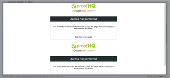

# [!UICONTROL [!DNL Workfront]校訂管理員]許可權疑難排解

以下是[!DNL Adobe Workfront]中可用於校訂使用者的許可權設定檔：

* [!UICONTROL 管理員]
* [!UICONTROL 監督員]
* [!UICONTROL 管理員]

<!--For detailed information about these options and how to configure them, see .-->

授與使用者[!UICONTROL 管理員]許可權時，可提供下列疑難排解資訊：

* **問題：**&#x200B;具有[!UICONTROL 管理員]許可權的使用者無法檢視其他使用者建立的校訂。 相反地，他們看到[!UICONTROL 拒絕存取]畫面。

  

  **解決方案：**&#x200B;必須明確將具有[!UICONTROL 管理員]許可權的使用者新增至校樣。 校訂應一律透過[!UICONTROL 進階校訂選項]視窗建立，使用者應一律透過此選項新增。

* **問題：**&#x200B;具有[!UICONTROL 管理員]許可權的使用者無法將校訂版本新增到其他使用者建立的校訂中（他們可能會在檔案集中提交校訂，但版本不會連線到其他使用者建立的原始集）。\
   **解決方案：**&#x200B;具有[!UICONTROL 管理員]許可權的使用者只有在同時具有[!UICONTROL 管理員]許可權的使用者符合下列條件時，才能將版本提交至其他使用者的校訂：

   * 明確新增到校樣
   * 在校訂上設定為[!UICONTROL 作者] （校訂角色）

* **問題：**&#x200B;具有[!UICONTROL 管理員]許可權的使用者無法編輯其他使用者對於他們未擁有或未建立之校訂的評論。\
   **解決方案：**&#x200B;如果具有[!UICONTROL 管理員]許可權的使用者沒有校訂，但他們應該能夠編輯註解，請將它們新增為[!UICONTROL 作者] （或[!UICONTROL 版主]）。\
   在[!DNL Workfront]中，[!UICONTROL 規劃師]、[!UICONTROL 工作者]、[!UICONTROL 請求者]、[!UICONTROL 檢閱者]型別授權有這三種型別的許可權。 [!DNL Workfront]中的系統管理員或使用者管理員可以編輯使用者的設定檔，並從中調整[!DNL Workfront Proof]許可權。
