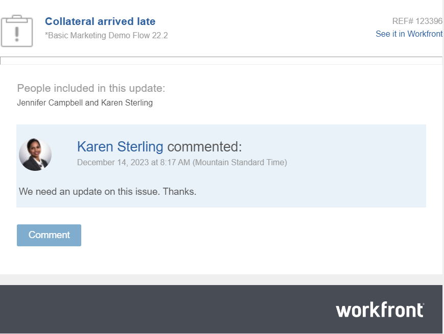

# 回覆更新內容

{{highlighted-preview}}

<!--remove legacy and new experience references when we remove the legacy updates in the UI - Jan 2024???-->

<!--
The highlighted information on this page refers to functionality not yet generally available. It is available only in the Preview environment for all customers. After the monthly releases to Production, the same features are also available in the Production environment for customers who enabled fast releases.   
For information about fast releases, see [Enable or disable fast releases for your organization](../../administration-and-setup/set-up-workfront/configure-system-defaults/enable-fast-release-process.md)  

For information about the current release schedule, see [Fourth Quarter 2023 release overview](../../product-announcements/product-releases/23-q4-release-activity/23-q4-release-overview.md) 

-->

>[!IMPORTANT]
>
>我們目前正在重新設計Adobe Workfront中的評論體驗。
>
>根據您存取註釋體驗的物件，您可能會在「更新」區段中看到下列功能：
>* 新體驗
>* 舊版體驗
>* 全新和舊版體驗
>
>如需有關新評論體驗及其可用性的詳細資訊，請參閱 [新的評論體驗](../../product-announcements/betas/new-commenting-experience-beta/unified-commenting-experience.md).
>
>新註解體驗僅適用於Workfront物件的「更新」區段，當您從以下區域存取物件時，將無法使用：
>
> * 首頁
> * 清單中的摘要面板
> * 時程表中的摘要面板
> * 工作負載平衡器中的摘要面板
>
>新的評論體驗可在「預覽」環境的清單、時程表和工作負載平衡器的摘要面板中取得。 <!--and in the Production environment for customers who have opted for the fast release process. For information about fast releases, see [Enable or disable fast releases for your organization](/help/quicksilver/administration-and-setup/set-up-workfront/configure-system-defaults/enable-fast-release-process.md). For information about the current release schedule, see [First Quarter 2024 release overview](/help/quicksilver/product-announcements/product-releases/24-q2-release-activity/24-q2-release-overview.md).-->

當有人回覆工作物件的評論或系統更新時，他們的回覆會出現在物件「更新」區段的通訊對話串中。

>[!IMPORTANT]
>
>無法在新評論體驗中回覆系統更新。 如需詳細資訊，請參閱 [新的評論體驗](../../product-announcements/betas/new-commenting-experience-beta/unified-commenting-experience.md).

<!--adjust the sentence before the second IMPORTANT and remove this important note when we remove legacy from the system-->

## 存取需求

您必須具有下列存取權才能執行本文中的步驟：

<table style="table-layout:auto"> 
 <col> 
 <col> 
 <tbody> 
  <tr> 
   <td role="rowheader"><strong>Adobe Workfront計畫*</strong></td> 
   <td> 
任何
 </td> 
  </tr> 
  <tr> 
   <td role="rowheader"><strong>Adobe Workfront授權*</strong></td> 
   <td> 
要求或更高的問題和檔案；檢閱或更高的所有其他物件
 </td> 
  </tr> 
  <tr> 
   <td role="rowheader"><strong>存取層級設定*</strong></td> 
   <td> 
問題和檔案的要求者或以上；所有其他物件的檢閱者或以上
 
<b>附註</b>

如果您還是沒有存取權，請詢問您的Workfront管理員，他們是否在您的存取層級中設定其他限制。 如需有關Workfront管理員如何修改您的存取層級的資訊，請參閱 <a href="../../administration-and-setup/add-users/configure-and-grant-access/create-modify-access-levels.md" class="MCXref xref">建立或修改自訂存取層級</a>.
 </td>
</tr> 
  <tr> 
   <td role="rowheader"><strong>物件許可權</strong></td> 
   <td> 
檢視物件的存取權
 
如需請求其他存取許可權的詳細資訊，請參閱 <a href="../../workfront-basics/grant-and-request-access-to-objects/request-access.md" class="MCXref xref">要求物件的存取權 </a>.
 </td> 
  </tr> 
 </tbody> 
</table>

&#42;若要瞭解您擁有的計畫、授權型別或存取權，請聯絡您的Workfront管理員。

## 在Workfront中回覆更新或回覆

您可以回覆物件執行緒中的註解，以檢視該物件，或者您可以以Workfront或群組管理員身分登入，並代表其他使用者回覆註解。 如需詳細資訊，請參閱 [以其他使用者身分登入](../../administration-and-setup/add-users/create-and-manage-users/log-in-as-another-user.md).

回覆註解或回覆會因您選擇的體驗和物件而異。

### 使用新註解體驗時回覆註解

如需有關新註解體驗中哪些功能可用以及哪些物件的資訊，請參閱 [新的評論體驗](../../product-announcements/betas/new-commenting-experience-beta/unified-commenting-experience.md).

1. 移至您要新增回覆的物件。
1. 按一下 **更新**，然後按一下 **註解** 定位物件，並尋找您要回覆的註解或回覆

   或

   按一下 **全部** 標籤，然後按一下 **在評論中回覆** 以在「註解」標籤中開啟註解並回覆。 您無法在「全部」索引標籤中回覆。

1. （可選）若要在回覆中包含先前更新的文字，請按一下 **更多** 選單，然後按一下 **引用回覆**. 先前更新的文字會出現在輸入區域中，以垂直灰色線標示。
1. 按一下 **回覆**.

   

   您可以在頁面底部看到目前參與交談的使用者 **新增回覆……** 方塊中，您可以新增更多或移除不再相關的專案。 這些使用者以及訂閱物件的任何使用者會在物件進行更新或回覆時收到通知。 您也可以標籤更多使用者，讓他們加入您的回覆中。  若要標籤更多使用者，請參閱 [標籤其他人的更新](../../workfront-basics/updating-work-items-and-viewing-updates/tag-others-on-updates.md).

   >[!TIP]
   >
   >   若要新增其他回覆至現有的回覆，您可以開始輸入 **新增回覆……** 方塊，或按一下 **回覆** 在原始註解上。 您的回覆會新增至對話串的結尾。

1. 開始輸入您的回覆，並使用RTF工具列的任何其他選項。 如需有關使用RTF或其他更新功能的資訊，請參閱 [更新工作](../updating-work-items-and-viewing-updates/update-work.md).

1. 按一下 **提交** 以儲存回覆。

1. （可選）按一下 **更多** 功能表  在您要回覆的評論右上角，以取得管理回覆的更多選項。 如需詳細資訊，請參閱 [更新工作](../updating-work-items-and-viewing-updates/update-work.md).

### 在舊版更新區段中回覆更新或回覆

1. 移至您要新增回覆的物件。
1. 在 **更新** 標籤中，尋找要回覆的更新或回覆。

1. （選擇性）若要在現有更新中檢視影像，請執行下列任一項作業：

   * 按一下 **預覽** 圖示  在影像縮圖上，以在新的瀏覽器標籤中開啟全尺寸影像。
   * 按一下 **下載** 圖示  在影像縮圖上以下載影像。

1. 按一下 **回覆** 在更新時，在出現的方塊中輸入回覆。

   您可以在該更新對話串頂端看到目前參與對話或每個回覆中被標籤的使用者。 這些使用者以及訂閱物件的任何使用者會在物件進行更新或回覆時收到通知。 您也可以標籤更多使用者，讓他們加入您的回覆中。  若要標籤更多使用者，請參閱 [標籤其他人的更新](../../workfront-basics/updating-work-items-and-viewing-updates/tag-others-on-updates.md).

   

1. （可選）若要在回覆中包含先前更新的文字，請按一下 **更多** 要報價的更新或回覆旁邊的功能表，然後按一下 **引文回覆**. 先前更新的文字會出現在輸入區域中，以垂直灰色線標示。
1. （選用）使用格式、表情符號、包含連結或影像，如文章「在Workfront更新中使用RTF文字」一節中所述 [更新工作](../../workfront-basics/updating-work-items-and-viewing-updates/update-work.md).
1. 按一下 **回覆** 以儲存回覆。

## 回覆電子郵件通知的更新

根據您的電子郵件通知的設定方式，在您有權存取的特定物件進行更新時，您可能會收到電子郵件通知。

您可以透過下列方式回覆電子郵件通知的更新：

* 回覆您收到的電子郵件。 您的回覆電子郵件會新增為原始評論的Workfront回覆。
* 使用電子郵件內的「評論」按鈕可導覽回Workfront並回覆更新區域的更新。

以下範例說明在任務的更新標籤上更新後，所觸發的電子郵件通知：

如需詳細資訊，請參閱 [回覆電子郵件通知](../updating-work-items-and-viewing-updates/reply-to-email-notifications.md).

