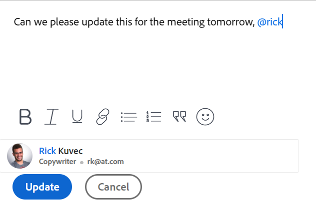

# 在更新時標籤其他人

<!--take "Beta" references out when we remove the beta-->

<!--The highlighted information on this page refers to functionality not yet generally available. It is available only in the Preview environment.-->

>[!NOTE]
>
>我們目前正在重新設計Adobe Workfront中的評論體驗。
>如需新更新體驗的詳細資訊，請參閱 [全新評論體驗](../updating-work-items-and-viewing-updates/unified-commenting-experience.md).
>
>您可以訪問以下對象的新設計：
> * 啟用注釋測試版時發生問題。
   >
   >     此功能僅適用於問題的「更新」區段，不適用於下列區域：
   >
   >     * 首頁
   >     * 清單中的摘要面板
   >     * 工時單中的「摘要」面板
>
> * 目標

   >
   >   目標的預設值為新的註解體驗。 您必須有額外的授權才能存取Workfront Targets。 如需詳細資訊，請參閱 [使用Workfront目標的需求](../../workfront-goals/goal-management/access-needed-for-wf-goals.md).
   >
   >    如需關於評論目標的資訊，請參閱 [管理Adobe Workfront目標中的目標註解](../../workfront-goals/goal-management/manage-goal-comments.md).

如果您想要吸引使用者注意他們可能不會關注的物件，則可在對物件進行更新時標籤使用者。
您可以將這些使用者指派給物件或讓他們訂閱物件，以便將其納入物件上，您可以在更新時標籤他們，以便與他們共用物件。 已標籤的使用者會收到您所輸入更新的相關通知。

>[!NOTE]
>
>必須啟用事件通知，使用者才能收到電子郵件通知。 管理員可以為整個系統或頂層組啟用通知。 使用者也可以在自己的使用者設定檔中啟用和停用個別事件通知。 如需詳細資訊，請參閱下列內容：
>
>* [為系統中的每個人配置事件通知](../../administration-and-setup/manage-workfront/emails/configure-event-notifications-for-everyone-in-the-system.md).
>* [檢視及設定群組的事件通知](../../administration-and-setup/manage-groups/create-and-manage-groups/view-and-configure-event-notifications-group.md)
>* [啟用或停用您自己的事件通知](../../workfront-basics/using-notifications/activate-or-deactivate-your-own-event-notifications.md).
>

如需將更新新增至Workfront物件的相關資訊，請參閱 [更新工作](../../workfront-basics/updating-work-items-and-viewing-updates/update-work.md).

>[!NOTE]
>
>將問題轉換為項目或任務時，更新將複製到新項目或任務，但標籤的用戶不會。 要繼續對話，必須再次標籤參與者。

## 存取需求

您必須具備下列存取權，才能執行本文中的步驟：

<table style="table-layout:auto"> 
 <col> 
 </col> 
 <col> 
 </col> 
 <tbody> 
  <tr> 
   <td role="rowheader"><strong>Adobe Workfront計畫*</strong></td> 
   <td> 
任何
 </td> 
  </tr> 
  <tr> 
   <td role="rowheader"><strong>Adobe Workfront授權*</strong></td> 
   <td> 
要求或更高的問題和檔案；查看其他所有對象的或更高版本
 </td> 
  </tr> 
  <tr> 
   <td role="rowheader"><strong>訪問級別配置*</strong></td> 
   <td> 
（二）申請事項和檔案的申請人或以上人員；所有其他對象的審閱者或更高版本
 
注意：如果您仍無權存取，請洽詢您的Workfront管理員，他們是否在您的存取層級設定其他限制。 如需Workfront管理員如何修改您的存取層級的詳細資訊，請參閱 <a href="../../administration-and-setup/add-users/configure-and-grant-access/create-modify-access-levels.md" class="MCXref xref">建立或修改自訂存取層級</a>.
 </td> 
  </tr> 
  <tr> 
   <td role="rowheader"><strong>物件權限</strong></td> 
   <td> 
檢視物件的存取權
 
有關請求其他訪問的資訊，請參閱 <a href="../../workfront-basics/grant-and-request-access-to-objects/request-access.md" class="MCXref xref">請求對對象的訪問 </a>.
 </td> 
  </tr> 
 </tbody> 
</table>

*若要了解您擁有的計畫、授權類型或存取權，請聯絡您的Workfront管理員。

## 在更新時標籤其他人

在更新中標籤其他人的方式會因您選取的體驗和物件而異。

### 在目前的更新區段中為其他項目加上更新標籤

1. 開始更新工作項，如 [更新工作](../../workfront-basics/updating-work-items-and-viewing-updates/update-work.md).
1. 在 **通知** 欄位中，開始鍵入要包括的用戶或組的名稱，然後在下拉清單中出現名稱時按一下該名稱。

   或

   在 **開始新更新** 區域中，開始鍵入要包括在更新中的用戶或組的名稱，然後在名稱出現在下拉清單中時按一下該名稱。

   >[!TIP]
   >
   >若要在有名稱類似或相同的使用者時識別正確的使用者，請注意頭像、使用者的主要角色或其電子郵件地址。 用戶必須至少與一個作業角色關聯，才能在您在更新中對其進行標籤時查看該角色。

   

1. （選用）若要將更新設為私人，請啟用 **對我的公司私有** （位於更新框的右下角）。 如此一來，更新就只會對您公司中的使用者顯示。 此 **對我的公司私有** 只有在您的Workfront設定檔中指定公司時，才可使用選項。

   >[!NOTE]
   >
   >公司外部的已標籤使用者仍可能收到應用程式內通知或電子郵件，即使他們在「更新」索引標籤上看不到私人留言。 如果您不想與外部使用者共用資訊，建議不要在更新時標籤外部使用者。

1. （可選）若要新增多個使用者和團隊，請重複步驟2。

   >[!NOTE]
   >
   >列在「通知」欄位中的所有使用者和團隊成員都會收到更新的應用程式內通知，並且可能會收到電子郵件，具體取決於其電子郵件通知設定的配置。 在留言或回覆中標籤自己的使用者會收到該留言或回覆的通知，且在執行緒的其餘時間內，可在「通知」欄位中看到其名稱，但除非再次標籤自己，否則不會收到其他通知。 如需詳細資訊，請參閱 [啟用或停用您自己的事件通知](../../workfront-basics/using-notifications/activate-or-deactivate-your-own-event-notifications.md) 和 [為系統中的每個人配置事件通知](../../administration-and-setup/manage-workfront/emails/configure-event-notifications-for-everyone-in-the-system.md).

1. 按一下 **更新**.\
   更新中包含的用戶會自動被授予對象的「查看」權限，並且可以查看和響應對象所做的更新。

   您可以在更新執行緒頂端查看每個回覆中的標籤者。 這些使用者以及訂閱物件的任何使用者，會在物件進行更新或回覆時收到通知。

   

   有關更新工作項時可用的其他功能的資訊，請參閱 [更新工作](../../workfront-basics/updating-work-items-and-viewing-updates/update-work.md).

### 在評論測試版體驗中為其他人加上更新標籤

您可以在評論測試版體驗中為其他人加上更新標籤。 您也可以移除在編輯留言時被錯誤標籤的使用者。

1. 開始更新工作項，如 [更新工作](../../workfront-basics/updating-work-items-and-viewing-updates/update-work.md).
1. 在 **標籤人員或團隊** 欄位中，開始鍵入要包括的用戶或組的名稱，然後在下拉清單中出現名稱時按一下該名稱。

   或

   在 **撰寫注釋** 區域中，開始鍵入要包括在更新中的用戶或組的名稱，然後在名稱出現在下拉清單中時按一下該名稱。

   >[!TIP]
   >
   >若要在有名稱類似或相同的使用者時識別正確的使用者，請注意頭像、使用者的主要角色或其電子郵件地址。 用戶必須至少與一個作業角色關聯，才能在您在更新中對其進行標籤時查看該角色。

   

1. （選用）若要將更新設為私人，請啟用 **對我的公司私有** （位於更新框的右下角）。 如此一來，更新就只會對您公司中的使用者顯示。 此 **對我的公司私有** 只有在您的Workfront設定檔中指定公司時，才可使用選項。

   >[!NOTE]
   >
   >* 只有當使用者與公司相關聯時，才會顯示此選項。
   >* 公司外部的已標籤使用者仍可能收到應用程式內通知或電子郵件，即使他們在「更新」索引標籤上看不到私人留言。 如果您不想與外部使用者共用資訊，建議不要在更新時標籤外部使用者。

1. （可選）若要新增多個使用者和團隊，請重複步驟2。 <!--insure this stays accurate-->

   >[!NOTE]
   >
   >列在「為人員或團隊標籤」欄位中的所有使用者和團隊成員都會收到更新的應用程式內通知，並且可能收到電子郵件，具體取決於其電子郵件通知設定的設定。 在留言或回覆中標籤自己的使用者會收到該留言或回覆的通知，且在執行緒的其餘時間內，其名稱會列在執行緒的成員清單中，但除非再次標籤自己，否則不會收到其他通知。 如需詳細資訊，請參閱 [啟用或停用您自己的事件通知](../../workfront-basics/using-notifications/activate-or-deactivate-your-own-event-notifications.md) 和 [為系統中的每個人配置事件通知](../../administration-and-setup/manage-workfront/emails/configure-event-notifications-for-everyone-in-the-system.md).

1. 按一下 **提交**.\
   更新中包含的用戶會自動被授予對象的「查看」權限，並且可以查看和響應對象所做的更新。

   您可以在「成員」區域的更新文本下查看每個答復中的標籤對象。 這些使用者以及訂閱物件的任何使用者，會在物件進行更新或回覆時收到通知。
1. （選用）按一下 **成員** 包含在更新中，以顯示您輸入的更新已共用給的實體清單。

   

   有關更新工作項時可用的其他功能的資訊，請參閱 [更新工作](../../workfront-basics/updating-work-items-and-viewing-updates/update-work.md).

1. （選用）按一下 **更多** 功能表  在「贊」圖示的右側，然後按一下 **編輯**. 移除任何已標籤的使用者，然後按一下 **提交**. 您只能在輸入留言後15分鐘內加以編輯。 您只能編輯您新增的留言。