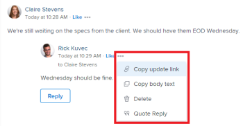

# 更新工作

<!--take "Beta" references out when we remove the beta-->

本頁醒目提示的資訊指出尚未普遍可用的功能。 它僅適用於預覽環境中的所有客戶。

>[!NOTE]
>
>我們目前正在重新設計Adobe Workfront中的評論體驗。
>
>如需有關新評論體驗的詳細資訊，請參閱 [新的評論體驗](../../product-announcements/betas/new-commenting-experience-beta/unified-commenting-experience.md).
>
>您可以存取下列物件的新體驗：
> * 問題， 專案、任務和檔案.
>
>     當您啟用註解Beta版體驗時，即可使用此功能。
>
>     此功能僅適用於「更新」區段，不適用於以下區域：
>
>     * 首頁
>     * 清單中的摘要面板
>     * 時程表中的摘要面板
>
> * 面板區域中的目標、卡片
>
>   新的評論體驗是目標和卡的唯一體驗。 您必須有其他授權才能存取Workfront目標。 如需詳細資訊，請參閱 [使用Workfront目標的需求](../../workfront-goals/goal-management/access-needed-for-wf-goals.md).
>
>     當您啟用卡片上的「註解」和「系統活動」區段時，您可以在「面板」區域中新增和檢視卡片的更新。 如需詳細資訊，請參閱 [新增臨機卡到展示板](../../agile/get-started-with-boards/add-card-to-board.md).

您可以在「更新」區段中對Adobe Workfront中的大多數物件新增註解。 如需有關哪些物件會顯示「更新」區段的詳細資訊，請參閱 [更新區段概觀](../updating-work-items-and-viewing-updates/updates-tab-overview.md).

您可以在Workfront物件（專案、任務或問題）上新增更新，以便在您註解物件時傳達物件的進度。 指派或訂閱物件的使用者可以檢視您的更新。 您也可以標籤使用者，讓使用者關注更新。 標籤的使用者會收到應用程式內通知及您更新的電子郵件。 如需詳細資訊，請參閱 [標籤其他更新的專案](../../workfront-basics/updating-work-items-and-viewing-updates/tag-others-on-updates.md).

您可以將註解新增至可以檢視的物件，也可以以Workfront或群組管理員身分登入，並代表其他使用者新增註解。 如需詳細資訊，請參閱 [以其他使用者身分登入](../../administration-and-setup/add-users/create-and-manage-users/log-in-as-another-user.md).

本頁資訊說明如何評論Workfront物件，以及如何更新專案、任務和問題。 如需有關對目標發表註解的資訊，請參閱 [在Adobe Workfront目標中管理目標註解](../../workfront-goals/goal-management/manage-goal-comments.md). 您必須有其他授權才能存取Workfront目標。

您可以從Workfront的下列區域將更新新增到專案、任務和問題：

* 從Workfront物件，在更新區段
* 從首頁區域（用於任務和問題）
* 從「摘要」面板中放入物件清單（適用於任務和問題）
* 從時程表（用於任務和問題）

## 存取需求

<!--
drafted for P&P release:
<table style="table-layout:auto"> 
 <col> 
 </col> 
 <col> 
 </col> 
 <tbody> 
  <tr> 
   <td role="rowheader"><strong>Adobe Workfront plan*</strong></td> 
   <td> 
Any
 </td> 
  </tr> 
  <tr> 
   <td role="rowheader"><strong>Adobe Workfront license*</strong></td> 
   <td> 
Current license: Contributor or higher for issues and documents: Light or higher for all other objects
 
   Or
   
Legacy  license: Request or higher for issues and documents; Review or higher for all other objects

   </td> 
  </tr> 
  <tr> 
   <td role="rowheader"><strong>Access level configurations*</strong></td> 
   <td> 
View or Edit access for the object the update is on
 
<b>NOTE</b>
   
   If you still don't have access, ask your Workfront administrator if they set additional restrictions in your access level. For information on how a Workfront administrator can modify your access level, see <a href="../../administration-and-setup/add-users/configure-and-grant-access/create-modify-access-levels.md" class="MCXref xref">Create or modify custom access levels</a>.
 </td> 
  </tr> 
  <tr> 
   <td role="rowheader"><strong>Object permissions</strong></td> 
   <td> 
View access to the object
 
For information on requesting additional access, see <a href="../../workfront-basics/grant-and-request-access-to-objects/request-access.md" class="MCXref xref">Request access to objects </a>.
 </td> 
  </tr> 
 </tbody> 
</table>
-->
您必須具有下列存取權才能執行本文中的步驟：

<table style="table-layout:auto"> 
 <col> 
 </col> 
 <col> 
 </col> 
 <tbody> 
  <tr> 
   <td role="rowheader"><strong>Adobe Workfront計畫*</strong></td> 
   <td> 
任何
 </td> 
  </tr> 
  <tr> 
   <td role="rowheader"><strong>Adobe Workfront授權*</strong></td> 
   <td> 
請求或更高版本以處理問題和檔案；檢閱或更高版本以處理所有其他物件
 </td> 
  </tr> 
  <tr> 
   <td role="rowheader"><strong>存取層級設定*</strong></td> 
   <td> 
檢視或編輯更新所在物件的存取權
 
<b>附註</b>

如果您仍然沒有存取權，請詢問您的Workfront管理員是否對您的存取層級設定了其他限制。 如需有關Workfront管理員如何修改您的存取層級的資訊，請參閱 <a href="../../administration-and-setup/add-users/configure-and-grant-access/create-modify-access-levels.md" class="MCXref xref">建立或修改自訂存取層級</a>.
 </td>
</tr> 
  <tr> 
   <td role="rowheader"><strong>物件許可權</strong></td> 
   <td> 
檢視物件的存取權
 
如需請求其他存取許可權的詳細資訊，請參閱 <a href="../../workfront-basics/grant-and-request-access-to-objects/request-access.md" class="MCXref xref">要求物件的存取權 </a>.
 </td> 
  </tr> 
 </tbody> 
</table>

&#42;若要瞭解您擁有的計畫、授權型別或存取權，請聯絡您的Workfront管理員。

## 將更新新增至工作專案

<!--drafted for the commenting experience - change the NOTE at the top of the following section with every new release to other objects -->

將更新新增至工作專案會因更新區段的版本以及您選擇的物件而異。

### 在目前更新區段中新增工作項的更新

>[!NOTE]
>
>下列功能適用於目標與卡片以外的所有物件。 您必須有其他授權才能存取Workfront目標。 如需有關對目標發表註解的資訊，請參閱 [在Adobe Workfront目標中管理目標註解](../../workfront-goals/goal-management/manage-goal-comments.md).
>
>當您啟用卡片上的「註解」和「系統活動」區段時，您可以在「展示板」區域中新增和檢視卡片的更新。 如需詳細資訊，請參閱 [新增臨機卡到展示板](../../agile/get-started-with-boards/add-card-to-board.md).

1. 前往您要提供更新的工作專案（例如專案、任務或問題）。
1. 按一下 **更新** 區段。
1. 按一下 **開始新的更新，** 然後輸入您的更新。
1. （選用）使用RTF文字，或在更新中新增表情符號、連結或影像，以增強您的內容。 如需詳細資訊，請參閱 [在Workfront更新中使用RTF文字](#use-rich-text-in-a-workfront-update) 章節
1. （選用）更新下列任何有關工作專案的資訊：

   <table style="table-layout:auto"> 
    <col> 
    <col> 
    <tbody> 
     <tr> 
      <td role="rowheader"><strong>通知</strong></td> 
      <td>識別必須收到更新通知的使用者。 指派或訂閱物件的使用者會在進行更新時自動收到通知。 
如需如何在更新中包含其他人的詳細資訊，請參閱 <a href="../../workfront-basics/updating-work-items-and-viewing-updates/tag-others-on-updates.md" class="MCXref xref">標籤其他更新的專案</a>.
</td> 
     </tr> 
     <tr> 
      <td role="rowheader"><strong>認可日期</strong></td> 
      <td>在日期選擇器中，選取您認可完成工作專案的日期。 如需認可日期的相關資訊，請參閱 <a href="../../manage-work/projects/updating-work-in-a-project/overview-of-commit-dates.md" class="MCXref xref">認可日期總覽</a>.</td> 
     </tr> 
     <tr> 
      <td role="rowheader"><strong>狀況</strong></td> 
      <td>為任務或問題選取新條件。 如需選取條件的詳細資訊，請參閱 <a href="../../manage-work/projects/updating-work-in-a-project/update-condition-for-tasks-and-issues.md" class="MCXref xref">更新任務和問題的條件</a>.</td> 
     </tr> 
     <tr> 
      <td role="rowheader"><strong>狀態</strong></td> 
      <td>按一下目前狀態旁邊的箭頭，然後從下拉式選單中選取所需的狀態。 如需有關設定「狀態」的資訊，請參閱 <a href="../../manage-work/projects/updating-work-in-a-project/update-task-status.md" class="MCXref xref">更新任務狀態</a>.
更新工作專案的狀態不會自動變更專案狀態。 視專案的設定方式而定，您可能必須個別更新專案狀態。 如需各種專案更新型別的詳細資訊，請參閱 <a href="../../manage-work/projects/manage-projects/select-project-update-type.md" class="MCXref xref">選取專案更新型別 </a>.

<b>附註</b>

   當工作專案處於未決核准狀態時，您無法變更工作專案的狀態。
</td>
   </tr> 
     <tr> 
      <td role="rowheader"><strong>完成列</strong></td> 
      <td>（僅適用於任務）將進度列滑至所需的百分比，以指出已完成工作的百分比。 您也可以連按兩下完成列，然後輸入完成百分比。</td> 
     </tr> 
     <tr> 
      <td role="rowheader"><strong>成為我公司所私有</strong></td> 
      <td> 
停用此選項可防止公司外部的使用者擁有檢視此更新的存取權。
 
      
<b>附註</b>

      
此選項僅在使用者與公司相關聯時顯示。

      </td> 
     </tr> 
    </tbody> 
   </table>

1. 按一下 **更新** 將更新新增至Workfront物件。

   >[!NOTE]
   >
   >按一下後會顯示一個小型快顯視窗7秒 **更新**，可讓您在發佈更新前復原更新並返回編輯窗格。 如果您關閉復原快顯視窗、等待快顯視窗消失，或離開頁面，則會發佈更新。
   >
   >如果您的Workfront管理員在存取層級中選取「永不允許使用者刪除註解」設定，您便無法還原註解。 如需詳細資訊，請參閱 [建立和修改自訂存取層級](../../administration-and-setup/add-users/configure-and-grant-access/create-modify-access-levels.md).

1. 若要回覆更新，請參閱 [回覆更新](../../workfront-basics/updating-work-items-and-viewing-updates/reply-to-updates.md).

### 使用備註測試版體驗新增工作專案的更新

如需有關新註解體驗的可用功能和哪些物件的資訊，請參閱 [新的評論體驗](../../product-announcements/betas/new-commenting-experience-beta/unified-commenting-experience.md).

1. 找到您要更新的物件，然後按一下其名稱以開啟物件的頁面。
1. 按一下  **更新** 在左側面板中。
1. 啟用 **註解Beta版** 在「更新」區域的右上角切換，然後按一下 **同意** （在Beta版協定上）。 這會將「更新」區域切換為註解Beta版體驗。
此 **註解** 標籤預設為選取。
1. 開始在 **新註解** 方塊。

   

   >[!TIP]
   >
   >在您完成輸入和提交評論之前離開更新區段時，即使您登出並重新登入，頁面上的評論仍會以草稿模式顯示。 任何新增至註解的影像也會儲存在草稿中。 草稿會儲存7天，之後便會捨棄且無法復原。 草擬的註解僅對輸入註解的使用者可見。

1. （可選）若要復原或重做變更，請使用下列快速鍵：
   * CTRL + Z (Mac為⌘ + z)可復原變更
   * 按CTRL + Y (Mac為⌘ + y)以重做變更
1. （選用）在 **標籤人員或團隊** 區域，開始輸入使用者名稱或電子郵件，或您想包含在此評論中的團隊，然後當它顯示在清單中時選取它。
1. （可選）若要新增RTF格式至您的更新，請使用 **RTF文字** 工具列來增強您的文字：

   * 粗體
   * 斜體
   * 底線
   * 連結
   * 項目符號清單
   * 編號清單
   * 新增附件 <!--(mark this parenthesis as draft: ************ this might be renamed to "Add image")-->

   如需詳細資訊，請參閱 [在Workfront更新中使用RTF文字](#use-rich-text-in-a-workfront-update) 章節。 <!--remove this list, above, when we get to parity for Rich Text-->

   >[!TIP]
   >
   >如果其他使用者將評論提交給您正在更新的相同專案，將有帶有「新」指示器的紅線通知您較新的評論。
   >
   >指示器只會在評論提交至專案後才顯示，不會在評論仍然撰寫時顯示。
   >
   >「新」指標只有在輸入新更新的使用者以及目前輸入更新的使用者都使用新評論體驗時才會顯示。
   >

1. 按一下 **提交** 將更新新增至Workfront物件。
1. （可選）若要編輯註解，請按一下 **更多** 功能表  按一下「讚」圖示右側，然後按一下 **編輯**.
1. 編輯評論中的資訊、新增或移除影像，或移除任何已標籤的使用者。
您可以在15分鐘內編輯評論，而無需提交評論。 「已編輯」指標會新增至更新評論時顯示的日期戳記左側。

   

   >[!TIP]
   >
   >* 系統會產生電子郵件，僅當您提交原始更新時，才會通知使用者您的更新。 編輯更新後不會產生電子郵件。
   >* 評論旁的日期戳記是原始評論的日期，而不是上次編輯的日期。

1. （可選）按一下 **回覆** 若要回覆現有註解，請遵循上述步驟4至7。 <!--(**************insure this stays accurate***********)-->. 如需有關回覆更新的資訊，請參閱 [回覆更新](../../workfront-basics/updating-work-items-and-viewing-updates/reply-to-updates.md).
1. （有條件和選擇性）如果其他使用者新增了在「更新」區段的可見區域外顯示的註解，請按一下 **檢視** 藍色內部 **新評論橫幅** 在熒幕底部顯示這些註解。

   

   熒幕底部會顯示其他註解。

   >[!NOTE]
   >
   >   「新註解」指標和「檢視」按鈕只有在進入新更新的使用者以及目前檢視更新區段的使用者都使用新註解體驗時才會顯示。

1. （可選）按一下 **按讚** 圖示. 圖示會隨著喜歡的數量而更新。
1. （條件式與選擇式）如果您在註解中包含其他人員，請按一下更新中包含的成員數，以顯示與您輸入的註解共用的實體清單。

   
1. （可選）按一下 **系統活動** 索引標籤來檢視系統記錄的更新。 當物件或其任何子系更新時，Workfront會產生有關該更新的備註，並顯示在「系統活動」標籤中。

   如需詳細資訊，請參閱 [更新區段概觀](../updating-work-items-and-viewing-updates/updates-tab-overview.md)

   >[!TIP]
   >
   >您無法將註解新增至系統更新。

## 在Workfront更新中使用RTF文字{#use-rich-text-in-a-workfront-update}

<!--remove this top note when we get to parity with the current version, OR change the note to mention that some options are ONLY available in the Beta version and not the current one.-->

>[!NOTE]
>
>RTF工具列中的某些選項可能不適用於評論Beta版體驗。

您可以使用RTF或新增各種專案（例如emoji、連結或影像）來增強更新。

1. 前往更新區域並開始輸入評論。
1. （可選）若要新增RTF格式至您的更新，請使用 **RTF文字** 工具列。

   | **屬性** | **工具列按鈕** | **Mac快速鍵** | **Windows快速鍵** |
   |---|---|---|---|
   | 粗體 |  | ⌘+b | Ctrl+B |
   | 斜體 |  | ⌘+i | Ctrl+I |
   | 底線 |  | ⌘+u | Ctrl+U |
   | 超連結 |  |  若要開啟「建立連結」或「新增連結」方塊： ⌘+K   在備註測試版體驗中，若要在選取的文字上貼上連結： ⌘+V  |  若要開啟「建立連結」或「新增連結」方塊：Ctrl+K   在備註測試版體驗中，若要在選取的文字上貼上連結： Ctrl+V  |
   | 項目符號清單 |  | ⌘+Shift+8 | Ctrl+Shift+8 |
   | 編號清單 |  | ⌘+Shift+7 | Ctrl+Shift+7 |
   | 封鎖報價 |  | ⌘+Shift+9 | Ctrl+Shift+9 |

   若要停止格式化文字，請取消選取 **RTF文字** 工具列。

   <!-- in the table above: take "Create Links" verbiage from the hyperlink when the old commenting is removed and the commenting beta is the only way to comment-->

   >[!NOTE]
   >
   >* 使用者收到的任何包含您更新的電子郵件通知中也都會顯示格式。
   >* 在「更新」標籤中檢視更新時，套用至電子郵件中更新的RTF格式不會顯示在更新上。
   >* 如果您的組織使用Workfront搭配Internet Explorer，則貼到更新中的任何格式化文字都會遺失RTF格式，並顯示為純文字。 您可以使用RTF工具列上的屬性來重新格式化文字。
   >* RTF格式不適用於「時程表」區域中所做的更新，或報表中檢視的「附註」和「最後條件」物件。

1. （選擇性）如果您想要包含先前更新或其他來源的文字，並將其與您自己的更新區分開來，您可以將其標示為「區塊報價」。 按一下 **封鎖報價** 圖示  並輸入您要引述的文字。 引號文字會顯示以垂直灰色線標示。 按一下 **封鎖報價** 圖示以恢復正常格式。

   

1. （選用）將表情符號新增至您的更新。

   >[!NOTE]
   >
   >* Workfront不會以表情符號取代標點符號表情符號，例如：)。
   >* 表情符號不適用於時程表區域中所做的更新，或報告中檢視的附註和上次條件物件。
   >* Workfront中的emoji功能使用Unicode字元，因此只會在支援Unicode字碼點的瀏覽器和作業系統上顯示。 平台、瀏覽器或作業系統版本與您的不同之使用者，可能無法存取相同的emoji。
   >* 不支援的emoji會以黑白方塊表示。
   >* Windows 7僅支援黑白表情符號。
   >* 在「更新」區域中檢視時，套用至透過電子郵件進行的更新的Emoji不會顯示在更新上。

1. （選用）若要新增其他資訊來源的URL連結：

   1. 在更新中按一下您要插入連結的位置。
   1. 於 **RTF文字** 工具列，按一下 **超連結** 圖示 .

   1. 在 **建立連結** 方塊，位於 **URL**，輸入或貼上您要連結之來源的URL。

   1. 下 **要顯示的文字**，輸入或貼上連結文字。
   1. 按一下&#x200B;**儲存**。

1. （可選）若要將影像附加至您的更新，請根據您使用的環境執行下列任一項作業：

   * 按一下 **影像** 圖示  並瀏覽至您電腦上的影像，或在使用目前的更新體驗時將影像拖曳至更新區域

   或

   按一下 **新增附件** 圖示  使用註解Beta版體驗時，並瀏覽至電腦上的影像。 <!--the name of the icon and the icon for it might change-->

   >[!NOTE]
   >
   >* 您的Workfront管理員必須先在Workfront介面區域的「更新摘要偏好設定」區段中啟用新增影像，您才能看到「影像」或「新增附件」圖示。 如需詳細資訊，請參閱 [設定使用者更新的偏好設定](../../administration-and-setup/set-up-workfront/system-tracked-update-feeds/configure-preferences-user-updates.md).
   >* 影像檔案大小上限為7 MB。 支援的影像檔案型別為.jpg、.gif和.png。
   >* 影像可從物件的「更新」區段中存取，也可以在「檔案」區域中存取。
   >* 您可以傳送包含影像但不含文字的更新。
   >* 當您刪除包含影像的註解時，根據您選擇的體驗，會出現以下情況：
   >
   >     * 在目前的註解體驗中，影像仍會保留在檔案區域中，但在更新區段中不再顯示。
   >     * 在新註解體驗中，影像會從「更新」區段及「檔案」區域移除。 當您編輯註解並刪除影像時，該影像也會從「檔案」區域刪除。
   >* 當有人從「檔案」區域刪除附加至註解的影像時，該影像也會從註解中移除。

1. 按一下 **更新**  或 **提交**，當使用評論Beta版體驗時。

## 複製更新資訊

有數種方式可以複製更新。 複製連結後，您可以與其他人共用連結，以將他們導向更新。

複製更新會因您使用的評論體驗而異。

### 複製目前評論體驗中的更新

* [複製更新](#copy-the-update)
* [複製執行緒連結](#copy-the-thread-link)
* [複製更新連結](#copy-the-update-link)

#### 複製更新 {#copy-the-update}

此選項會將文字從特定更新複製到剪貼簿。

1. 前往更新或您要複製的回覆。
1. 按一下 **更多** 功能表，然後按一下 **複製內文**.

   

#### 複製執行緒連結 {#copy-the-thread-link}

此選項會將完整對話串連結複製到剪貼簿，以便您與其他使用者共用對話串。

1. 前往您要複製的更新執行緒。

1. 按一下 **更多** 功能表，然後按一下 **複製執行緒連結**.

   

#### 複製更新連結 {#copy-the-update-link}

此選項會將特定的更新連結複製到剪貼簿。 當您共用更新連結時，追蹤該連結的使用者會看到更新周圍的邊框。

1. 前往更新或您要複製的回覆。
1. 按一下 **更多** 個別更新旁的功能表，然後按一下 **複製更新連結**.

   

### 複製新評論體驗中的更新

如需有關新註解體驗的可用功能和哪些物件的資訊，請參閱 [新的評論體驗](../../product-announcements/betas/new-commenting-experience-beta/unified-commenting-experience.md).

<!--when we remove and deprecate the legacy stream, add screen shots in the secitons below-->

* [複製連結](#copy-link)
* [複製本文](#copy-body-text)

#### 複製連結

此選項會將註解或對話串連結複製到剪貼簿，以便您與其他使用者共用註解或整個對話串。

1. 前往您要複製其連結的更新。

1. 按一下 **更多** 功能表，然後按一下 **複製連結**.

#### 複製本文

此選項會將文字從特定更新複製到剪貼簿。

1. 前往更新或您要複製的回覆。
1. 按一下 **更多** 功能表，然後按一下 **複製內文**.

## 刪除更新或回覆

根據Workfront管理員賦予您的存取權，您或許可以刪除在物件的「更新」標籤上新增的更新。 如需詳細資訊，請參閱 [建立或修改自訂存取層級](../../administration-and-setup/add-users/configure-and-grant-access/create-modify-access-levels.md#creating-a-new-access-from-scratch) 在文章中 [建立或修改自訂存取層級](../../administration-and-setup/add-users/configure-and-grant-access/create-modify-access-levels.md).

Workfront使用者(包括Workfront管理員)無法刪除其他使用者所做的更新。 但是，如果使用者的存取層級允許他們刪除自己的更新，Workfront管理員可以以該使用者的身分登入，並刪除他們所做的更新。 如需詳細資訊，請參閱 [建立或修改自訂存取層級](../../administration-and-setup/add-users/configure-and-grant-access/create-modify-access-levels.md#creating-a-new-access-from-scratch) 和 [以其他使用者身分登入](../../administration-and-setup/add-users/create-and-manage-users/log-in-as-another-user.md).

1. 前往您要刪除的更新或回覆。
1. 按一下 **更多** 您想要刪除的更新或回覆旁的功能表，然後按一下 **刪除**.

   

1. 在出現的訊息中，按一下 **確認** 或按 **刪除**，當使用評論Beta版體驗時。

   >[!NOTE]
   >
   >刪除具有附加影像的更新會同時刪除註解和影像。 如需詳細資訊，請參閱 [在Workfront更新中使用RTF文字](#use-rich-text-in-a-workfront-update) 章節。

   當您刪除的評論有關聯的回覆時，會指出該評論已移除，並附有移除該評論的使用者名稱。

   

   使用備註測試版體驗時，已刪除的備註會立即從Workfront中移除。 使用更新區段的使用者會即時看到另一個使用者正在刪除評論。

   <!--when we remove the beta, take out the first part of the sentence above about only when commenting in beta experience. Leave the rest though-->

## 在時程表上新增更新

1. 前往您要進行更新的時程表。
1. 按一下時程表以開啟。
1. 在時程表底部，按一下 **包含註解**.
1. 在時程表底部顯示的方塊中，輸入更新。

   

1. （視條件而定）若要儲存更新而不提交時程表以供核准，請按一下 **儲存以供稍後使用**.

   或

   若要儲存更新並提交時程表以供核准，請按一下 **提交以進行核准**.

   或

   如果您的時程表未由核准者設定，請按一下 **儲存並關閉時程表** 以儲存您的更新。

## 啟用或停用系統更新

<!--remove the preview tag with 23.2 production, but keep the note till we remove Beta and it becomed the only exprience: -->

>[!NOTE]
>
>使用Beta版評論體驗時，無法停用系統更新。
>本節中的資訊僅指目前更新章節中可用的功能。
>如需Beta版系統更新的詳細資訊，請參閱 [更新區段概觀](../updating-work-items-and-viewing-updates/updates-tab-overview.md).

Workfront物件的「更新」區段會顯示兩種資訊：

* **使用者更新：** 使用者更新是您和您系統中的其他使用者輸入的評論。

  

* **系統更新：** 系統更新記錄移除資產、新增或刪除版本、附加或移除核准請求，以及對物件上的檔案所做的任何編輯或變更。

  

根據您的Workfront授權，系統更新可能會依預設啟用。 Workfront管理員可決定系統更新中會追蹤哪些專案，如中所述 [系統追蹤更新](../../administration-and-setup/set-up-workfront/system-tracked-update-feeds/system-tracked-update-feeds.md). 您也可以篩選掉系統更新或活動，以便只看到所有物件的使用者更新。

如需使用者與系統更新之間差異的詳細資訊，請參閱 [系統追蹤更新](../../administration-and-setup/set-up-workfront/system-tracked-update-feeds/system-tracked-update-feeds.md).

若要啟用或停用系統更新：

1. 按一下 **更新** 標籤上的物件。
1. 按一下 **顯示系統更新** 向左滑動（停用）或向右滑動（啟用）。

   

   此選項會持續存在於整個Workfront的所有物件中，並保持在您選取的位置，即使您登出Workfront亦然。

