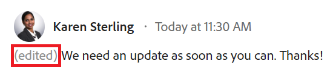
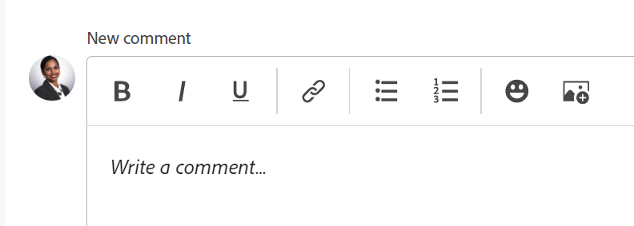

# 更新工作

<!--take "Beta" references out when we remove the beta and change "current" to "legacy" after October 26-->

本頁醒目提示的資訊指出尚未普遍可用的功能。 它僅在預覽環境中可供所有客戶使用。 每月發行至生產環境後，生產環境中為啟用快速發行的客戶也提供相同的功能。 \
如需快速發行版本的相關資訊，請參閱 [啟用或停用組織的快速發行](../../administration-and-setup/set-up-workfront/configure-system-defaults/enable-fast-release-process.md)

如需目前發行排程的詳細資訊，請參閱 [2023年第四季版本總覽](../../product-announcements/product-releases/23-q4-release-activity/23-q4-release-overview.md)

>[!IMPORTANT]
>
>我們目前正在重新設計Adobe Workfront中的評論體驗。
>根據您存取評論體驗的環境和物件，您可能會在更新區段中看到不同的功能。
>
>如需有關新評論體驗及其可用性的詳細資訊，請參閱 [新的評論體驗](../../product-announcements/betas/new-commenting-experience-beta/unified-commenting-experience.md).
>
>新註解體驗僅適用於「更新」區段，不適用於下列區域：
>
> * 首頁
> * 清單中的摘要面板
> * 時程表中的摘要面板

<!-- with October 26 release: add somewhere this, and decide where we need to keep information about the legacy commenting. Should we create an article about iterations comments like we have for goals and cards?!:

>[!NOTE]
>
>Iterations display the legacy commenting experience.-->

<!--old message, before Auhust 17: 

>[!NOTE]
>
>We are currently redesigning the commenting experience in Adobe Workfront.
>
>For more information about the new commenting experience, see [New commenting experience](../../product-announcements/betas/new-commenting-experience-beta/unified-commenting-experience.md). 
>
>You can access the new experience for the following objects:
> * Issues, projects, tasks, and documents.
>
>     This is available when you enable the commenting Beta experience.
>
>     This functionality is available only for the Updates section, and it is not available for the following areas:
>
>     * Home
>     * Summary panel in lists
>     * Summary panel in timesheets
>
> * Goals, cards in the Boards area
>
>   The new commenting experience is the only experience for goals and cards. You must have an additional license to access Workfront Goals. For more information, see [Requirements to use Workfront Goals](../../workfront-goals/goal-management/access-needed-for-wf-goals.md). 
>
>     You can add and view updates to cards in the Boards area when you enable the Comments and System Activity sections on a card. For more information, see [Add an ad hoc card to a board](../../agile/get-started-with-boards/add-card-to-board.md).
-->

## 更新工作的相關考量事項

* 您可以在「更新」區段中，將註解新增至Adobe Workfront中的大部分物件。 如需有關哪些物件會顯示「更新」區段的詳細資訊，請參閱 [更新區段概觀](../updating-work-items-and-viewing-updates/updates-tab-overview.md).

* 您可以從與Workfront整合的其他應用程式或Workfront行動應用程式，將註解新增至Workfront物件。

  並非所有與Workfront整合的應用程式都能為Workfront物件新增註解。

  從應用程式存取Workfront物件時，並非所有其他應用程式都能使用Workfront物件更新區段中可用的所有功能。 例如，從協力廠商應用程式將評論新增至Workfront物件時，RTF功能或讓評論成為某人的公司私密可能無法使用。

* 您可以在註解物件時傳達Workfront物件（專案、任務或問題）的進度。 指派或訂閱物件的使用者可收到有關您更新的通知。 擁有物件檢視存取許可權的任何人都可以檢視您的更新。

* 您可以標籤使用者，讓他們注意更新。 標籤的使用者會收到應用程式內通知及您更新的電子郵件。

  >[!TIP]
  >
  >   在新的註解體驗中，註解擁有者會被自動標籤。 如需詳細資訊，請參閱 [標籤其他人的更新](../../workfront-basics/updating-work-items-and-viewing-updates/tag-others-on-updates.md).
  <!--take the "in the new commenting experience" out when this is the only experience-->

* 您可以將註解新增至可以檢視的物件，也可以以Workfront或群組管理員身分登入，並代表其他使用者新增註解。 如需詳細資訊，請參閱 [以其他使用者身分登入](../../administration-and-setup/add-users/create-and-manage-users/log-in-as-another-user.md).

* 您可以從Workfront的下列區域新增更新至專案、任務和問題：

   * 從Workfront物件，在更新區段
   * 從首頁區域（用於任務和問題）
   * 從物件清單中的摘要面板或時間表（用於任務和問題）

本頁資訊說明如何評論Workfront物件，以及如何更新專案、任務和問題。

如需有關註解目標的資訊，請參閱 [在Adobe Workfront目標中管理目標註解](../../workfront-goals/goal-management/manage-goal-comments.md). 您必須額外擁有授權才能存取Workfront目標。

如需在「面板」區域中註解卡片的相關資訊，請參閱 [新增臨機卡到展示板](../../agile/get-started-with-boards/add-card-to-board.md).

## 存取需求

<!--
drafted for P&P release:
<table style="table-layout:auto"> 
 <col> 
 </col> 
 <col> 
 </col> 
 <tbody> 
  <tr> 
   <td role="rowheader"><strong>Adobe Workfront plan*</strong></td> 
   <td> 
Any
 </td> 
  </tr> 
  <tr> 
   <td role="rowheader"><strong>Adobe Workfront license*</strong></td> 
   <td> 
Current license: Contributor or higher for issues and documents: Light or higher for all other objects
 
   Or
   
Legacy  license: Request or higher for issues and documents; Review or higher for all other objects

   </td> 
  </tr> 
  <tr> 
   <td role="rowheader"><strong>Access level configurations*</strong></td> 
   <td> 
View or Edit access for the object the update is on
 
<b>NOTE</b>
   
   If you still don't have access, ask your Workfront administrator if they set additional restrictions in your access level. For information on how a Workfront administrator can modify your access level, see <a href="../../administration-and-setup/add-users/configure-and-grant-access/create-modify-access-levels.md" class="MCXref xref">Create or modify custom access levels</a>.
 </td> 
  </tr> 
  <tr> 
   <td role="rowheader"><strong>Object permissions</strong></td> 
   <td> 
View access to the object
 
For information on requesting additional access, see <a href="../../workfront-basics/grant-and-request-access-to-objects/request-access.md" class="MCXref xref">Request access to objects </a>.
 </td> 
  </tr> 
 </tbody> 
</table>
-->
您必須具有下列存取權才能執行本文中的步驟：

<table style="table-layout:auto"> 
 <col> 
 </col> 
 <col> 
 </col> 
 <tbody> 
  <tr> 
   <td role="rowheader"><strong>Adobe Workfront計畫*</strong></td> 
   <td> 
任何
 </td> 
  </tr> 
  <tr> 
   <td role="rowheader"><strong>Adobe Workfront授權*</strong></td> 
   <td> 
要求或更高的問題和檔案；檢閱或更高的所有其他物件
 </td> 
  </tr> 
  <tr> 
   <td role="rowheader"><strong>存取層級設定*</strong></td> 
   <td> 
檢視或編輯更新所在物件的存取權
 
<b>附註</b>

如果您還是沒有存取權，請詢問您的Workfront管理員，他們是否在您的存取層級中設定其他限制。 如需有關Workfront管理員如何修改您的存取層級的資訊，請參閱 <a href="../../administration-and-setup/add-users/configure-and-grant-access/create-modify-access-levels.md" class="MCXref xref">建立或修改自訂存取層級</a>.
 </td>
</tr> 
  <tr> 
   <td role="rowheader"><strong>物件許可權</strong></td> 
   <td> 
檢視物件的存取權
 
如需請求其他存取許可權的詳細資訊，請參閱 <a href="../../workfront-basics/grant-and-request-access-to-objects/request-access.md" class="MCXref xref">要求物件的存取權 </a>.
 </td> 
  </tr> 
 </tbody> 
</table>

&#42;若要瞭解您擁有的計畫、授權型別或存取權，請聯絡您的Workfront管理員。

## 將更新新增至工作專案

將更新新增至工作專案會因更新區段的版本以及您選擇的物件而有所不同。

### 在目前的更新區段中新增更新至工作專案

<!--on October 26, replace "current" with "legacy"-->

>[!NOTE]
>
>下列功能適用於目標與卡片以外的所有物件。 您必須額外擁有授權才能存取Workfront目標。 如需有關註解目標的資訊，請參閱 [在Adobe Workfront目標中管理目標註解](../../workfront-goals/goal-management/manage-goal-comments.md).
>
>當您啟用卡片上的「註解」和「系統活動」區段時，您可以在「面板」區域中新增和檢視卡片的更新。 如需詳細資訊，請參閱 [新增臨機卡到展示板](../../agile/get-started-with-boards/add-card-to-board.md).

1. 移至您要為其提供更新的工作專案（例如專案、任務或問題）。
1. 按一下 **更新** 區段。
1. 按一下 **開始新的更新，** 然後輸入您的更新。
1. （選用）使用RTF文字，或在更新中新增emoji、連結或影像，以增強您的內容。 如需詳細資訊，請參閱 [在Workfront更新中使用RTF文字](#use-rich-text-in-a-workfront-update) 一節。
1. （選擇性）更新下列任何有關工作專案的資訊：

   <table style="table-layout:auto"> 
    <col> 
    <col> 
    <tbody> 
     <tr> 
      <td role="rowheader"><strong>通知</strong></td> 
      <td>識別必須收到更新通知的使用者。 指定或訂閱物件的使用者會在進行更新時自動收到通知。 
如需如何在更新中包含其他專案的詳細資訊，請參閱 <a href="../../workfront-basics/updating-work-items-and-viewing-updates/tag-others-on-updates.md" class="MCXref xref">標籤其他人的更新</a>.
</td> 
     </tr> 
     <tr> 
      <td role="rowheader"><strong>認可日期</strong></td> 
      <td>在日期選擇器中，選取您認可完成工作專案的日期。 如需有關認可日期的資訊，請參閱 <a href="../../manage-work/projects/updating-work-in-a-project/overview-of-commit-dates.md" class="MCXref xref">認可日期總覽</a>.</td> 
     </tr> 
     <tr> 
      <td role="rowheader"><strong>狀況</strong></td> 
      <td>為任務或問題選取新條件。 如需有關選取條件的資訊，請參閱 <a href="../../manage-work/projects/updating-work-in-a-project/update-condition-for-tasks-and-issues.md" class="MCXref xref">更新任務和問題的條件</a>.</td> 
     </tr> 
     <tr> 
      <td role="rowheader"><strong>狀態</strong></td> 
      <td>按一下目前狀態旁邊的箭頭，然後從下拉式選單中選取所需的狀態。 如需有關設定「狀態」的資訊，請參閱 <a href="../../manage-work/projects/updating-work-in-a-project/update-task-status.md" class="MCXref xref">更新任務狀態</a>.
更新工作專案的狀態不會自動變更專案狀態。 視您專案的設定方式而定，您可能會個別更新專案狀態。 如需各種專案更新型別的詳細資訊，請參閱 <a href="../../manage-work/projects/manage-projects/select-project-update-type.md" class="MCXref xref">選取專案更新型別 </a>.

<b>附註</b>

   當工作專案處於未決核准狀態時，您無法變更其狀態。
</td>
   </tr> 
     <tr> 
      <td role="rowheader"><strong>完成列</strong></td> 
      <td>（僅適用於任務）將進度列滑至所需的百分比，以指出已完成工作的百分比。 您也可以連按兩下完成列並輸入完成百分比。</td> 
     </tr> 
     <tr> 
      <td role="rowheader"><strong>成為我公司所私有</strong></td> 
      <td> 
停用此選項可防止公司外部的使用者擁有檢視此更新的存取權。
 
      
<b>附註</b>

      
只有在使用者與公司相關聯時，才會顯示此選項。

      
此選項並非適用於所有您可從中新增更新的區域。 例如，您無法從第三方應用程式新增更新。 

      </td> 
     </tr> 
    </tbody> 
   </table>

1. 按一下 **更新** 將更新新增至Workfront物件。

   >[!NOTE]
   >
   >按一下後會顯示一個小型快顯視窗7秒 **更新**，可讓您復原更新，並在更新發佈前返回編輯窗格。 如果您關閉復原快顯視窗、等待快顯視窗消失或離開頁面，則會發佈更新。
   >
   >如果您的Workfront管理員在存取層級中選取「永不允許使用者刪除註解」設定，您便無法復原註解。 如需詳細資訊，請參閱 [建立和修改自訂存取層級](../../administration-and-setup/add-users/configure-and-grant-access/create-modify-access-levels.md).

1. 若要回覆更新，請參閱 [回覆更新](../../workfront-basics/updating-work-items-and-viewing-updates/reply-to-updates.md).

### 使用新的註解體驗將更新新增到工作專案

如需有關新註解體驗有哪些功能可用以及哪些物件的資訊，請參閱 [新的評論體驗](../../product-announcements/betas/new-commenting-experience-beta/unified-commenting-experience.md).

1. 找到您要更新的物件，然後按一下其名稱以開啟物件的頁面。
1. 按一下  **更新** 在左側面板中。

   此 **註解** 標籤預設為選取。
1. 開始在 **新註解** 方塊。

   

   >[!TIP]
   >
   >在您完成輸入並提交評論之前離開更新區段，即使您登出並重新登入，仍會將頁面上的評論保留在草稿模式中。 加入註解的任何影像也會儲存在草稿中。 草稿會儲存7天，之後便會捨棄且無法復原。 草擬的註解僅對輸入註解的使用者可見。

1. （可選）若要復原或重做變更，請使用下列快速鍵：
   * CTRL + Z (Mac為⌘ + z)可復原變更
   * 按CTRL + Y (Mac則為⌘ + y)以重做變更
1. （選用）在 **標籤人員或團隊** 區域，開始輸入使用者或要納入此註解中的團隊的名稱或電子郵件，然後在其顯示在清單中時選取它。
1. （選用）使用RTF文字，或在更新中新增emoji、連結或影像，以增強您的內容。 如需詳細資訊，請參閱 [在Workfront更新中使用RTF文字](#use-rich-text-in-a-workfront-update) 一節。

   >[!TIP]
   >
   >如果其他使用者向您更新的相同專案提交評論，則會出現帶有「新」指示器的紅線，以通知您較新的評論。
   >
   >指示器只會在提交專案的註解後顯示，不會在註解仍在撰寫時顯示。
   >
   >「新」指標只有在輸入新更新的使用者以及目前輸入更新的使用者都使用新註解體驗時才會顯示。
   >

1. 按一下 **提交** 將更新新增至Workfront物件。
1. （可選）若要編輯註解，請按一下 **更多** 功能表   在註解的右上角，然後按一下 **編輯**.
1. 編輯註解中的資訊、新增或移除影像，或移除任何已標籤的使用者。
您只能在15分鐘內編輯您提交的評論。 「已編輯」指示器會新增至日期戳記的左側，該日期戳記會在輸入評論時顯示。

   >[!TIP]
   >
   >目前年份的評論不會在日期戳記中顯示年份。 將游標暫留在時間戳記上會顯示完整日期，包括年份。

   

   >[!TIP]
   >
   >* 系統只會在您提交原始更新時，才會產生電子郵件通知使用者您的更新。 編輯更新後不會產生電子郵件。
   >* 註解旁邊的日期戳記是原始註解的日期，而不是上次編輯的日期。
   >* 當您代表另一個使用者張貼評論時(當您以Workfront或群組管理員身份登入時)，如果您以其他使用者身份登入，則無法編輯評論。 只有在您以使用者身分登出並以您自己的身分重新登入後，才能編輯註解。

1. （選用）按一下 **回覆** 若要回覆現有註解，請遵循上述步驟4-8。 <!--(**************insure this stays accurate***********)--> 如需有關回覆更新的資訊，請參閱 [回覆更新](../../workfront-basics/updating-work-items-and-viewing-updates/reply-to-updates.md).

   >[!TIP]
   >
   >   若要在現有回覆中新增更多回覆，您可以開始輸入 **新增回覆……** 方塊，或按一下 **回覆** 在原始註解上。 您的回覆會新增至對話串的結尾。

1. （條件式與選擇性）如果其他使用者已新增註釋，且這些註釋顯示在「更新」區段的可見區域之外，請按一下 **檢視** 藍色內部 **新評論橫幅** 在熒幕底部顯示這些註解。

   

   熒幕底部會顯示其他註解。

   >[!NOTE]
   >
   >   「新註解」指標和「檢視」按鈕僅在進入新更新的使用者以及目前檢視更新區段的使用者都使用新註解體驗時顯示。

1. （可選）按一下 **按讚** 圖示. 圖示會隨著喜歡的數量而更新。
1. （條件式與選擇式）如果您在註解中包含其他人員，請按一下更新中包含的成員數目，以顯示與您輸入的註解共用之實體的清單。

   

   >[!TIP]
   >
   >   前兩個已標籤實體的名稱會顯示在它們的頭像旁。 如果兩個以上的圖元被標籤，則只顯示第一個圖元的名稱和其他圖元的數量。

1. （可選）按一下 **系統活動** 標籤以檢視系統記錄的更新。 當物件或其任何子系更新時，Workfront會產生有關該更新的附註，並將其顯示在系統活動標籤中。

   如需詳細資訊，請參閱 [更新區段概觀](../updating-work-items-and-viewing-updates/updates-tab-overview.md)

   >[!TIP]
   >
   >您無法將註解新增至系統更新。

## 在Workfront更新中使用RTF文字{#use-rich-text-in-a-workfront-update}

<!--October 2023: remove this top note when we get to parity with the current version, OR change the note to mention that some options are ONLY available in the Beta version and not the current one.-->

>[!NOTE]
>
>RTF工具列中的某些選項可能不適用於新的評論體驗。

您可以使用RTF或新增各種專案（例如emoji、連結或影像）來增強更新。

1. 前往 **更新** Workfront區域，並開始輸入註解。
1. （可選）若要新增RTF格式至您的更新，請使用 **RTF文字** 工具列。

   

   <!--October 2023: the individual icons in the toolbar will need replacing-->

   | **屬性** | **工具列按鈕** | **Mac快速鍵** | **Windows快速鍵** |
   |---|---|---|---|
   | 粗體 |  | ⌘+b | Ctrl+B |
   | 斜體 |  | ⌘+i | Ctrl+I |
   | 底線 |  | ⌘+u | Ctrl+U |
   | 超連結 |  |  若要開啟「建立連結」或「新增連結」方塊： ⌘+K   在備註測試版體驗中，若要在選取的文字上貼上連結： ⌘+V  |  若要開啟「建立連結」或「新增連結」方塊：Ctrl+K   在備註測試版體驗中，若要將連結貼到選取的文字上：Ctrl+V  |
   | 項目符號清單 |  | ⌘+Shift+8 | Ctrl+Shift+8 |
   | 編號清單 |  | ⌘+Shift+7 | Ctrl+Shift+7 |
   | 封鎖報價 |  | ⌘+Shift+9 | Ctrl+Shift+9 |

   若要停止格式化文字，請取消選取 **RTF文字** 工具列。

   <!-- in the table above: take "Create Links" verbiage from the hyperlink when the old commenting is removed and the commenting beta is the only way to comment - with October 2023-->

   >[!NOTE]
   >
   >* 使用者收到的任何包含您更新的電子郵件通知中，也會顯示格式。
   >* 在更新索引標籤中檢視時，套用至電子郵件中更新的RTF格式未顯示在更新上。
   >* 如果您的組織搭配Internet Explorer使用Workfront，則貼入更新的任何格式化文字都會遺失RTF格式，並顯示為純文字。 您可以使用RTF工具列上的屬性來重新格式化文字。
   >* RTF格式不適用於「時程表」區域中進行的更新，或報表中檢視的「附註」和「最後條件」物件。

1. （選擇性）如果您要包含先前更新或其他來源的文字，並將其與您自己的更新區分開來，您可以將其標示為「區塊報價」。 按一下 **封鎖報價** 圖示  並輸入您要報價的文字。 引號文字會以垂直灰色線標示。 按一下 **封鎖報價** 圖示以恢復正常格式。

   

1. （選用）新增emoji至您的更新。

   >[!NOTE]
   >
   >* Workfront不會以表情符號取代標點符號表情符號，例如：)。
   >* 在報表中檢視的「附註」和「最後條件」物件無法使用Emoji。
   >* Workfront中的emoji功能使用Unicode字元，因此只會在支援Unicode字碼點的瀏覽器和作業系統上顯示。 平台、瀏覽器或作業系統版本與您的使用者不同，可能無法存取相同的emoji。
   >* 不支援的emoji會以黑白方塊表示。
   >* Windows 7僅支援黑白表情符號。
   >* 在「更新」區域中檢視時，套用至透過電子郵件進行的更新的Emoji不會顯示在更新上。

1. （選用）若要新增URL連結至其他資訊來源，請執行下列動作：

   1. 在更新中按一下您要插入連結的位置。
   1. 在 **RTF文字** 工具列，按一下 **超連結** 圖示 .

   1. 在 **建立連結** 方塊，位於 **URL**，鍵入或貼上您要連結之來源的URL。

   1. 在 **要顯示的文字**，輸入或貼上連結文字。
   1. 按一下&#x200B;**儲存**。

1. （可選）若要將影像附加至您的更新，請根據您使用的環境執行下列任一項作業：

   * 按一下 **影像** 圖示  並瀏覽至您電腦上的影像，或在使用目前的更新體驗時將影像拖曳到更新區域

   或

   按一下 **新增附件** 圖示  並使用新的註解體驗瀏覽至電腦上的影像。 <!--**************** the tooltip of this icon might be renamed to "Add image")--> <!--in October 26 - leave this as the only icon instead of the OR option-->

   >[!NOTE]
   >
   >* 您的Workfront管理員必須先在Workfront介面區域的更新摘要偏好設定區段中啟用新增影像，您才能看到影像或新增附件圖示。 如需詳細資訊，請參閱 [設定使用者更新的偏好設定](../../administration-and-setup/set-up-workfront/system-tracked-update-feeds/configure-preferences-user-updates.md).
   >* 影像檔案大小上限為7 MB。 支援的影像檔案型別為.jpg、.gif和.png。
   >* 影像可從物件的「更新」區段存取，也可以在「檔案」區域存取。
   >* 您可以傳送包含影像且不含文字的更新。
   >* 刪除包含影像的註解時，系統會根據您選擇的體驗，顯示下列情況：
   >
   >     * 在目前的註解體驗中，影像仍保留在檔案區域中，但在更新區段中不再顯示。
   >     * 在新註解體驗中，影像會從「更新」區段及「檔案」區域移除。 當您編輯註解並刪除影像時，也會從「檔案」區域刪除影像。
   >* 當有人從「檔案」區域刪除附加至註解的影像時，該影像也會從註解中移除。

1. 按一下 **更新**  或 **提交**，當使用評論Beta版體驗時。

## 複製更新資訊

有幾種方式可以複製更新。 複製連結後，您可以與其他人共用連結，以將他們導向更新。

複製更新會因您使用的評論體驗而異。

### 複製目前評論體驗中的更新

<!--October 26 - replace current with legacy-->

* [複製更新](#copy-the-update)
* [複製執行緒連結](#copy-the-thread-link)
* [複製更新連結](#copy-the-update-link)

#### 複製更新 {#copy-the-update}

此選項會將文字從特定更新複製到剪貼簿。

1. 前往更新或您要複製的回覆。
1. 按一下 **更多** 功能表，然後按一下 **複製內文**.

   

#### 複製執行緒連結 {#copy-the-thread-link}

此選項會將完整對話串連結複製到剪貼簿，以便您與其他使用者共用對話串。

1. 移至您要複製的更新執行緒。

1. 按一下 **更多** 功能表，然後按一下 **複製對話連結**.

   

#### 複製更新連結 {#copy-the-update-link}

此選項會將特定的更新連結複製到剪貼簿。 當您共用更新連結時，追蹤該連結的使用者會看到更新周圍的邊框。

1. 前往更新或您要複製的回覆。
1. 按一下 **更多** 個別更新旁的功能表，然後按一下 **複製更新連結**.

   

### 在新的評論體驗中複製更新

如需有關新註解體驗有哪些功能可用以及哪些物件的資訊，請參閱 [新的評論體驗](../../product-announcements/betas/new-commenting-experience-beta/unified-commenting-experience.md).

<!--when we remove and deprecate the legacy stream, add screen shots in the sections below- October 2023-->

* [複製連結](#copy-link)
* [複製本文](#copy-body-text)

#### 複製連結

此選項會將註解或對話串連結複製到剪貼簿，以便您與其他使用者共用註解或整個對話串。

1. 前往要複製其連結的更新。

1. 按一下 **更多** 功能表，然後按一下 **複製連結**.

#### 複製本文

此選項會將文字從特定更新複製到剪貼簿。

1. 前往更新或您要複製的回覆。
1. 按一下 **更多** 功能表，然後按一下 **複製內文**.

## 刪除更新或回覆

根據Workfront管理員賦予您的存取權，您或許可以刪除在物件的「更新」標籤上新增的更新。 如需詳細資訊，請參閱 [建立或修改自訂存取層級](../../administration-and-setup/add-users/configure-and-grant-access/create-modify-access-levels.md#creating-a-new-access-from-scratch) 在文章中 [建立或修改自訂存取層級](../../administration-and-setup/add-users/configure-and-grant-access/create-modify-access-levels.md).

Workfront使用者(包括Workfront管理員)無法刪除其他使用者所做的更新。 但是，如果使用者的存取層級允許他們刪除自己的更新，Workfront管理員可以以該使用者的身分登入，並刪除他們所做的更新。 如需詳細資訊，請參閱 [建立或修改自訂存取層級](../../administration-and-setup/add-users/configure-and-grant-access/create-modify-access-levels.md#creating-a-new-access-from-scratch) 和 [以其他使用者身分登入](../../administration-and-setup/add-users/create-and-manage-users/log-in-as-another-user.md).

1. 前往更新或您要刪除的回覆。
1. 按一下 **更多** 您要刪除的更新或回覆旁的功能表，然後按一下 **刪除**. <!--October 2023 - replace screen shot here-->

   

1. 在顯示的訊息中，按一下 **確認** 或按一下 **刪除**，當使用評論Beta版體驗時。

   >[!NOTE]
   >
   >刪除具有附加影像的更新會同時刪除註解和影像。 如需詳細資訊，請參閱 [在Workfront更新中使用RTF文字](#use-rich-text-in-a-workfront-update) 一節。

   當您刪除的評論有關聯的回覆時，會顯示已移除評論，以及移除評論的使用者姓名。

   

   使用註解測試版體驗時，已刪除的註解會立即從Workfront中移除。 使用更新區段的使用者會看到另一個使用者即時刪除的評論。

   <!--when we remove the beta, take out the first part of the sentence above about only when commenting in beta experience. Leave the rest though-->

<!--this is no longer needed - adding timesheet comments is just like adding comments to any other object now

## Add an update on a Timesheet

1. Go to a Timesheet on which you want to make an update.
1. Click the Timesheet to open it.
1. At the bottom of the Timesheet, click **Include a comment**.
1. In the box that displays at the bottom of the Timesheet, type an update.

   

1. (Conditional) To save your update without submitting the Timesheet for approval, click **Save for Later**.

   Or

   To save your update and submit the Timesheet for approval, click **Submit for Approval**.

   Or

   If your Timesheet is not set up with an approver, click **Save and Close Timesheet** to save your update.

-->

## 啟用或停用系統更新

<!--October 2023: remove the whole section because this is no longer possible -->

<!--October 2023: when the new stream goes to all objects production, consider updating this article also, to say there is no System Activity tab to be disabled for objects anymore: help\quicksilver\administration-and-setup\set-up-workfront\system-tracked-update-feeds\system-tracked-update-feeds.md-->

>[!NOTE]
>
>使用新的評論體驗時，無法停用系統更新。
>本節中的資訊僅參考目前更新章節中可用的功能。 <!--October 26: replace current with legacy-->
>如需Beta版中系統更新的詳細資訊，請參閱 [更新區段概觀](../updating-work-items-and-viewing-updates/updates-tab-overview.md).

Workfront物件的更新區段會顯示兩種型別的資訊：

* **使用者更新：** 使用者更新是您和您系統中的其他使用者輸入的註解。 <!--October 2023 - new screen shot -->

  

* **系統更新：** 系統更新記錄移除資產、新增或刪除版本、附加或移除核准請求，以及對物件上的檔案所做的任何編輯或變更。 <!--October 2023 - new screen shot -->

  

  根據您的Workfront授權，系統更新可能會依預設啟用。 Workfront管理員可決定系統更新中會追蹤哪些專案，如中所述 [系統追蹤更新](../../administration-and-setup/set-up-workfront/system-tracked-update-feeds/system-tracked-update-feeds.md). 您也可以篩選掉系統更新或活動，以便只看到所有物件的使用者更新。

  下列物件沒有系統產生的更新：

   * 團隊
   * 範本
   * 範本任務

若要啟用或停用系統更新：

1. 按一下 **更新** 標籤上的物件。
1. 按一下 **顯示系統更新** 向左（停用）或向右（啟用）滑動切換器。

   

   此選項在整個Workfront的所有物件中持續有效，並保持在您選取的位置，即使您登出Workfront亦然。

   >[!TIP]
   >
   >   未記錄系統更新的物件在其「更新」區域中沒有「顯示系統更新」選項。

   <!--when Anna adds the new updates stream to ALL objects, she will remove the System Activity tab from the objects that don't record system updates - add another line to the TIP above to say: The System Activity tab is not available for objects that don't record system-generated updates.*************** OR: maybe make this part of the statement where we list which objects these are, above???  -->

