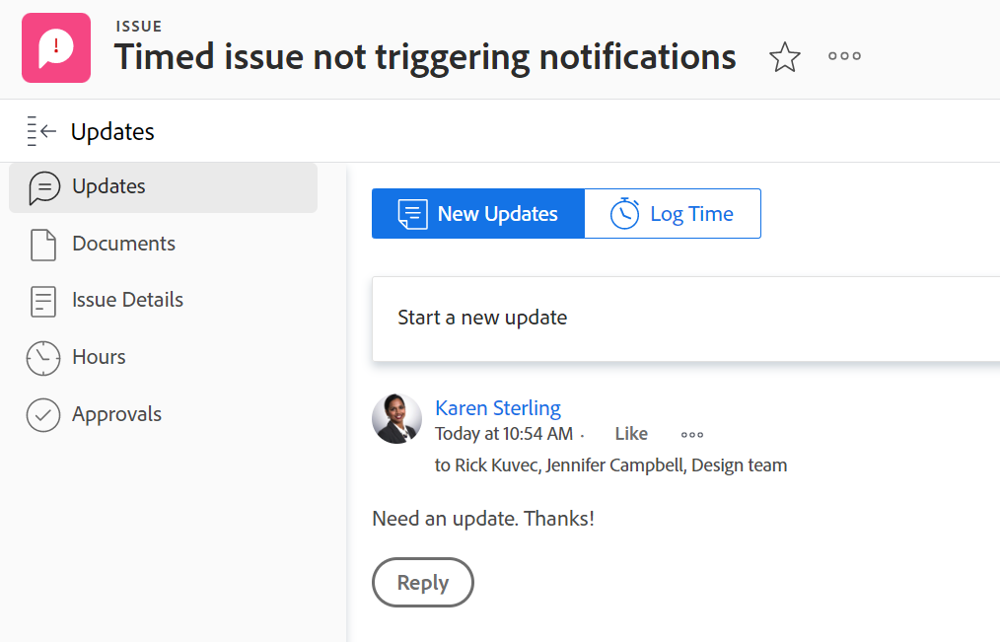

# 更新區段概觀

<!--take "Beta" references out when we remove the beta-->

<!--The highlighted information on this page refers to functionality not yet generally available. It is available only in the Preview environment. -->

>[!NOTE]
>
>我們目前正在重新設計Adobe Workfront中的評論體驗。
>如需新更新體驗的詳細資訊，請參閱 [全新評論體驗](../updating-work-items-and-viewing-updates/unified-commenting-experience.md).
>
>您可以訪問以下對象的新設計：
> * 啟用注釋測試版時發生問題。
   >
   >     此功能僅適用於問題的「更新」區段，不適用於下列區域：
   >
   >     * 首頁
   >     * 清單中的摘要面板
   >     * 工時單中的「摘要」面板
>
> * 目標

   >
   >   目標的預設值為新的註解體驗。 您必須有額外的授權才能存取Workfront Targets。 如需詳細資訊，請參閱 [使用Workfront目標的需求](../../workfront-goals/goal-management/access-needed-for-wf-goals.md).
   >
   >    如需關於評論目標的資訊，請參閱 [管理Adobe Workfront目標中的目標註解](../../workfront-goals/goal-management/manage-goal-comments.md).

對象的「更新」部分顯示用戶在跟蹤對象更改的對象或系統更新上所做的注釋。

## 「更新」區段的概觀

「更新」區段中的資訊會根據您存取該資訊的環境而以不同方式組織。

### 目前更新區段的概觀

物件的「更新」區段會顯示最多200個過去90天內進行的最新更新。

目前的更新區段顯示下列資訊：

* 用戶的評論和對這些評論的答復。
* 系統更新，這些是Workfront為記錄物件上的特定事件而建立的資訊性訊息。 例如，您可以利用系統更新擷取狀態、名稱或自訂欄位中的變更。 您的Workfront或群組管理員可以為您的物件啟用系統更新。 如需詳細資訊，請參閱 [配置系統更新](../../administration-and-setup/set-up-workfront/system-tracked-update-feeds/configure-system-updates.md).

「更新」(Updates)部分將顯示以下對象：

<table style="table-layout:auto"> 
 <col> 
 <col> 
 <tbody> 
  <tr> 
   <td> 
    <ul> 
     <li>文件</li> 
     <li>目標</li> 
     <li>問題</li> 
     <li>疊代</li> 
     <li>專案</li> 
     <li>計劃</li> 
     <li>專案組合</li> 
    </ul> </td> 
   <td> 
    <ul> 
     <li>劇本</li> 
     <li>任務</li> 
     <li>範本</li> 
     <li>範本任務</li> 
     <li>時程表</li> 
     <li>使用者</li> 
    </ul> </td> 
  </tr> 
 </tbody> 
</table>

### 測試版評論體驗的「更新」區段概觀

「更新」區段會在新的註解體驗中，於下列標籤中顯示資訊：

* **註解**:顯示用戶的評論和對這些評論的回覆。 如需在新注釋體驗中更新物件的相關資訊，請參閱 [更新工作](../updating-work-items-and-viewing-updates/update-work.md).
* **系統活動**:顯示系統更新，這些資訊性訊息是Workfront為記錄物件上的特定事件而建立的。 例如，您可以利用系統更新擷取狀態、名稱或自訂欄位中的變更。 您的Workfront或群組管理員可以為您的物件啟用系統更新。 如需詳細資訊，請參閱 [配置系統更新](../../administration-and-setup/set-up-workfront/system-tracked-update-feeds/configure-system-updates.md).

目前，您可以使用測試版對下列物件加以註解和回覆更新：

<table style="table-layout:auto"> 
 <col> 
 <col> 
 <tbody> 
  <tr> 
   <td> 
    <ul> 
     <li>
目標

     
這是目標的預設體驗

     </li> 
     </ul> </td> 
   <td> 
    <ul> 
     <li>問題</li> 
     </ul> </td> 
  </tr> 
 </tbody> 
</table>

## 也出現在高排名對象上的更新

如下表所示，對某些對象的更新所做的答復也會出現在排名較高的對象的「更新」部分。

例如，將更新添加到任務時，該更新將出現在該任務的「更新」部分和包含該任務的項目的「更新」部分。

<table style="table-layout:auto"> 
 <col> 
 <col> 
 <thead> 
  <tr> 
   <th><strong>添加原始更新的對象</strong> </th> 
   <th> 
<strong>顯示原始更新的高級對象</strong> 
 </th> 
  </tr> 
 </thead> 
 <tbody> 
  <tr> 
   <td>問題</td> 
   <td>專案</td> 
  </tr> 
  <tr> 
   <td>任務</td> 
   <td>專案</td> 
  </tr> 
  <tr> 
   <td>專案</td> 
   <td>方案，Portfolio</td> 
  </tr> 
  <tr data-mc-conditions=""> 
   <td>文件 </td> 
   <td>附加文檔的對象，項目 </td> 
  </tr> 
  <tr> 
   <td>方案</td> 
   <td>專案組合</td> 
  </tr> 
  <tr> 
   <td>使用者</td> 
   <td>團隊</td> 
  </tr> 
  <tr> 
   <td>時程表</td> 
   <td>使用者、團隊</td> 
  </tr> 
  <tr> 
   <td>範本任務</td> 
   <td>範本</td> 
  </tr> 
  <tr> 
   <td>本文</td> 
   <td>迭代，團隊</td> 
  </tr> 
  <tr> 
   <td>反覆項目</td> 
   <td>團隊</td> 
  </tr>

<tr> 
   <td>目標</td> 
   <td>結果，活動</td> 
  </tr> 
 </tbody> 
</table>

>[!NOTE]
>
>添加到系統更新的回復不會匯總到父對象。 只有子對象的直接回覆和添加到現有更新的回覆才會匯總到父對象。
>
>如需Adobe Workfront中物件階層的相關資訊，請參閱 [了解Adobe Workfront中的物件](../../workfront-basics/navigate-workfront/workfront-navigation/understand-objects.md).
>
> 無法回覆新評論測試版體驗中的系統更新。 如需詳細資訊，請參閱 [全新評論體驗](../updating-work-items-and-viewing-updates/unified-commenting-experience.md).

## 「更新」一節的限制

團隊的「更新」區段以及代表其他使用者輸入更新時，有些限制。

### 使用者和團隊的限制

無法對團隊進行更新。 在以下對象上輸入的更新將填充團隊的「更新」(Updates)部分：

* 使用者
* 時程表
* 劇本
* 疊代

在使用者和團隊的「更新」區段中，您可以檢視過去90天內輸入的更新。

如果您想查看使用者或團隊上所進行的所有更新，超過90天的限制，您可以建立報表以取得附註。 報表不應有時間篩選器來顯示使用者或團隊所做的所有更新。 如需詳細資訊，請參閱 [建立自訂報表](../../reports-and-dashboards/reports/creating-and-managing-reports/create-custom-report.md).

### 代表其他使用者輸入註解時的限制

Adobe Workfront管理員和群組管理員可以和其他使用者身分登入，並在Workfront中執行動作，例如輸入註解。 (如需詳細資訊，請參閱 [以其他使用者身分登入](../../administration-and-setup/add-users/create-and-manage-users/log-in-as-another-user.md).) 代表其他使用者提出的任何意見都會在意見中注明。

群組管理員可以代表其他人發表意見，但無法刪除該意見。 只有Adobe Workfront管理員可以刪除代表其他使用者發表的意見。

## 使用「日記帳分錄」報表查看工作項的系統更新

「日記帳分錄」報表從項目、任務和問題的「更新」區域顯示系統更新。

報表可讓您查看：

* 發生了多少個狀態更改
* 刪除任務或問題時
* 重要自訂欄位中的值在專案期間有何變更
* 專案期間有哪些重要日期變更
* 如果在項目過程中更改了優先順序
* 如果專案的擁有者已變更

如需詳細資訊，請參閱 [更新區域報告](../../reports-and-dashboards/reports/creating-and-managing-reports/create-journal-entry-report.md).
