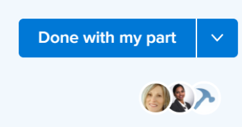

# Work On It and Done（完成和處理）按鈕概述

當您被指派給任務或問題時，可以使用上下文按鈕，該按鈕根據您對工作項目的參與情況更改名稱和功能。

使用內容按鈕來接受或完成工作項目，您可以讓Adobe Workfront更新項目上的數個欄位，而無須自行手動更新。

## 處理它和完成按鈕名稱

根據您從哪個Workfront區域訪問任務或問題，「執行任務」或「完成」按鈕可以更改名稱，如以下情況所述： 

* 當任務或問題首次分配給您且狀態為「新建」時，按鈕將顯示為「工作」。

   

   >[!TIP]
   >
   >您可以用「開始」按鈕替換「工作在它」按鈕。 有關用「開始」按鈕替換「工作在It」按鈕的資訊，請參閱  [將「Work On It（工作完成）」按鈕替換為「Start（開始）」按鈕](../../people-teams-and-groups/create-and-manage-teams/work-on-it-button-to-start-button.md) .

* 在您按一下「Work On It accept（接受）」後，按鈕會變更為「Mark as done（標籤為完成）」或「Done（完成）」 ，具體取決於您在Workfront中哪個位置存取任務或問題。 有關可以在何處訪問Work On It按鈕的資訊，請參閱部分 [找出「Work On It And Done（完成）」按鈕](#locate-the-work-on-it-and-done-button) 這篇文章。

   

* 如果您不是分配給任務或問題的唯一一個，並且您正在從「首頁」(Home)區域的「工作清單」(Work List)中訪問您的工作項，則按鈕將更改為「使用我的部件完成」(Done with my part)。

   

## 找出「Work On It And Done（完成）」按鈕 {#locate-the-work-on-it-and-done-button}

您可以在Workfront的下列區域找到「執行」和「完成」按鈕：

* 「首頁」區域，在「工作清單」或「詳細資訊」面板中

   有關在「首頁」區域將項目標籤為「完成」的資訊，請參閱 [在「首頁」區域將項目標籤為「完成」](../../workfront-basics/using-home/using-the-home-area/mark-item-done-in-home.md).

* 在任務或問題的標題中

   如需物件標題的相關資訊，請參閱 [新物件標題](../../workfront-basics/the-new-workfront-experience/new-object-headers.md).

* 在清單或Workload Balancer中的任務或問題摘要面板中

   有關使用「摘要」面板的資訊，請參閱 [摘要概觀](../../workfront-basics/the-new-workfront-experience/summary-overview.md).

## 概述欄位，當您按一下「執行並完成」按鈕時，這些欄位會自動更新

使用「工作完成」和「完成」按鈕的好處是，您可以允許Workfront自動更新分配給您的工作項的資訊。

* [「Work On It」按鈕](#work-on-it-button)
* [開始按鈕](#start-button)
* [完成按鈕](#the-done-button)

### 「Work On It」按鈕 {#work-on-it-button}

按一下「處理」後，下列項目也會更新：

* 分配狀態從「請求」更新為「工作」

   >[!TIP]
   >
   >「分配狀態」欄位僅顯示在報告和清單中。 有關「分配狀態」欄位的資訊，請參閱 [Adobe Workfront術語表](../../workfront-basics/navigate-workfront/workfront-navigation/workfront-terminology-glossary.md).

* 提交日期

   有關提交日期的資訊，請參見 [提交日期概述](../../manage-work/projects/updating-work-in-a-project/overview-of-commit-dates.md).

### 開始按鈕 {#start-button}

如果您有權編輯團隊，則可以用團隊的「開始」按鈕替換「在它上工作」按鈕。 當該團隊作為其主團隊的用戶按一下他們被分配的項目的「開始」按鈕時，其工作項目上的其他欄位將自動更新。 有關用「開始」按鈕替換「工作在It」按鈕的資訊，請參閱 [將「Work On It（工作完成）」按鈕替換為「Start（開始）」按鈕](../../people-teams-and-groups/create-and-manage-teams/work-on-it-button-to-start-button.md).

除了按一下「開始」按鈕時更新的欄位外，在按一下「開始」按鈕時，還會自動更新以下欄位：

* 狀態
* 實際開始日期

   有關實際開始日期的資訊，請參閱 [項目實際起始日期概覽](../../manage-work/projects/planning-a-project/project-actual-start-date.md).

* 實際完成日期（如果「開始」按鈕與相當於「完成」或「關閉」的狀態關聯）。

   有關實際完成日期的資訊，請參閱 [項目實際完成日期概覽](../../manage-work/projects/planning-a-project/project-actual-completion-date.md).

>[!NOTE]
>
>按一下「撤消」按鈕將工作項返回原始狀態並刪除實際起始日期。
>
>「還原」按鈕在以下區域不可用：
>
>* 團隊請求
>* 任務標題
>

### 完成按鈕 {#the-done-button}

如果您有權編輯團隊，則可以為團隊配置「完成」按鈕，以在將項目標籤為已完成時更新任務或發放狀態。 以該團隊作為其主團隊的用戶按一下其項目上的「完成」按鈕時，以下欄位會自動更新任務或問題：

* 狀態
* 從工作狀態更新到完成狀態
* 實際完成日期

如需為團隊設定「完成」按鈕的相關資訊，請參閱下列文章：

* [配置任務的完成按鈕](../../people-teams-and-groups/create-and-manage-teams/configure-the-done-button-for-tasks.md)
* [設定問題的「完成」按鈕](../../people-teams-and-groups/create-and-manage-teams/configure-the-done-button-for-issues.md)
