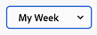

# 開始使用Adobe Workfront中的新首頁

新首頁是管理您工作的強大新功能。 您可以自訂此彈性空間，以強調您最重要的工作，並簡化您的任務、問題、請求和核准管理。

## 自訂新首頁

「新首頁」的設計可高度客製化，讓您選取追蹤您最重要工作的小工具，根據到期時間篩選工作範圍，甚至新增一絲顏色。

### 介面工具

Widget是New Home的基礎。 將Widget新增到首頁後，您就可以選擇顯示的資訊型別，以最符合您的工作需求。 某些Widget僅適用於特定授權型別，因為它們追蹤的物件僅適用於這些授權。 目前有十個Widget可供選擇，以及它們顯示的資訊摘要如下：

* **我的工作**\
    此Widget是管理各種工作的絕佳起點，可在一個位置顯示您所有指派的任務、問題和請求。

* **我的專案**\
    在表格中顯示指派給您的專案，表格可排序以僅顯示您擁有的專案或您所在的所有專案；標準篩選、檢視和分組選項；以及直接建立新專案的按鈕。

* **我的任務**\
    在表格中顯示指派給您的任務，表格中有可自訂的篩選器、檢視和群組，以及直接建立新任務的按鈕。

* **我的問題**\
    以可自訂的篩選器、檢視和群組的表格顯示指派給您的問題，以及直接建立新問題的按鈕。

* **我的請求**\
    顯示您已提交的所有請求、只顯示開啟中請求的篩選條件，以及開啟請求摘要窗格的按鈕。

* **團隊請求**\
    顯示您依團隊排序之團隊的所有擱置請求，以及直接指派請求給使用者或自行處理的按鈕。

* **正等待我的核准**\
    顯示所有未決指派或已委派的核准、委派核准的按鈕，以及直接在Widget中做出核准決策的按鈕。

* **所有核准**\
    以可自訂欄的表格顯示組織的所有核准，以及可讓您搜尋特定核准的搜尋列。

* **提及**\
    顯示最近在Workfront上包含@提及您的評論對話串，以及一個可讓您在Widget中撰寫回覆的回覆按鈕。

* **待辦事項**\
    這個獨特的Widget可讓您將文字專案新增至您可自由編輯的個人檢查清單。

如需新增、移動、調整大小或刪除介面工具集的資訊，請參閱 [新增、編輯或移除新首頁中的Widget](/help/quicksilver/workfront-basics/using-home/new-home/add-edit-remove-widgets-in-new-home.md)

### 背景自訂

您可以選取頁面頂端的彩色橫幅，在首頁上加入一點個人光暈。

**若要變更「首頁」背景的顏色：**

1. 按一下Adobe Workfront圖示，導覽至您的首頁  如果將「首頁」設為著陸頁面，或按一下主功能表圖示，則會在畫面頂端顯示  然後按一下 **首頁**.

1. 按一下畫面右上角的「自訂」按鈕。

   

1. 在 **背景** 的區段 **自訂** 窗格，按一下您要為「首頁」背景選取的顏色。 您也可以按一下 **無** 以移除背景。

### 依時間範圍篩選

您可以快速篩選首頁上的所有資訊，以在三個特定時間範圍內顯示物件資訊：日、周或月。 此外，「首頁」頂端會顯示您到期的工作數目以及您已在範圍內完成的工作數目摘要。

**若要變更首頁的時間範圍：**

1. 按一下Adobe Workfront圖示，導覽至您的首頁  如果將「首頁」設為著陸頁面，或按一下主功能表圖示，則會在畫面頂端顯示  然後按一下 **首頁**.

1. 按一下首頁左上角的時間範圍篩選器。 依預設，篩選器設為 **我的周**.

   

1. 按一下 **日**， **周**，或 **月** 篩選您的首頁，以便只顯示該時間範圍內到期的物件資訊。

## 還原為目前的首頁體驗

對於偏好使用現有首頁體驗的使用者，可切換「新首頁」 。

**返回目前的首頁體驗：**

1. 按一下Adobe Workfront圖示，導覽至您的首頁  如果將「首頁」設為著陸頁面，或按一下主功能表圖示，則會在畫面頂端顯示  然後按一下 **首頁**.

1. 按一下 **返回目前的首頁** 按鈕來切換頁面。

   

1. 在出現的確認視窗中，您可以選擇參加有關您使用新首頁的體驗的簡短問卷調查，或按一下 **返回目前的首頁** 以完成您的決定，並回覆至目前的「首頁」體驗。

>[!NOTE]
>
> 系統管理員可以停用「新增首頁」作為其使用者的預設設定。 如需有關變更系統使用者預設首頁體驗的資訊，請參閱 [設定系統偏好設定](/help/quicksilver/administration-and-setup/manage-workfront/security/configure-security-preferences.md).
