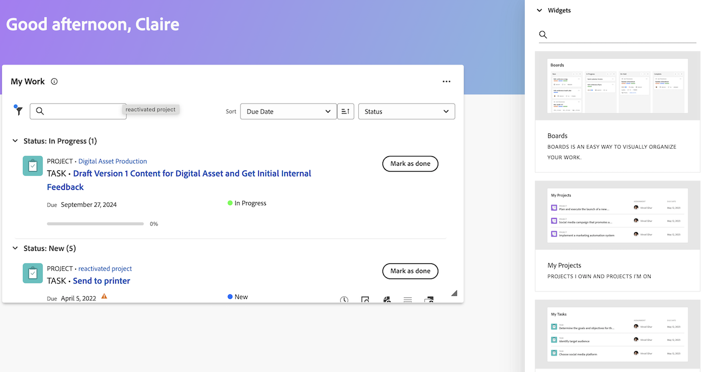

# 從舊版首頁移至新首頁

舊版首頁將於2017年第4季版本中從Workfront移除。 本文提供有關新首頁中將提供哪些功能的資訊，以及Workfront管理員將使用者移至新首頁體驗的建議。

如需有關舊版家用軟體棄用的詳細資訊，請參閱[舊版家用軟體棄用指南]。

## 瞭解從舊版首頁到新首頁有何變化

### 工作清單

#### 使用我的工作Widget組織工作

「我的工作」Widget是以Widget格式建立的，以便儘可能映象舊版首頁工作清單。 使用者可以使用類似的篩選器和分組，在我的工作Widget中分組和篩選其工作清單：

| **篩選器** | **群組** |
|------------|-----------|
|  — 處理  — 準備開始  — 未就緒  — 已要求  — 已委派  — 已完成 |  — 專案  — 狀態  — 到期日期  — 無 |

**新主目錄中無法使用**&#x200B;舊主目錄群組

* 計畫完成日期 — 已重新命名為新首頁的到期日
* 計劃開始
* 認可日期
* 我的優先順序

| **舊版首頁** | **新首頁** |
|------------|-----------|
|  |  |

#### 委派工作

使用者仍然可以在以下Widget中從「新首頁」委派工作：

* 我的工作
* 我的任務
* 我的問題
* 我的核准

使用者可在下列Widget中找到委派給他們的工作：

* 使用「委派給我」篩選器的我的工作Widget
* 使用受委派核准篩選器的我的核准

| **舊版首頁** | **新首頁** |
|------------|-----------|
|  |  |

#### 使用行事曆檢視

新首頁不再提供行事曆檢視；但是，行事曆的替代專案在優先順序的藍圖上。

#### 建立個人任務

使用者無法再像在舊版首頁一樣建立個人任務，而是可以建立待辦事項。

#### 檢視我已提交的核准

使用者可以使用我已提交的核准篩選器，在我核准的Widget中檢視他們在新首頁提交的核准。

#### 新增專案至我的優先順序

使用者無法再存取「新首頁」中的「我的優先順序」功能。 我們將推出新的「我的焦點」欄，其優先順序將取代此欄位。

使用者可視需要使用展示板Widget來追蹤高優先順序的專案。

### 更新工作專案

在舊版首頁中，使用者可以使用正確的面板來更新他們的工作。 在新首頁中，使用者現在使用摘要面板來更新工作。 這是專案、任務、問題和檔案中提供的相同摘要面板。

#### 使用摘要面板

在摘要中，使用者可以

* 更新完成百分比
* 新增更新
* 瀏覽至檔案區域以上傳檔案
* 檢視工作專案詳細資料和更新自訂欄位
Workfront管理員可以自訂哪些欄位會出現在版面配置範本的摘要中。 如需詳細資訊，請參閱[使用配置範本自訂首頁和摘要](/help/quicksilver/administration-and-setup/customize-workfront/use-layout-templates/customize-home-summary-layout-template.md)。
* 變更工作專案狀態
* 檢視子任務
* 記錄時間
* 檢視附加的核准流程
* 上傳檔案 — 此功能為全新功能

| **舊版首頁** | **新首頁** |
|------------|-----------|
|  |  |

#### 開啟摘要面板

使用者可以透過將游標停留在工作專案上，然後按一下&#x200B;**摘要**&#x200B;圖示來開啟「摘要」面板。

如需有關如何使用「摘要」面板的其他資訊，請參閱[摘要概觀](/help/quicksilver/workfront-basics/the-new-workfront-experience/summary-overview.md)。

#### 使用快速動作

除了「摘要」面板，使用者還可以使用快速動作

* 記錄時間
* 新增更新
* 更新自訂表單
* 上傳檔案

若要找到快速動作功能表，請將滑鼠停留在工作專案上。 快速動作清單會顯示在&#x200B;**處理它**&#x200B;或&#x200B;**完成**&#x200B;按鈕附近。

### 檢視核准和團隊請求

使用者仍然可以使用以下Widget在「新首頁」中管理核准和團隊請求：

* 我的核准
* 所有核准
* 團隊請求

如需新增Widget至新首頁的詳細資訊，請參閱[新首頁的新增、編輯或移除Widget]。

## 瞭解可用的Widget

Widget是「新首頁」的基礎。 將Widget新增到首頁後，使用者可以選擇顯示的資訊型別，以最符合其工作需求。 某些Widget僅適用於特定授權型別，因為它們追蹤的物件僅適用於這些授權。

Workfront管理員可使用版面配置範本自訂「新首頁」中可用的Widget。 如需詳細資訊，請參閱[使用配置範本自訂新首頁](/help/quicksilver/administration-and-setup/customize-workfront/use-layout-templates/customize-new-home-layout-template.md)。

+++ 展開以檢視可用Widget的詳細清單
目前有11個Widget可供選擇，以及它們顯示的資訊摘要如下：

* **我的工作**\
   在一個位置顯示所有指派的任務、問題和請求。 您可以按一下「處理它」按鈕開始處理專案，或按一下「完成」按鈕將其標籤為完成。 您也可以更新有關任務和問題的資訊（狀態、條件、完成百分比）、記錄時間，以及從「我的工作」Widget新增更新。

* **展示板**\
    顯示您已建立或受邀使用的任何面板。 您也可以根據下列範本建立新面板：基本面板、看板、回顧面板、動態面板。

* **我的專案**\
    顯示您擁有的&#x200B;_專案_&#x200B;或您在清單中的&#x200B;_專案_。 您可以使用現有的篩選器、檢視或分組來自訂清單，或直接從介面工具集建立專案。

* **我的任務**\
    在清單中顯示指派給您的任務。 您可以使用現有的篩選器、檢視或分組來自訂清單，也可以直接從Widget建立任務。 您也可以在外出時委派工作。

* **我的問題**\
    顯示清單中指派給您的問題。 您可以使用現有的篩選器、檢視或分組來自訂清單，或直接從Widget建立問題。 此Widget僅包含關聯專案設為「目前」的問題，不包含已完成的專案。 您也可以在外出時委派問題。

* **我的要求**\
    顯示您已提交的所有請求、僅顯示已開啟請求的篩選條件，以及可開啟請求摘要面板的按鈕。

* **團隊要求**\
    顯示您所在團隊的所有待處理請求 (依團隊排序)，以及用於直接將請求指派給使用者或自行處理請求的按鈕。

* **我的核准**\
    顯示所有待指派或委派的核准、用於委派核准的按鈕，以及用於直接在小工具中做出核准決策的按鈕。

* **所有核准**\
        顯示2個圖表，內含平均核准時間和決定的相關資訊，以及擱置和逾期核准的清單檢視。 此功能是分階段發行的一部分，目前僅供特定客戶使用。

* **提及次數**\
    顯示來自Workfront的最近評論對話串，類似於「我的更新」頁面。 您可以使用回覆按鈕在Widget中撰寫回覆。 只要任務或問題在過去30天內已更新，此Widget也會顯示針對您指派給、您指派給其他使用者、您擁有、您是主要連絡人或您建立之任務或問題所做的評論。

* **待辦事項**\
    這個獨特的Widget可讓您將專案新增至您可自由編輯的個人檢查清單。 會將待辦事項作為個人專案中的任務進行追蹤，並在完成後保留最多兩週。

  >[!NOTE]
  >
  >您必須有建立任務的許可權，才能在待辦事項Widget中建立待辦事項，而且只有由目前使用者輸入的個人任務才會顯示在Widget中。

+++

### 檢視適用於每種授權型別的Widget

依預設，首頁會根據您的授權型別，填入幾個特定的Widget。 下表概述各授權型別使用者第一次導覽至「新首頁」時所看到的Widget。

<table border="1" class="inlineTable">
    <tr>
        <td><b>新授權型別</b></td>
        <td><b>預設Widget</b></td>
    </tr>
    <tr>
        <td>標準</td>
        <td>我的專案、我的工作、提及內容、待辦事項</td>
    </tr>
    <tr>
        <td>精簡</td>
        <td>我的工作，我的核准</td>
    </tr>
    <tr>
        <td>貢獻者</td>
        <td>我的請求、提及、我的核准、面板</td>
    </tr>
    <tr>
        <td>外部</td>
        <td>我的核准</td>
    </tr>
</table>

<table border="1" class="inlineTable">
    <tr>
        <td><b>目前授權型別</b></td>
        <td><b>預設Widget</b></td>
    </tr>
    <tr>
        <td>規劃</td>
        <td>我的專案、提及內容、待辦事項</td>
    </tr>
    <tr>
        <td>工作</td>
        <td>我的工作、提及、待辦事項</td>
    </tr>
    <tr>
        <td>審閱</td>
        <td>我的工作，提及</td>
    </tr>
    <tr>
        <td>請求</td>
        <td>我的專案，我的核准</td>
    </tr>
    <tr>
        <td>參與</td>
        <td>我的工作，提及</td>
    </tr>
    <tr>
        <td>外部</td>
        <td>我的核准</td>
    </tr>
</table>

## 準備淘汰

為了協助您將和貴組織的干擾降至最低，以下提供一些可協助您輕鬆轉換的建議。

### 開始轉換至新首頁

我們的主要建議是儘快開始轉換到新的首頁。 從組織上來說，這表示您的管理員會透過版面範本（類似於舊版首頁）自訂使用者的體驗，以確保每個使用者都有他們需要的內容。

我們建議管理員：

1. 使用版面配置範本建立預設的新首頁版面配置（或選擇性地為每個使用者、團隊、群組或需要獨特版面配置的工作角色建立一個版面配置）。 如需詳細資訊，請參閱[使用配置範本自訂新首頁](/help/quicksilver/administration-and-setup/customize-workfront/use-layout-templates/customize-new-home-layout-template.md)。

1. 將您的新版面範本指派給少數測試使用者，這些使用者可以驗證其Widget和一般設定是否符合其工作需求。

1. 將其他使用者重新指派到「新首頁」版面配置。

如此一來，您的使用者就能儘快適應新體驗，並自訂新首頁，以最符合個人需求。 請參閱新首頁中的[移除、新增和重新排列Widget]，瞭解使用者如何在自己的新首頁上自訂這些Widget。

### 適用於使用者的資源

**說明文章**

* [使用我的工作Widget管理您的工作]

**培訓**

* [在首頁教學課程中移除、新增及重新排列Widget](https://experienceleague.adobe.com/en/docs/workfront-learn/tutorials-workfront/home/remove-add-and-rearrange-widgets)
* [Adobe Workfront中的Worker基礎知識](https://adobe-ats.sabacloud.com/Saba/Web_spf/PRODTNT100/app/me/learningeventdetail/cours000000000098821?regId=regdw000000001250612)

>[!IMPORTANT]
>
>此為免費課程，但您必須登入並註冊才能存取。