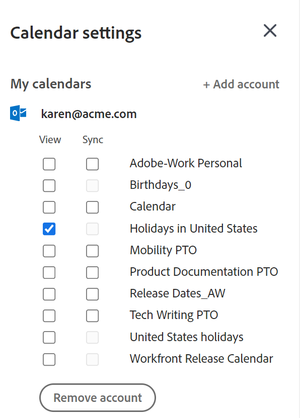

# 設定您的 [!UICONTROL 首頁行事曆] 檢視設定

<!--Audited: 01/2024-->

您可以設定 [!UICONTROL 首頁行事曆] 進行以下操作的設定：

* 與雲端託管的 [!DNL Office 365] 或 [!DNL Outlook Live] 之網頁版 [!DNL Outlook] 整合。您可以顯示Outlook行事曆的所有事件，以及您在 [!UICONTROL 首頁行事曆] 在Adobe Workfront中。
* 協助您根據以下網站提供的可用工作時數追蹤您的工作負載： [!UICONTROL 配置] 長條圖。

若要深入瞭解首頁行事曆，請參閱 [[!UICONTROL 首頁行事曆] 檢視](../../../workfront-basics/using-home/using-the-home-area/home-calendar-view.md).

本文說明如何設定首頁行事曆設定，以及如何將首頁行事曆與外部Outlook行事曆整合。

## 存取需求

+++ 展開以檢視本文中功能的存取需求。

您必須具有下列存取權才能執行本文中的步驟：

<table style="table-layout:auto"> 
 <col> 
 </col> 
 <col> 
 </col> 
 <tbody> 
  <tr> 
   <td role="rowheader"><strong>[!DNL Adobe Workfront plan]</strong></td> 
   <td> 
任何
 </td> 
  </tr> 
  <tr> 
   <td role="rowheader"><strong>[!DNL Adobe Workfront] 授權*</strong></td> 
   <td> 
目前： [！UICONTROL Work]或更高版本
 
   或
   
新增：[！UICONTROL Standard]
 
   </td> 
  </tr> 
   </tbody> 
</table>

*若要瞭解您擁有的計畫或授權型別，請連絡 [!DNL Workfront] 管理員。 如需詳細資訊，請參閱 [Workfront檔案中的存取需求](/help/quicksilver/administration-and-setup/add-users/access-levels-and-object-permissions/access-level-requirements-in-documentation.md).

+++

## 關於整合 [!DNL Microsoft Outlook] 行事曆

當您使用設定首頁行事曆時，請考慮以下事項 [!DNL Microsoft Outlook] 行事曆：

* 您只能整合Web型版本的 [!DNL Outlook] 在雲端託管 [!DNL Office 365] 或 [!DNL Outlook Live].

  內部部署 [!DNL Outlook] 和 [!DNL Outlook] 在雲端型企業上 [!DNL Exchange] 伺服器不受支援。

  如果您的組織使用單一登入，您需要 [!DNL Microsoft 365 E3] 或 [!DNL E5].

* 與您的關聯的附件 [!DNL Outlook] 事件未附加至 [!DNL Outlook] 您的首頁行事曆中的活動。
* 與整合 [!DNL Outlook] 每個使用者都必須個別完成行事曆。
* 出現在中的事件 [!UICONTROL 到期] 長條圖未出現在您的 [!DNL Microsoft] 除非您從「 」拖曳行事曆 [!UICONTROL 工作清單] 至您的 [!DNL Adobe Workfront] 行事曆。 如需詳細資訊，請參閱 [[!UICONTROL 到期] 長條圖](../../../workfront-basics/using-home/using-the-home-area/home-calendar-view.md#viewing-the-due-bar) 和 [上的工作清單 [!UICONTROL 首頁行事曆]](../../../workfront-basics/using-home/using-the-home-area/home-calendar-view.md#using-the-left-panel-of-the-home-view) 在 [[!UICONTROL 首頁行事曆] 檢視](../../../workfront-basics/using-home/using-the-home-area/home-calendar-view.md).

* 當您啟用與的整合時 [!DNL Outlook]，僅限拖曳至 [!UICONTROL 首頁行事曆] 從那時起，將會進行同步。 在啟用整合之前位於首頁行事曆上的專案將不會顯示，如果您希望這些專案出現在中，必須將其再次拖曳到首頁行事曆上 [!DNL Outlook].
* 當您共用（或取消共用） [!DNL Outlook] 行事曆與其他人共用或當您變更與其他人共用的行事曆的許可權層級時，此變更在約30分鐘內不會影響他們的行事曆。 如需詳細資訊，請參閱 [!DNL Microsoft Outlook] 檔案。\
   因此，當您整合 [!DNL Workfront] 具有的行事曆 [!DNL Outlook] 您與其他使用者共用的行事曆，他們看不到您的 [!DNL Workfront] 行事曆專案約30分鐘。

>[!NOTE]
>
>此 [!DNL Outlook] 行事曆設定與 [!DNL Outlook] 增益集([!UICONTROL [!DNL Outlook] 整合] 或 [!DNL Workfront Outlook])。 不需要安裝即可設定行事曆，但需要安裝 [!DNL Outlook] 增益集。 如需詳細資訊，請參閱 [!DNL Outlook] 增益集請參閱 [設定 [!DNL Adobe Workfront for Outlook]](../../../workfront-integrations-and-apps/using-workfront-with-outlook/set-up-workfront-for-outlook.md).

## 設定您的 [!UICONTROL 首頁行事曆] 檢視設定並將其與Outlook行事曆整合

1. 在 [!UICONTROL 首頁行事曆] 檢視，按一下 **[!UICONTROL 設定]** 齒輪圖示  以開啟 **[!UICONTROL 行事曆設定]** 面板。

   如果您需要有關存取 [!UICONTROL 首頁行事曆] 檢視，請參閱 [檢視 [!UICONTROL 首頁行事曆]](../../../workfront-basics/using-home/using-the-home-area/view-home-calendar.md).

1. （選用）若要整合您的 [!DNL Microsoft Outlook] 行事曆，按一下 **[!UICONTROL 新增帳戶]** 位於的右上角 **[!UICONTROL 行事曆設定]** 面板。 然後，如果系統提示您這樣做，請輸入 [!DNL Microsoft Outlook] 登入資訊。 您可以重複此步驟以新增多個 [!DNL Outlook] 帳戶。

   >[!NOTE]
   >
   >您必須提供 [!DNL Workfront] 存取您的許可權 [!DNL Outlook] 行事曆。 授與許可權允許 [!DNL Workfront] 若要維護對行事曆資料的存取權，請閱讀 [!DNL outlook] 設定檔，並讀取和更新您的 [!DNL Microsoft] 行事曆。

1. 重新整理瀏覽器視窗以檢視您的資訊 [!DNL Outlook] 行事曆中的帳戶和 [!UICONTROL 行事曆設定] 面板。
1. 按一下 **[!UICONTROL 設定]** 齒輪圖示再次在右上角開啟 **[!UICONTROL 行事曆設定]** 面板。 

1. （選擇性）在每個底下 [!DNL Microsoft] 在上一步中新增的帳戶，請選取 **[!UICONTROL 檢視]** 或 **[!UICONTROL 同步]**：

   * **[!UICONTROL 檢視]**：這是唯讀選項，可顯示 [!DNL Microsoft] 您的行事曆活動 [!UICONTROL 首頁行事曆].
   * **[!UICONTROL 同步]**：此選項可讓您在 [!DNL Microsoft] 和 [!UICONTROL 首頁] 行事曆。 換句話說， [!DNL Workfront] [!UICONTROL 首頁行事曆] 個專案匯出至您的 [!DNL Microsoft] 行事曆和 [!DNL Microsoft] 行事曆專案匯入您的Workfront [!UICONTROL 首頁行事曆] 即時。

     

1. （選用）在您的底下 [!DNL Workfront] 帳戶或整合帳戶，選取您要在您的帳號上檢視的關聯行事曆 [!UICONTROL 首頁行事曆] （例如您的PTO、生日或節假日行事曆），然後按一下瀏覽器的 [!UICONTROL 重新整理] 或 [!UICONTROL 重新載入] 按鈕以檢視您的變更。

1. （選用）在 **[!UICONTROL 一般]** 區段在 **[!UICONTROL 每週開始於]**，選取您要在首頁行事曆中顯示為工作週第一天的日期。

   

1. 設定下列選項：

   * **[!UICONTROL 我的工作日]：** 選取您的工作日。
   * **[!UICONTROL 我的日常開始時間]：** 選取您開始工作日的時間。
   * **[!UICONTROL 我的日常結束時間]：** 選取您結束工作日的時間。

   [!DNL Workfront] 會使用這三個設定來計算您一週的工作時數。 此數字會影響 [!UICONTROL 配置] 長條圖，可協助您根據可用工作時數追蹤工作負載。 如需詳細資訊，請參閱 [[!UICONTROL 配置] 長條圖](../../../workfront-basics/using-home/using-the-home-area/home-calendar-view.md#understanding-the-allocation-of-time) 在文章中 [[!UICONTROL 首頁行事曆] 檢視](../../../workfront-basics/using-home/using-the-home-area/home-calendar-view.md).

1. 按一下 **[!UICONTROL 行事曆設定]** 區域以關閉它。

   [!DNL Workfront] 會自動儲存您的變更。

如需有關使用 [!UICONTROL 行事曆] 檢視以管理您的工作指派與整合行事曆事件，請參閱 [使用 [!UICONTROL 首頁行事曆] 檢視](../../../workfront-basics/using-home/using-the-home-area/use-home-calendar-view.md).

<!--
<MadCap:conditionalText data-mc-conditions="QuicksilverOrClassic.Draft mode">
(NOTE: from Courtney: [step #] Type your weekly work hours under How many hours a week do you work?This number affects the Allocation bar, which helps you track your workload against your available work hours. For more information, see "Allocation Bar" in the article "Understanding the Home Calendar View.")
</MadCap:conditionalText>
-->
