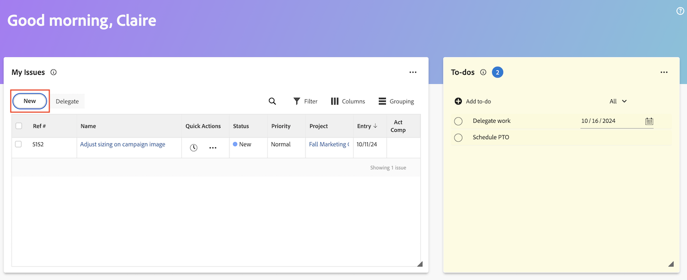

# 從首頁區域建立工作專案和專案

您可以從[!UICONTROL 首頁]區域建立工作專案和專案。

在家中，您可以

* 提交請求
* 將任務和問題新增到特定專案
* 從範本、空白專案建立專案，或匯入MS專案。

## 存取需求

+++ 展開以檢視本文中功能的存取需求。

您必須具有下列存取權才能執行本文中的步驟：

<table style="table-layout:auto"> 
 <col> 
 <col> 
 <tbody> 
  <tr> 
   <td role="rowheader"><strong>[!DNL Adobe Workfront plan*]</strong></td> 
   <td> 
任何
 </td> 
  </tr> 
  <tr> 
   <td role="rowheader"><strong>[!DNL Adobe Workfront] 授權*</strong></td> 
   <td> 
[!UICONTROL Work]或更高版本
 </td> 
  </tr> 
  <tr> 
   <td role="rowheader"><strong>存取層級設定*</strong></td> 
   <td> 
[!UICONTROL Worker]
 
<b>附註</b>
 
   
如果您仍然沒有存取權，請詢問您的[!DNL Workfront]管理員是否已在您的存取層級中設定其他限制。 如需[!DNL Workfront]管理員如何修改存取層級的詳細資訊，請參閱<a href="../../../administration-and-setup/add-users/configure-and-grant-access/create-modify-access-levels.md" class="MCXref xref">建立或修改自訂存取層級</a>。
 </td> 
  </tr> 
  <tr> 
   <td role="rowheader"><strong>物件許可權</strong></td> 
   <td> 
[!UICONTROL Edit]或更新的任務存取權
 
如需請求其他存取權的資訊，請參閱<a href="../../../workfront-basics/grant-and-request-access-to-objects/request-access.md" class="MCXref xref">請求物件</a>的存取權。
 </td> 
  </tr> 
 </tbody> 
</table>

&#42;若要瞭解您擁有的計畫、授權型別或存取權，請連絡您的[!DNL Workfront]管理員。

+++

## 建立個人待辦事項

您可以在[!UICONTROL 首頁]區域的待辦事項Widget中建立個人待辦事項。 待辦事項是您為自己建立的個人任務。

您和其他使用者可以在個人任務報告中檢視您的個人任務。 如有需要，他們可以從該處將其新增至專案。

>[!TIP]
>
>您從使用者設定檔頁面傳送給其他使用者或您自己的工作專案，也會顯示在使用者首頁區域的待辦事項Widget中。 如需詳細資訊，請參閱[建立個人工作](/help/quicksilver/workfront-basics/updating-work-items-and-viewing-updates/create-personal-tasks.md)。

若要建立待辦事項，請執行下列步驟：

1. 按一下右上角的&#x200B;**[!UICONTROL 主功能表]** ，或左上角的&#x200B;**主功能表**  （如果可用），然後按一下&#x200B;**[!UICONTROL 首頁]**。
1. （視條件而定）按一下「自訂」**&#x200B;**，然後按一下「待辦事項」**&#x200B;**，將待辦事項Widget新增至您的主畫面。
1. 移至&#x200B;**待辦事項** Widget，然後按一下&#x200B;**新增待辦事項**。
1. 輸入個人待辦事項的名稱，然後按一下「輸入」。
1. （選擇性）按一下&#x200B;**日期**&#x200B;圖示以新增專案的到期日。
   
1. （選擇性）建立個人工作報告或篩選器。 如需有關建立個人工作篩選的資訊，請參閱[篩選：個人工作](/help/quicksilver/reports-and-dashboards/reports/custom-view-filter-grouping-samples/filter-personal-tasks.md)。
您可以在個人任務報告中檢視您的待辦事項以及其他使用者的待辦事項。

## 將任務新增至專案

您可以直接從「首頁」區域將任務新增到現有專案：

1. 按一下右上角的&#x200B;**[!UICONTROL 主功能表]** ，然後按一下&#x200B;**[!UICONTROL 首頁]**。
1. （視條件而定）將&#x200B;**我的任務** Widget新增至您的主畫面。 按一下&#x200B;**自訂**，然後尋找&#x200B;**我的工作**。
1. 前往&#x200B;**我的工作** Widget，然後按一下&#x200B;**新增**。
   
1. 在&#x200B;**新增工作**&#x200B;對話方塊中，輸入工作名稱。
1. 開始輸入專案名稱，然後從清單中選取名稱。
1. （選擇性）在下列欄位中輸入資訊：

   | 欄位 | 指示 |
   |----------|----------|
   | **說明** | 輸入說明。 |
   | **指派** | 指派使用者。 |
   | **期間** | 輸入持續時間。 |
   | **計畫完成日期** | 選擇計畫完成日期。 |
   | **更多選項** | 選擇更多選項，為工作設定更多設定。 如需建立工作的詳細資訊，請參閱[編輯工作](/help/quicksilver/manage-work/tasks/manage-tasks/edit-tasks.md)。 |

1. 按一下&#x200B;**建立工作**。

## 將問題新增至專案

您可以直接從首頁區域將問題新增到現有專案：

1. 按一下右上角的&#x200B;**[!UICONTROL 主功能表]** ，然後按一下&#x200B;**[!UICONTROL 首頁]**。
1. （視條件而定）將&#x200B;**我的問題** Widget新增至您的主畫面。 按一下&#x200B;**自訂**，然後尋找&#x200B;**我的問題**。
1. 移至&#x200B;**我的問題** Widget，然後按一下&#x200B;**新增**。
   
1. 在&#x200B;**新問題對話方塊**&#x200B;中，開始輸入專案名稱，然後從清單中選取名稱。
1. 輸入問題名稱。
1. （選擇性）在下列欄位中輸入資訊：

   | 欄位 | 指示 |
   |----------|----------|
   | **說明** | 輸入說明。 |
   | **指派** | 指派使用者。 |
   | **優先順序** | 選擇優先等級。 |
   | **文件** | 上傳檔案。 |

1. 按一下&#x200B;**儲存新問題**。

## 建立請求

您可以直接從「首頁」區域建立請求：

1. 按一下右上角的&#x200B;**[!UICONTROL 主功能表]** ，然後按一下&#x200B;**[!UICONTROL 首頁]**。
1. （視條件而定）將&#x200B;**我的請求** Widget新增至您的主畫面。 按一下&#x200B;**自訂**，找到&#x200B;**我的要求**。
1. 移至&#x200B;**我的要求** Widget，然後按一下&#x200B;**新增**。
   

1. 在&#x200B;**新要求**&#x200B;對話方塊中，開始輸入要求佇列的名稱。
1. 填寫相關欄位。
1. 按一下&#x200B;**提交**。

如需有關提交請求的詳細資訊，請參閱[建立及提交請求](/help/quicksilver/manage-work/requests/create-requests/create-submit-requests.md)。

## 建立專案

您可以直接從「首頁」區域建立專案：

1. 按一下右上角的&#x200B;**[!UICONTROL 主功能表]** ，然後按一下&#x200B;**[!UICONTROL 首頁]**。
1. （視條件而定）將&#x200B;**我的專案** Widget新增至您的主畫面。 按一下&#x200B;**自訂**，然後尋找&#x200B;**我的專案**。
1. 前往&#x200B;**我的專案** Widget，然後按一下&#x200B;**新增**。
   
1. 選擇下列其中一個選項：

   | 欄位 | 指示 |
   |----------|----------|
   | 從範本 | 移至[使用範本建立專案](/help/quicksilver/manage-work/projects/create-projects/create-project-from-template.md)，以取得有關使用範本建立專案的詳細指示。 |
   | 空白專案 | 請移至[從頭開始建立專案](/help/quicksilver/manage-work/projects/create-projects/create-project.md#create-a-project-from-scratch)，取得建立空白專案的詳細指示。 |
   | 匯入 MS Project | 請移至[從Microsoft專案匯入專案](/help/quicksilver/manage-work/projects/create-projects/import-project-from-ms-project.md)，取得匯入MS專案的詳細指示。 |

<!--
## Create a board

You can create a board directly from the Home area:

1. Click the **[!UICONTROL Main Menu]**  in the upper-right corner, then click **[!UICONTROL Home]**.
1. (Conditional) Add the **Boards** widget to your home screen. Click **Customize**, and find **Boards**. -->

<!--
## Delete a to-do item

1. Click the **[!UICONTROL Main Menu]**  in the upper-right corner, then click **[!UICONTROL Home]**.
1. Go to the to-do widget.
1. Hover over the item, then click the **Delete** icon . 

## Edit a to-do item

1. Click the **[!UICONTROL Main Menu]**  in the upper-right corner, then click **[!UICONTROL Home]**.
1. Go to the to-do widget.
1. Edit the item name.
1. Click on the **Date** icon  to add or adjust a due date. -->
