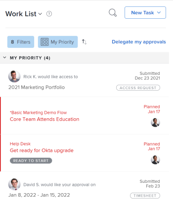

# 開始使用 [!UICONTROL 首頁]

本文旨在說明目前的 [!UICONTROL 首頁] 區域於 [!DNL Adobe Workfront]. 有關使用新專案的資訊 [!UICONTROL 首頁]，請參閱 [開始使用Adobe Workfront中的新首頁](../new-home/get-started-with-new-home.md).

檢視您目前工作有兩種方式 [!UICONTROL 首頁] 區域：

* 從 [!UICONTROL 工作清單]
* 從 [!UICONTROL 行事曆].

## 工作清單

您可以在下列位置檢視所有指派的工作： [!UICONTROL 工作清單]：

![[!UICONTROL 工作清單] 面板](assets/worklist-and-right-panel-home.png)

檢閱下列章節(在目前的 [!UICONTROL 首頁] 區域，如上方影像中醒目提示：

* **A**：使用左側面板來篩選、排序和選取指派給您的工作。

* **B**：在左側面板中選擇工作專案後，使用右側面板與自訂欄位互動、進行更新並記錄時間。

如需關於使用的詳細資訊 [!UICONTROL 首頁工作清單]，請參閱下列文章：

* [在中顯示專案 [!UICONTROL 工作清單] 在 [!UICONTROL 首頁] 區域](../../../workfront-basics/using-home/using-the-home-area/display-items-in-home-work-list.md)
* [從建立工作專案 [!UICONTROL 首頁] 區域](../../../workfront-basics/using-home/using-the-home-area/create-work-items-in-home.md)

## 行事曆

您可以透過顯示工作專案到期時間來顯示您的工作，也可以透過檢閱您的工作來封鎖完成工作的時間。 [!UICONTROL 行事曆] 在 [!UICONTROL 首頁] 區域：

檢閱下列章節(在目前的 [!UICONTROL 首頁] 區域，如上方影像中醒目提示：

* **A**：使用 [!UICONTROL 行事曆] 檢視，以建立您需要完成之工作的視覺化地圖。 只要從以下位置按一下並拖曳工作專案： [!UICONTROL 工作清單] 在 [!UICONTROL 行事曆] 以封鎖工作的時間。

* **B**：使用 [!UICONTROL 行事曆]的同步選項，用來與您的 [!DNL Outlook] 行事曆。 在一個地方管理會議和工作。

* **C**：使用 [!UICONTROL 詳細資料] 按鈕以開啟新的右側面板，您可以在此檢視有關工作專案的更多資訊。

* **D**：使用到期列來追蹤指派給您的工作到期時間。

如需如何使用首頁行事曆的詳細資訊，請參閱 [使用 [!UICONTROL 首頁行事曆] 檢視](../../../workfront-basics/using-home/using-the-home-area/use-home-calendar-view.md).

## 尋找您的工作

此 [!UICONTROL 首頁] 區域是您尋找指派給您的任務、問題和核准的一站式服務。 內建在中的篩選和排序選項 [!UICONTROL 首頁] 區域協同工作，支援您以您想要的方式工作。 您可以使用 [!UICONTROL 排序依據：] 將專案群組在一起，然後使用篩選器來專注於需要完成的工作的選項。

>[!NOTE]
>
>篩選和排序選項會儲存在瀏覽器中。 如果您一律在同一部電腦上使用相同的瀏覽器（且不清除網站資料），篩選和排序將不會變更，但如果您切換瀏覽器或電腦，則篩選和排序將會不同。

### 將類似的工作專案與&#39;[!UICONTROL 分組依據]&#39;選項

此 [!UICONTROL 排序依據：] 選項可讓您將工作清單中類似的專案分組。 排序依據：

* [!UICONTROL 計畫完成]
* [!UICONTROL 計劃開始]
* [!UICONTROL 認可日期]
* [!UICONTROL 專案]
* [!UICONTROL 我的優先順序]

如需如何使用分組的詳細資訊，請參閱 [在中顯示專案 [!UICONTROL 工作清單] 在 [!UICONTROL 首頁] 區域](../../../workfront-basics/using-home/using-the-home-area/display-items-in-home-work-list.md).

### 使用篩選器縮小您的焦點

此 [!UICONTROL 工作清單] 篩選可讓您將焦點縮小至特定工作專案。

以下範例說明如何篩選在「首頁」中檢視的專案：

* 依專案型別和狀態篩選。

  例如，如果要顯示所有任務，可以選取 [!UICONTROL 任務] 篩選。 如果您希望比這更具體並且只顯示已準備好供您開始處理的任務，則選取 [!UICONTROL 準備開始] 下的篩選器 [!UICONTROL 任務] 篩選。

* 僅依專案型別篩選。

  例如，您可以選取 [!UICONTROL 問題] 檢視所有狀態的所有問題([!UICONTROL 處理] 或 [!UICONTROL 已要求])，或 [!UICONTROL 核准] 檢視所有工作專案、存取權請求、時程表、檔案和校訂核准。

* 僅依狀態篩選。

  例如，您可以選取 [!UICONTROL 已完成] 篩選以顯示已完成的任務和問題。 這包含個人任務，但不包含核准。

如需如何使用篩選器的詳細資訊，請參閱 [在中顯示專案 [!UICONTROL 工作清單] 在 [!UICONTROL 首頁] 區域](../../../workfront-basics/using-home/using-the-home-area/display-items-in-home-work-list.md).

### 存取指派給您團隊的工作

此 [!UICONTROL 首頁] 區域擁有專屬於團隊請求的永久分組，且直接連結至團隊的請求頁面。 使用此分組來檢視和存取您所在任何團隊的請求。

>[!NOTE]
>
>此 [!UICONTROL 篩選] 和 [!UICONTROL 排序依據：] 選項不會影響 [!UICONTROL 團隊請求] 分組。 只要您已將工作指派給團隊，就可以看到此分組。

有關存取團隊請求的詳細資訊，請參閱文章 [[!UICONTROL 管理] 中的工作和團隊請求 [!UICONTROL 首頁] 區域](../../../workfront-basics/using-home/using-the-home-area/manage-work-and-team-requests-home.md).

### 監視您提交的工作

追蹤您直接從提交以供核准的工作 [!UICONTROL 工作清單]. 您可以提醒核准者需要核准的工作。 如有需要，您也可以恢復核准。

>[!NOTE]
>
>此 [!UICONTROL 篩選] 和 [!UICONTROL 排序依據：] 選項不會影響 [!UICONTROL 我已提交的核准] 分組。 只要您有工作等待核准，就可以看到此分組。

## 優先處理對您而言重要的事項

此 [!UICONTROL 工作清單] 可讓您透過設定優先順序來呈現對您而言重要的工作 [!UICONTROL 我的優先順序排序依據] 選項。 您最多可以新增20個專案至 [!UICONTROL 我的優先順序] 清單。 使用 [!UICONTROL 更多] 功能表以將工作專案新增至您的優先順序清單。

>[!NOTE]
>
>任何新增至的工作專案 [!UICONTROL 我的優先順序] 只有您能看見，而且沒有人可以排定您的工作優先順序。

有關如何使用的詳細資訊 [!UICONTROL 我的優先順序]，請參閱 [排定工作的優先順序 [!UICONTROL 首頁] 區域](../../../workfront-basics/using-home/using-the-home-area/prioritize-work-in-home.md).

## 完成它

使用中的右側面板 [!UICONTROL 首頁] 更新並完成您的工作。

### 在為您自訂的空間中工作

您的 [!DNL Adobe Workfront] 管理員可以新增最多16個自訂欄位，以便更輕鬆地尋找和更新您需要的資訊。 大部分欄位都可編輯，因此您不必導覽至工作專案。

若要更新此區域中的任何欄位，只需按一下欄位即可。

>[!NOTE]
>
>您無法更新 [!UICONTROL 認可日期] 在此區域中。

### 以重要資訊更新同事

與的同事快速、有效率地溝通 [!UICONTROL 首頁] 區域。 您可以詢問同事問題、通知他們最近的更新，或回覆直接評論。 此外，您還可以透過下列方式，向其他人更新您目前的進度：

* 更新 [!UICONTROL 認可日期]

  <!--
  <note type="note">
  This is the only place you can update the Commit Date in Home.
   
  </note>
  -->

* 報告您對未來的感受
* 更新完成百分比列

如需在中通訊的詳細資訊 [!UICONTROL 首頁] 區域，請參閱 [更新工作](../../../workfront-basics/updating-work-items-and-viewing-updates/update-work.md).

### 記錄您的時間

追蹤您處理個別工作專案的時數。 您可以選擇一般時數型別，例如 [!UICONTROL 任務時間]，您也可以選擇專案專屬的時數型別，由您的 [!DNL Workfront] 管理員。

如需如何登入時間的詳細資訊，請參閱 [!UICONTROL 首頁] 區域，請參閱區段 [首頁](../../../timesheets/create-and-manage-timesheets/log-time.md#home) 在文章中 [記錄時間](../../../timesheets/create-and-manage-timesheets/log-time.md).

