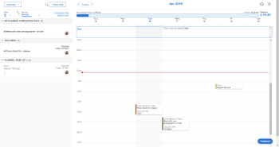

# [!UICONTROL 首頁行事曆]檢視

<!--

Updated for QS except for section about expanding a work item in the list--this isn't working yet in QS.

-->

在[!UICONTROL 首頁]區域中的[!UICONTROL 首頁行事曆]檢視可讓您檢視和管理工作週，以及個人工作行事曆上的工作指派（只有您能看見）。 您可以用它來排程您想要完成工作的時間。 而且您可以將其與外部行事曆(例如[!UICONTROL Microsoft Outlook]行事曆)整合。

>[!NOTE]
>
>[!UICONTROL 首頁行事曆]檢視與[!UICONTROL 行事曆]報告不同。 如需[!UICONTROL 行事曆]報告的詳細資訊，請參閱[[!UICONTROL 行事曆]報告總覽](../../../reports-and-dashboards/reports/calendars/calendar-reports-overview.md)。

若您需要設定[!UICONTROL 首頁行事曆]的指示，請參閱[設定您的[!UICONTROL 首頁行事曆]檢視設定](../../../workfront-basics/using-home/using-the-home-area/configure-home-calendar-view.md)。

如需有關存取[!UICONTROL 首頁行事曆]檢視的資訊，請參閱[檢視[!UICONTROL 首頁行事曆]](../../../workfront-basics/using-home/using-the-home-area/view-home-calendar.md)。

如需整合您的[!UICONTROL 首頁行事曆]與外部行事曆的資訊，請參閱[[!UICONTROL 設定您的[！UICONTROL首頁行事曆]]檢視設定](../../../workfront-basics/using-home/using-the-home-area/configure-home-calendar-view.md)。

本文中的其餘章節更詳細地說明[!UICONTROL 首頁行事曆]檢視的章節和功能。

## [!UICONTROL 首頁行事曆]上的工作清單

指派給您、您的群組、您的團隊和您的角色的工作專案（任務、問題、請求和核准）會顯示在[!UICONTROL 首頁]區域行事曆左側的[!UICONTROL 工作清單]中。

您可以將工作專案從[!UICONTROL 工作清單]拖曳到您的[!UICONTROL 首頁行事曆]，以便排程處理工作專案的時間。 若要進一步瞭解排程您的工作，請參閱[使用[!UICONTROL 首頁行事曆]檢視](../../../workfront-basics/using-home/using-the-home-area/use-home-calendar-view.md)。

您可以按一下清單中的工作專案來檢視和更新進度。

視專案而定，下列資訊可能會顯示在行事曆的左側，代表您在工作清單中選取的專案：

* **[!UICONTROL 專案名稱]**：顯示在工作專案的左上方。 這是與專案相關聯的專案。 在上述範例中，專案標題為「2020年秋季行銷活動」。
* **[!UICONTROL 工作專案名稱]**：顯示在專案名稱下方。 在上述範例中，工作專案的標題為「9月15日專刊」。
* **[!UICONTROL 完成]**：按一下此按鈕，將工作指派的狀態變更為[!UICONTROL 完成]。 此按鈕僅在您被指派任務或問題時顯示。
* **[!UICONTROL 完成我的零件]**：按一下[!UICONTROL 完成我的零件]按鈕，將工作指派的狀態變更為[!UICONTROL 完成]。
* **[!UICONTROL 計畫]**：顯示資源管理員已針對專案上要完成的工作所配置的時數。 若要進一步瞭解計畫時數，請參閱[計畫時數總覽](../../../manage-work/tasks/task-information/planned-hours.md)。

* **[!UICONTROL 已登入]**：在時程表或專案的[!UICONTROL 更新]索引標籤中顯示您已登入工作專案的時數。 若要瞭解更多資訊，請參閱[從[!UICONTROL 首頁]區域](../../../workfront-basics/using-home/using-the-home-area/log-time-on-work-item-in-home.md)將時間記錄在工作專案上

* **[!UICONTROL 已排程]**：在[!UICONTROL 行事曆]檢視中顯示您為工作專案排程的時數。 若要進一步瞭解將工作專案移至您的[!UICONTROL 行事曆]檢視，請參閱[使用[!UICONTROL 首頁行事曆]檢視](../../../workfront-basics/using-home/using-the-home-area/use-home-calendar-view.md)中的[排程[!UICONTROL 首頁行事曆]](../../../workfront-basics/using-home/using-the-home-area/use-home-calendar-view.md#scheduling-work-items-in-home-calendar)中的工作專案。

* **[!UICONTROL 詳細資料]**：按一下此按鈕，即可在[!UICONTROL 行事曆]檢視的右側面板中顯示工作專案的詳細資料。
* **[!UICONTROL 處理它]**：按一下此按鈕，接受處理專案的指派。

## 配置列

當您設定[!UICONTROL 首頁行事曆]時，您指定了一週內通常工作的時數（請參閱[設定您的[!UICONTROL 首頁行事曆]檢視設定](../../../workfront-basics/using-home/using-the-home-area/configure-home-calendar-view.md)）。 [!DNL Adobe Workfront]使用此數字來決定您的總可分配工作時數。

[!UICONTROL 配置]列以視覺化方式呈現您每週的工作時數以及您的使用方式。

[!UICONTROL 配置]列中的顏色表示下列資訊：

* **灰色**：從整合行事曆排程的事件時數。 如需整合行事曆的詳細資訊，請參閱[設定您的[!UICONTROL 首頁行事曆]檢視設定](../../../workfront-basics/using-home/using-the-home-area/configure-home-calendar-view.md)中的[設定您的[!UICONTROL 首頁行事曆]檢視設定](../../../workfront-basics/using-home/using-the-home-area/configure-home-calendar-view.md#configuring-your-home-calendar-view)一節。

* **藍色**：您已為指派給您的[!DNL Workfront]個工作專案排程的時數。 您可以從[!UICONTROL 工作清單]拖放專案到行事曆中，以排程工作。 如需排程工作的詳細資訊，請參閱[使用[!UICONTROL 首頁行事曆]檢視](../../../workfront-basics/using-home/using-the-home-area/use-home-calendar-view.md)中的[排程您[!UICONTROL 首頁行事曆]](../../../workfront-basics/using-home/using-the-home-area/use-home-calendar-view.md#scheduling-work-items-in-home-calendar)區段中的工作專案。

* **淺藍色**：可供配置的可用時數。
* **紅色**（未顯示於上面）：已排程的事件和工作專案已超過您一週的可用時數。

## [!UICONTROL 到期]列

您的[!UICONTROL 首頁行事曆]上的[!UICONTROL 到期]列會顯示目前顯示的一週到期的專案，依據為其[!UICONTROL 規劃完成日期]。

>[!NOTE]
>
>如果您已將Microsoft行事曆與[!DNL Workfront]行事曆整合，除非您將專案從工作清單拖曳至您的[!DNL Workfront]行事曆，否則[!UICONTROL 到期]列中的專案不會出現在您的Microsoft行事曆中。 如需詳細資訊，請參閱上述[!UICONTROL 首頁行事曆]](#work-list-on-the-home-calendar)上的[工作清單一節，以及文章[設定您的[!UICONTROL 首頁行事曆]檢視設定](../../../workfront-basics/using-home/using-the-home-area/configure-home-calendar-view.md)。
